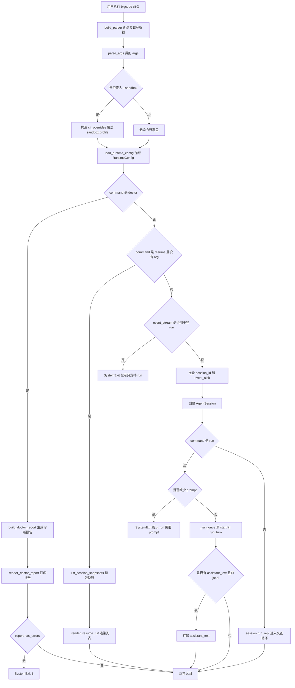
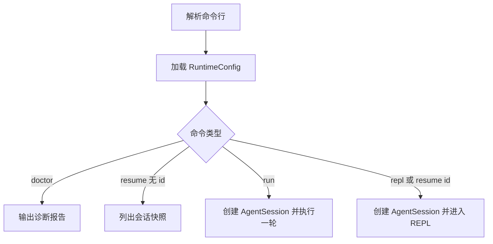

# `bigcode/cli.py` 代码阅读

源码路径：`bigcode/cli.py`

## 这个文件解决什么问题

`cli.py` 是 BigCode 的命令行入口。你在终端里输入的 `bigcode repl`、`bigcode run`、`bigcode resume`、`bigcode doctor` 最终都会先进入这个文件。

它不负责模型推理、工具执行、上下文压缩这些复杂逻辑。它的职责更像一个“分流器”：

- 解析命令行参数。
- 根据 `--cwd`、`--model`、`--sandbox` 等参数加载运行配置。
- 对 `doctor` 走诊断流程。
- 对 `resume` 列出或恢复会话。
- 对 `run` 创建会话并执行一次 prompt。
- 对 `repl` 创建会话并进入交互循环。

读这个文件时要抓住一点：`cli.py` 只决定“要启动哪种运行模式”，真正的会话主流程在 `bigcode/agent/session.py`。

## 先抓主线

主线从 `main()` 开始：

1. `build_parser()` 创建 `argparse.ArgumentParser`。
2. `parse_args()` 把用户命令变成 `args`。
3. `load_runtime_config()` 读取配置，生成 `RuntimeConfig`。
4. 如果命令是 `doctor`，调用诊断系统并退出。
5. 如果命令是 `resume` 且没有 session id，列出可恢复会话并退出。
6. 其它情况创建 `AgentSession`。
7. `run` 调 `_run_once()` 执行一轮。
8. `repl` 或带 id 的 `resume` 调 `session.run_repl()`。

## 核心函数

### `build_parser()`

这个函数定义 BigCode 的命令行界面。

关键参数：

- `command`：可选值是 `repl`、`resume`、`run`、`doctor`，默认是 `repl`。
- `arg`：复用参数。对 `run` 来说是 prompt，对 `resume` 来说是 session id。
- `--cwd`：工作区目录，后续配置加载、工具路径判断都围绕它展开。
- `--model`：临时覆盖本次使用的模型引用。
- `--non-interactive`：禁止交互式权限询问。
- `--event-stream jsonl`：让 `bigcode run` 输出机器可读事件。
- `--sandbox`：临时覆盖 sandbox profile。
- `--no-probe`、`--timeout`：只给 `doctor` 的探测流程使用。

### `main(argv=None)`

这是入口函数，负责整体分支。

最重要的细节是 `--sandbox` 的处理：

```py
if args.sandbox:
    config_kwargs["cli_overrides"] = {"sandbox": {"profile": args.sandbox}}
```

这说明命令行 sandbox 只是本次运行的临时覆盖，不会写回配置文件。

`doctor` 分支比较特殊：它只加载配置并生成诊断报告，不创建 `AgentSession`。这样即使模型配置坏了，用户仍能运行 `bigcode doctor` 看错误。

`resume` 也有两个分支：

- `bigcode resume`：不带 id，只列出会话快照。
- `bigcode resume <id>`：带 id，创建 `AgentSession(session_id=<id>)`，后续从 transcript 和 snapshot 恢复。

`event_stream` 目前只支持 `bigcode run`，所以代码里显式拒绝其它命令：

```py
if args.event_stream != "off" and args.command != "run":
    raise SystemExit(...)
```

### `_run_once(session, prompt)`

非交互模式只执行一次：

1. `await session.start()` 触发会话启动逻辑。
2. `await session.run_turn(prompt)` 执行一轮用户输入。

这就是 `bigcode run "..."` 和 REPL 的主要差别：`run` 不进入循环。

### `_render_resume_list(items)`

把 `list_session_snapshots()` 返回的快照列表渲染成制表符分隔文本。

输出列包括：

- `id`
- `updated_at`
- `model`
- `messages`
- `artifacts`
- `cwd`

这个函数不恢复会话，只负责展示可恢复项。

### `_format_time(timestamp)`

把 Unix 时间戳变成本地时间字符串。它是一个纯展示辅助函数。

## 和其他模块的关系

- 调 `bigcode.config.load_runtime_config()` 得到 `RuntimeConfig`。
- 调 `bigcode.agent.AgentSession` 创建真正的会话对象。
- 调 `bigcode.agent.snapshot.list_session_snapshots()` 列出可恢复会话。
- 调 `bigcode.diagnostics.build_doctor_report()` 和 `render_doctor_report()` 做诊断。
- 可选创建 `JsonlEventSink(sys.stdout)`，让 `run` 输出事件流。

## 阅读建议

先读 `main()`，不要被 `argparse` 参数细节卡住。你只需要记住：CLI 最终会把用户命令转成配置对象和 `AgentSession` 调用。后续所有复杂流程都不在这个文件。

<!-- BEGIN EXTENDED READING NOTES -->

## 超详细源码阅读笔记（扩写版）

这一节是为了把前面的概览扩展成可以逐步跟读源码的版本。
阅读时不要只看结论，要把这里的每个检查点和对应源码放在一起看。
本篇主题是：命令行入口。
模块职责可以先压缩成一句话：把终端命令分流到 doctor、run、resume、repl 四条路径。
下面的内容按“定位、符号、入口、数据流、边界、误区、自测”的顺序展开。
如果你是 Python 初学者，建议先读每节第一组短句，再回到源码找同名函数。

### A. 阅读定位

- 这篇文档对应源码：bigcode/cli.py。
- 它在阅读路线里的角色：把终端命令分流到 doctor、run、resume、repl 四条路径。
- 上游输入主要来自：用户终端输入, python -m bigcode, bigcode 命令包装器。
- 下游输出或调用对象主要是：RuntimeConfig, AgentSession, doctor 诊断报告, session snapshot 列表。
- 可以用这个例子追踪：`bigcode run "hello" --cwd . --model provider:model`。
- 先读公开入口，再读辅助函数；先读数据结构，再读使用这些结构的流程。
- 遇到以下划线开头的函数，先判断它服务哪个公开函数，不要孤立理解。
- 遇到 dataclass，先把字段含义看懂，再看谁创建它、谁消费它。
- 遇到 BaseModel，先看字段类型，因为字段类型就是工具或 API 的输入约束。
- 遇到 async def，重点看它 await 了谁，这通常就是跨模块调用点。

### B. 源码文件 `bigcode/cli.py` 的结构地图

- 这个文件共有 119 行源码。
- 顶层 class/function 数量是 5。
- 顶层常量数量是 0。
- import/import from 语句数量大约是 10。
- 阅读时可以先折叠函数体，只看顶层符号顺序。
- 顶层符号顺序通常反映作者希望你先理解的数据类型和主入口。

#### 顶层符号阅读

- `def build_parser`：位于第 19-31 行附近。
  - 先看签名和返回值，判断 `build_parser` 是入口、数据模型还是辅助逻辑。
  - 再看它直接读取哪些字段、调用哪些函数、返回什么对象。
  - 如果 `build_parser` 是类，先读字段和构造函数，再读会被外部调用的方法。
  - 如果 `build_parser` 是函数，先找调用方；没有调用方时看是否是导出入口或测试使用。
- `def main`：位于第 34-81 行附近。
  - 先看签名和返回值，判断 `main` 是入口、数据模型还是辅助逻辑。
  - 再看它直接读取哪些字段、调用哪些函数、返回什么对象。
  - 如果 `main` 是类，先读字段和构造函数，再读会被外部调用的方法。
  - 如果 `main` 是函数，先找调用方；没有调用方时看是否是导出入口或测试使用。
- `async def _run_once`：位于第 84-87 行附近。
  - 先看签名和返回值，判断 `_run_once` 是入口、数据模型还是辅助逻辑。
  - 再看它直接读取哪些字段、调用哪些函数、返回什么对象。
  - 如果 `_run_once` 是类，先读字段和构造函数，再读会被外部调用的方法。
  - 如果 `_run_once` 是函数，先找调用方；没有调用方时看是否是导出入口或测试使用。
- `def _render_resume_list`：位于第 90-108 行附近。
  - 先看签名和返回值，判断 `_render_resume_list` 是入口、数据模型还是辅助逻辑。
  - 再看它直接读取哪些字段、调用哪些函数、返回什么对象。
  - 如果 `_render_resume_list` 是类，先读字段和构造函数，再读会被外部调用的方法。
  - 如果 `_render_resume_list` 是函数，先找调用方；没有调用方时看是否是导出入口或测试使用。
- `def _format_time`：位于第 111-115 行附近。
  - 先看签名和返回值，判断 `_format_time` 是入口、数据模型还是辅助逻辑。
  - 再看它直接读取哪些字段、调用哪些函数、返回什么对象。
  - 如果 `_format_time` 是类，先读字段和构造函数，再读会被外部调用的方法。
  - 如果 `_format_time` 是函数，先找调用方；没有调用方时看是否是导出入口或测试使用。

### C. 主流程拆解

- 第 1 步：解析 argparse 参数。读这一环节时要确认输入对象是什么、输出对象交给谁。
- 第 2 步：加载 RuntimeConfig。读这一环节时要确认输入对象是什么、输出对象交给谁。
- 第 3 步：按 command 分支。读这一环节时要确认输入对象是什么、输出对象交给谁。
- 第 4 步：创建 AgentSession。读这一环节时要确认输入对象是什么、输出对象交给谁。
- 第 5 步：执行 run_turn 或 run_repl。读这一环节时要确认输入对象是什么、输出对象交给谁。

### D. 本篇最应该盯住的源码点

- 关注点 1：command 的复用 arg。它通常决定你是否真正理解这个模块的边界。
- 关注点 2：--sandbox 临时覆盖。它通常决定你是否真正理解这个模块的边界。
- 关注点 3：--event-stream 只允许 run。它通常决定你是否真正理解这个模块的边界。
- 关注点 4：doctor 不创建 AgentSession。它通常决定你是否真正理解这个模块的边界。
- 关注点 5：resume 无 id 只列表。它通常决定你是否真正理解这个模块的边界。

### E. 初学者容易误解的点

- 误区 1：把 doctor 当成模型请求流程。读源码时用实际调用链验证，不要只按变量名猜。
- 误区 2：以为 --sandbox 会写回配置。读源码时用实际调用链验证，不要只按变量名猜。
- 误区 3：忽略 run 和 repl 的差异。读源码时用实际调用链验证，不要只按变量名猜。
- 误区 4：把 resume 列表和恢复会话混为一谈。读源码时用实际调用链验证，不要只按变量名猜。

### F. 数据流追踪

- 输入侧 1：`用户终端输入` 是这个模块可能接收信息的来源。
  - 追踪时先找它在哪个函数参数、对象字段或配置字段中出现。
  - 如果它是外部输入，要继续检查是否有校验、默认值或错误处理。
- 输入侧 2：`python -m bigcode` 是这个模块可能接收信息的来源。
  - 追踪时先找它在哪个函数参数、对象字段或配置字段中出现。
  - 如果它是外部输入，要继续检查是否有校验、默认值或错误处理。
- 输入侧 3：`bigcode 命令包装器` 是这个模块可能接收信息的来源。
  - 追踪时先找它在哪个函数参数、对象字段或配置字段中出现。
  - 如果它是外部输入，要继续检查是否有校验、默认值或错误处理。
- 输出侧 1：`RuntimeConfig` 是这个模块处理结果的去向。
  - 追踪时看当前模块传递的是原始值、结构化对象，还是已经裁剪过的投影。
  - 如果下游是工具或模型，重点检查安全边界和格式转换。
- 输出侧 2：`AgentSession` 是这个模块处理结果的去向。
  - 追踪时看当前模块传递的是原始值、结构化对象，还是已经裁剪过的投影。
  - 如果下游是工具或模型，重点检查安全边界和格式转换。
- 输出侧 3：`doctor 诊断报告` 是这个模块处理结果的去向。
  - 追踪时看当前模块传递的是原始值、结构化对象，还是已经裁剪过的投影。
  - 如果下游是工具或模型，重点检查安全边界和格式转换。
- 输出侧 4：`session snapshot 列表` 是这个模块处理结果的去向。
  - 追踪时看当前模块传递的是原始值、结构化对象，还是已经裁剪过的投影。
  - 如果下游是工具或模型，重点检查安全边界和格式转换。

### G. 边界情况阅读表

| 01 | `build_parser` | 输入为空时是否有默认值或早返回 | 回到源码确认实际分支，不要用经验推断 |
| 02 | `main` | 配置项不存在时是报错、降级还是记录 warning | 回到源码确认实际分支，不要用经验推断 |
| 03 | `_run_once` | 外部依赖不可用时是否影响主流程 | 回到源码确认实际分支，不要用经验推断 |
| 04 | `_render_resume_list` | 异常是否被捕获并转成结构化结果 | 回到源码确认实际分支，不要用经验推断 |
| 05 | `_format_time` | 列表为空时返回空列表还是 None | 回到源码确认实际分支，不要用经验推断 |
| 06 | `build_parser` | 路径或名称是否合法是否有校验 | 回到源码确认实际分支，不要用经验推断 |
| 07 | `main` | 非交互模式是否会改变行为 | 回到源码确认实际分支，不要用经验推断 |
| 08 | `_run_once` | 状态是否会写入 transcript、snapshot 或磁盘文件 | 回到源码确认实际分支，不要用经验推断 |
| 09 | `_render_resume_list` | 是否存在只读模式、plan 模式或 sandbox 的特殊分支 | 回到源码确认实际分支，不要用经验推断 |
| 10 | `_format_time` | 返回值是否会继续进入模型上下文 | 回到源码确认实际分支，不要用经验推断 |
| 11 | `build_parser` | 输入为空时是否有默认值或早返回 | 回到源码确认实际分支，不要用经验推断 |
| 12 | `main` | 配置项不存在时是报错、降级还是记录 warning | 回到源码确认实际分支，不要用经验推断 |
| 13 | `_run_once` | 外部依赖不可用时是否影响主流程 | 回到源码确认实际分支，不要用经验推断 |
| 14 | `_render_resume_list` | 异常是否被捕获并转成结构化结果 | 回到源码确认实际分支，不要用经验推断 |
| 15 | `_format_time` | 列表为空时返回空列表还是 None | 回到源码确认实际分支，不要用经验推断 |
| 16 | `build_parser` | 路径或名称是否合法是否有校验 | 回到源码确认实际分支，不要用经验推断 |
| 17 | `main` | 非交互模式是否会改变行为 | 回到源码确认实际分支，不要用经验推断 |
| 18 | `_run_once` | 状态是否会写入 transcript、snapshot 或磁盘文件 | 回到源码确认实际分支，不要用经验推断 |
| 19 | `_render_resume_list` | 是否存在只读模式、plan 模式或 sandbox 的特殊分支 | 回到源码确认实际分支，不要用经验推断 |
| 20 | `_format_time` | 返回值是否会继续进入模型上下文 | 回到源码确认实际分支，不要用经验推断 |
| 21 | `build_parser` | 输入为空时是否有默认值或早返回 | 回到源码确认实际分支，不要用经验推断 |
| 22 | `main` | 配置项不存在时是报错、降级还是记录 warning | 回到源码确认实际分支，不要用经验推断 |
| 23 | `_run_once` | 外部依赖不可用时是否影响主流程 | 回到源码确认实际分支，不要用经验推断 |
| 24 | `_render_resume_list` | 异常是否被捕获并转成结构化结果 | 回到源码确认实际分支，不要用经验推断 |
| 25 | `_format_time` | 列表为空时返回空列表还是 None | 回到源码确认实际分支，不要用经验推断 |
| 26 | `build_parser` | 路径或名称是否合法是否有校验 | 回到源码确认实际分支，不要用经验推断 |
| 27 | `main` | 非交互模式是否会改变行为 | 回到源码确认实际分支，不要用经验推断 |
| 28 | `_run_once` | 状态是否会写入 transcript、snapshot 或磁盘文件 | 回到源码确认实际分支，不要用经验推断 |
| 29 | `_render_resume_list` | 是否存在只读模式、plan 模式或 sandbox 的特殊分支 | 回到源码确认实际分支，不要用经验推断 |
| 30 | `_format_time` | 返回值是否会继续进入模型上下文 | 回到源码确认实际分支，不要用经验推断 |
| 31 | `build_parser` | 输入为空时是否有默认值或早返回 | 回到源码确认实际分支，不要用经验推断 |
| 32 | `main` | 配置项不存在时是报错、降级还是记录 warning | 回到源码确认实际分支，不要用经验推断 |
| 33 | `_run_once` | 外部依赖不可用时是否影响主流程 | 回到源码确认实际分支，不要用经验推断 |
| 34 | `_render_resume_list` | 异常是否被捕获并转成结构化结果 | 回到源码确认实际分支，不要用经验推断 |
| 35 | `_format_time` | 列表为空时返回空列表还是 None | 回到源码确认实际分支，不要用经验推断 |
| 36 | `build_parser` | 路径或名称是否合法是否有校验 | 回到源码确认实际分支，不要用经验推断 |
| 37 | `main` | 非交互模式是否会改变行为 | 回到源码确认实际分支，不要用经验推断 |
| 38 | `_run_once` | 状态是否会写入 transcript、snapshot 或磁盘文件 | 回到源码确认实际分支，不要用经验推断 |
| 39 | `_render_resume_list` | 是否存在只读模式、plan 模式或 sandbox 的特殊分支 | 回到源码确认实际分支，不要用经验推断 |
| 40 | `_format_time` | 返回值是否会继续进入模型上下文 | 回到源码确认实际分支，不要用经验推断 |
| 41 | `build_parser` | 输入为空时是否有默认值或早返回 | 回到源码确认实际分支，不要用经验推断 |
| 42 | `main` | 配置项不存在时是报错、降级还是记录 warning | 回到源码确认实际分支，不要用经验推断 |
| 43 | `_run_once` | 外部依赖不可用时是否影响主流程 | 回到源码确认实际分支，不要用经验推断 |
| 44 | `_render_resume_list` | 异常是否被捕获并转成结构化结果 | 回到源码确认实际分支，不要用经验推断 |
| 45 | `_format_time` | 列表为空时返回空列表还是 None | 回到源码确认实际分支，不要用经验推断 |
| 46 | `build_parser` | 路径或名称是否合法是否有校验 | 回到源码确认实际分支，不要用经验推断 |
| 47 | `main` | 非交互模式是否会改变行为 | 回到源码确认实际分支，不要用经验推断 |
| 48 | `_run_once` | 状态是否会写入 transcript、snapshot 或磁盘文件 | 回到源码确认实际分支，不要用经验推断 |
| 49 | `_render_resume_list` | 是否存在只读模式、plan 模式或 sandbox 的特殊分支 | 回到源码确认实际分支，不要用经验推断 |
| 50 | `_format_time` | 返回值是否会继续进入模型上下文 | 回到源码确认实际分支，不要用经验推断 |
| 51 | `build_parser` | 输入为空时是否有默认值或早返回 | 回到源码确认实际分支，不要用经验推断 |
| 52 | `main` | 配置项不存在时是报错、降级还是记录 warning | 回到源码确认实际分支，不要用经验推断 |
| 53 | `_run_once` | 外部依赖不可用时是否影响主流程 | 回到源码确认实际分支，不要用经验推断 |
| 54 | `_render_resume_list` | 异常是否被捕获并转成结构化结果 | 回到源码确认实际分支，不要用经验推断 |
| 55 | `_format_time` | 列表为空时返回空列表还是 None | 回到源码确认实际分支，不要用经验推断 |
| 56 | `build_parser` | 路径或名称是否合法是否有校验 | 回到源码确认实际分支，不要用经验推断 |
| 57 | `main` | 非交互模式是否会改变行为 | 回到源码确认实际分支，不要用经验推断 |
| 58 | `_run_once` | 状态是否会写入 transcript、snapshot 或磁盘文件 | 回到源码确认实际分支，不要用经验推断 |
| 59 | `_render_resume_list` | 是否存在只读模式、plan 模式或 sandbox 的特殊分支 | 回到源码确认实际分支，不要用经验推断 |
| 60 | `_format_time` | 返回值是否会继续进入模型上下文 | 回到源码确认实际分支，不要用经验推断 |

### H. 与阅读路线的衔接

- 读完 `命令行入口` 后，回到 `doc/CodeReadingGuide.md` 看它处在哪一阶段。
- 如果它的上游是 用户终端输入，就从上游重新走一次调用链。
- 如果它的下游是 RuntimeConfig，就继续读下游如何消费当前模块的输出。
- 不要只背函数名；真正的理解是能说清数据对象怎样跨文件移动。
- 当你能画出自己的简图，再对照文末两个流程图，说明这一篇基本读通了。

## 详细流程图



## 核心流程图


