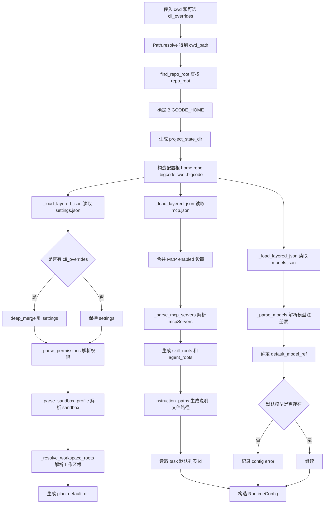
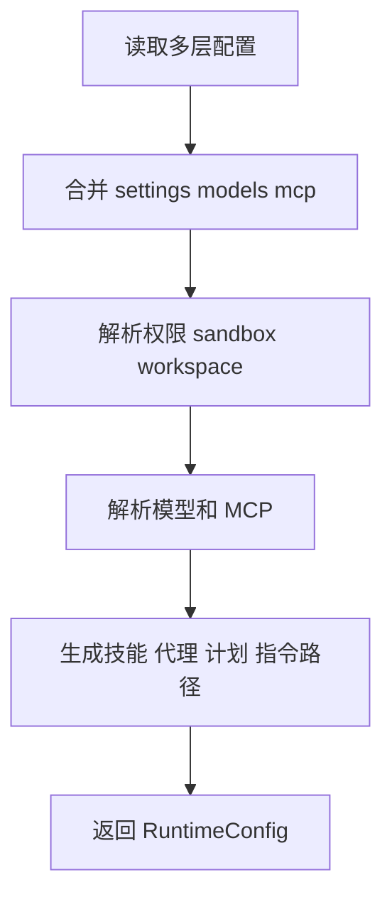

# `bigcode/config/loader.py` 代码阅读

源码路径：`bigcode/config/loader.py`

## 这个文件解决什么问题

`loader.py` 是 BigCode 的启动配置流水线。它把磁盘配置、环境变量、命令行覆盖项合并成一个 `RuntimeConfig`。

你可以把它理解成“启动前的总装配厂”：后续 `AgentSession` 不再到处读取 `settings.json`、`models.json`、`mcp.json`，而是直接使用这里产出的 `RuntimeConfig`。

它主要处理：

- 从 `cwd` 向上找到项目根目录。
- 按优先级读取多层 `.bigcode` 配置。
- 解析权限模式、sandbox、workspace roots。
- 解析模型 provider 和模型能力。
- 解析 MCP server。
- 生成 skill、agent、instruction、plan、task 等运行路径。
- 收集配置错误，不轻易中断启动。

## 先抓主线

主入口是 `load_runtime_config()`。

它的整体顺序是：

1. 解析 `cwd`，找到 `repo_root`。
2. 确定 `BIGCODE_HOME` 和项目状态目录。
3. 读取 home、repo、cwd 三层配置根。
4. 分别合并 `settings.json`、`models.json`、`mcp.json`。
5. 合并命令行覆盖项。
6. 解析权限、sandbox、workspace roots。
7. 解析模型表和默认模型。
8. 解析 MCP 开关和 server。
9. 生成 plan、skill、agent、instruction、task 路径。
10. 返回 `RuntimeConfig`。

## 核心函数

### `find_repo_root(cwd)`

从 `cwd` 往父目录找 `.git`。找到了就返回那个目录，找不到就把 `cwd` 当项目根。

这个函数决定了项目级配置的位置：

- `repo_root/.bigcode/settings.json`
- `repo_root/.bigcode/models.json`
- `repo_root/.bigcode/mcp.json`

### `load_runtime_config(cwd, cli_overrides=None, env=None)`

这是最重要的函数。

配置分层顺序是：

1. `home`
2. `repo_root/.bigcode`
3. `cwd/.bigcode`

后面的层覆盖前面的层，所以当前目录配置可以覆盖项目根配置，项目根配置可以覆盖用户级配置。

它会读取三类 JSON：

- `settings.json`：权限、hooks、sandbox、workspace、plan、tasks 等运行设置。
- `models.json`：模型 provider、模型 id、能力、默认模型。
- `mcp.json`：MCP server 配置。

命令行覆盖项优先级最高，只合并进 `settings`。

错误处理方式也很重要：大部分解析错误被追加到 `errors`，最后放进 `RuntimeConfig.config_errors`。这样 `doctor` 可以一次性报告多个问题。

### `_load_layered_json(roots, filename, errors)`

按配置根目录顺序读取同名 JSON，并用 `deep_merge()` 合并。

它不要求每个文件都存在；读不到或 JSON 错误会记录到 `errors`。

### `_resolve_workspace_roots(cwd, configured, errors)`

workspace root 决定工具可以在哪些目录里读写。

规则：

- 默认包含 `cwd`。
- 用户配置的路径会 `expanduser()` 并 `resolve(strict=True)`。
- 解析失败会写入 `errors`。
- 最后去重。

### `_parse_permissions(data, errors)`

把 `settings.permissions` 转成 `ToolPermissionContext`。

支持的模式：

- `default`
- `acceptEdits`
- `plan`
- `bypassPermissions`

如果模式无效，会降级到 `default` 并记录错误。

权限规则从三个列表解析：

- `always_allow`
- `always_deny`
- `always_ask`

规则可以是字符串简写，也可以是字典形式。字符串如 `"Read"` 会被当作工具名；字典可以指定 `tool`、`tool_name`、`pattern`、`behavior`。

### `_parse_sandbox_profile(data, errors)`

读取 `sandbox.profile`。

合法值只有：

- `none`
- `read-only`
- `workspace`

无效值会降级到 `none`。

### `_parse_models(data)`

解析 `models.json` 的核心函数。

输入大致结构是：

- `providers`
- 每个 provider 有 `base_url`、`api_key_env`、`default_headers`、`models`
- 每个 model 有 `id`、`capabilities`、`context_window`、`max_output_tokens`

最终输出是 `dict[str, ResolvedModel]`，key 是 `provider:model_key`。

值得注意的校验：

- provider name 和 model key 必须匹配正则。
- `base_url` 必须以 `http://` 或 `https://` 开头。
- `api_key_env` 必须像环境变量名，不能像明文密钥。
- `openai-compatible` 会被提示弃用并按 `claude-compatible` 处理。

### `_parse_api_key_env(...)` 和 `_looks_like_secret(value)`

这两个函数防止用户把 API key 明文写进 `models.json`。

正确写法是：

```json
{
  "api_key_env": "ANTHROPIC_API_KEY"
}
```

错误写法是把类似 `sk-...` 的 token 直接放进去。代码会检测并报错。

### `_parse_mcp_servers(data, errors)`

解析 `mcpServers`，生成 `McpServerConfig`。

它只做配置包装，不连接 server。真正连接发生在 `bigcode/mcp/client.py`。

### `_instruction_paths(home, repo_root, cwd)`

生成可能存在的说明文件路径：

- `home/instructions.md`
- `repo_root/BIGCODE.md`
- `repo_root/.bigcode/instructions.md`
- `repo_root/.bigcode/rules/*.md`
- `cwd/BIGCODE.md`
- `cwd/.bigcode/instructions.md`
- `cwd/.bigcode/rules/*.md`
- `cwd/BIGCODE.local.md`

这个函数只生成路径列表，不读取文件内容。系统提示词构建阶段才会读取。

## 和其他模块的关系

- 使用 `bigcode.config.models.RuntimeConfig` 作为最终配置对象。
- 使用 `bigcode.tools.permissions.ToolPermissionContext` 保存权限设置。
- 使用 `bigcode.utils.jsonio.deep_merge()` 合并配置。
- 使用 `project_id_for_path()` 为当前项目生成状态目录。
- `AgentSession` 后续主要消费 `RuntimeConfig`，不直接读配置文件。

## 阅读建议

先读 `load_runtime_config()` 的主流程，再分别读 `_parse_permissions()`、`_parse_models()`、`_parse_mcp_servers()`。不要一开始钻进正则和错误文本；这些是防御性校验，不是主线。

<!-- BEGIN EXTENDED READING NOTES -->

## 超详细源码阅读笔记（扩写版）

这一节是为了把前面的概览扩展成可以逐步跟读源码的版本。
阅读时不要只看结论，要把这里的每个检查点和对应源码放在一起看。
本篇主题是：配置加载器。
模块职责可以先压缩成一句话：把 settings、models、mcp、环境变量和命令行覆盖合成 RuntimeConfig。
下面的内容按“定位、符号、入口、数据流、边界、误区、自测”的顺序展开。
如果你是 Python 初学者，建议先读每节第一组短句，再回到源码找同名函数。

### A. 阅读定位

- 这篇文档对应源码：bigcode/config/loader.py, bigcode/config/models.py。
- 它在阅读路线里的角色：把 settings、models、mcp、环境变量和命令行覆盖合成 RuntimeConfig。
- 上游输入主要来自：cli.py, 环境变量, .bigcode/settings.json, .bigcode/models.json, .bigcode/mcp.json。
- 下游输出或调用对象主要是：RuntimeConfig, AgentSession, ToolPermissionContext, McpClientManager。
- 可以用这个例子追踪：`load_runtime_config(Path.cwd(), cli_overrides={"sandbox": {"profile": "workspace"}})`。
- 先读公开入口，再读辅助函数；先读数据结构，再读使用这些结构的流程。
- 遇到以下划线开头的函数，先判断它服务哪个公开函数，不要孤立理解。
- 遇到 dataclass，先把字段含义看懂，再看谁创建它、谁消费它。
- 遇到 BaseModel，先看字段类型，因为字段类型就是工具或 API 的输入约束。
- 遇到 async def，重点看它 await 了谁，这通常就是跨模块调用点。

### B. 源码文件 `bigcode/config/loader.py` 的结构地图

- 这个文件共有 382 行源码。
- 顶层 class/function 数量是 14。
- 顶层常量数量是 3。
- import/import from 语句数量大约是 9。
- 阅读时可以先折叠函数体，只看顶层符号顺序。
- 顶层符号顺序通常反映作者希望你先理解的数据类型和主入口。

#### 顶层常量阅读

- `_NAME_RE` 位于第 19 行附近，通常是规则集合、正则、默认值或白名单。
  - 读 `_NAME_RE` 时先问：它是安全边界、展示配置，还是业务默认值。
  - 再找哪里引用 `_NAME_RE`，引用点才说明它真正影响哪个分支。
- `_MODEL_KEY_RE` 位于第 20 行附近，通常是规则集合、正则、默认值或白名单。
  - 读 `_MODEL_KEY_RE` 时先问：它是安全边界、展示配置，还是业务默认值。
  - 再找哪里引用 `_MODEL_KEY_RE`，引用点才说明它真正影响哪个分支。
- `_ENV_VAR_RE` 位于第 21 行附近，通常是规则集合、正则、默认值或白名单。
  - 读 `_ENV_VAR_RE` 时先问：它是安全边界、展示配置，还是业务默认值。
  - 再找哪里引用 `_ENV_VAR_RE`，引用点才说明它真正影响哪个分支。

#### 顶层符号阅读

- `def find_repo_root`：位于第 24-30 行附近。
  - 先看签名和返回值，判断 `find_repo_root` 是入口、数据模型还是辅助逻辑。
  - 再看它直接读取哪些字段、调用哪些函数、返回什么对象。
  - 如果 `find_repo_root` 是类，先读字段和构造函数，再读会被外部调用的方法。
  - 如果 `find_repo_root` 是函数，先找调用方；没有调用方时看是否是导出入口或测试使用。
- `def load_runtime_config`：位于第 33-138 行附近。
  - 先看签名和返回值，判断 `load_runtime_config` 是入口、数据模型还是辅助逻辑。
  - 再看它直接读取哪些字段、调用哪些函数、返回什么对象。
  - 如果 `load_runtime_config` 是类，先读字段和构造函数，再读会被外部调用的方法。
  - 如果 `load_runtime_config` 是函数，先找调用方；没有调用方时看是否是导出入口或测试使用。
- `def _load_layered_json`：位于第 141-150 行附近。
  - 先看签名和返回值，判断 `_load_layered_json` 是入口、数据模型还是辅助逻辑。
  - 再看它直接读取哪些字段、调用哪些函数、返回什么对象。
  - 如果 `_load_layered_json` 是类，先读字段和构造函数，再读会被外部调用的方法。
  - 如果 `_load_layered_json` 是函数，先找调用方；没有调用方时看是否是导出入口或测试使用。
- `def _dedupe_existing`：位于第 153-166 行附近。
  - 先看签名和返回值，判断 `_dedupe_existing` 是入口、数据模型还是辅助逻辑。
  - 再看它直接读取哪些字段、调用哪些函数、返回什么对象。
  - 如果 `_dedupe_existing` 是类，先读字段和构造函数，再读会被外部调用的方法。
  - 如果 `_dedupe_existing` 是函数，先找调用方；没有调用方时看是否是导出入口或测试使用。
- `def _dedupe_paths`：位于第 169-178 行附近。
  - 先看签名和返回值，判断 `_dedupe_paths` 是入口、数据模型还是辅助逻辑。
  - 再看它直接读取哪些字段、调用哪些函数、返回什么对象。
  - 如果 `_dedupe_paths` 是类，先读字段和构造函数，再读会被外部调用的方法。
  - 如果 `_dedupe_paths` 是函数，先找调用方；没有调用方时看是否是导出入口或测试使用。
- `def _resolve_workspace_roots`：位于第 181-189 行附近。
  - 先看签名和返回值，判断 `_resolve_workspace_roots` 是入口、数据模型还是辅助逻辑。
  - 再看它直接读取哪些字段、调用哪些函数、返回什么对象。
  - 如果 `_resolve_workspace_roots` 是类，先读字段和构造函数，再读会被外部调用的方法。
  - 如果 `_resolve_workspace_roots` 是函数，先找调用方；没有调用方时看是否是导出入口或测试使用。
- `def _parse_permissions`：位于第 192-231 行附近。
  - 先看签名和返回值，判断 `_parse_permissions` 是入口、数据模型还是辅助逻辑。
  - 再看它直接读取哪些字段、调用哪些函数、返回什么对象。
  - 如果 `_parse_permissions` 是类，先读字段和构造函数，再读会被外部调用的方法。
  - 如果 `_parse_permissions` 是函数，先找调用方；没有调用方时看是否是导出入口或测试使用。
- `def _parse_sandbox_profile`：位于第 234-243 行附近。
  - 先看签名和返回值，判断 `_parse_sandbox_profile` 是入口、数据模型还是辅助逻辑。
  - 再看它直接读取哪些字段、调用哪些函数、返回什么对象。
  - 如果 `_parse_sandbox_profile` 是类，先读字段和构造函数，再读会被外部调用的方法。
  - 如果 `_parse_sandbox_profile` 是函数，先找调用方；没有调用方时看是否是导出入口或测试使用。
- `def _behavior_for_key`：位于第 246-252 行附近。
  - 先看签名和返回值，判断 `_behavior_for_key` 是入口、数据模型还是辅助逻辑。
  - 再看它直接读取哪些字段、调用哪些函数、返回什么对象。
  - 如果 `_behavior_for_key` 是类，先读字段和构造函数，再读会被外部调用的方法。
  - 如果 `_behavior_for_key` 是函数，先找调用方；没有调用方时看是否是导出入口或测试使用。
- `def _parse_models`：位于第 255-319 行附近。
  - 先看签名和返回值，判断 `_parse_models` 是入口、数据模型还是辅助逻辑。
  - 再看它直接读取哪些字段、调用哪些函数、返回什么对象。
  - 如果 `_parse_models` 是类，先读字段和构造函数，再读会被外部调用的方法。
  - 如果 `_parse_models` 是函数，先找调用方；没有调用方时看是否是导出入口或测试使用。
- `def _parse_api_key_env`：位于第 322-338 行附近。
  - 先看签名和返回值，判断 `_parse_api_key_env` 是入口、数据模型还是辅助逻辑。
  - 再看它直接读取哪些字段、调用哪些函数、返回什么对象。
  - 如果 `_parse_api_key_env` 是类，先读字段和构造函数，再读会被外部调用的方法。
  - 如果 `_parse_api_key_env` 是函数，先找调用方；没有调用方时看是否是导出入口或测试使用。
- `def _looks_like_secret`：位于第 341-346 行附近。
  - 先看签名和返回值，判断 `_looks_like_secret` 是入口、数据模型还是辅助逻辑。
  - 再看它直接读取哪些字段、调用哪些函数、返回什么对象。
  - 如果 `_looks_like_secret` 是类，先读字段和构造函数，再读会被外部调用的方法。
  - 如果 `_looks_like_secret` 是函数，先找调用方；没有调用方时看是否是导出入口或测试使用。
- `def _parse_mcp_servers`：位于第 349-363 行附近。
  - 先看签名和返回值，判断 `_parse_mcp_servers` 是入口、数据模型还是辅助逻辑。
  - 再看它直接读取哪些字段、调用哪些函数、返回什么对象。
  - 如果 `_parse_mcp_servers` 是类，先读字段和构造函数，再读会被外部调用的方法。
  - 如果 `_parse_mcp_servers` 是函数，先找调用方；没有调用方时看是否是导出入口或测试使用。
- `def _instruction_paths`：位于第 366-382 行附近。
  - 先看签名和返回值，判断 `_instruction_paths` 是入口、数据模型还是辅助逻辑。
  - 再看它直接读取哪些字段、调用哪些函数、返回什么对象。
  - 如果 `_instruction_paths` 是类，先读字段和构造函数，再读会被外部调用的方法。
  - 如果 `_instruction_paths` 是函数，先找调用方；没有调用方时看是否是导出入口或测试使用。

### B. 源码文件 `bigcode/config/models.py` 的结构地图

- 这个文件共有 81 行源码。
- 顶层 class/function 数量是 4。
- 顶层常量数量是 0。
- import/import from 语句数量大约是 4。
- 阅读时可以先折叠函数体，只看顶层符号顺序。
- 顶层符号顺序通常反映作者希望你先理解的数据类型和主入口。

#### 顶层符号阅读

- `class ModelCapabilities`：位于第 16-24 行附近。
  - 先看签名和返回值，判断 `ModelCapabilities` 是入口、数据模型还是辅助逻辑。
  - 再看它直接读取哪些字段、调用哪些函数、返回什么对象。
  - 如果 `ModelCapabilities` 是类，先读字段和构造函数，再读会被外部调用的方法。
  - 如果 `ModelCapabilities` 是函数，先找调用方；没有调用方时看是否是导出入口或测试使用。
- `class ResolvedModel`：位于第 28-43 行附近。
  - 先看签名和返回值，判断 `ResolvedModel` 是入口、数据模型还是辅助逻辑。
  - 再看它直接读取哪些字段、调用哪些函数、返回什么对象。
  - 如果 `ResolvedModel` 是类，先读字段和构造函数，再读会被外部调用的方法。
  - 如果 `ResolvedModel` 是函数，先找调用方；没有调用方时看是否是导出入口或测试使用。
- `class McpServerConfig`：位于第 47-54 行附近。
  - 先看签名和返回值，判断 `McpServerConfig` 是入口、数据模型还是辅助逻辑。
  - 再看它直接读取哪些字段、调用哪些函数、返回什么对象。
  - 如果 `McpServerConfig` 是类，先读字段和构造函数，再读会被外部调用的方法。
  - 如果 `McpServerConfig` 是函数，先找调用方；没有调用方时看是否是导出入口或测试使用。
- `class RuntimeConfig`：位于第 58-81 行附近。
  - 先看签名和返回值，判断 `RuntimeConfig` 是入口、数据模型还是辅助逻辑。
  - 再看它直接读取哪些字段、调用哪些函数、返回什么对象。
  - 如果 `RuntimeConfig` 是类，先读字段和构造函数，再读会被外部调用的方法。
  - 如果 `RuntimeConfig` 是函数，先找调用方；没有调用方时看是否是导出入口或测试使用。

### C. 主流程拆解

- 第 1 步：解析 cwd 和 repo_root。读这一环节时要确认输入对象是什么、输出对象交给谁。
- 第 2 步：合并多层 JSON 配置。读这一环节时要确认输入对象是什么、输出对象交给谁。
- 第 3 步：解析权限和 sandbox。读这一环节时要确认输入对象是什么、输出对象交给谁。
- 第 4 步：解析模型和 MCP。读这一环节时要确认输入对象是什么、输出对象交给谁。
- 第 5 步：生成运行目录和路径列表。读这一环节时要确认输入对象是什么、输出对象交给谁。

### D. 本篇最应该盯住的源码点

- 关注点 1：配置层级覆盖顺序。它通常决定你是否真正理解这个模块的边界。
- 关注点 2：errors 收集而不是立即抛错。它通常决定你是否真正理解这个模块的边界。
- 关注点 3：api_key_env 只接受环境变量名。它通常决定你是否真正理解这个模块的边界。
- 关注点 4：workspace_roots 解析。它通常决定你是否真正理解这个模块的边界。
- 关注点 5：instruction_paths 只生成路径。它通常决定你是否真正理解这个模块的边界。

### E. 初学者容易误解的点

- 误区 1：以为 _dedupe_existing 要求路径存在。读源码时用实际调用链验证，不要只按变量名猜。
- 误区 2：把 models.json 的 default_model 和 settings 的 default_model 优先级看反。读源码时用实际调用链验证，不要只按变量名猜。
- 误区 3：把 MCP enabled 和 server enabled 混为一谈。读源码时用实际调用链验证，不要只按变量名猜。
- 误区 4：忽略 cwd/.bigcode 的覆盖能力。读源码时用实际调用链验证，不要只按变量名猜。

### F. 数据流追踪

- 输入侧 1：`cli.py` 是这个模块可能接收信息的来源。
  - 追踪时先找它在哪个函数参数、对象字段或配置字段中出现。
  - 如果它是外部输入，要继续检查是否有校验、默认值或错误处理。
- 输入侧 2：`环境变量` 是这个模块可能接收信息的来源。
  - 追踪时先找它在哪个函数参数、对象字段或配置字段中出现。
  - 如果它是外部输入，要继续检查是否有校验、默认值或错误处理。
- 输入侧 3：`.bigcode/settings.json` 是这个模块可能接收信息的来源。
  - 追踪时先找它在哪个函数参数、对象字段或配置字段中出现。
  - 如果它是外部输入，要继续检查是否有校验、默认值或错误处理。
- 输入侧 4：`.bigcode/models.json` 是这个模块可能接收信息的来源。
  - 追踪时先找它在哪个函数参数、对象字段或配置字段中出现。
  - 如果它是外部输入，要继续检查是否有校验、默认值或错误处理。
- 输入侧 5：`.bigcode/mcp.json` 是这个模块可能接收信息的来源。
  - 追踪时先找它在哪个函数参数、对象字段或配置字段中出现。
  - 如果它是外部输入，要继续检查是否有校验、默认值或错误处理。
- 输出侧 1：`RuntimeConfig` 是这个模块处理结果的去向。
  - 追踪时看当前模块传递的是原始值、结构化对象，还是已经裁剪过的投影。
  - 如果下游是工具或模型，重点检查安全边界和格式转换。
- 输出侧 2：`AgentSession` 是这个模块处理结果的去向。
  - 追踪时看当前模块传递的是原始值、结构化对象，还是已经裁剪过的投影。
  - 如果下游是工具或模型，重点检查安全边界和格式转换。
- 输出侧 3：`ToolPermissionContext` 是这个模块处理结果的去向。
  - 追踪时看当前模块传递的是原始值、结构化对象，还是已经裁剪过的投影。
  - 如果下游是工具或模型，重点检查安全边界和格式转换。
- 输出侧 4：`McpClientManager` 是这个模块处理结果的去向。
  - 追踪时看当前模块传递的是原始值、结构化对象，还是已经裁剪过的投影。
  - 如果下游是工具或模型，重点检查安全边界和格式转换。

### G. 边界情况阅读表

| 01 | `find_repo_root` | 输入为空时是否有默认值或早返回 | 回到源码确认实际分支，不要用经验推断 |
| 02 | `load_runtime_config` | 配置项不存在时是报错、降级还是记录 warning | 回到源码确认实际分支，不要用经验推断 |
| 03 | `_load_layered_json` | 外部依赖不可用时是否影响主流程 | 回到源码确认实际分支，不要用经验推断 |
| 04 | `_dedupe_existing` | 异常是否被捕获并转成结构化结果 | 回到源码确认实际分支，不要用经验推断 |
| 05 | `_dedupe_paths` | 列表为空时返回空列表还是 None | 回到源码确认实际分支，不要用经验推断 |
| 06 | `_resolve_workspace_roots` | 路径或名称是否合法是否有校验 | 回到源码确认实际分支，不要用经验推断 |
| 07 | `_parse_permissions` | 非交互模式是否会改变行为 | 回到源码确认实际分支，不要用经验推断 |
| 08 | `_parse_sandbox_profile` | 状态是否会写入 transcript、snapshot 或磁盘文件 | 回到源码确认实际分支，不要用经验推断 |
| 09 | `_behavior_for_key` | 是否存在只读模式、plan 模式或 sandbox 的特殊分支 | 回到源码确认实际分支，不要用经验推断 |
| 10 | `_parse_models` | 返回值是否会继续进入模型上下文 | 回到源码确认实际分支，不要用经验推断 |
| 11 | `_parse_api_key_env` | 输入为空时是否有默认值或早返回 | 回到源码确认实际分支，不要用经验推断 |
| 12 | `_looks_like_secret` | 配置项不存在时是报错、降级还是记录 warning | 回到源码确认实际分支，不要用经验推断 |
| 13 | `_parse_mcp_servers` | 外部依赖不可用时是否影响主流程 | 回到源码确认实际分支，不要用经验推断 |
| 14 | `_instruction_paths` | 异常是否被捕获并转成结构化结果 | 回到源码确认实际分支，不要用经验推断 |
| 15 | `ModelCapabilities` | 列表为空时返回空列表还是 None | 回到源码确认实际分支，不要用经验推断 |
| 16 | `ResolvedModel` | 路径或名称是否合法是否有校验 | 回到源码确认实际分支，不要用经验推断 |
| 17 | `McpServerConfig` | 非交互模式是否会改变行为 | 回到源码确认实际分支，不要用经验推断 |
| 18 | `RuntimeConfig` | 状态是否会写入 transcript、snapshot 或磁盘文件 | 回到源码确认实际分支，不要用经验推断 |
| 19 | `find_repo_root` | 是否存在只读模式、plan 模式或 sandbox 的特殊分支 | 回到源码确认实际分支，不要用经验推断 |
| 20 | `load_runtime_config` | 返回值是否会继续进入模型上下文 | 回到源码确认实际分支，不要用经验推断 |
| 21 | `_load_layered_json` | 输入为空时是否有默认值或早返回 | 回到源码确认实际分支，不要用经验推断 |
| 22 | `_dedupe_existing` | 配置项不存在时是报错、降级还是记录 warning | 回到源码确认实际分支，不要用经验推断 |
| 23 | `_dedupe_paths` | 外部依赖不可用时是否影响主流程 | 回到源码确认实际分支，不要用经验推断 |
| 24 | `_resolve_workspace_roots` | 异常是否被捕获并转成结构化结果 | 回到源码确认实际分支，不要用经验推断 |
| 25 | `_parse_permissions` | 列表为空时返回空列表还是 None | 回到源码确认实际分支，不要用经验推断 |
| 26 | `_parse_sandbox_profile` | 路径或名称是否合法是否有校验 | 回到源码确认实际分支，不要用经验推断 |
| 27 | `_behavior_for_key` | 非交互模式是否会改变行为 | 回到源码确认实际分支，不要用经验推断 |
| 28 | `_parse_models` | 状态是否会写入 transcript、snapshot 或磁盘文件 | 回到源码确认实际分支，不要用经验推断 |
| 29 | `_parse_api_key_env` | 是否存在只读模式、plan 模式或 sandbox 的特殊分支 | 回到源码确认实际分支，不要用经验推断 |
| 30 | `_looks_like_secret` | 返回值是否会继续进入模型上下文 | 回到源码确认实际分支，不要用经验推断 |
| 31 | `_parse_mcp_servers` | 输入为空时是否有默认值或早返回 | 回到源码确认实际分支，不要用经验推断 |
| 32 | `_instruction_paths` | 配置项不存在时是报错、降级还是记录 warning | 回到源码确认实际分支，不要用经验推断 |
| 33 | `ModelCapabilities` | 外部依赖不可用时是否影响主流程 | 回到源码确认实际分支，不要用经验推断 |
| 34 | `ResolvedModel` | 异常是否被捕获并转成结构化结果 | 回到源码确认实际分支，不要用经验推断 |
| 35 | `McpServerConfig` | 列表为空时返回空列表还是 None | 回到源码确认实际分支，不要用经验推断 |
| 36 | `RuntimeConfig` | 路径或名称是否合法是否有校验 | 回到源码确认实际分支，不要用经验推断 |
| 37 | `find_repo_root` | 非交互模式是否会改变行为 | 回到源码确认实际分支，不要用经验推断 |
| 38 | `load_runtime_config` | 状态是否会写入 transcript、snapshot 或磁盘文件 | 回到源码确认实际分支，不要用经验推断 |
| 39 | `_load_layered_json` | 是否存在只读模式、plan 模式或 sandbox 的特殊分支 | 回到源码确认实际分支，不要用经验推断 |
| 40 | `_dedupe_existing` | 返回值是否会继续进入模型上下文 | 回到源码确认实际分支，不要用经验推断 |
| 41 | `_dedupe_paths` | 输入为空时是否有默认值或早返回 | 回到源码确认实际分支，不要用经验推断 |
| 42 | `_resolve_workspace_roots` | 配置项不存在时是报错、降级还是记录 warning | 回到源码确认实际分支，不要用经验推断 |
| 43 | `_parse_permissions` | 外部依赖不可用时是否影响主流程 | 回到源码确认实际分支，不要用经验推断 |
| 44 | `_parse_sandbox_profile` | 异常是否被捕获并转成结构化结果 | 回到源码确认实际分支，不要用经验推断 |
| 45 | `_behavior_for_key` | 列表为空时返回空列表还是 None | 回到源码确认实际分支，不要用经验推断 |
| 46 | `_parse_models` | 路径或名称是否合法是否有校验 | 回到源码确认实际分支，不要用经验推断 |
| 47 | `_parse_api_key_env` | 非交互模式是否会改变行为 | 回到源码确认实际分支，不要用经验推断 |
| 48 | `_looks_like_secret` | 状态是否会写入 transcript、snapshot 或磁盘文件 | 回到源码确认实际分支，不要用经验推断 |
| 49 | `_parse_mcp_servers` | 是否存在只读模式、plan 模式或 sandbox 的特殊分支 | 回到源码确认实际分支，不要用经验推断 |
| 50 | `_instruction_paths` | 返回值是否会继续进入模型上下文 | 回到源码确认实际分支，不要用经验推断 |
| 51 | `ModelCapabilities` | 输入为空时是否有默认值或早返回 | 回到源码确认实际分支，不要用经验推断 |
| 52 | `ResolvedModel` | 配置项不存在时是报错、降级还是记录 warning | 回到源码确认实际分支，不要用经验推断 |
| 53 | `McpServerConfig` | 外部依赖不可用时是否影响主流程 | 回到源码确认实际分支，不要用经验推断 |
| 54 | `RuntimeConfig` | 异常是否被捕获并转成结构化结果 | 回到源码确认实际分支，不要用经验推断 |
| 55 | `find_repo_root` | 列表为空时返回空列表还是 None | 回到源码确认实际分支，不要用经验推断 |
| 56 | `load_runtime_config` | 路径或名称是否合法是否有校验 | 回到源码确认实际分支，不要用经验推断 |
| 57 | `_load_layered_json` | 非交互模式是否会改变行为 | 回到源码确认实际分支，不要用经验推断 |
| 58 | `_dedupe_existing` | 状态是否会写入 transcript、snapshot 或磁盘文件 | 回到源码确认实际分支，不要用经验推断 |
| 59 | `_dedupe_paths` | 是否存在只读模式、plan 模式或 sandbox 的特殊分支 | 回到源码确认实际分支，不要用经验推断 |
| 60 | `_resolve_workspace_roots` | 返回值是否会继续进入模型上下文 | 回到源码确认实际分支，不要用经验推断 |

### H. 与阅读路线的衔接

- 读完 `配置加载器` 后，回到 `doc/CodeReadingGuide.md` 看它处在哪一阶段。
- 如果它的上游是 cli.py，就从上游重新走一次调用链。
- 如果它的下游是 RuntimeConfig，就继续读下游如何消费当前模块的输出。
- 不要只背函数名；真正的理解是能说清数据对象怎样跨文件移动。
- 当你能画出自己的简图，再对照文末两个流程图，说明这一篇基本读通了。

## 详细流程图



## 核心流程图


