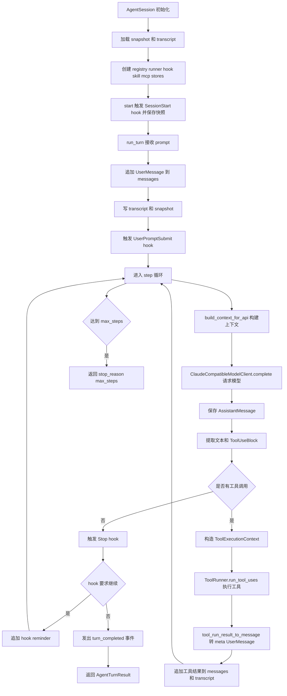
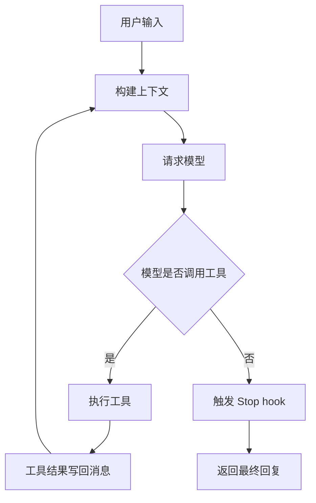

# `bigcode/agent/session.py` 代码阅读

源码路径：`bigcode/agent/session.py`

## 这个文件解决什么问题

`session.py` 是 BigCode 的主控制器。它把配置、消息、模型、工具、hook、技能、MCP、任务、子代理、transcript、snapshot 全部串成一个可运行的会话。

如果只读一个文件理解 BigCode 的运行方式，就应该先读这里，尤其是 `AgentSession.run_turn()`。

它做的事可以概括成一句话：

> 用户输入进入 `messages`，每一步构建上下文请求模型，模型可能返回工具调用，工具结果再变成 meta user message 喂回模型，直到模型不再请求工具。

## 先抓主线

主类是 `AgentSession`。

主流程是：

1. `__init__()` 初始化会话状态。
2. `start()` 触发会话启动 hook 并保存快照。
3. `run_turn(prompt)` 追加用户消息。
4. 每一步调用 `build_context_for_api()`。
5. 调 `ClaudeCompatibleModelClient.complete()` 请求模型。
6. 把模型返回的 `AssistantMessage` 追加到消息历史。
7. 如果没有 `ToolUseBlock`，触发 `Stop` hook 并返回最终文本。
8. 如果有工具调用，交给 `ToolRunner.run_tool_uses()`。
9. 工具结果通过 `tool_run_result_to_message()` 变成 meta user message。
10. 继续下一步模型请求。

## 核心数据结构和类

### `AgentTurnResult`

单轮对话的返回值：

- `assistant_text`：最终助手文本。
- `tool_results`：本轮执行过的工具结果。
- `stop_reason`：模型停止原因或 `max_steps`。

### `AgentSession`

会话对象保存大量状态：

- `config`：启动配置。
- `session_id`：会话 id。
- `model_ref`：当前模型引用。
- `permission_context`：当前权限模式和规则。
- `registry`：工具注册表。
- `runner`：工具执行器。
- `messages`：内部消息历史。
- `read_file_state`：文件读写快照。
- `loaded_skills`：已加载技能。
- `active_artifacts`：当前会话可读的大结果 artifact。
- `plan_state`、`task_store`、`plan_store`：计划和任务状态。
- `agent_task_store`：后台子代理任务状态。
- `skill_registry`：技能索引。
- `mcp_manager`：MCP 客户端管理器。
- `hook_bus`：hook 事件总线。
- `transcript`：完整消息流水。
- `artifact_store`：大工具结果落盘存储。

## 关键函数逐段讲解

### `__init__(...)`

初始化阶段做了很多装配工作。

最重要的几件事：

- 如果传入 `session_id` 且允许持久化，会尝试加载 snapshot。
- `task_list_id` 优先用 snapshot，其次用配置默认值，最后用 session id。
- `model_ref` 优先用命令行传入值，其次用 snapshot，其次用默认模型。
- 权限上下文会复制一份，避免运行时修改污染全局配置。
- 创建默认工具注册表和 `ToolRunner`。
- 从 snapshot 恢复 `ReadFileState`、已加载技能、artifact、最近验证命令。
- 加载技能、创建 MCP manager、注册内置 hook 和命令 hook。
- 创建 transcript 和 artifact store。
- 如果是 resume，会从 transcript 恢复 `messages`。

这个方法说明 BigCode 的恢复机制有两层：

- transcript：恢复完整消息历史。
- snapshot：快速恢复会话状态摘要。

### `model` 属性

根据 `self.model_ref` 从 `config.models` 中取出 `ResolvedModel`。

如果没有默认模型或模型不存在，会提前抛错，避免请求模型时才失败。

### `make_tool_context()`

把 `AgentSession` 中的运行状态打包成 `ToolExecutionContext`。

工具不直接依赖 `AgentSession`，而是通过这个上下文访问：

- `cwd`
- `workspace_roots`
- `permission_context`
- `read_file_state`
- `hook_bus`
- `plan_state`
- `task_store`
- `skill_registry`
- `mcp_manager`
- `artifact_store`
- `sandbox_profile`

这让工具系统和会话系统保持一定解耦。

### `start()`

会话开始时：

1. 发出 `session_started` 状态事件。
2. 触发 `SessionStart` hook。
3. 保存 snapshot。

### `run_turn(prompt, max_steps=20)`

这是最核心的函数。

第一段：接收用户输入。

- 发出 `turn_started` 事件。
- 创建 `UserMessage(prompt)`。
- 追加到 `self.messages`。
- 写入 transcript。
- 触发 `UserPromptSubmit` hook。

第二段：进入最多 `max_steps` 的循环。

每一步都会重新构建上下文：

```py
built = await build_context_for_api(self.messages, ContextBuildDeps(...))
```

这样做是因为工具结果、Plan Mode 状态、任务提醒、hook attachment 都可能在上一轮之后变化。

第三段：请求模型。

```py
response = await ClaudeCompatibleModelClient(self.model).complete(
    built.system_prompt,
    built.api_messages,
    self.registry.schemas_for_model(),
)
```

模型拿到三样东西：

- system prompt
- API messages
- 工具 schemas

第四段：保存模型回复。

模型回复已经是内部 `AssistantMessage`。代码会：

- 追加到 `messages`
- 写 transcript
- 提取文本
- 找出所有 `ToolUseBlock`

第五段：没有工具调用时尝试结束。

如果没有工具调用，会触发 `Stop` hook。Plan Mode 的停止保护就在这里发挥作用：如果模型没有用 `AskUserQuestion` 或 `ExitPlanMode` 收尾，hook 可以要求继续当前 turn。

第六段：有工具调用时执行工具。

```py
results = await self.runner.run_tool_uses(tool_uses, self.make_tool_context())
```

然后每个 `ToolRunResult` 会变成 meta `UserMessage([ToolResultBlock])`，追加回消息历史，供下一次模型请求使用。

如果循环超过 `max_steps`，返回 `stop_reason="max_steps"`。

### `run_subagent(...)`

同步运行一个子代理。

它会创建一个新的 `AgentSession`，但这个 child session 和父会话有关键差异：

- 使用独立 sidechain transcript。
- 不保存主 snapshot。
- 默认非交互。
- 工具注册表会被 `_registry_for_subagent()` 裁剪。
- 权限模式由 `_resolve_subagent_permission_mode()` 决定。
- 复用父会话的 task、plan、skill、MCP、hook 等共享组件。
- `read_file_state` 先 clone，结束后只把写入快照合并回父会话。

### `start_background_subagent(...)` 和 `_run_background_subagent(...)`

后台子代理不会等待执行完成。

启动时：

1. 生成 agent id。
2. 在 `AgentTaskStore` 创建 queued 状态。
3. `asyncio.create_task()` 启动后台运行。
4. 立即返回任务状态。

后台 task 内部会把状态更新为：

- `running`
- `completed`
- `failed`
- `cancelled`

最终输出会写到单独的输出文件。

### `cancel_background_subagent(agent_id)`

尝试取消仍在运行的后台子代理。

如果内存里有 asyncio task，就调用 `cancel()`；如果只有磁盘状态，则返回 `not_running`。

### `run_repl()`

交互式循环。

它区分两种输入来源：

- 非 TTY：逐行读 stdin，适合管道。
- TTY：用 `input()` 持续读取用户输入。

以 `/` 开头的输入走 `handle_command()`；普通文本走 `run_turn()`。

### `handle_command(line)`

本地命令不走模型。

支持：

- `/exit`、`/quit`
- `/help`
- `/doctor`
- `/status`
- `/plan`
- `/compact`

其中 `/plan` 会直接调用 `EnterPlanModeTool` 的 `call()`，复用工具内部状态更新逻辑。`/compact` 会调用 `apply_context_compact()` 手动压缩当前内存消息。

### 快照和记录函数

- `record_loaded_skill()`：记录已加载技能。
- `record_artifact()`：登记大工具结果 artifact。
- `record_last_verification()`：记录最近一次测试、构建、lint 命令。
- `_append_transcript()`：写 transcript 后保存 snapshot。
- `_save_snapshot()`：写入可恢复会话摘要。

### 子代理辅助函数

- `_resolve_subagent_permission_mode()`：父会话如果已经放宽权限，子代理继承；否则使用子代理定义。
- `_registry_for_subagent()`：按子代理 allowed/disallowed 工具裁剪 registry；后台和 plan 子代理会额外禁用危险工具。

## 和其他模块的关系

- `context.builder`：每次请求模型前构建上下文。
- `models`：发送 Claude-compatible 模型请求。
- `tools.runner`：执行模型返回的工具调用。
- `context.normalizer`：把工具结果变回消息。
- `hooks`：在会话、上下文、工具、停止、子代理等节点插入逻辑。
- `skills`、`mcp`：提供外部能力。
- `subagents`：定义和管理子代理。
- `agent.snapshot`、`context.transcript`：负责恢复和持久化。

## 阅读建议

先完整读 `run_turn()`，再回头读 `__init__()`。`__init__()` 字段很多，但大部分都是为了给 `run_turn()`、工具、hook、子代理准备运行时状态。

<!-- BEGIN EXTENDED READING NOTES -->

## 超详细源码阅读笔记（扩写版）

这一节是为了把前面的概览扩展成可以逐步跟读源码的版本。
阅读时不要只看结论，要把这里的每个检查点和对应源码放在一起看。
本篇主题是：Agent 会话主控制器。
模块职责可以先压缩成一句话：维护一次会话的全部状态，并驱动用户输入、模型回复、工具执行、结果回填的循环。
下面的内容按“定位、符号、入口、数据流、边界、误区、自测”的顺序展开。
如果你是 Python 初学者，建议先读每节第一组短句，再回到源码找同名函数。

### A. 阅读定位

- 这篇文档对应源码：bigcode/agent/session.py。
- 它在阅读路线里的角色：维护一次会话的全部状态，并驱动用户输入、模型回复、工具执行、结果回填的循环。
- 上游输入主要来自：cli.py, 子代理工具, REPL 本地命令。
- 下游输出或调用对象主要是：Context builder, ClaudeCompatibleModelClient, ToolRunner, HookBus, Transcript, SessionSnapshot。
- 可以用这个例子追踪：`用户输入 -> Assistant tool_use -> ToolRunner -> ToolResultBlock -> 再次请求模型`。
- 先读公开入口，再读辅助函数；先读数据结构，再读使用这些结构的流程。
- 遇到以下划线开头的函数，先判断它服务哪个公开函数，不要孤立理解。
- 遇到 dataclass，先把字段含义看懂，再看谁创建它、谁消费它。
- 遇到 BaseModel，先看字段类型，因为字段类型就是工具或 API 的输入约束。
- 遇到 async def，重点看它 await 了谁，这通常就是跨模块调用点。

### B. 源码文件 `bigcode/agent/session.py` 的结构地图

- 这个文件共有 844 行源码。
- 顶层 class/function 数量是 8。
- 顶层常量数量是 0。
- import/import from 语句数量大约是 31。
- 阅读时可以先折叠函数体，只看顶层符号顺序。
- 顶层符号顺序通常反映作者希望你先理解的数据类型和主入口。

#### 顶层符号阅读

- `class AgentTurnResult`：位于第 41-48 行附近。
  - 先看签名和返回值，判断 `AgentTurnResult` 是入口、数据模型还是辅助逻辑。
  - 再看它直接读取哪些字段、调用哪些函数、返回什么对象。
  - 如果 `AgentTurnResult` 是类，先读字段和构造函数，再读会被外部调用的方法。
  - 如果 `AgentTurnResult` 是函数，先找调用方；没有调用方时看是否是导出入口或测试使用。
- `class AgentSession`：位于第 51-749 行附近。
  - 先看签名和返回值，判断 `AgentSession` 是入口、数据模型还是辅助逻辑。
  - 再看它直接读取哪些字段、调用哪些函数、返回什么对象。
  - 如果 `AgentSession` 是类，先读字段和构造函数，再读会被外部调用的方法。
  - 如果 `AgentSession` 是函数，先找调用方；没有调用方时看是否是导出入口或测试使用。
- `def _clone_permission_context`：位于第 752-760 行附近。
  - 先看签名和返回值，判断 `_clone_permission_context` 是入口、数据模型还是辅助逻辑。
  - 再看它直接读取哪些字段、调用哪些函数、返回什么对象。
  - 如果 `_clone_permission_context` 是类，先读字段和构造函数，再读会被外部调用的方法。
  - 如果 `_clone_permission_context` 是函数，先找调用方；没有调用方时看是否是导出入口或测试使用。
- `def _format_exception`：位于第 763-765 行附近。
  - 先看签名和返回值，判断 `_format_exception` 是入口、数据模型还是辅助逻辑。
  - 再看它直接读取哪些字段、调用哪些函数、返回什么对象。
  - 如果 `_format_exception` 是类，先读字段和构造函数，再读会被外部调用的方法。
  - 如果 `_format_exception` 是函数，先找调用方；没有调用方时看是否是导出入口或测试使用。
- `def _parse_timeout`：位于第 768-776 行附近。
  - 先看签名和返回值，判断 `_parse_timeout` 是入口、数据模型还是辅助逻辑。
  - 再看它直接读取哪些字段、调用哪些函数、返回什么对象。
  - 如果 `_parse_timeout` 是类，先读字段和构造函数，再读会被外部调用的方法。
  - 如果 `_parse_timeout` 是函数，先找调用方；没有调用方时看是否是导出入口或测试使用。
- `def _total_tokens`：位于第 779-788 行附近。
  - 先看签名和返回值，判断 `_total_tokens` 是入口、数据模型还是辅助逻辑。
  - 再看它直接读取哪些字段、调用哪些函数、返回什么对象。
  - 如果 `_total_tokens` 是类，先读字段和构造函数，再读会被外部调用的方法。
  - 如果 `_total_tokens` 是函数，先找调用方；没有调用方时看是否是导出入口或测试使用。
- `def _resolve_subagent_permission_mode`：位于第 791-798 行附近。
  - 先看签名和返回值，判断 `_resolve_subagent_permission_mode` 是入口、数据模型还是辅助逻辑。
  - 再看它直接读取哪些字段、调用哪些函数、返回什么对象。
  - 如果 `_resolve_subagent_permission_mode` 是类，先读字段和构造函数，再读会被外部调用的方法。
  - 如果 `_resolve_subagent_permission_mode` 是函数，先找调用方；没有调用方时看是否是导出入口或测试使用。
- `def _registry_for_subagent`：位于第 801-844 行附近。
  - 先看签名和返回值，判断 `_registry_for_subagent` 是入口、数据模型还是辅助逻辑。
  - 再看它直接读取哪些字段、调用哪些函数、返回什么对象。
  - 如果 `_registry_for_subagent` 是类，先读字段和构造函数，再读会被外部调用的方法。
  - 如果 `_registry_for_subagent` 是函数，先找调用方；没有调用方时看是否是导出入口或测试使用。

### C. 主流程拆解

- 第 1 步：初始化 session 状态。读这一环节时要确认输入对象是什么、输出对象交给谁。
- 第 2 步：start 触发 SessionStart。读这一环节时要确认输入对象是什么、输出对象交给谁。
- 第 3 步：run_turn 追加用户消息。读这一环节时要确认输入对象是什么、输出对象交给谁。
- 第 4 步：构建上下文并请求模型。读这一环节时要确认输入对象是什么、输出对象交给谁。
- 第 5 步：执行工具并回填结果。读这一环节时要确认输入对象是什么、输出对象交给谁。
- 第 6 步：保存 transcript 和 snapshot。读这一环节时要确认输入对象是什么、输出对象交给谁。

### D. 本篇最应该盯住的源码点

- 关注点 1：run_turn 的 step 循环。它通常决定你是否真正理解这个模块的边界。
- 关注点 2：Stop hook 的 continue_turn。它通常决定你是否真正理解这个模块的边界。
- 关注点 3：工具结果作为 meta user message。它通常决定你是否真正理解这个模块的边界。
- 关注点 4：子代理 child session 的状态隔离。它通常决定你是否真正理解这个模块的边界。
- 关注点 5：snapshot 和 transcript 的分工。它通常决定你是否真正理解这个模块的边界。

### E. 初学者容易误解的点

- 误区 1：以为一次用户输入只请求一次模型。读源码时用实际调用链验证，不要只按变量名猜。
- 误区 2：把 assistant_text 当作所有助手历史。读源码时用实际调用链验证，不要只按变量名猜。
- 误区 3：忽略工具调用后还会继续请求模型。读源码时用实际调用链验证，不要只按变量名猜。
- 误区 4：以为子代理会污染父 transcript。读源码时用实际调用链验证，不要只按变量名猜。

### F. 数据流追踪

- 输入侧 1：`cli.py` 是这个模块可能接收信息的来源。
  - 追踪时先找它在哪个函数参数、对象字段或配置字段中出现。
  - 如果它是外部输入，要继续检查是否有校验、默认值或错误处理。
- 输入侧 2：`子代理工具` 是这个模块可能接收信息的来源。
  - 追踪时先找它在哪个函数参数、对象字段或配置字段中出现。
  - 如果它是外部输入，要继续检查是否有校验、默认值或错误处理。
- 输入侧 3：`REPL 本地命令` 是这个模块可能接收信息的来源。
  - 追踪时先找它在哪个函数参数、对象字段或配置字段中出现。
  - 如果它是外部输入，要继续检查是否有校验、默认值或错误处理。
- 输出侧 1：`Context builder` 是这个模块处理结果的去向。
  - 追踪时看当前模块传递的是原始值、结构化对象，还是已经裁剪过的投影。
  - 如果下游是工具或模型，重点检查安全边界和格式转换。
- 输出侧 2：`ClaudeCompatibleModelClient` 是这个模块处理结果的去向。
  - 追踪时看当前模块传递的是原始值、结构化对象，还是已经裁剪过的投影。
  - 如果下游是工具或模型，重点检查安全边界和格式转换。
- 输出侧 3：`ToolRunner` 是这个模块处理结果的去向。
  - 追踪时看当前模块传递的是原始值、结构化对象，还是已经裁剪过的投影。
  - 如果下游是工具或模型，重点检查安全边界和格式转换。
- 输出侧 4：`HookBus` 是这个模块处理结果的去向。
  - 追踪时看当前模块传递的是原始值、结构化对象，还是已经裁剪过的投影。
  - 如果下游是工具或模型，重点检查安全边界和格式转换。
- 输出侧 5：`Transcript` 是这个模块处理结果的去向。
  - 追踪时看当前模块传递的是原始值、结构化对象，还是已经裁剪过的投影。
  - 如果下游是工具或模型，重点检查安全边界和格式转换。
- 输出侧 6：`SessionSnapshot` 是这个模块处理结果的去向。
  - 追踪时看当前模块传递的是原始值、结构化对象，还是已经裁剪过的投影。
  - 如果下游是工具或模型，重点检查安全边界和格式转换。

### G. 边界情况阅读表

| 01 | `AgentTurnResult` | 输入为空时是否有默认值或早返回 | 回到源码确认实际分支，不要用经验推断 |
| 02 | `AgentSession` | 配置项不存在时是报错、降级还是记录 warning | 回到源码确认实际分支，不要用经验推断 |
| 03 | `_clone_permission_context` | 外部依赖不可用时是否影响主流程 | 回到源码确认实际分支，不要用经验推断 |
| 04 | `_format_exception` | 异常是否被捕获并转成结构化结果 | 回到源码确认实际分支，不要用经验推断 |
| 05 | `_parse_timeout` | 列表为空时返回空列表还是 None | 回到源码确认实际分支，不要用经验推断 |
| 06 | `_total_tokens` | 路径或名称是否合法是否有校验 | 回到源码确认实际分支，不要用经验推断 |
| 07 | `_resolve_subagent_permission_mode` | 非交互模式是否会改变行为 | 回到源码确认实际分支，不要用经验推断 |
| 08 | `_registry_for_subagent` | 状态是否会写入 transcript、snapshot 或磁盘文件 | 回到源码确认实际分支，不要用经验推断 |
| 09 | `AgentTurnResult` | 是否存在只读模式、plan 模式或 sandbox 的特殊分支 | 回到源码确认实际分支，不要用经验推断 |
| 10 | `AgentSession` | 返回值是否会继续进入模型上下文 | 回到源码确认实际分支，不要用经验推断 |
| 11 | `_clone_permission_context` | 输入为空时是否有默认值或早返回 | 回到源码确认实际分支，不要用经验推断 |
| 12 | `_format_exception` | 配置项不存在时是报错、降级还是记录 warning | 回到源码确认实际分支，不要用经验推断 |
| 13 | `_parse_timeout` | 外部依赖不可用时是否影响主流程 | 回到源码确认实际分支，不要用经验推断 |
| 14 | `_total_tokens` | 异常是否被捕获并转成结构化结果 | 回到源码确认实际分支，不要用经验推断 |
| 15 | `_resolve_subagent_permission_mode` | 列表为空时返回空列表还是 None | 回到源码确认实际分支，不要用经验推断 |
| 16 | `_registry_for_subagent` | 路径或名称是否合法是否有校验 | 回到源码确认实际分支，不要用经验推断 |
| 17 | `AgentTurnResult` | 非交互模式是否会改变行为 | 回到源码确认实际分支，不要用经验推断 |
| 18 | `AgentSession` | 状态是否会写入 transcript、snapshot 或磁盘文件 | 回到源码确认实际分支，不要用经验推断 |
| 19 | `_clone_permission_context` | 是否存在只读模式、plan 模式或 sandbox 的特殊分支 | 回到源码确认实际分支，不要用经验推断 |
| 20 | `_format_exception` | 返回值是否会继续进入模型上下文 | 回到源码确认实际分支，不要用经验推断 |
| 21 | `_parse_timeout` | 输入为空时是否有默认值或早返回 | 回到源码确认实际分支，不要用经验推断 |
| 22 | `_total_tokens` | 配置项不存在时是报错、降级还是记录 warning | 回到源码确认实际分支，不要用经验推断 |
| 23 | `_resolve_subagent_permission_mode` | 外部依赖不可用时是否影响主流程 | 回到源码确认实际分支，不要用经验推断 |
| 24 | `_registry_for_subagent` | 异常是否被捕获并转成结构化结果 | 回到源码确认实际分支，不要用经验推断 |
| 25 | `AgentTurnResult` | 列表为空时返回空列表还是 None | 回到源码确认实际分支，不要用经验推断 |
| 26 | `AgentSession` | 路径或名称是否合法是否有校验 | 回到源码确认实际分支，不要用经验推断 |
| 27 | `_clone_permission_context` | 非交互模式是否会改变行为 | 回到源码确认实际分支，不要用经验推断 |
| 28 | `_format_exception` | 状态是否会写入 transcript、snapshot 或磁盘文件 | 回到源码确认实际分支，不要用经验推断 |
| 29 | `_parse_timeout` | 是否存在只读模式、plan 模式或 sandbox 的特殊分支 | 回到源码确认实际分支，不要用经验推断 |
| 30 | `_total_tokens` | 返回值是否会继续进入模型上下文 | 回到源码确认实际分支，不要用经验推断 |
| 31 | `_resolve_subagent_permission_mode` | 输入为空时是否有默认值或早返回 | 回到源码确认实际分支，不要用经验推断 |
| 32 | `_registry_for_subagent` | 配置项不存在时是报错、降级还是记录 warning | 回到源码确认实际分支，不要用经验推断 |
| 33 | `AgentTurnResult` | 外部依赖不可用时是否影响主流程 | 回到源码确认实际分支，不要用经验推断 |
| 34 | `AgentSession` | 异常是否被捕获并转成结构化结果 | 回到源码确认实际分支，不要用经验推断 |
| 35 | `_clone_permission_context` | 列表为空时返回空列表还是 None | 回到源码确认实际分支，不要用经验推断 |
| 36 | `_format_exception` | 路径或名称是否合法是否有校验 | 回到源码确认实际分支，不要用经验推断 |
| 37 | `_parse_timeout` | 非交互模式是否会改变行为 | 回到源码确认实际分支，不要用经验推断 |
| 38 | `_total_tokens` | 状态是否会写入 transcript、snapshot 或磁盘文件 | 回到源码确认实际分支，不要用经验推断 |
| 39 | `_resolve_subagent_permission_mode` | 是否存在只读模式、plan 模式或 sandbox 的特殊分支 | 回到源码确认实际分支，不要用经验推断 |
| 40 | `_registry_for_subagent` | 返回值是否会继续进入模型上下文 | 回到源码确认实际分支，不要用经验推断 |
| 41 | `AgentTurnResult` | 输入为空时是否有默认值或早返回 | 回到源码确认实际分支，不要用经验推断 |
| 42 | `AgentSession` | 配置项不存在时是报错、降级还是记录 warning | 回到源码确认实际分支，不要用经验推断 |
| 43 | `_clone_permission_context` | 外部依赖不可用时是否影响主流程 | 回到源码确认实际分支，不要用经验推断 |
| 44 | `_format_exception` | 异常是否被捕获并转成结构化结果 | 回到源码确认实际分支，不要用经验推断 |
| 45 | `_parse_timeout` | 列表为空时返回空列表还是 None | 回到源码确认实际分支，不要用经验推断 |
| 46 | `_total_tokens` | 路径或名称是否合法是否有校验 | 回到源码确认实际分支，不要用经验推断 |
| 47 | `_resolve_subagent_permission_mode` | 非交互模式是否会改变行为 | 回到源码确认实际分支，不要用经验推断 |
| 48 | `_registry_for_subagent` | 状态是否会写入 transcript、snapshot 或磁盘文件 | 回到源码确认实际分支，不要用经验推断 |
| 49 | `AgentTurnResult` | 是否存在只读模式、plan 模式或 sandbox 的特殊分支 | 回到源码确认实际分支，不要用经验推断 |
| 50 | `AgentSession` | 返回值是否会继续进入模型上下文 | 回到源码确认实际分支，不要用经验推断 |
| 51 | `_clone_permission_context` | 输入为空时是否有默认值或早返回 | 回到源码确认实际分支，不要用经验推断 |
| 52 | `_format_exception` | 配置项不存在时是报错、降级还是记录 warning | 回到源码确认实际分支，不要用经验推断 |
| 53 | `_parse_timeout` | 外部依赖不可用时是否影响主流程 | 回到源码确认实际分支，不要用经验推断 |
| 54 | `_total_tokens` | 异常是否被捕获并转成结构化结果 | 回到源码确认实际分支，不要用经验推断 |
| 55 | `_resolve_subagent_permission_mode` | 列表为空时返回空列表还是 None | 回到源码确认实际分支，不要用经验推断 |
| 56 | `_registry_for_subagent` | 路径或名称是否合法是否有校验 | 回到源码确认实际分支，不要用经验推断 |
| 57 | `AgentTurnResult` | 非交互模式是否会改变行为 | 回到源码确认实际分支，不要用经验推断 |
| 58 | `AgentSession` | 状态是否会写入 transcript、snapshot 或磁盘文件 | 回到源码确认实际分支，不要用经验推断 |
| 59 | `_clone_permission_context` | 是否存在只读模式、plan 模式或 sandbox 的特殊分支 | 回到源码确认实际分支，不要用经验推断 |
| 60 | `_format_exception` | 返回值是否会继续进入模型上下文 | 回到源码确认实际分支，不要用经验推断 |

### H. 与阅读路线的衔接

- 读完 `Agent 会话主控制器` 后，回到 `doc/CodeReadingGuide.md` 看它处在哪一阶段。
- 如果它的上游是 cli.py，就从上游重新走一次调用链。
- 如果它的下游是 Context builder，就继续读下游如何消费当前模块的输出。
- 不要只背函数名；真正的理解是能说清数据对象怎样跨文件移动。
- 当你能画出自己的简图，再对照文末两个流程图，说明这一篇基本读通了。

## 详细流程图



## 核心流程图


