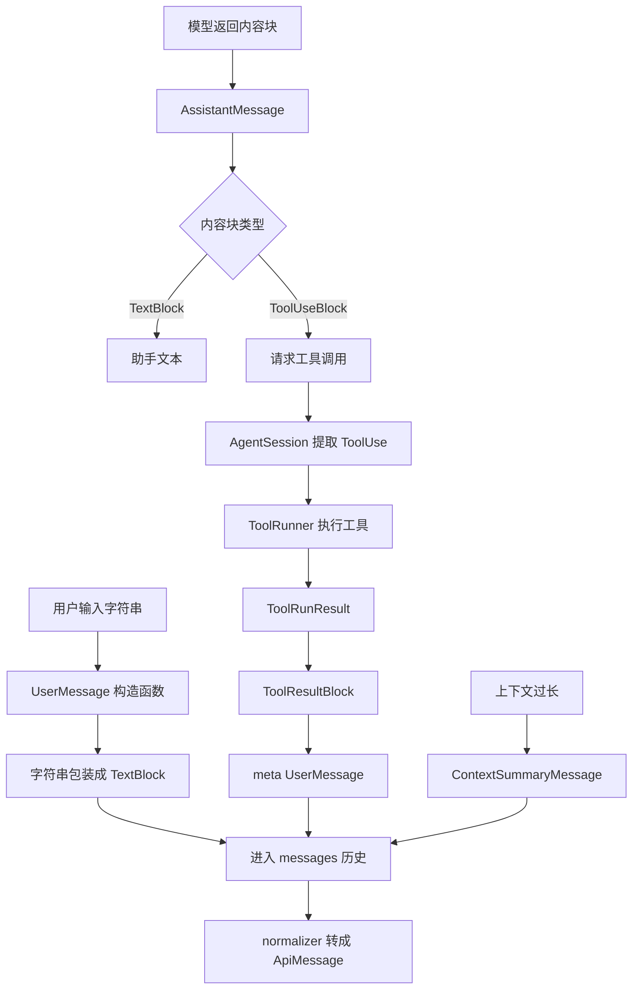
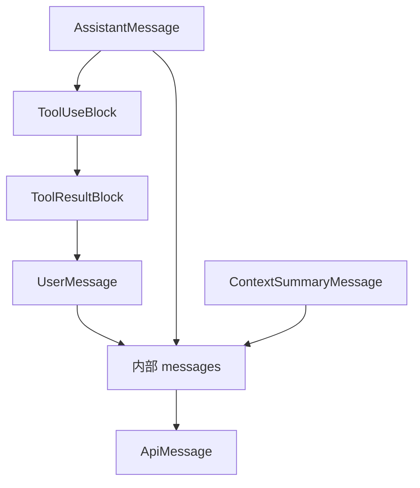

# `bigcode/context/messages.py` 代码阅读

源码路径：`bigcode/context/messages.py`

## 这个文件解决什么问题

`messages.py` 定义 BigCode 内部消息模型。它回答一个基础问题：BigCode 在内存里怎样表示用户输入、模型回复、工具调用、工具结果和上下文摘要？

这个文件不负责发送 API，也不负责压缩上下文。它只定义数据结构和一个小工具函数。

理解它之后，再读 `builder.py` 和 `normalizer.py` 会容易很多，因为后面所有上下文处理都围绕这些消息类型展开。

## 先抓主线

内部消息分两层：

1. 内容块 `ContentBlock`
2. 消息 `MessageBase` 的不同子类

内容块有三种：

- `TextBlock`：普通文本。
- `ToolUseBlock`：助手请求调用工具。
- `ToolResultBlock`：工具执行结果。

消息有四种主要类型：

- `UserMessage`
- `AssistantMessage`
- `SystemMessage`
- `ContextSummaryMessage`

最后还有 `ApiMessage`，它不是内部完整消息，而是发给模型 API 的简化结构。

## 核心数据结构

### `TextBlock`

普通文本块。

字段：

- `type="text"`
- `text`

用户消息和助手消息都可以包含它。

### `ToolUseBlock`

模型请求工具调用的块。

字段：

- `type="tool_use"`
- `id`：工具调用 id，后续工具结果要用它对应。
- `name`：工具名。
- `input`：模型传给工具的原始参数。

`AgentSession.run_turn()` 会从 `AssistantMessage.content` 中找出这些块，然后转换成 `ToolUse` 给 `ToolRunner`。

### `ToolResultBlock`

工具执行结果块。

字段：

- `type="tool_result"`
- `tool_use_id`：回应哪个 `ToolUseBlock.id`。
- `content`：工具结果内容。
- `is_error`：是否是错误结果。

它通常出现在 `is_meta=True` 的 `UserMessage` 里。原因是 Claude Messages API 要求工具结果以 user role 的形式回传。

### `ContentBlock`

类型别名：

```py
ContentBlock = TextBlock | ToolUseBlock | ToolResultBlock
```

这说明用户消息和助手消息的内容都不是单纯字符串，而是内容块列表。

### `MessageBase`

所有内部消息的基础字段：

- `type`
- `uuid`
- `timestamp`
- `is_meta`
- `origin`

`uuid` 用 `new_id("msg")` 生成。`is_meta` 和 `origin` 用来区分真实用户输入、工具结果、hook 提醒、compact 摘要等来源。

### `UserMessage`

表示用户侧消息。

它既可以是真实用户输入，也可以是系统生成的 meta 消息，例如：

- 工具结果。
- hook reminder。
- context attachment。

构造函数支持两种输入：

- 字符串：自动包装成 `[TextBlock(text=content)]`。
- 内容块列表：直接使用。

### `AssistantMessage`

表示模型回复。

除了 `content`，还保存：

- `model`
- `stop_reason`
- `usage`

`usage` 后续会用于统计 token，例如子代理结果里的 `total_tokens`。

### `SystemMessage`

表示 BigCode 本地系统消息。

当前注释说明 transcript 主要恢复用户和助手消息，系统消息更多是未来扩展或本地状态表达。

它不是 system prompt。system prompt 是另外由 `system_prompt.py` 构建。

### `ContextSummaryMessage`

上下文压缩摘要。

当历史太长时，`compact.py` 会用这个消息代替被省略的一段历史。

它默认：

- `type="context_summary"`
- `is_meta=True`
- `origin="compact"`

### `ApiMessage`

发给 Claude Messages API 的结构：

- `role` 只能是 `user` 或 `assistant`。
- `content` 是 dict 列表。

它比内部消息少很多字段，不保存 uuid、timestamp、origin 等本地信息。

## 关键函数

### `text_from_blocks(blocks)`

从内容块列表里提取所有 `TextBlock.text`，并用换行拼接。

`AgentSession.run_turn()` 用它从助手回复里拿最终文本：

```py
text = text_from_blocks(assistant.content)
```

它会忽略工具调用和工具结果块。

## 和其他模块的关系

- `AgentSession` 把用户输入创建成 `UserMessage`，把模型回复保存成 `AssistantMessage`。
- `ToolRunner` 返回 `ToolRunResult` 后，`normalizer.tool_run_result_to_message()` 会生成包含 `ToolResultBlock` 的 meta `UserMessage`。
- `compact.py` 会生成 `ContextSummaryMessage`。
- `normalizer.py` 会把这些内部消息转换成 `ApiMessage`。
- `transcript.py` 会持久化和恢复这些消息。

## 阅读建议

先看三个 block，再看四个 message。只要记住“工具调用在 assistant 里，工具结果在 meta user 里”，后面 API 归一化逻辑就很好理解。

<!-- BEGIN EXTENDED READING NOTES -->

## 超详细源码阅读笔记（扩写版）

这一节是为了把前面的概览扩展成可以逐步跟读源码的版本。
阅读时不要只看结论，要把这里的每个检查点和对应源码放在一起看。
本篇主题是：内部消息模型。
模块职责可以先压缩成一句话：定义 BigCode 内部如何表示文本、工具调用、工具结果、用户消息、助手消息和摘要消息。
下面的内容按“定位、符号、入口、数据流、边界、误区、自测”的顺序展开。
如果你是 Python 初学者，建议先读每节第一组短句，再回到源码找同名函数。

### A. 阅读定位

- 这篇文档对应源码：bigcode/context/messages.py。
- 它在阅读路线里的角色：定义 BigCode 内部如何表示文本、工具调用、工具结果、用户消息、助手消息和摘要消息。
- 上游输入主要来自：AgentSession, Tool normalizer, Context compact。
- 下游输出或调用对象主要是：Context builder, Normalizer, Transcript, 模型请求 payload。
- 可以用这个例子追踪：`AssistantMessage([TextBlock, ToolUseBlock]) 后接 UserMessage([ToolResultBlock])`。
- 先读公开入口，再读辅助函数；先读数据结构，再读使用这些结构的流程。
- 遇到以下划线开头的函数，先判断它服务哪个公开函数，不要孤立理解。
- 遇到 dataclass，先把字段含义看懂，再看谁创建它、谁消费它。
- 遇到 BaseModel，先看字段类型，因为字段类型就是工具或 API 的输入约束。
- 遇到 async def，重点看它 await 了谁，这通常就是跨模块调用点。

### B. 源码文件 `bigcode/context/messages.py` 的结构地图

- 这个文件共有 147 行源码。
- 顶层 class/function 数量是 10。
- 顶层常量数量是 0。
- import/import from 语句数量大约是 6。
- 阅读时可以先折叠函数体，只看顶层符号顺序。
- 顶层符号顺序通常反映作者希望你先理解的数据类型和主入口。

#### 顶层符号阅读

- `class TextBlock`：位于第 16-22 行附近。
  - 先看签名和返回值，判断 `TextBlock` 是入口、数据模型还是辅助逻辑。
  - 再看它直接读取哪些字段、调用哪些函数、返回什么对象。
  - 如果 `TextBlock` 是类，先读字段和构造函数，再读会被外部调用的方法。
  - 如果 `TextBlock` 是函数，先找调用方；没有调用方时看是否是导出入口或测试使用。
- `class ToolUseBlock`：位于第 25-33 行附近。
  - 先看签名和返回值，判断 `ToolUseBlock` 是入口、数据模型还是辅助逻辑。
  - 再看它直接读取哪些字段、调用哪些函数、返回什么对象。
  - 如果 `ToolUseBlock` 是类，先读字段和构造函数，再读会被外部调用的方法。
  - 如果 `ToolUseBlock` 是函数，先找调用方；没有调用方时看是否是导出入口或测试使用。
- `class ToolResultBlock`：位于第 36-44 行附近。
  - 先看签名和返回值，判断 `ToolResultBlock` 是入口、数据模型还是辅助逻辑。
  - 再看它直接读取哪些字段、调用哪些函数、返回什么对象。
  - 如果 `ToolResultBlock` 是类，先读字段和构造函数，再读会被外部调用的方法。
  - 如果 `ToolResultBlock` 是函数，先找调用方；没有调用方时看是否是导出入口或测试使用。
- `class MessageBase`：位于第 51-60 行附近。
  - 先看签名和返回值，判断 `MessageBase` 是入口、数据模型还是辅助逻辑。
  - 再看它直接读取哪些字段、调用哪些函数、返回什么对象。
  - 如果 `MessageBase` 是类，先读字段和构造函数，再读会被外部调用的方法。
  - 如果 `MessageBase` 是函数，先找调用方；没有调用方时看是否是导出入口或测试使用。
- `class UserMessage`：位于第 64-74 行附近。
  - 先看签名和返回值，判断 `UserMessage` 是入口、数据模型还是辅助逻辑。
  - 再看它直接读取哪些字段、调用哪些函数、返回什么对象。
  - 如果 `UserMessage` 是类，先读字段和构造函数，再读会被外部调用的方法。
  - 如果 `UserMessage` 是函数，先找调用方；没有调用方时看是否是导出入口或测试使用。
- `class AssistantMessage`：位于第 78-101 行附近。
  - 先看签名和返回值，判断 `AssistantMessage` 是入口、数据模型还是辅助逻辑。
  - 再看它直接读取哪些字段、调用哪些函数、返回什么对象。
  - 如果 `AssistantMessage` 是类，先读字段和构造函数，再读会被外部调用的方法。
  - 如果 `AssistantMessage` 是函数，先找调用方；没有调用方时看是否是导出入口或测试使用。
- `class SystemMessage`：位于第 105-119 行附近。
  - 先看签名和返回值，判断 `SystemMessage` 是入口、数据模型还是辅助逻辑。
  - 再看它直接读取哪些字段、调用哪些函数、返回什么对象。
  - 如果 `SystemMessage` 是类，先读字段和构造函数，再读会被外部调用的方法。
  - 如果 `SystemMessage` 是函数，先找调用方；没有调用方时看是否是导出入口或测试使用。
- `class ContextSummaryMessage`：位于第 123-133 行附近。
  - 先看签名和返回值，判断 `ContextSummaryMessage` 是入口、数据模型还是辅助逻辑。
  - 再看它直接读取哪些字段、调用哪些函数、返回什么对象。
  - 如果 `ContextSummaryMessage` 是类，先读字段和构造函数，再读会被外部调用的方法。
  - 如果 `ContextSummaryMessage` 是函数，先找调用方；没有调用方时看是否是导出入口或测试使用。
- `class ApiMessage`：位于第 136-142 行附近。
  - 先看签名和返回值，判断 `ApiMessage` 是入口、数据模型还是辅助逻辑。
  - 再看它直接读取哪些字段、调用哪些函数、返回什么对象。
  - 如果 `ApiMessage` 是类，先读字段和构造函数，再读会被外部调用的方法。
  - 如果 `ApiMessage` 是函数，先找调用方；没有调用方时看是否是导出入口或测试使用。
- `def text_from_blocks`：位于第 145-147 行附近。
  - 先看签名和返回值，判断 `text_from_blocks` 是入口、数据模型还是辅助逻辑。
  - 再看它直接读取哪些字段、调用哪些函数、返回什么对象。
  - 如果 `text_from_blocks` 是类，先读字段和构造函数，再读会被外部调用的方法。
  - 如果 `text_from_blocks` 是函数，先找调用方；没有调用方时看是否是导出入口或测试使用。

### C. 主流程拆解

- 第 1 步：内容块建模。读这一环节时要确认输入对象是什么、输出对象交给谁。
- 第 2 步：内部消息建模。读这一环节时要确认输入对象是什么、输出对象交给谁。
- 第 3 步：meta 消息区分。读这一环节时要确认输入对象是什么、输出对象交给谁。
- 第 4 步：ApiMessage 简化投影。读这一环节时要确认输入对象是什么、输出对象交给谁。
- 第 5 步：text_from_blocks 提取文本。读这一环节时要确认输入对象是什么、输出对象交给谁。

### D. 本篇最应该盯住的源码点

- 关注点 1：ToolUseBlock.id 和 ToolResultBlock.tool_use_id 配对。它通常决定你是否真正理解这个模块的边界。
- 关注点 2：UserMessage 可以是真实输入也可以是 meta。它通常决定你是否真正理解这个模块的边界。
- 关注点 3：SystemMessage 不是 system prompt。它通常决定你是否真正理解这个模块的边界。
- 关注点 4：ContextSummaryMessage 是 compact 产物。它通常决定你是否真正理解这个模块的边界。

### E. 初学者容易误解的点

- 误区 1：把内部 MessageBase 当作 API message。读源码时用实际调用链验证，不要只按变量名猜。
- 误区 2：把工具结果放在 assistant role。读源码时用实际调用链验证，不要只按变量名猜。
- 误区 3：忽略 is_meta 和 origin。读源码时用实际调用链验证，不要只按变量名猜。
- 误区 4：以为 TextBlock 是唯一内容块。读源码时用实际调用链验证，不要只按变量名猜。

### F. 数据流追踪

- 输入侧 1：`AgentSession` 是这个模块可能接收信息的来源。
  - 追踪时先找它在哪个函数参数、对象字段或配置字段中出现。
  - 如果它是外部输入，要继续检查是否有校验、默认值或错误处理。
- 输入侧 2：`Tool normalizer` 是这个模块可能接收信息的来源。
  - 追踪时先找它在哪个函数参数、对象字段或配置字段中出现。
  - 如果它是外部输入，要继续检查是否有校验、默认值或错误处理。
- 输入侧 3：`Context compact` 是这个模块可能接收信息的来源。
  - 追踪时先找它在哪个函数参数、对象字段或配置字段中出现。
  - 如果它是外部输入，要继续检查是否有校验、默认值或错误处理。
- 输出侧 1：`Context builder` 是这个模块处理结果的去向。
  - 追踪时看当前模块传递的是原始值、结构化对象，还是已经裁剪过的投影。
  - 如果下游是工具或模型，重点检查安全边界和格式转换。
- 输出侧 2：`Normalizer` 是这个模块处理结果的去向。
  - 追踪时看当前模块传递的是原始值、结构化对象，还是已经裁剪过的投影。
  - 如果下游是工具或模型，重点检查安全边界和格式转换。
- 输出侧 3：`Transcript` 是这个模块处理结果的去向。
  - 追踪时看当前模块传递的是原始值、结构化对象，还是已经裁剪过的投影。
  - 如果下游是工具或模型，重点检查安全边界和格式转换。
- 输出侧 4：`模型请求 payload` 是这个模块处理结果的去向。
  - 追踪时看当前模块传递的是原始值、结构化对象，还是已经裁剪过的投影。
  - 如果下游是工具或模型，重点检查安全边界和格式转换。

### G. 边界情况阅读表

| 01 | `TextBlock` | 输入为空时是否有默认值或早返回 | 回到源码确认实际分支，不要用经验推断 |
| 02 | `ToolUseBlock` | 配置项不存在时是报错、降级还是记录 warning | 回到源码确认实际分支，不要用经验推断 |
| 03 | `ToolResultBlock` | 外部依赖不可用时是否影响主流程 | 回到源码确认实际分支，不要用经验推断 |
| 04 | `MessageBase` | 异常是否被捕获并转成结构化结果 | 回到源码确认实际分支，不要用经验推断 |
| 05 | `UserMessage` | 列表为空时返回空列表还是 None | 回到源码确认实际分支，不要用经验推断 |
| 06 | `AssistantMessage` | 路径或名称是否合法是否有校验 | 回到源码确认实际分支，不要用经验推断 |
| 07 | `SystemMessage` | 非交互模式是否会改变行为 | 回到源码确认实际分支，不要用经验推断 |
| 08 | `ContextSummaryMessage` | 状态是否会写入 transcript、snapshot 或磁盘文件 | 回到源码确认实际分支，不要用经验推断 |
| 09 | `ApiMessage` | 是否存在只读模式、plan 模式或 sandbox 的特殊分支 | 回到源码确认实际分支，不要用经验推断 |
| 10 | `text_from_blocks` | 返回值是否会继续进入模型上下文 | 回到源码确认实际分支，不要用经验推断 |
| 11 | `TextBlock` | 输入为空时是否有默认值或早返回 | 回到源码确认实际分支，不要用经验推断 |
| 12 | `ToolUseBlock` | 配置项不存在时是报错、降级还是记录 warning | 回到源码确认实际分支，不要用经验推断 |
| 13 | `ToolResultBlock` | 外部依赖不可用时是否影响主流程 | 回到源码确认实际分支，不要用经验推断 |
| 14 | `MessageBase` | 异常是否被捕获并转成结构化结果 | 回到源码确认实际分支，不要用经验推断 |
| 15 | `UserMessage` | 列表为空时返回空列表还是 None | 回到源码确认实际分支，不要用经验推断 |
| 16 | `AssistantMessage` | 路径或名称是否合法是否有校验 | 回到源码确认实际分支，不要用经验推断 |
| 17 | `SystemMessage` | 非交互模式是否会改变行为 | 回到源码确认实际分支，不要用经验推断 |
| 18 | `ContextSummaryMessage` | 状态是否会写入 transcript、snapshot 或磁盘文件 | 回到源码确认实际分支，不要用经验推断 |
| 19 | `ApiMessage` | 是否存在只读模式、plan 模式或 sandbox 的特殊分支 | 回到源码确认实际分支，不要用经验推断 |
| 20 | `text_from_blocks` | 返回值是否会继续进入模型上下文 | 回到源码确认实际分支，不要用经验推断 |
| 21 | `TextBlock` | 输入为空时是否有默认值或早返回 | 回到源码确认实际分支，不要用经验推断 |
| 22 | `ToolUseBlock` | 配置项不存在时是报错、降级还是记录 warning | 回到源码确认实际分支，不要用经验推断 |
| 23 | `ToolResultBlock` | 外部依赖不可用时是否影响主流程 | 回到源码确认实际分支，不要用经验推断 |
| 24 | `MessageBase` | 异常是否被捕获并转成结构化结果 | 回到源码确认实际分支，不要用经验推断 |
| 25 | `UserMessage` | 列表为空时返回空列表还是 None | 回到源码确认实际分支，不要用经验推断 |
| 26 | `AssistantMessage` | 路径或名称是否合法是否有校验 | 回到源码确认实际分支，不要用经验推断 |
| 27 | `SystemMessage` | 非交互模式是否会改变行为 | 回到源码确认实际分支，不要用经验推断 |
| 28 | `ContextSummaryMessage` | 状态是否会写入 transcript、snapshot 或磁盘文件 | 回到源码确认实际分支，不要用经验推断 |
| 29 | `ApiMessage` | 是否存在只读模式、plan 模式或 sandbox 的特殊分支 | 回到源码确认实际分支，不要用经验推断 |
| 30 | `text_from_blocks` | 返回值是否会继续进入模型上下文 | 回到源码确认实际分支，不要用经验推断 |
| 31 | `TextBlock` | 输入为空时是否有默认值或早返回 | 回到源码确认实际分支，不要用经验推断 |
| 32 | `ToolUseBlock` | 配置项不存在时是报错、降级还是记录 warning | 回到源码确认实际分支，不要用经验推断 |
| 33 | `ToolResultBlock` | 外部依赖不可用时是否影响主流程 | 回到源码确认实际分支，不要用经验推断 |
| 34 | `MessageBase` | 异常是否被捕获并转成结构化结果 | 回到源码确认实际分支，不要用经验推断 |
| 35 | `UserMessage` | 列表为空时返回空列表还是 None | 回到源码确认实际分支，不要用经验推断 |
| 36 | `AssistantMessage` | 路径或名称是否合法是否有校验 | 回到源码确认实际分支，不要用经验推断 |
| 37 | `SystemMessage` | 非交互模式是否会改变行为 | 回到源码确认实际分支，不要用经验推断 |
| 38 | `ContextSummaryMessage` | 状态是否会写入 transcript、snapshot 或磁盘文件 | 回到源码确认实际分支，不要用经验推断 |
| 39 | `ApiMessage` | 是否存在只读模式、plan 模式或 sandbox 的特殊分支 | 回到源码确认实际分支，不要用经验推断 |
| 40 | `text_from_blocks` | 返回值是否会继续进入模型上下文 | 回到源码确认实际分支，不要用经验推断 |
| 41 | `TextBlock` | 输入为空时是否有默认值或早返回 | 回到源码确认实际分支，不要用经验推断 |
| 42 | `ToolUseBlock` | 配置项不存在时是报错、降级还是记录 warning | 回到源码确认实际分支，不要用经验推断 |
| 43 | `ToolResultBlock` | 外部依赖不可用时是否影响主流程 | 回到源码确认实际分支，不要用经验推断 |
| 44 | `MessageBase` | 异常是否被捕获并转成结构化结果 | 回到源码确认实际分支，不要用经验推断 |
| 45 | `UserMessage` | 列表为空时返回空列表还是 None | 回到源码确认实际分支，不要用经验推断 |
| 46 | `AssistantMessage` | 路径或名称是否合法是否有校验 | 回到源码确认实际分支，不要用经验推断 |
| 47 | `SystemMessage` | 非交互模式是否会改变行为 | 回到源码确认实际分支，不要用经验推断 |
| 48 | `ContextSummaryMessage` | 状态是否会写入 transcript、snapshot 或磁盘文件 | 回到源码确认实际分支，不要用经验推断 |
| 49 | `ApiMessage` | 是否存在只读模式、plan 模式或 sandbox 的特殊分支 | 回到源码确认实际分支，不要用经验推断 |
| 50 | `text_from_blocks` | 返回值是否会继续进入模型上下文 | 回到源码确认实际分支，不要用经验推断 |
| 51 | `TextBlock` | 输入为空时是否有默认值或早返回 | 回到源码确认实际分支，不要用经验推断 |
| 52 | `ToolUseBlock` | 配置项不存在时是报错、降级还是记录 warning | 回到源码确认实际分支，不要用经验推断 |
| 53 | `ToolResultBlock` | 外部依赖不可用时是否影响主流程 | 回到源码确认实际分支，不要用经验推断 |
| 54 | `MessageBase` | 异常是否被捕获并转成结构化结果 | 回到源码确认实际分支，不要用经验推断 |
| 55 | `UserMessage` | 列表为空时返回空列表还是 None | 回到源码确认实际分支，不要用经验推断 |
| 56 | `AssistantMessage` | 路径或名称是否合法是否有校验 | 回到源码确认实际分支，不要用经验推断 |
| 57 | `SystemMessage` | 非交互模式是否会改变行为 | 回到源码确认实际分支，不要用经验推断 |
| 58 | `ContextSummaryMessage` | 状态是否会写入 transcript、snapshot 或磁盘文件 | 回到源码确认实际分支，不要用经验推断 |
| 59 | `ApiMessage` | 是否存在只读模式、plan 模式或 sandbox 的特殊分支 | 回到源码确认实际分支，不要用经验推断 |
| 60 | `text_from_blocks` | 返回值是否会继续进入模型上下文 | 回到源码确认实际分支，不要用经验推断 |

### H. 与阅读路线的衔接

- 读完 `内部消息模型` 后，回到 `doc/CodeReadingGuide.md` 看它处在哪一阶段。
- 如果它的上游是 AgentSession，就从上游重新走一次调用链。
- 如果它的下游是 Context builder，就继续读下游如何消费当前模块的输出。
- 不要只背函数名；真正的理解是能说清数据对象怎样跨文件移动。
- 当你能画出自己的简图，再对照文末两个流程图，说明这一篇基本读通了。

## 详细流程图



## 核心流程图


