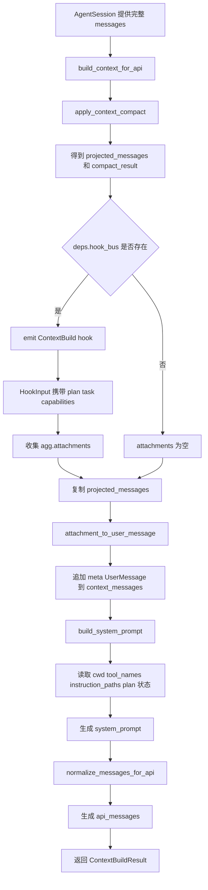
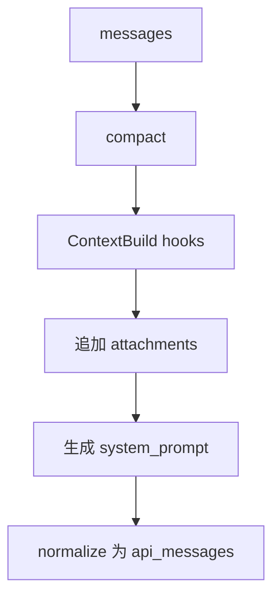

# `bigcode/context/builder.py` 代码阅读

源码路径：`bigcode/context/builder.py`

## 这个文件解决什么问题

`builder.py` 负责把当前会话的内部 `messages` 加工成一次模型请求需要的完整上下文。

它不是简单地把历史消息原样发给模型，而是做了几件关键事情：

- 对过长历史做 compact。
- 触发 `ContextBuild` hook，收集动态附件。
- 把附件转成 meta user message。
- 重新生成 system prompt。
- 调 `normalize_messages_for_api()` 转成 API messages。

它是 `AgentSession.run_turn()` 每次请求模型前必走的步骤。

## 先抓主线

主入口是 `build_context_for_api(messages, deps)`。

流程：

1. 调 `apply_context_compact(messages)`。
2. 如果有 `hook_bus`，触发 `ContextBuild`。
3. 收集 hook 返回的 `attachments`。
4. 把压缩后的消息复制到 `context_messages`。
5. 把附件转成 meta `UserMessage` 追加进去。
6. 调 `build_system_prompt()` 生成 system prompt。
7. 调 `normalize_messages_for_api()` 生成 `api_messages`。
8. 返回 `ContextBuildResult`。

## 核心数据结构

### `ContextBuildDeps`

构建上下文需要的外部依赖集合。

字段包括：

- `session_id`
- `cwd`
- `instruction_paths`
- `tool_names`
- `hook_bus`
- `permission_mode`
- `plan_mode_state`
- `task_store`
- `task_list_id`
- `capabilities`

这个 dataclass 的作用是避免 `build_context_for_api()` 参数列表太长。

### `ContextBuildResult`

构建结果。

字段包括：

- `system_prompt`
- `context_messages`
- `api_messages`
- `compact_result`
- `attachments`

`context_messages` 是内部投影视图，`api_messages` 是真正发给模型 API 的消息。

## 关键函数逐段讲解

### `build_context_for_api(messages, deps)`

第一步：压缩历史。

```py
compact_result = await apply_context_compact(messages)
```

返回的 `compact_result.projected_messages` 是本轮请求模型实际采用的历史视图，不一定等于完整 `messages`。

第二步：触发 `ContextBuild` hook。

hook 输入里带了：

- 当前消息数量。
- Plan Mode 状态。
- task store 和 task list id。
- capabilities。

内置 hook 会利用这些信息注入：

- Plan Mode 提醒。
- 未完成任务提醒。
- 技能和 MCP 能力索引。

第三步：组装 `context_messages`。

```py
context_messages = list(compact_result.projected_messages)
context_messages.extend(attachment_to_user_message(att) for att in attachments)
```

注意附件不是直接发 API，而是先转成内部 `UserMessage`。这样后续统一由 normalizer 处理。

第四步：构建 system prompt。

`build_system_prompt()` 接收：

- 当前 cwd。
- 工具名称列表。
- instruction 文件路径。
- Plan Mode 是否激活。
- Plan 文件路径。

这说明 system prompt 每次请求前都会重新生成。原因是工具列表、日期、项目说明、Plan Mode 状态都可能变化。

第五步：归一化 API 消息。

```py
api_messages = normalize_messages_for_api(system_prompt, context_messages)
```

虽然函数传入了 `system_prompt`，当前 normalizer 里只是接收但未实际使用。真正使用 system prompt 的地方是模型客户端请求参数。

## 和其他模块的关系

- 调 `compact.apply_context_compact()` 压缩历史。
- 通过 `HookBus.emit("ContextBuild", ...)` 收集动态附件。
- 调 `normalizer.attachment_to_user_message()` 把 attachment 包成系统提醒。
- 调 `system_prompt.build_system_prompt()` 构建系统提示词。
- 调 `normalizer.normalize_messages_for_api()` 转成模型 API 消息。
- 被 `AgentSession.run_turn()` 在每个模型请求前调用。

## 阅读建议

这个文件的重点不是复杂算法，而是“顺序”。上下文构建一定是先 compact，再 hook，再 system prompt，再 API normalizer。顺序错了，模型看到的动态信息就可能不完整或不合法。

<!-- BEGIN EXTENDED READING NOTES -->

## 超详细源码阅读笔记（扩写版）

这一节是为了把前面的概览扩展成可以逐步跟读源码的版本。
阅读时不要只看结论，要把这里的每个检查点和对应源码放在一起看。
本篇主题是：上下文构建器。
模块职责可以先压缩成一句话：每次请求模型前，把完整消息历史加工成 system prompt、context messages 和 api messages。
下面的内容按“定位、符号、入口、数据流、边界、误区、自测”的顺序展开。
如果你是 Python 初学者，建议先读每节第一组短句，再回到源码找同名函数。

### A. 阅读定位

- 这篇文档对应源码：bigcode/context/builder.py。
- 它在阅读路线里的角色：每次请求模型前，把完整消息历史加工成 system prompt、context messages 和 api messages。
- 上游输入主要来自：AgentSession.run_turn, HookBus, PlanModeState, TaskStore。
- 下游输出或调用对象主要是：模型客户端, Normalizer, System prompt builder。
- 可以用这个例子追踪：`messages -> compact_result.projected_messages -> attachments -> api_messages`。
- 先读公开入口，再读辅助函数；先读数据结构，再读使用这些结构的流程。
- 遇到以下划线开头的函数，先判断它服务哪个公开函数，不要孤立理解。
- 遇到 dataclass，先把字段含义看懂，再看谁创建它、谁消费它。
- 遇到 BaseModel，先看字段类型，因为字段类型就是工具或 API 的输入约束。
- 遇到 async def，重点看它 await 了谁，这通常就是跨模块调用点。

### B. 源码文件 `bigcode/context/builder.py` 的结构地图

- 这个文件共有 91 行源码。
- 顶层 class/function 数量是 3。
- 顶层常量数量是 0。
- import/import from 语句数量大约是 8。
- 阅读时可以先折叠函数体，只看顶层符号顺序。
- 顶层符号顺序通常反映作者希望你先理解的数据类型和主入口。

#### 顶层符号阅读

- `class ContextBuildDeps`：位于第 19-33 行附近。
  - 先看签名和返回值，判断 `ContextBuildDeps` 是入口、数据模型还是辅助逻辑。
  - 再看它直接读取哪些字段、调用哪些函数、返回什么对象。
  - 如果 `ContextBuildDeps` 是类，先读字段和构造函数，再读会被外部调用的方法。
  - 如果 `ContextBuildDeps` 是函数，先找调用方；没有调用方时看是否是导出入口或测试使用。
- `class ContextBuildResult`：位于第 37-43 行附近。
  - 先看签名和返回值，判断 `ContextBuildResult` 是入口、数据模型还是辅助逻辑。
  - 再看它直接读取哪些字段、调用哪些函数、返回什么对象。
  - 如果 `ContextBuildResult` 是类，先读字段和构造函数，再读会被外部调用的方法。
  - 如果 `ContextBuildResult` 是函数，先找调用方；没有调用方时看是否是导出入口或测试使用。
- `async def build_context_for_api`：位于第 46-91 行附近。
  - 先看签名和返回值，判断 `build_context_for_api` 是入口、数据模型还是辅助逻辑。
  - 再看它直接读取哪些字段、调用哪些函数、返回什么对象。
  - 如果 `build_context_for_api` 是类，先读字段和构造函数，再读会被外部调用的方法。
  - 如果 `build_context_for_api` 是函数，先找调用方；没有调用方时看是否是导出入口或测试使用。

### C. 主流程拆解

- 第 1 步：apply_context_compact。读这一环节时要确认输入对象是什么、输出对象交给谁。
- 第 2 步：触发 ContextBuild hook。读这一环节时要确认输入对象是什么、输出对象交给谁。
- 第 3 步：把 attachment 转成 meta user message。读这一环节时要确认输入对象是什么、输出对象交给谁。
- 第 4 步：build_system_prompt。读这一环节时要确认输入对象是什么、输出对象交给谁。
- 第 5 步：normalize_messages_for_api。读这一环节时要确认输入对象是什么、输出对象交给谁。

### D. 本篇最应该盯住的源码点

- 关注点 1：compact 先于 hook。它通常决定你是否真正理解这个模块的边界。
- 关注点 2：attachments 最终是 UserMessage。它通常决定你是否真正理解这个模块的边界。
- 关注点 3：system prompt 每次重建。它通常决定你是否真正理解这个模块的边界。
- 关注点 4：ContextBuildDeps 聚合外部依赖。它通常决定你是否真正理解这个模块的边界。

### E. 初学者容易误解的点

- 误区 1：以为 context_messages 就是 api_messages。读源码时用实际调用链验证，不要只按变量名猜。
- 误区 2：以为 attachment 是普通聊天气泡。读源码时用实际调用链验证，不要只按变量名猜。
- 误区 3：忽略 capabilities 只通过 hook 进入上下文。读源码时用实际调用链验证，不要只按变量名猜。
- 误区 4：以为 system_prompt 在 normalizer 里生成。读源码时用实际调用链验证，不要只按变量名猜。

### F. 数据流追踪

- 输入侧 1：`AgentSession.run_turn` 是这个模块可能接收信息的来源。
  - 追踪时先找它在哪个函数参数、对象字段或配置字段中出现。
  - 如果它是外部输入，要继续检查是否有校验、默认值或错误处理。
- 输入侧 2：`HookBus` 是这个模块可能接收信息的来源。
  - 追踪时先找它在哪个函数参数、对象字段或配置字段中出现。
  - 如果它是外部输入，要继续检查是否有校验、默认值或错误处理。
- 输入侧 3：`PlanModeState` 是这个模块可能接收信息的来源。
  - 追踪时先找它在哪个函数参数、对象字段或配置字段中出现。
  - 如果它是外部输入，要继续检查是否有校验、默认值或错误处理。
- 输入侧 4：`TaskStore` 是这个模块可能接收信息的来源。
  - 追踪时先找它在哪个函数参数、对象字段或配置字段中出现。
  - 如果它是外部输入，要继续检查是否有校验、默认值或错误处理。
- 输出侧 1：`模型客户端` 是这个模块处理结果的去向。
  - 追踪时看当前模块传递的是原始值、结构化对象，还是已经裁剪过的投影。
  - 如果下游是工具或模型，重点检查安全边界和格式转换。
- 输出侧 2：`Normalizer` 是这个模块处理结果的去向。
  - 追踪时看当前模块传递的是原始值、结构化对象，还是已经裁剪过的投影。
  - 如果下游是工具或模型，重点检查安全边界和格式转换。
- 输出侧 3：`System prompt builder` 是这个模块处理结果的去向。
  - 追踪时看当前模块传递的是原始值、结构化对象，还是已经裁剪过的投影。
  - 如果下游是工具或模型，重点检查安全边界和格式转换。

### G. 边界情况阅读表

| 01 | `ContextBuildDeps` | 输入为空时是否有默认值或早返回 | 回到源码确认实际分支，不要用经验推断 |
| 02 | `ContextBuildResult` | 配置项不存在时是报错、降级还是记录 warning | 回到源码确认实际分支，不要用经验推断 |
| 03 | `build_context_for_api` | 外部依赖不可用时是否影响主流程 | 回到源码确认实际分支，不要用经验推断 |
| 04 | `ContextBuildDeps` | 异常是否被捕获并转成结构化结果 | 回到源码确认实际分支，不要用经验推断 |
| 05 | `ContextBuildResult` | 列表为空时返回空列表还是 None | 回到源码确认实际分支，不要用经验推断 |
| 06 | `build_context_for_api` | 路径或名称是否合法是否有校验 | 回到源码确认实际分支，不要用经验推断 |
| 07 | `ContextBuildDeps` | 非交互模式是否会改变行为 | 回到源码确认实际分支，不要用经验推断 |
| 08 | `ContextBuildResult` | 状态是否会写入 transcript、snapshot 或磁盘文件 | 回到源码确认实际分支，不要用经验推断 |
| 09 | `build_context_for_api` | 是否存在只读模式、plan 模式或 sandbox 的特殊分支 | 回到源码确认实际分支，不要用经验推断 |
| 10 | `ContextBuildDeps` | 返回值是否会继续进入模型上下文 | 回到源码确认实际分支，不要用经验推断 |
| 11 | `ContextBuildResult` | 输入为空时是否有默认值或早返回 | 回到源码确认实际分支，不要用经验推断 |
| 12 | `build_context_for_api` | 配置项不存在时是报错、降级还是记录 warning | 回到源码确认实际分支，不要用经验推断 |
| 13 | `ContextBuildDeps` | 外部依赖不可用时是否影响主流程 | 回到源码确认实际分支，不要用经验推断 |
| 14 | `ContextBuildResult` | 异常是否被捕获并转成结构化结果 | 回到源码确认实际分支，不要用经验推断 |
| 15 | `build_context_for_api` | 列表为空时返回空列表还是 None | 回到源码确认实际分支，不要用经验推断 |
| 16 | `ContextBuildDeps` | 路径或名称是否合法是否有校验 | 回到源码确认实际分支，不要用经验推断 |
| 17 | `ContextBuildResult` | 非交互模式是否会改变行为 | 回到源码确认实际分支，不要用经验推断 |
| 18 | `build_context_for_api` | 状态是否会写入 transcript、snapshot 或磁盘文件 | 回到源码确认实际分支，不要用经验推断 |
| 19 | `ContextBuildDeps` | 是否存在只读模式、plan 模式或 sandbox 的特殊分支 | 回到源码确认实际分支，不要用经验推断 |
| 20 | `ContextBuildResult` | 返回值是否会继续进入模型上下文 | 回到源码确认实际分支，不要用经验推断 |
| 21 | `build_context_for_api` | 输入为空时是否有默认值或早返回 | 回到源码确认实际分支，不要用经验推断 |
| 22 | `ContextBuildDeps` | 配置项不存在时是报错、降级还是记录 warning | 回到源码确认实际分支，不要用经验推断 |
| 23 | `ContextBuildResult` | 外部依赖不可用时是否影响主流程 | 回到源码确认实际分支，不要用经验推断 |
| 24 | `build_context_for_api` | 异常是否被捕获并转成结构化结果 | 回到源码确认实际分支，不要用经验推断 |
| 25 | `ContextBuildDeps` | 列表为空时返回空列表还是 None | 回到源码确认实际分支，不要用经验推断 |
| 26 | `ContextBuildResult` | 路径或名称是否合法是否有校验 | 回到源码确认实际分支，不要用经验推断 |
| 27 | `build_context_for_api` | 非交互模式是否会改变行为 | 回到源码确认实际分支，不要用经验推断 |
| 28 | `ContextBuildDeps` | 状态是否会写入 transcript、snapshot 或磁盘文件 | 回到源码确认实际分支，不要用经验推断 |
| 29 | `ContextBuildResult` | 是否存在只读模式、plan 模式或 sandbox 的特殊分支 | 回到源码确认实际分支，不要用经验推断 |
| 30 | `build_context_for_api` | 返回值是否会继续进入模型上下文 | 回到源码确认实际分支，不要用经验推断 |
| 31 | `ContextBuildDeps` | 输入为空时是否有默认值或早返回 | 回到源码确认实际分支，不要用经验推断 |
| 32 | `ContextBuildResult` | 配置项不存在时是报错、降级还是记录 warning | 回到源码确认实际分支，不要用经验推断 |
| 33 | `build_context_for_api` | 外部依赖不可用时是否影响主流程 | 回到源码确认实际分支，不要用经验推断 |
| 34 | `ContextBuildDeps` | 异常是否被捕获并转成结构化结果 | 回到源码确认实际分支，不要用经验推断 |
| 35 | `ContextBuildResult` | 列表为空时返回空列表还是 None | 回到源码确认实际分支，不要用经验推断 |
| 36 | `build_context_for_api` | 路径或名称是否合法是否有校验 | 回到源码确认实际分支，不要用经验推断 |
| 37 | `ContextBuildDeps` | 非交互模式是否会改变行为 | 回到源码确认实际分支，不要用经验推断 |
| 38 | `ContextBuildResult` | 状态是否会写入 transcript、snapshot 或磁盘文件 | 回到源码确认实际分支，不要用经验推断 |
| 39 | `build_context_for_api` | 是否存在只读模式、plan 模式或 sandbox 的特殊分支 | 回到源码确认实际分支，不要用经验推断 |
| 40 | `ContextBuildDeps` | 返回值是否会继续进入模型上下文 | 回到源码确认实际分支，不要用经验推断 |
| 41 | `ContextBuildResult` | 输入为空时是否有默认值或早返回 | 回到源码确认实际分支，不要用经验推断 |
| 42 | `build_context_for_api` | 配置项不存在时是报错、降级还是记录 warning | 回到源码确认实际分支，不要用经验推断 |
| 43 | `ContextBuildDeps` | 外部依赖不可用时是否影响主流程 | 回到源码确认实际分支，不要用经验推断 |
| 44 | `ContextBuildResult` | 异常是否被捕获并转成结构化结果 | 回到源码确认实际分支，不要用经验推断 |
| 45 | `build_context_for_api` | 列表为空时返回空列表还是 None | 回到源码确认实际分支，不要用经验推断 |
| 46 | `ContextBuildDeps` | 路径或名称是否合法是否有校验 | 回到源码确认实际分支，不要用经验推断 |
| 47 | `ContextBuildResult` | 非交互模式是否会改变行为 | 回到源码确认实际分支，不要用经验推断 |
| 48 | `build_context_for_api` | 状态是否会写入 transcript、snapshot 或磁盘文件 | 回到源码确认实际分支，不要用经验推断 |
| 49 | `ContextBuildDeps` | 是否存在只读模式、plan 模式或 sandbox 的特殊分支 | 回到源码确认实际分支，不要用经验推断 |
| 50 | `ContextBuildResult` | 返回值是否会继续进入模型上下文 | 回到源码确认实际分支，不要用经验推断 |
| 51 | `build_context_for_api` | 输入为空时是否有默认值或早返回 | 回到源码确认实际分支，不要用经验推断 |
| 52 | `ContextBuildDeps` | 配置项不存在时是报错、降级还是记录 warning | 回到源码确认实际分支，不要用经验推断 |
| 53 | `ContextBuildResult` | 外部依赖不可用时是否影响主流程 | 回到源码确认实际分支，不要用经验推断 |
| 54 | `build_context_for_api` | 异常是否被捕获并转成结构化结果 | 回到源码确认实际分支，不要用经验推断 |
| 55 | `ContextBuildDeps` | 列表为空时返回空列表还是 None | 回到源码确认实际分支，不要用经验推断 |
| 56 | `ContextBuildResult` | 路径或名称是否合法是否有校验 | 回到源码确认实际分支，不要用经验推断 |
| 57 | `build_context_for_api` | 非交互模式是否会改变行为 | 回到源码确认实际分支，不要用经验推断 |
| 58 | `ContextBuildDeps` | 状态是否会写入 transcript、snapshot 或磁盘文件 | 回到源码确认实际分支，不要用经验推断 |
| 59 | `ContextBuildResult` | 是否存在只读模式、plan 模式或 sandbox 的特殊分支 | 回到源码确认实际分支，不要用经验推断 |
| 60 | `build_context_for_api` | 返回值是否会继续进入模型上下文 | 回到源码确认实际分支，不要用经验推断 |

### H. 与阅读路线的衔接

- 读完 `上下文构建器` 后，回到 `doc/CodeReadingGuide.md` 看它处在哪一阶段。
- 如果它的上游是 AgentSession.run_turn，就从上游重新走一次调用链。
- 如果它的下游是 模型客户端，就继续读下游如何消费当前模块的输出。
- 不要只背函数名；真正的理解是能说清数据对象怎样跨文件移动。
- 当你能画出自己的简图，再对照文末两个流程图，说明这一篇基本读通了。

## 详细流程图



## 核心流程图


