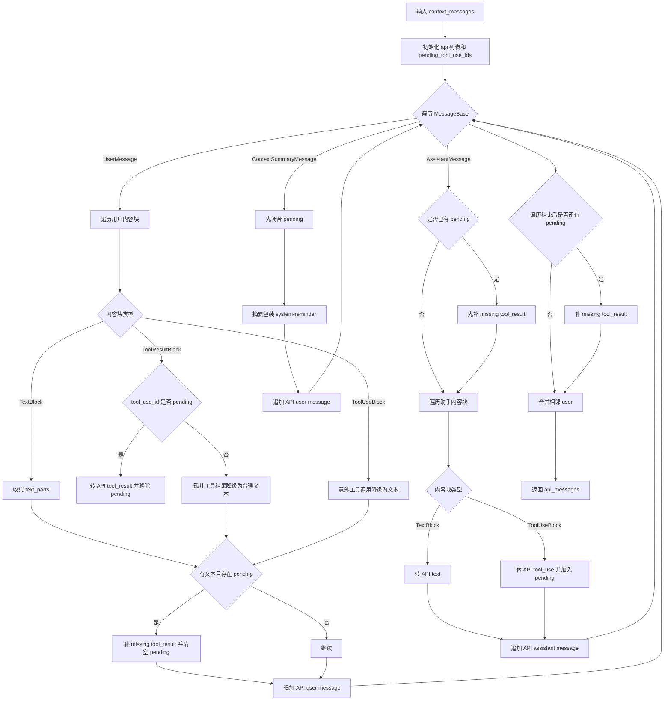
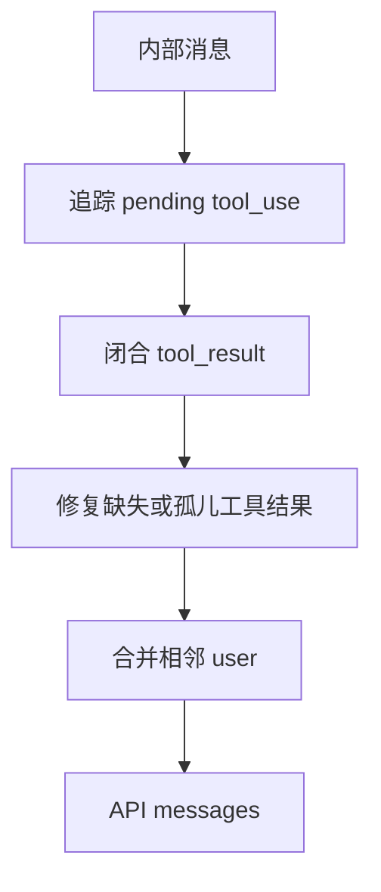

# `bigcode/context/normalizer.py` 代码阅读

源码路径：`bigcode/context/normalizer.py`

## 这个文件解决什么问题

`normalizer.py` 把 BigCode 内部消息转换成 Claude Messages API 能接受的消息格式。

内部消息很丰富，有 meta 消息、attachment、context summary、工具结果等。但模型 API 最终只接受比较严格的结构：

- role 只能是 `user` 或 `assistant`。
- assistant 的 `tool_use` 必须有后续 user 的 `tool_result` 闭合。
- 孤儿工具结果不能直接发。
- 相邻 user 消息可以合并。

这个文件就是 API 协议的“修正和投影层”。

## 先抓主线

主入口是 `normalize_messages_for_api(system_prompt, messages)`。

它遍历内部消息：

1. 遇到 `UserMessage`：转成 API user。
2. 遇到 `AssistantMessage`：转成 API assistant，并记录 pending tool use。
3. 遇到 `ContextSummaryMessage`：包装成 system reminder 后作为 API user。
4. 如果发现工具调用没有结果，就补一个错误 `tool_result`。
5. 最后合并相邻 user 消息。

另一个重要函数是 `tool_run_result_to_message()`，它把工具执行结果转成内部 `UserMessage([ToolResultBlock])`。

## 核心机制：`pending_tool_use_ids`

Claude 工具协议要求：

1. assistant 消息里出现 `tool_use`。
2. 后续 user 消息必须带回对应 `tool_result`。

所以 normalizer 用 `pending_tool_use_ids` 记录尚未闭合的工具调用。

当遍历到 assistant 的 `ToolUseBlock` 时：

- 加入 `pending_tool_use_ids`。

当遍历到 user 的 `ToolResultBlock` 时：

- 如果 id 在 pending 集合中，转成 API `tool_result` 并移除。
- 如果 id 不在 pending 集合中，说明它是孤儿结果，降级成普通文本。

当遇到新的普通用户文本或新的 assistant 消息时，如果还有 pending id：

- 自动补错误 `tool_result`，避免 API 拒绝请求。

## 关键函数逐段讲解

### `attachment_to_user_message(att)`

把 `Attachment` 包成 meta `UserMessage`。

内容会通过 `wrap_system_reminder()` 变成：

```xml
<system-reminder>
...
</system-reminder>
```

这样模型能知道它不是用户原始需求，而是系统动态提醒。

### `normalize_messages_for_api(system_prompt, messages)`

这是核心函数。

处理 `UserMessage`：

- `TextBlock` 被收集到 `text_parts`。
- `ToolResultBlock` 会按 pending 状态决定是 tool_result 还是普通文本。
- 意外出现在 user 消息里的 `ToolUseBlock` 会降级成文本说明。
- 如果有普通文本且还有 pending 工具调用，会先补缺失工具结果。

处理 `AssistantMessage`：

- 如果旧的 pending 工具调用还没闭合，会先补错误结果。
- `TextBlock` 转成 API text。
- `ToolUseBlock` 转成 API tool_use，并把 id 加入 pending 集合。

处理 `ContextSummaryMessage`：

- 如果有 pending 工具调用，先补错误结果。
- 摘要用 `<system-reminder>` 包装，作为 user message 进入 API。

最后：

- 如果遍历结束仍有 pending 工具调用，补错误结果。
- 调 `_merge_adjacent_users()` 合并相邻 user 消息。

### `tool_run_result_to_message(result)`

把工具执行结果变成内部 meta user 消息。

规则：

- 成功时内容取 `result.output.data`。
- 失败时内容取 `result.error_message`。
- 如果有 artifact 元数据，会合并进内容。
- 最终生成 `ToolResultBlock(tool_use_id=..., content=..., is_error=...)`。

这个函数由 `AgentSession.run_turn()` 在工具执行后调用。

### `_artifact_metadata(result)`

从 run result 和 output metadata 中提取：

- `artifact_id`
- `artifact_path`
- `original_chars`

这些字段用于告诉模型：工具结果太大，完整内容已经落盘，可以通过 artifact 读取。

### `_stringify_tool_content(content, is_error)`

把工具结果转成 API 需要的字符串。

错误结果会加 `ERROR: ` 前缀。

### `_tool_result_to_api_block(result)`

把内部 `ToolResultBlock` 转成 API dict：

- `type="tool_result"`
- `tool_use_id`
- `content`
- `is_error`

### `_missing_tool_result_blocks(tool_use_ids)`

为缺失的工具调用生成错误结果：

```text
ERROR: Tool result missing from transcript.
```

这是协议兜底，避免历史损坏导致 API 请求失败。

### `_merge_adjacent_users(messages)`

把连续 user message 合并为一个。

这能减少 API message 数量，也能让自动补的 tool_result 和文本保持合法顺序。

## 和其他模块的关系

- `builder.py` 调 `normalize_messages_for_api()`。
- `AgentSession` 调 `tool_run_result_to_message()`。
- `messages.py` 提供内部消息和 block 类型。
- `attachments.py` 提供 `Attachment` 和 `wrap_system_reminder()`。
- `tools.base.ToolRunResult` 是工具执行结果来源。

## 阅读建议

重点跟踪 `pending_tool_use_ids`。这个集合就是 normalizer 的核心状态机。只要理解它怎样开启、闭合和兜底，整个文件就清楚了。

<!-- BEGIN EXTENDED READING NOTES -->

## 超详细源码阅读笔记（扩写版）

这一节是为了把前面的概览扩展成可以逐步跟读源码的版本。
阅读时不要只看结论，要把这里的每个检查点和对应源码放在一起看。
本篇主题是：消息归一化器。
模块职责可以先压缩成一句话：把内部消息投影成 Claude Messages API 可接受的 user 和 assistant 消息。
下面的内容按“定位、符号、入口、数据流、边界、误区、自测”的顺序展开。
如果你是 Python 初学者，建议先读每节第一组短句，再回到源码找同名函数。

### A. 阅读定位

- 这篇文档对应源码：bigcode/context/normalizer.py。
- 它在阅读路线里的角色：把内部消息投影成 Claude Messages API 可接受的 user 和 assistant 消息。
- 上游输入主要来自：Context builder, ToolRunner 输出, Attachment 系统。
- 下游输出或调用对象主要是：ClaudeCompatibleModelClient, 模型 API。
- 可以用这个例子追踪：`tool_use id=abc 后必须出现 tool_result tool_use_id=abc`。
- 先读公开入口，再读辅助函数；先读数据结构，再读使用这些结构的流程。
- 遇到以下划线开头的函数，先判断它服务哪个公开函数，不要孤立理解。
- 遇到 dataclass，先把字段含义看懂，再看谁创建它、谁消费它。
- 遇到 BaseModel，先看字段类型，因为字段类型就是工具或 API 的输入约束。
- 遇到 async def，重点看它 await 了谁，这通常就是跨模块调用点。

### B. 源码文件 `bigcode/context/normalizer.py` 的结构地图

- 这个文件共有 161 行源码。
- 顶层 class/function 数量是 8。
- 顶层常量数量是 0。
- import/import from 语句数量大约是 6。
- 阅读时可以先折叠函数体，只看顶层符号顺序。
- 顶层符号顺序通常反映作者希望你先理解的数据类型和主入口。

#### 顶层符号阅读

- `def attachment_to_user_message`：位于第 25-27 行附近。
  - 先看签名和返回值，判断 `attachment_to_user_message` 是入口、数据模型还是辅助逻辑。
  - 再看它直接读取哪些字段、调用哪些函数、返回什么对象。
  - 如果 `attachment_to_user_message` 是类，先读字段和构造函数，再读会被外部调用的方法。
  - 如果 `attachment_to_user_message` 是函数，先找调用方；没有调用方时看是否是导出入口或测试使用。
- `def normalize_messages_for_api`：位于第 30-95 行附近。
  - 先看签名和返回值，判断 `normalize_messages_for_api` 是入口、数据模型还是辅助逻辑。
  - 再看它直接读取哪些字段、调用哪些函数、返回什么对象。
  - 如果 `normalize_messages_for_api` 是类，先读字段和构造函数，再读会被外部调用的方法。
  - 如果 `normalize_messages_for_api` 是函数，先找调用方；没有调用方时看是否是导出入口或测试使用。
- `def tool_run_result_to_message`：位于第 98-107 行附近。
  - 先看签名和返回值，判断 `tool_run_result_to_message` 是入口、数据模型还是辅助逻辑。
  - 再看它直接读取哪些字段、调用哪些函数、返回什么对象。
  - 如果 `tool_run_result_to_message` 是类，先读字段和构造函数，再读会被外部调用的方法。
  - 如果 `tool_run_result_to_message` 是函数，先找调用方；没有调用方时看是否是导出入口或测试使用。
- `def _artifact_metadata`：位于第 110-119 行附近。
  - 先看签名和返回值，判断 `_artifact_metadata` 是入口、数据模型还是辅助逻辑。
  - 再看它直接读取哪些字段、调用哪些函数、返回什么对象。
  - 如果 `_artifact_metadata` 是类，先读字段和构造函数，再读会被外部调用的方法。
  - 如果 `_artifact_metadata` 是函数，先找调用方；没有调用方时看是否是导出入口或测试使用。
- `def _stringify_tool_content`：位于第 122-127 行附近。
  - 先看签名和返回值，判断 `_stringify_tool_content` 是入口、数据模型还是辅助逻辑。
  - 再看它直接读取哪些字段、调用哪些函数、返回什么对象。
  - 如果 `_stringify_tool_content` 是类，先读字段和构造函数，再读会被外部调用的方法。
  - 如果 `_stringify_tool_content` 是函数，先找调用方；没有调用方时看是否是导出入口或测试使用。
- `def _tool_result_to_api_block`：位于第 130-137 行附近。
  - 先看签名和返回值，判断 `_tool_result_to_api_block` 是入口、数据模型还是辅助逻辑。
  - 再看它直接读取哪些字段、调用哪些函数、返回什么对象。
  - 如果 `_tool_result_to_api_block` 是类，先读字段和构造函数，再读会被外部调用的方法。
  - 如果 `_tool_result_to_api_block` 是函数，先找调用方；没有调用方时看是否是导出入口或测试使用。
- `def _missing_tool_result_blocks`：位于第 140-150 行附近。
  - 先看签名和返回值，判断 `_missing_tool_result_blocks` 是入口、数据模型还是辅助逻辑。
  - 再看它直接读取哪些字段、调用哪些函数、返回什么对象。
  - 如果 `_missing_tool_result_blocks` 是类，先读字段和构造函数，再读会被外部调用的方法。
  - 如果 `_missing_tool_result_blocks` 是函数，先找调用方；没有调用方时看是否是导出入口或测试使用。
- `def _merge_adjacent_users`：位于第 153-161 行附近。
  - 先看签名和返回值，判断 `_merge_adjacent_users` 是入口、数据模型还是辅助逻辑。
  - 再看它直接读取哪些字段、调用哪些函数、返回什么对象。
  - 如果 `_merge_adjacent_users` 是类，先读字段和构造函数，再读会被外部调用的方法。
  - 如果 `_merge_adjacent_users` 是函数，先找调用方；没有调用方时看是否是导出入口或测试使用。

### C. 主流程拆解

- 第 1 步：遍历内部消息。读这一环节时要确认输入对象是什么、输出对象交给谁。
- 第 2 步：追踪 pending_tool_use_ids。读这一环节时要确认输入对象是什么、输出对象交给谁。
- 第 3 步：转换 tool_result。读这一环节时要确认输入对象是什么、输出对象交给谁。
- 第 4 步：补缺失工具结果。读这一环节时要确认输入对象是什么、输出对象交给谁。
- 第 5 步：合并相邻 user。读这一环节时要确认输入对象是什么、输出对象交给谁。

### D. 本篇最应该盯住的源码点

- 关注点 1：pending_tool_use_ids 状态机。它通常决定你是否真正理解这个模块的边界。
- 关注点 2：孤儿 tool_result 降级为文本。它通常决定你是否真正理解这个模块的边界。
- 关注点 3：ContextSummaryMessage 包成 system-reminder。它通常决定你是否真正理解这个模块的边界。
- 关注点 4：artifact metadata 合并。它通常决定你是否真正理解这个模块的边界。

### E. 初学者容易误解的点

- 误区 1：忽略工具协议的严格配对。读源码时用实际调用链验证，不要只按变量名猜。
- 误区 2：以为孤儿 tool_result 可以直接发 API。读源码时用实际调用链验证，不要只按变量名猜。
- 误区 3：忘记相邻 user 会合并。读源码时用实际调用链验证，不要只按变量名猜。
- 误区 4：把错误工具结果和普通文本混淆。读源码时用实际调用链验证，不要只按变量名猜。

### F. 数据流追踪

- 输入侧 1：`Context builder` 是这个模块可能接收信息的来源。
  - 追踪时先找它在哪个函数参数、对象字段或配置字段中出现。
  - 如果它是外部输入，要继续检查是否有校验、默认值或错误处理。
- 输入侧 2：`ToolRunner 输出` 是这个模块可能接收信息的来源。
  - 追踪时先找它在哪个函数参数、对象字段或配置字段中出现。
  - 如果它是外部输入，要继续检查是否有校验、默认值或错误处理。
- 输入侧 3：`Attachment 系统` 是这个模块可能接收信息的来源。
  - 追踪时先找它在哪个函数参数、对象字段或配置字段中出现。
  - 如果它是外部输入，要继续检查是否有校验、默认值或错误处理。
- 输出侧 1：`ClaudeCompatibleModelClient` 是这个模块处理结果的去向。
  - 追踪时看当前模块传递的是原始值、结构化对象，还是已经裁剪过的投影。
  - 如果下游是工具或模型，重点检查安全边界和格式转换。
- 输出侧 2：`模型 API` 是这个模块处理结果的去向。
  - 追踪时看当前模块传递的是原始值、结构化对象，还是已经裁剪过的投影。
  - 如果下游是工具或模型，重点检查安全边界和格式转换。

### G. 边界情况阅读表

| 01 | `attachment_to_user_message` | 输入为空时是否有默认值或早返回 | 回到源码确认实际分支，不要用经验推断 |
| 02 | `normalize_messages_for_api` | 配置项不存在时是报错、降级还是记录 warning | 回到源码确认实际分支，不要用经验推断 |
| 03 | `tool_run_result_to_message` | 外部依赖不可用时是否影响主流程 | 回到源码确认实际分支，不要用经验推断 |
| 04 | `_artifact_metadata` | 异常是否被捕获并转成结构化结果 | 回到源码确认实际分支，不要用经验推断 |
| 05 | `_stringify_tool_content` | 列表为空时返回空列表还是 None | 回到源码确认实际分支，不要用经验推断 |
| 06 | `_tool_result_to_api_block` | 路径或名称是否合法是否有校验 | 回到源码确认实际分支，不要用经验推断 |
| 07 | `_missing_tool_result_blocks` | 非交互模式是否会改变行为 | 回到源码确认实际分支，不要用经验推断 |
| 08 | `_merge_adjacent_users` | 状态是否会写入 transcript、snapshot 或磁盘文件 | 回到源码确认实际分支，不要用经验推断 |
| 09 | `attachment_to_user_message` | 是否存在只读模式、plan 模式或 sandbox 的特殊分支 | 回到源码确认实际分支，不要用经验推断 |
| 10 | `normalize_messages_for_api` | 返回值是否会继续进入模型上下文 | 回到源码确认实际分支，不要用经验推断 |
| 11 | `tool_run_result_to_message` | 输入为空时是否有默认值或早返回 | 回到源码确认实际分支，不要用经验推断 |
| 12 | `_artifact_metadata` | 配置项不存在时是报错、降级还是记录 warning | 回到源码确认实际分支，不要用经验推断 |
| 13 | `_stringify_tool_content` | 外部依赖不可用时是否影响主流程 | 回到源码确认实际分支，不要用经验推断 |
| 14 | `_tool_result_to_api_block` | 异常是否被捕获并转成结构化结果 | 回到源码确认实际分支，不要用经验推断 |
| 15 | `_missing_tool_result_blocks` | 列表为空时返回空列表还是 None | 回到源码确认实际分支，不要用经验推断 |
| 16 | `_merge_adjacent_users` | 路径或名称是否合法是否有校验 | 回到源码确认实际分支，不要用经验推断 |
| 17 | `attachment_to_user_message` | 非交互模式是否会改变行为 | 回到源码确认实际分支，不要用经验推断 |
| 18 | `normalize_messages_for_api` | 状态是否会写入 transcript、snapshot 或磁盘文件 | 回到源码确认实际分支，不要用经验推断 |
| 19 | `tool_run_result_to_message` | 是否存在只读模式、plan 模式或 sandbox 的特殊分支 | 回到源码确认实际分支，不要用经验推断 |
| 20 | `_artifact_metadata` | 返回值是否会继续进入模型上下文 | 回到源码确认实际分支，不要用经验推断 |
| 21 | `_stringify_tool_content` | 输入为空时是否有默认值或早返回 | 回到源码确认实际分支，不要用经验推断 |
| 22 | `_tool_result_to_api_block` | 配置项不存在时是报错、降级还是记录 warning | 回到源码确认实际分支，不要用经验推断 |
| 23 | `_missing_tool_result_blocks` | 外部依赖不可用时是否影响主流程 | 回到源码确认实际分支，不要用经验推断 |
| 24 | `_merge_adjacent_users` | 异常是否被捕获并转成结构化结果 | 回到源码确认实际分支，不要用经验推断 |
| 25 | `attachment_to_user_message` | 列表为空时返回空列表还是 None | 回到源码确认实际分支，不要用经验推断 |
| 26 | `normalize_messages_for_api` | 路径或名称是否合法是否有校验 | 回到源码确认实际分支，不要用经验推断 |
| 27 | `tool_run_result_to_message` | 非交互模式是否会改变行为 | 回到源码确认实际分支，不要用经验推断 |
| 28 | `_artifact_metadata` | 状态是否会写入 transcript、snapshot 或磁盘文件 | 回到源码确认实际分支，不要用经验推断 |
| 29 | `_stringify_tool_content` | 是否存在只读模式、plan 模式或 sandbox 的特殊分支 | 回到源码确认实际分支，不要用经验推断 |
| 30 | `_tool_result_to_api_block` | 返回值是否会继续进入模型上下文 | 回到源码确认实际分支，不要用经验推断 |
| 31 | `_missing_tool_result_blocks` | 输入为空时是否有默认值或早返回 | 回到源码确认实际分支，不要用经验推断 |
| 32 | `_merge_adjacent_users` | 配置项不存在时是报错、降级还是记录 warning | 回到源码确认实际分支，不要用经验推断 |
| 33 | `attachment_to_user_message` | 外部依赖不可用时是否影响主流程 | 回到源码确认实际分支，不要用经验推断 |
| 34 | `normalize_messages_for_api` | 异常是否被捕获并转成结构化结果 | 回到源码确认实际分支，不要用经验推断 |
| 35 | `tool_run_result_to_message` | 列表为空时返回空列表还是 None | 回到源码确认实际分支，不要用经验推断 |
| 36 | `_artifact_metadata` | 路径或名称是否合法是否有校验 | 回到源码确认实际分支，不要用经验推断 |
| 37 | `_stringify_tool_content` | 非交互模式是否会改变行为 | 回到源码确认实际分支，不要用经验推断 |
| 38 | `_tool_result_to_api_block` | 状态是否会写入 transcript、snapshot 或磁盘文件 | 回到源码确认实际分支，不要用经验推断 |
| 39 | `_missing_tool_result_blocks` | 是否存在只读模式、plan 模式或 sandbox 的特殊分支 | 回到源码确认实际分支，不要用经验推断 |
| 40 | `_merge_adjacent_users` | 返回值是否会继续进入模型上下文 | 回到源码确认实际分支，不要用经验推断 |
| 41 | `attachment_to_user_message` | 输入为空时是否有默认值或早返回 | 回到源码确认实际分支，不要用经验推断 |
| 42 | `normalize_messages_for_api` | 配置项不存在时是报错、降级还是记录 warning | 回到源码确认实际分支，不要用经验推断 |
| 43 | `tool_run_result_to_message` | 外部依赖不可用时是否影响主流程 | 回到源码确认实际分支，不要用经验推断 |
| 44 | `_artifact_metadata` | 异常是否被捕获并转成结构化结果 | 回到源码确认实际分支，不要用经验推断 |
| 45 | `_stringify_tool_content` | 列表为空时返回空列表还是 None | 回到源码确认实际分支，不要用经验推断 |
| 46 | `_tool_result_to_api_block` | 路径或名称是否合法是否有校验 | 回到源码确认实际分支，不要用经验推断 |
| 47 | `_missing_tool_result_blocks` | 非交互模式是否会改变行为 | 回到源码确认实际分支，不要用经验推断 |
| 48 | `_merge_adjacent_users` | 状态是否会写入 transcript、snapshot 或磁盘文件 | 回到源码确认实际分支，不要用经验推断 |
| 49 | `attachment_to_user_message` | 是否存在只读模式、plan 模式或 sandbox 的特殊分支 | 回到源码确认实际分支，不要用经验推断 |
| 50 | `normalize_messages_for_api` | 返回值是否会继续进入模型上下文 | 回到源码确认实际分支，不要用经验推断 |
| 51 | `tool_run_result_to_message` | 输入为空时是否有默认值或早返回 | 回到源码确认实际分支，不要用经验推断 |
| 52 | `_artifact_metadata` | 配置项不存在时是报错、降级还是记录 warning | 回到源码确认实际分支，不要用经验推断 |
| 53 | `_stringify_tool_content` | 外部依赖不可用时是否影响主流程 | 回到源码确认实际分支，不要用经验推断 |
| 54 | `_tool_result_to_api_block` | 异常是否被捕获并转成结构化结果 | 回到源码确认实际分支，不要用经验推断 |
| 55 | `_missing_tool_result_blocks` | 列表为空时返回空列表还是 None | 回到源码确认实际分支，不要用经验推断 |
| 56 | `_merge_adjacent_users` | 路径或名称是否合法是否有校验 | 回到源码确认实际分支，不要用经验推断 |
| 57 | `attachment_to_user_message` | 非交互模式是否会改变行为 | 回到源码确认实际分支，不要用经验推断 |
| 58 | `normalize_messages_for_api` | 状态是否会写入 transcript、snapshot 或磁盘文件 | 回到源码确认实际分支，不要用经验推断 |
| 59 | `tool_run_result_to_message` | 是否存在只读模式、plan 模式或 sandbox 的特殊分支 | 回到源码确认实际分支，不要用经验推断 |
| 60 | `_artifact_metadata` | 返回值是否会继续进入模型上下文 | 回到源码确认实际分支，不要用经验推断 |

### H. 与阅读路线的衔接

- 读完 `消息归一化器` 后，回到 `doc/CodeReadingGuide.md` 看它处在哪一阶段。
- 如果它的上游是 Context builder，就从上游重新走一次调用链。
- 如果它的下游是 ClaudeCompatibleModelClient，就继续读下游如何消费当前模块的输出。
- 不要只背函数名；真正的理解是能说清数据对象怎样跨文件移动。
- 当你能画出自己的简图，再对照文末两个流程图，说明这一篇基本读通了。

## 详细流程图



## 核心流程图


