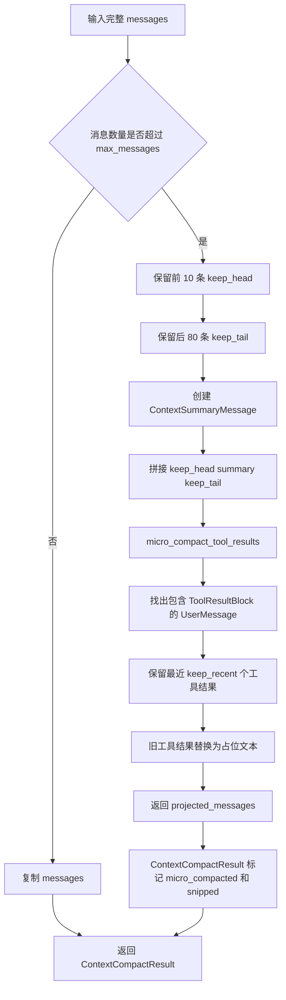
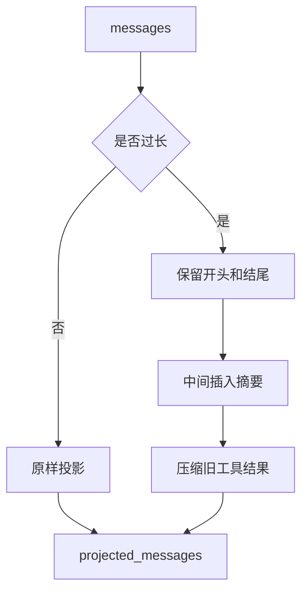

# `bigcode/context/compact.py` 代码阅读

源码路径：`bigcode/context/compact.py`

## 这个文件解决什么问题

`compact.py` 负责在会话历史太长时做简单压缩，避免模型上下文无限增长。

当前实现非常朴素，但主意很清楚：

- 消息数量没超过阈值就原样返回。
- 超过阈值后保留开头和结尾。
- 中间插入一条摘要消息。
- 对较旧的工具结果做微压缩，只保留最近几个完整工具结果。

它不调用模型生成摘要，而是用确定性的占位摘要。

## 先抓主线

主入口是 `apply_context_compact(messages, max_messages=120)`。

流程：

1. 如果 `len(messages) <= max_messages`，返回原始消息副本。
2. 否则保留前 10 条和后 80 条。
3. 中间插入 `ContextSummaryMessage`，说明省略了多少条。
4. 对投影后的消息调用 `micro_compact_tool_results()`。
5. 返回 `ContextCompactResult`。

## 核心数据结构

### `ContextCompactState`

一个轻量状态对象：

- `step_index`
- `turn_start`

当前文件里没有复杂使用，更多是为未来 compact 流程保留状态形状。

### `ContextCompactResult`

压缩结果。

字段：

- `projected_messages`：本次模型请求使用的消息投影。
- `micro_compacted`：是否做过工具结果微压缩。
- `snipped`：是否裁剪了中间消息。
- `collapsed_spans`
- `auto_compacted`
- `blocked`

当前实现主要设置 `projected_messages`、`micro_compacted`、`snipped`。

## 关键函数逐段讲解

### `apply_context_compact(messages, max_messages=120)`

这是上下文压缩主入口。

未超过阈值：

```py
return ContextCompactResult(projected_messages=list(messages))
```

这里返回副本，不直接返回原列表，避免后续修改影响原始消息。

超过阈值：

```py
keep_head = messages[:10]
keep_tail = messages[-80:]
summary = ContextSummaryMessage(...)
projected = keep_head + [summary] + keep_tail
```

这表示 BigCode 优先保留：

- 会话开头：通常有最初目标或重要背景。
- 最近历史：通常和当前任务最相关。

中间历史用一条 `ContextSummaryMessage` 替代。

随后调用：

```py
micro_compact_tool_results(projected)
```

这会把较旧工具结果内容替换成 `[Older tool result compacted]`。

### `micro_compact_tool_results(messages, keep_recent=3)`

这个函数只压缩工具结果，不压缩普通文本或助手文本。

步骤：

1. 找出所有包含 `ToolResultBlock` 的 `UserMessage` 下标。
2. 保留最后 `keep_recent` 个完整工具结果。
3. 对更旧的工具结果，把 `content` 换成占位文本。
4. 其它消息原样保留。

注意它会创建新的 `UserMessage`，并保留原消息的：

- `is_meta`
- `origin`

这样工具结果仍然能和 `ToolUseBlock` 配对，只是内容变短了。

## 和其他模块的关系

- `builder.py` 在每次构建上下文时调用 `apply_context_compact()`。
- `messages.py` 提供 `ContextSummaryMessage`、`UserMessage`、`ToolResultBlock`。
- `normalizer.py` 会把 `ContextSummaryMessage` 包装成 `<system-reminder>` 发给模型。
- `AgentSession.handle_command("/compact")` 也会手动调用这个模块，并把当前内存消息替换为压缩结果。

## 阅读建议

这个文件不用当成复杂摘要系统读。它目前是一个保守的截断投影：保头、保尾、中间放摘要、旧工具结果占位。重点是理解它不会修改原始 transcript，除非 `/compact` 命令显式把 session 的内存消息替换掉。

<!-- BEGIN EXTENDED READING NOTES -->

## 超详细源码阅读笔记（扩写版）

这一节是为了把前面的概览扩展成可以逐步跟读源码的版本。
阅读时不要只看结论，要把这里的每个检查点和对应源码放在一起看。
本篇主题是：上下文压缩。
模块职责可以先压缩成一句话：在消息太多时构造较短的投影视图，并压缩较旧工具结果。
下面的内容按“定位、符号、入口、数据流、边界、误区、自测”的顺序展开。
如果你是 Python 初学者，建议先读每节第一组短句，再回到源码找同名函数。

### A. 阅读定位

- 这篇文档对应源码：bigcode/context/compact.py。
- 它在阅读路线里的角色：在消息太多时构造较短的投影视图，并压缩较旧工具结果。
- 上游输入主要来自：Context builder, /compact 本地命令。
- 下游输出或调用对象主要是：Normalizer, 模型请求上下文。
- 可以用这个例子追踪：`130 条消息 -> 前 10 条 + 摘要 + 后 80 条`。
- 先读公开入口，再读辅助函数；先读数据结构，再读使用这些结构的流程。
- 遇到以下划线开头的函数，先判断它服务哪个公开函数，不要孤立理解。
- 遇到 dataclass，先把字段含义看懂，再看谁创建它、谁消费它。
- 遇到 BaseModel，先看字段类型，因为字段类型就是工具或 API 的输入约束。
- 遇到 async def，重点看它 await 了谁，这通常就是跨模块调用点。

### B. 源码文件 `bigcode/context/compact.py` 的结构地图

- 这个文件共有 74 行源码。
- 顶层 class/function 数量是 4。
- 顶层常量数量是 0。
- import/import from 语句数量大约是 3。
- 阅读时可以先折叠函数体，只看顶层符号顺序。
- 顶层符号顺序通常反映作者希望你先理解的数据类型和主入口。

#### 顶层符号阅读

- `class ContextCompactState`：位于第 13-19 行附近。
  - 先看签名和返回值，判断 `ContextCompactState` 是入口、数据模型还是辅助逻辑。
  - 再看它直接读取哪些字段、调用哪些函数、返回什么对象。
  - 如果 `ContextCompactState` 是类，先读字段和构造函数，再读会被外部调用的方法。
  - 如果 `ContextCompactState` 是函数，先找调用方；没有调用方时看是否是导出入口或测试使用。
- `class ContextCompactResult`：位于第 23-33 行附近。
  - 先看签名和返回值，判断 `ContextCompactResult` 是入口、数据模型还是辅助逻辑。
  - 再看它直接读取哪些字段、调用哪些函数、返回什么对象。
  - 如果 `ContextCompactResult` 是类，先读字段和构造函数，再读会被外部调用的方法。
  - 如果 `ContextCompactResult` 是函数，先找调用方；没有调用方时看是否是导出入口或测试使用。
- `async def apply_context_compact`：位于第 36-47 行附近。
  - 先看签名和返回值，判断 `apply_context_compact` 是入口、数据模型还是辅助逻辑。
  - 再看它直接读取哪些字段、调用哪些函数、返回什么对象。
  - 如果 `apply_context_compact` 是类，先读字段和构造函数，再读会被外部调用的方法。
  - 如果 `apply_context_compact` 是函数，先找调用方；没有调用方时看是否是导出入口或测试使用。
- `def micro_compact_tool_results`：位于第 50-73 行附近。
  - 先看签名和返回值，判断 `micro_compact_tool_results` 是入口、数据模型还是辅助逻辑。
  - 再看它直接读取哪些字段、调用哪些函数、返回什么对象。
  - 如果 `micro_compact_tool_results` 是类，先读字段和构造函数，再读会被外部调用的方法。
  - 如果 `micro_compact_tool_results` 是函数，先找调用方；没有调用方时看是否是导出入口或测试使用。

### C. 主流程拆解

- 第 1 步：判断消息数量。读这一环节时要确认输入对象是什么、输出对象交给谁。
- 第 2 步：保留头部。读这一环节时要确认输入对象是什么、输出对象交给谁。
- 第 3 步：保留尾部。读这一环节时要确认输入对象是什么、输出对象交给谁。
- 第 4 步：插入 ContextSummaryMessage。读这一环节时要确认输入对象是什么、输出对象交给谁。
- 第 5 步：micro_compact_tool_results。读这一环节时要确认输入对象是什么、输出对象交给谁。

### D. 本篇最应该盯住的源码点

- 关注点 1：没有超过阈值就原样副本返回。它通常决定你是否真正理解这个模块的边界。
- 关注点 2：超过阈值保头保尾。它通常决定你是否真正理解这个模块的边界。
- 关注点 3：工具结果只压旧的。它通常决定你是否真正理解这个模块的边界。
- 关注点 4：compact 不等于 transcript 删除。它通常决定你是否真正理解这个模块的边界。

### E. 初学者容易误解的点

- 误区 1：以为当前实现会调用模型生成摘要。读源码时用实际调用链验证，不要只按变量名猜。
- 误区 2：以为所有工具结果都会压缩。读源码时用实际调用链验证，不要只按变量名猜。
- 误区 3：忽略 keep_recent。读源码时用实际调用链验证，不要只按变量名猜。
- 误区 4：把 projected_messages 当作完整历史。读源码时用实际调用链验证，不要只按变量名猜。

### F. 数据流追踪

- 输入侧 1：`Context builder` 是这个模块可能接收信息的来源。
  - 追踪时先找它在哪个函数参数、对象字段或配置字段中出现。
  - 如果它是外部输入，要继续检查是否有校验、默认值或错误处理。
- 输入侧 2：`/compact 本地命令` 是这个模块可能接收信息的来源。
  - 追踪时先找它在哪个函数参数、对象字段或配置字段中出现。
  - 如果它是外部输入，要继续检查是否有校验、默认值或错误处理。
- 输出侧 1：`Normalizer` 是这个模块处理结果的去向。
  - 追踪时看当前模块传递的是原始值、结构化对象，还是已经裁剪过的投影。
  - 如果下游是工具或模型，重点检查安全边界和格式转换。
- 输出侧 2：`模型请求上下文` 是这个模块处理结果的去向。
  - 追踪时看当前模块传递的是原始值、结构化对象，还是已经裁剪过的投影。
  - 如果下游是工具或模型，重点检查安全边界和格式转换。

### G. 边界情况阅读表

| 01 | `ContextCompactState` | 输入为空时是否有默认值或早返回 | 回到源码确认实际分支，不要用经验推断 |
| 02 | `ContextCompactResult` | 配置项不存在时是报错、降级还是记录 warning | 回到源码确认实际分支，不要用经验推断 |
| 03 | `apply_context_compact` | 外部依赖不可用时是否影响主流程 | 回到源码确认实际分支，不要用经验推断 |
| 04 | `micro_compact_tool_results` | 异常是否被捕获并转成结构化结果 | 回到源码确认实际分支，不要用经验推断 |
| 05 | `ContextCompactState` | 列表为空时返回空列表还是 None | 回到源码确认实际分支，不要用经验推断 |
| 06 | `ContextCompactResult` | 路径或名称是否合法是否有校验 | 回到源码确认实际分支，不要用经验推断 |
| 07 | `apply_context_compact` | 非交互模式是否会改变行为 | 回到源码确认实际分支，不要用经验推断 |
| 08 | `micro_compact_tool_results` | 状态是否会写入 transcript、snapshot 或磁盘文件 | 回到源码确认实际分支，不要用经验推断 |
| 09 | `ContextCompactState` | 是否存在只读模式、plan 模式或 sandbox 的特殊分支 | 回到源码确认实际分支，不要用经验推断 |
| 10 | `ContextCompactResult` | 返回值是否会继续进入模型上下文 | 回到源码确认实际分支，不要用经验推断 |
| 11 | `apply_context_compact` | 输入为空时是否有默认值或早返回 | 回到源码确认实际分支，不要用经验推断 |
| 12 | `micro_compact_tool_results` | 配置项不存在时是报错、降级还是记录 warning | 回到源码确认实际分支，不要用经验推断 |
| 13 | `ContextCompactState` | 外部依赖不可用时是否影响主流程 | 回到源码确认实际分支，不要用经验推断 |
| 14 | `ContextCompactResult` | 异常是否被捕获并转成结构化结果 | 回到源码确认实际分支，不要用经验推断 |
| 15 | `apply_context_compact` | 列表为空时返回空列表还是 None | 回到源码确认实际分支，不要用经验推断 |
| 16 | `micro_compact_tool_results` | 路径或名称是否合法是否有校验 | 回到源码确认实际分支，不要用经验推断 |
| 17 | `ContextCompactState` | 非交互模式是否会改变行为 | 回到源码确认实际分支，不要用经验推断 |
| 18 | `ContextCompactResult` | 状态是否会写入 transcript、snapshot 或磁盘文件 | 回到源码确认实际分支，不要用经验推断 |
| 19 | `apply_context_compact` | 是否存在只读模式、plan 模式或 sandbox 的特殊分支 | 回到源码确认实际分支，不要用经验推断 |
| 20 | `micro_compact_tool_results` | 返回值是否会继续进入模型上下文 | 回到源码确认实际分支，不要用经验推断 |
| 21 | `ContextCompactState` | 输入为空时是否有默认值或早返回 | 回到源码确认实际分支，不要用经验推断 |
| 22 | `ContextCompactResult` | 配置项不存在时是报错、降级还是记录 warning | 回到源码确认实际分支，不要用经验推断 |
| 23 | `apply_context_compact` | 外部依赖不可用时是否影响主流程 | 回到源码确认实际分支，不要用经验推断 |
| 24 | `micro_compact_tool_results` | 异常是否被捕获并转成结构化结果 | 回到源码确认实际分支，不要用经验推断 |
| 25 | `ContextCompactState` | 列表为空时返回空列表还是 None | 回到源码确认实际分支，不要用经验推断 |
| 26 | `ContextCompactResult` | 路径或名称是否合法是否有校验 | 回到源码确认实际分支，不要用经验推断 |
| 27 | `apply_context_compact` | 非交互模式是否会改变行为 | 回到源码确认实际分支，不要用经验推断 |
| 28 | `micro_compact_tool_results` | 状态是否会写入 transcript、snapshot 或磁盘文件 | 回到源码确认实际分支，不要用经验推断 |
| 29 | `ContextCompactState` | 是否存在只读模式、plan 模式或 sandbox 的特殊分支 | 回到源码确认实际分支，不要用经验推断 |
| 30 | `ContextCompactResult` | 返回值是否会继续进入模型上下文 | 回到源码确认实际分支，不要用经验推断 |
| 31 | `apply_context_compact` | 输入为空时是否有默认值或早返回 | 回到源码确认实际分支，不要用经验推断 |
| 32 | `micro_compact_tool_results` | 配置项不存在时是报错、降级还是记录 warning | 回到源码确认实际分支，不要用经验推断 |
| 33 | `ContextCompactState` | 外部依赖不可用时是否影响主流程 | 回到源码确认实际分支，不要用经验推断 |
| 34 | `ContextCompactResult` | 异常是否被捕获并转成结构化结果 | 回到源码确认实际分支，不要用经验推断 |
| 35 | `apply_context_compact` | 列表为空时返回空列表还是 None | 回到源码确认实际分支，不要用经验推断 |
| 36 | `micro_compact_tool_results` | 路径或名称是否合法是否有校验 | 回到源码确认实际分支，不要用经验推断 |
| 37 | `ContextCompactState` | 非交互模式是否会改变行为 | 回到源码确认实际分支，不要用经验推断 |
| 38 | `ContextCompactResult` | 状态是否会写入 transcript、snapshot 或磁盘文件 | 回到源码确认实际分支，不要用经验推断 |
| 39 | `apply_context_compact` | 是否存在只读模式、plan 模式或 sandbox 的特殊分支 | 回到源码确认实际分支，不要用经验推断 |
| 40 | `micro_compact_tool_results` | 返回值是否会继续进入模型上下文 | 回到源码确认实际分支，不要用经验推断 |
| 41 | `ContextCompactState` | 输入为空时是否有默认值或早返回 | 回到源码确认实际分支，不要用经验推断 |
| 42 | `ContextCompactResult` | 配置项不存在时是报错、降级还是记录 warning | 回到源码确认实际分支，不要用经验推断 |
| 43 | `apply_context_compact` | 外部依赖不可用时是否影响主流程 | 回到源码确认实际分支，不要用经验推断 |
| 44 | `micro_compact_tool_results` | 异常是否被捕获并转成结构化结果 | 回到源码确认实际分支，不要用经验推断 |
| 45 | `ContextCompactState` | 列表为空时返回空列表还是 None | 回到源码确认实际分支，不要用经验推断 |
| 46 | `ContextCompactResult` | 路径或名称是否合法是否有校验 | 回到源码确认实际分支，不要用经验推断 |
| 47 | `apply_context_compact` | 非交互模式是否会改变行为 | 回到源码确认实际分支，不要用经验推断 |
| 48 | `micro_compact_tool_results` | 状态是否会写入 transcript、snapshot 或磁盘文件 | 回到源码确认实际分支，不要用经验推断 |
| 49 | `ContextCompactState` | 是否存在只读模式、plan 模式或 sandbox 的特殊分支 | 回到源码确认实际分支，不要用经验推断 |
| 50 | `ContextCompactResult` | 返回值是否会继续进入模型上下文 | 回到源码确认实际分支，不要用经验推断 |
| 51 | `apply_context_compact` | 输入为空时是否有默认值或早返回 | 回到源码确认实际分支，不要用经验推断 |
| 52 | `micro_compact_tool_results` | 配置项不存在时是报错、降级还是记录 warning | 回到源码确认实际分支，不要用经验推断 |
| 53 | `ContextCompactState` | 外部依赖不可用时是否影响主流程 | 回到源码确认实际分支，不要用经验推断 |
| 54 | `ContextCompactResult` | 异常是否被捕获并转成结构化结果 | 回到源码确认实际分支，不要用经验推断 |
| 55 | `apply_context_compact` | 列表为空时返回空列表还是 None | 回到源码确认实际分支，不要用经验推断 |
| 56 | `micro_compact_tool_results` | 路径或名称是否合法是否有校验 | 回到源码确认实际分支，不要用经验推断 |
| 57 | `ContextCompactState` | 非交互模式是否会改变行为 | 回到源码确认实际分支，不要用经验推断 |
| 58 | `ContextCompactResult` | 状态是否会写入 transcript、snapshot 或磁盘文件 | 回到源码确认实际分支，不要用经验推断 |
| 59 | `apply_context_compact` | 是否存在只读模式、plan 模式或 sandbox 的特殊分支 | 回到源码确认实际分支，不要用经验推断 |
| 60 | `micro_compact_tool_results` | 返回值是否会继续进入模型上下文 | 回到源码确认实际分支，不要用经验推断 |

### H. 与阅读路线的衔接

- 读完 `上下文压缩` 后，回到 `doc/CodeReadingGuide.md` 看它处在哪一阶段。
- 如果它的上游是 Context builder，就从上游重新走一次调用链。
- 如果它的下游是 Normalizer，就继续读下游如何消费当前模块的输出。
- 不要只背函数名；真正的理解是能说清数据对象怎样跨文件移动。
- 当你能画出自己的简图，再对照文末两个流程图，说明这一篇基本读通了。

## 详细流程图



## 核心流程图


