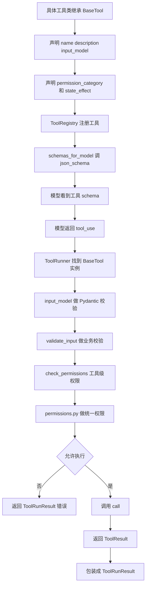
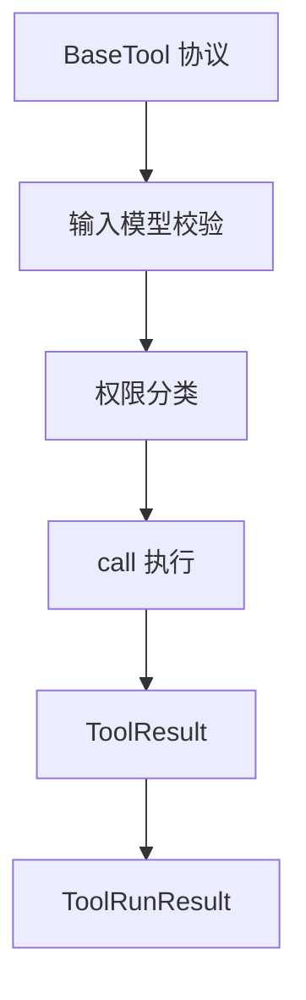

# `bigcode/tools/base.py` 代码阅读

源码路径：`bigcode/tools/base.py`

## 这个文件解决什么问题

`base.py` 定义所有工具共享的协议和基础类型。

BigCode 里的工具很多，比如 `Read`、`Edit`、`Bash`、`WebFetch`、`SkillLoad`、`Agent`。这些工具功能不同，但都必须遵守同一套执行协议：

- 有工具名。
- 有输入模型。
- 有权限分类。
- 能校验输入。
- 能检查权限。
- 能执行并返回结构化结果。

`base.py` 就是这套协议的定义处。

## 先抓主线

读这个文件时按这个顺序看：

1. 权限和状态影响的类型别名。
2. `ValidationResult`、`PermissionDecision`、`ToolResult`、`ToolRunResult`。
3. `ToolExecutionContext`。
4. `BaseTool` 抽象基类。
5. `EmptyInput`。

## 核心类型

### `PermissionBehavior`

权限结果：

- `allow`：允许。
- `deny`：拒绝。
- `ask`：需要询问用户。
- `passthrough`：当前层不决定，交给后续权限系统。

### `PermissionCategory`

工具权限类别：

- `read`
- `write`
- `edit`
- `delete`
- `bash`
- `network`
- `agent`
- `skill`
- `mcp`
- `state`

权限系统会根据类别决定默认策略。

### `StateEffect`

工具对状态的影响：

- `none`：没有状态影响。
- `read_file_state`：影响文件读取快照。
- `workspace_write`：写工作区。
- `app_state`：改变应用内部状态。
- `external`：访问外部系统或副作用不完全在本地。

`ToolRunner` 会用它判断工具能不能并发执行。

### `ValidationResult`

工具输入业务校验结果。

字段：

- `ok`
- `message`
- `error_code`

如果 `ok=False`，`ToolRunner` 会直接返回错误结果，不执行工具。

### `PermissionDecision`

权限检查返回值。

字段：

- `behavior`
- `message`
- `updated_input`
- `reason`
- `rule`

`updated_input` 允许某些权限或 hook 流程修改工具输入，但最终仍要重新校验。

### `ToolResult`

工具执行成功后的结构化输出。

字段：

- `data`
- `metadata`

工具的真实返回内容放在 `data`，额外信息放在 `metadata`。

### `ToolRunResult`

一次工具调用的最终运行结果。

字段：

- `tool_use_id`
- `tool_name`
- `output`
- `is_error`
- `error_message`
- `metadata`

它比 `ToolResult` 多了工具调用 id、工具名、错误状态等运行层信息。`ToolRunner` 返回的是 `ToolRunResult`。

### `ToolExecutionContext`

工具运行时上下文。

工具通过它访问运行环境，而不是直接依赖 `AgentSession`。

重要字段：

- `cwd`
- `workspace_roots`
- `permission_context`
- `read_file_state`
- `abort_event`
- `session_id`
- `hook_bus`
- `is_non_interactive_session`
- `plan_state`
- `task_store`
- `plan_store`
- `skill_registry`
- `mcp_manager`
- `agent_session`
- `event_sink`
- `artifact_store`
- `active_artifacts`
- `project_state_dir`
- `sandbox_profile`

这个对象是工具系统连接会话状态的桥。

## 核心类：`BaseTool`

所有工具都继承它。

### 类属性

每个工具通常要声明：

- `name`
- `aliases`
- `description`
- `input_model`
- `permission_category`
- `state_effect`
- `max_result_chars`

其中 `input_model` 是 Pydantic 模型，负责校验模型传来的参数。

### `is_enabled(ctx)`

判断工具当前是否可用。

默认返回 `True`。某些工具可以根据环境禁用自己。

### `is_concurrency_safe(input, ctx)`

判断工具能否并发执行。

默认逻辑：

```py
return self.state_effect == "none"
```

也就是说默认只有无状态副作用工具可并发。

### `validate_input(input, ctx)`

工具执行前的业务校验。

Pydantic 只能校验字段类型；这个函数负责更具体的业务约束，比如路径是否存在、参数组合是否合法等。

默认通过。

### `check_permissions(input, ctx)`

工具自己的权限补充判断。

默认返回：

```py
PermissionDecision(behavior="passthrough", updated_input=input)
```

意思是工具自己不做最终决定，交给 `permissions.py` 的统一权限系统。

### `json_schema()`

返回 `input_model.model_json_schema()`，用于给模型描述工具参数格式。

`ToolRegistry.schemas_for_model()` 会调用它。

### `call(input, ctx, on_progress=None)`

抽象方法。每个具体工具必须实现。

它是真正执行工具逻辑的地方，返回 `ToolResult`。

## `EmptyInput`

一个空 Pydantic 输入模型，用于不需要参数的工具。

例如某些状态工具或模式切换工具可以使用它。

## 和其他模块的关系

- `registry.py` 注册 `BaseTool` 实例，并读取工具 schema。
- `runner.py` 按 `BaseTool` 协议校验、检查权限、调用 `call()`。
- `permissions.py` 使用 `permission_category` 和工具输入做权限判断。
- 具体工具文件继承 `BaseTool`。
- `AgentSession.make_tool_context()` 创建 `ToolExecutionContext`。

## 阅读建议

把这个文件当成工具系统的接口文档看。真正的执行流程在 `runner.py`，真正的安全决策在 `permissions.py`，但它们都依赖这里定义的类型。

<!-- BEGIN EXTENDED READING NOTES -->

## 超详细源码阅读笔记（扩写版）

这一节是为了把前面的概览扩展成可以逐步跟读源码的版本。
阅读时不要只看结论，要把这里的每个检查点和对应源码放在一起看。
本篇主题是：工具基础协议。
模块职责可以先压缩成一句话：定义所有工具共享的输入校验、权限决策、执行上下文和返回结果协议。
下面的内容按“定位、符号、入口、数据流、边界、误区、自测”的顺序展开。
如果你是 Python 初学者，建议先读每节第一组短句，再回到源码找同名函数。

### A. 阅读定位

- 这篇文档对应源码：bigcode/tools/base.py。
- 它在阅读路线里的角色：定义所有工具共享的输入校验、权限决策、执行上下文和返回结果协议。
- 上游输入主要来自：具体工具实现, AgentSession.make_tool_context。
- 下游输出或调用对象主要是：ToolRegistry, ToolRunner, Permissions。
- 可以用这个例子追踪：`ReadTool 继承 BaseTool 并声明 input_model 和 permission_category`。
- 先读公开入口，再读辅助函数；先读数据结构，再读使用这些结构的流程。
- 遇到以下划线开头的函数，先判断它服务哪个公开函数，不要孤立理解。
- 遇到 dataclass，先把字段含义看懂，再看谁创建它、谁消费它。
- 遇到 BaseModel，先看字段类型，因为字段类型就是工具或 API 的输入约束。
- 遇到 async def，重点看它 await 了谁，这通常就是跨模块调用点。

### B. 源码文件 `bigcode/tools/base.py` 的结构地图

- 这个文件共有 157 行源码。
- 顶层 class/function 数量是 7。
- 顶层常量数量是 0。
- import/import from 语句数量大约是 7。
- 阅读时可以先折叠函数体，只看顶层符号顺序。
- 顶层符号顺序通常反映作者希望你先理解的数据类型和主入口。

#### 顶层符号阅读

- `class ValidationResult`：位于第 25-32 行附近。
  - 先看签名和返回值，判断 `ValidationResult` 是入口、数据模型还是辅助逻辑。
  - 再看它直接读取哪些字段、调用哪些函数、返回什么对象。
  - 如果 `ValidationResult` 是类，先读字段和构造函数，再读会被外部调用的方法。
  - 如果 `ValidationResult` 是函数，先找调用方；没有调用方时看是否是导出入口或测试使用。
- `class PermissionDecision`：位于第 36-45 行附近。
  - 先看签名和返回值，判断 `PermissionDecision` 是入口、数据模型还是辅助逻辑。
  - 再看它直接读取哪些字段、调用哪些函数、返回什么对象。
  - 如果 `PermissionDecision` 是类，先读字段和构造函数，再读会被外部调用的方法。
  - 如果 `PermissionDecision` 是函数，先找调用方；没有调用方时看是否是导出入口或测试使用。
- `class ToolResult`：位于第 49-55 行附近。
  - 先看签名和返回值，判断 `ToolResult` 是入口、数据模型还是辅助逻辑。
  - 再看它直接读取哪些字段、调用哪些函数、返回什么对象。
  - 如果 `ToolResult` 是类，先读字段和构造函数，再读会被外部调用的方法。
  - 如果 `ToolResult` 是函数，先找调用方；没有调用方时看是否是导出入口或测试使用。
- `class ToolRunResult`：位于第 59-69 行附近。
  - 先看签名和返回值，判断 `ToolRunResult` 是入口、数据模型还是辅助逻辑。
  - 再看它直接读取哪些字段、调用哪些函数、返回什么对象。
  - 如果 `ToolRunResult` 是类，先读字段和构造函数，再读会被外部调用的方法。
  - 如果 `ToolRunResult` 是函数，先找调用方；没有调用方时看是否是导出入口或测试使用。
- `class ToolExecutionContext`：位于第 73-96 行附近。
  - 先看签名和返回值，判断 `ToolExecutionContext` 是入口、数据模型还是辅助逻辑。
  - 再看它直接读取哪些字段、调用哪些函数、返回什么对象。
  - 如果 `ToolExecutionContext` 是类，先读字段和构造函数，再读会被外部调用的方法。
  - 如果 `ToolExecutionContext` 是函数，先找调用方；没有调用方时看是否是导出入口或测试使用。
- `class BaseTool`：位于第 99-149 行附近。
  - 先看签名和返回值，判断 `BaseTool` 是入口、数据模型还是辅助逻辑。
  - 再看它直接读取哪些字段、调用哪些函数、返回什么对象。
  - 如果 `BaseTool` 是类，先读字段和构造函数，再读会被外部调用的方法。
  - 如果 `BaseTool` 是函数，先找调用方；没有调用方时看是否是导出入口或测试使用。
- `class EmptyInput`：位于第 152-157 行附近。
  - 先看签名和返回值，判断 `EmptyInput` 是入口、数据模型还是辅助逻辑。
  - 再看它直接读取哪些字段、调用哪些函数、返回什么对象。
  - 如果 `EmptyInput` 是类，先读字段和构造函数，再读会被外部调用的方法。
  - 如果 `EmptyInput` 是函数，先找调用方；没有调用方时看是否是导出入口或测试使用。

### C. 主流程拆解

- 第 1 步：BaseTool 声明工具元数据。读这一环节时要确认输入对象是什么、输出对象交给谁。
- 第 2 步：Pydantic input_model 校验输入。读这一环节时要确认输入对象是什么、输出对象交给谁。
- 第 3 步：validate_input 做业务校验。读这一环节时要确认输入对象是什么、输出对象交给谁。
- 第 4 步：check_permissions 补充权限。读这一环节时要确认输入对象是什么、输出对象交给谁。
- 第 5 步：call 返回 ToolResult。读这一环节时要确认输入对象是什么、输出对象交给谁。

### D. 本篇最应该盯住的源码点

- 关注点 1：PermissionBehavior 四态。它通常决定你是否真正理解这个模块的边界。
- 关注点 2：StateEffect 影响并发。它通常决定你是否真正理解这个模块的边界。
- 关注点 3：ToolExecutionContext 是状态桥梁。它通常决定你是否真正理解这个模块的边界。
- 关注点 4：ToolRunResult 包含运行层信息。它通常决定你是否真正理解这个模块的边界。

### E. 初学者容易误解的点

- 误区 1：把 ToolResult 和 ToolRunResult 混用。读源码时用实际调用链验证，不要只按变量名猜。
- 误区 2：忘记 permission_category 必填。读源码时用实际调用链验证，不要只按变量名猜。
- 误区 3：以为工具可以直接访问所有 AgentSession 字段。读源码时用实际调用链验证，不要只按变量名猜。
- 误区 4：忽略 state_effect 的并发意义。读源码时用实际调用链验证，不要只按变量名猜。

### F. 数据流追踪

- 输入侧 1：`具体工具实现` 是这个模块可能接收信息的来源。
  - 追踪时先找它在哪个函数参数、对象字段或配置字段中出现。
  - 如果它是外部输入，要继续检查是否有校验、默认值或错误处理。
- 输入侧 2：`AgentSession.make_tool_context` 是这个模块可能接收信息的来源。
  - 追踪时先找它在哪个函数参数、对象字段或配置字段中出现。
  - 如果它是外部输入，要继续检查是否有校验、默认值或错误处理。
- 输出侧 1：`ToolRegistry` 是这个模块处理结果的去向。
  - 追踪时看当前模块传递的是原始值、结构化对象，还是已经裁剪过的投影。
  - 如果下游是工具或模型，重点检查安全边界和格式转换。
- 输出侧 2：`ToolRunner` 是这个模块处理结果的去向。
  - 追踪时看当前模块传递的是原始值、结构化对象，还是已经裁剪过的投影。
  - 如果下游是工具或模型，重点检查安全边界和格式转换。
- 输出侧 3：`Permissions` 是这个模块处理结果的去向。
  - 追踪时看当前模块传递的是原始值、结构化对象，还是已经裁剪过的投影。
  - 如果下游是工具或模型，重点检查安全边界和格式转换。

### G. 边界情况阅读表

| 01 | `ValidationResult` | 输入为空时是否有默认值或早返回 | 回到源码确认实际分支，不要用经验推断 |
| 02 | `PermissionDecision` | 配置项不存在时是报错、降级还是记录 warning | 回到源码确认实际分支，不要用经验推断 |
| 03 | `ToolResult` | 外部依赖不可用时是否影响主流程 | 回到源码确认实际分支，不要用经验推断 |
| 04 | `ToolRunResult` | 异常是否被捕获并转成结构化结果 | 回到源码确认实际分支，不要用经验推断 |
| 05 | `ToolExecutionContext` | 列表为空时返回空列表还是 None | 回到源码确认实际分支，不要用经验推断 |
| 06 | `BaseTool` | 路径或名称是否合法是否有校验 | 回到源码确认实际分支，不要用经验推断 |
| 07 | `EmptyInput` | 非交互模式是否会改变行为 | 回到源码确认实际分支，不要用经验推断 |
| 08 | `ValidationResult` | 状态是否会写入 transcript、snapshot 或磁盘文件 | 回到源码确认实际分支，不要用经验推断 |
| 09 | `PermissionDecision` | 是否存在只读模式、plan 模式或 sandbox 的特殊分支 | 回到源码确认实际分支，不要用经验推断 |
| 10 | `ToolResult` | 返回值是否会继续进入模型上下文 | 回到源码确认实际分支，不要用经验推断 |
| 11 | `ToolRunResult` | 输入为空时是否有默认值或早返回 | 回到源码确认实际分支，不要用经验推断 |
| 12 | `ToolExecutionContext` | 配置项不存在时是报错、降级还是记录 warning | 回到源码确认实际分支，不要用经验推断 |
| 13 | `BaseTool` | 外部依赖不可用时是否影响主流程 | 回到源码确认实际分支，不要用经验推断 |
| 14 | `EmptyInput` | 异常是否被捕获并转成结构化结果 | 回到源码确认实际分支，不要用经验推断 |
| 15 | `ValidationResult` | 列表为空时返回空列表还是 None | 回到源码确认实际分支，不要用经验推断 |
| 16 | `PermissionDecision` | 路径或名称是否合法是否有校验 | 回到源码确认实际分支，不要用经验推断 |
| 17 | `ToolResult` | 非交互模式是否会改变行为 | 回到源码确认实际分支，不要用经验推断 |
| 18 | `ToolRunResult` | 状态是否会写入 transcript、snapshot 或磁盘文件 | 回到源码确认实际分支，不要用经验推断 |
| 19 | `ToolExecutionContext` | 是否存在只读模式、plan 模式或 sandbox 的特殊分支 | 回到源码确认实际分支，不要用经验推断 |
| 20 | `BaseTool` | 返回值是否会继续进入模型上下文 | 回到源码确认实际分支，不要用经验推断 |
| 21 | `EmptyInput` | 输入为空时是否有默认值或早返回 | 回到源码确认实际分支，不要用经验推断 |
| 22 | `ValidationResult` | 配置项不存在时是报错、降级还是记录 warning | 回到源码确认实际分支，不要用经验推断 |
| 23 | `PermissionDecision` | 外部依赖不可用时是否影响主流程 | 回到源码确认实际分支，不要用经验推断 |
| 24 | `ToolResult` | 异常是否被捕获并转成结构化结果 | 回到源码确认实际分支，不要用经验推断 |
| 25 | `ToolRunResult` | 列表为空时返回空列表还是 None | 回到源码确认实际分支，不要用经验推断 |
| 26 | `ToolExecutionContext` | 路径或名称是否合法是否有校验 | 回到源码确认实际分支，不要用经验推断 |
| 27 | `BaseTool` | 非交互模式是否会改变行为 | 回到源码确认实际分支，不要用经验推断 |
| 28 | `EmptyInput` | 状态是否会写入 transcript、snapshot 或磁盘文件 | 回到源码确认实际分支，不要用经验推断 |
| 29 | `ValidationResult` | 是否存在只读模式、plan 模式或 sandbox 的特殊分支 | 回到源码确认实际分支，不要用经验推断 |
| 30 | `PermissionDecision` | 返回值是否会继续进入模型上下文 | 回到源码确认实际分支，不要用经验推断 |
| 31 | `ToolResult` | 输入为空时是否有默认值或早返回 | 回到源码确认实际分支，不要用经验推断 |
| 32 | `ToolRunResult` | 配置项不存在时是报错、降级还是记录 warning | 回到源码确认实际分支，不要用经验推断 |
| 33 | `ToolExecutionContext` | 外部依赖不可用时是否影响主流程 | 回到源码确认实际分支，不要用经验推断 |
| 34 | `BaseTool` | 异常是否被捕获并转成结构化结果 | 回到源码确认实际分支，不要用经验推断 |
| 35 | `EmptyInput` | 列表为空时返回空列表还是 None | 回到源码确认实际分支，不要用经验推断 |
| 36 | `ValidationResult` | 路径或名称是否合法是否有校验 | 回到源码确认实际分支，不要用经验推断 |
| 37 | `PermissionDecision` | 非交互模式是否会改变行为 | 回到源码确认实际分支，不要用经验推断 |
| 38 | `ToolResult` | 状态是否会写入 transcript、snapshot 或磁盘文件 | 回到源码确认实际分支，不要用经验推断 |
| 39 | `ToolRunResult` | 是否存在只读模式、plan 模式或 sandbox 的特殊分支 | 回到源码确认实际分支，不要用经验推断 |
| 40 | `ToolExecutionContext` | 返回值是否会继续进入模型上下文 | 回到源码确认实际分支，不要用经验推断 |
| 41 | `BaseTool` | 输入为空时是否有默认值或早返回 | 回到源码确认实际分支，不要用经验推断 |
| 42 | `EmptyInput` | 配置项不存在时是报错、降级还是记录 warning | 回到源码确认实际分支，不要用经验推断 |
| 43 | `ValidationResult` | 外部依赖不可用时是否影响主流程 | 回到源码确认实际分支，不要用经验推断 |
| 44 | `PermissionDecision` | 异常是否被捕获并转成结构化结果 | 回到源码确认实际分支，不要用经验推断 |
| 45 | `ToolResult` | 列表为空时返回空列表还是 None | 回到源码确认实际分支，不要用经验推断 |
| 46 | `ToolRunResult` | 路径或名称是否合法是否有校验 | 回到源码确认实际分支，不要用经验推断 |
| 47 | `ToolExecutionContext` | 非交互模式是否会改变行为 | 回到源码确认实际分支，不要用经验推断 |
| 48 | `BaseTool` | 状态是否会写入 transcript、snapshot 或磁盘文件 | 回到源码确认实际分支，不要用经验推断 |
| 49 | `EmptyInput` | 是否存在只读模式、plan 模式或 sandbox 的特殊分支 | 回到源码确认实际分支，不要用经验推断 |
| 50 | `ValidationResult` | 返回值是否会继续进入模型上下文 | 回到源码确认实际分支，不要用经验推断 |
| 51 | `PermissionDecision` | 输入为空时是否有默认值或早返回 | 回到源码确认实际分支，不要用经验推断 |
| 52 | `ToolResult` | 配置项不存在时是报错、降级还是记录 warning | 回到源码确认实际分支，不要用经验推断 |
| 53 | `ToolRunResult` | 外部依赖不可用时是否影响主流程 | 回到源码确认实际分支，不要用经验推断 |
| 54 | `ToolExecutionContext` | 异常是否被捕获并转成结构化结果 | 回到源码确认实际分支，不要用经验推断 |
| 55 | `BaseTool` | 列表为空时返回空列表还是 None | 回到源码确认实际分支，不要用经验推断 |
| 56 | `EmptyInput` | 路径或名称是否合法是否有校验 | 回到源码确认实际分支，不要用经验推断 |
| 57 | `ValidationResult` | 非交互模式是否会改变行为 | 回到源码确认实际分支，不要用经验推断 |
| 58 | `PermissionDecision` | 状态是否会写入 transcript、snapshot 或磁盘文件 | 回到源码确认实际分支，不要用经验推断 |
| 59 | `ToolResult` | 是否存在只读模式、plan 模式或 sandbox 的特殊分支 | 回到源码确认实际分支，不要用经验推断 |
| 60 | `ToolRunResult` | 返回值是否会继续进入模型上下文 | 回到源码确认实际分支，不要用经验推断 |

### H. 与阅读路线的衔接

- 读完 `工具基础协议` 后，回到 `doc/CodeReadingGuide.md` 看它处在哪一阶段。
- 如果它的上游是 具体工具实现，就从上游重新走一次调用链。
- 如果它的下游是 ToolRegistry，就继续读下游如何消费当前模块的输出。
- 不要只背函数名；真正的理解是能说清数据对象怎样跨文件移动。
- 当你能画出自己的简图，再对照文末两个流程图，说明这一篇基本读通了。

## 详细流程图



## 核心流程图


