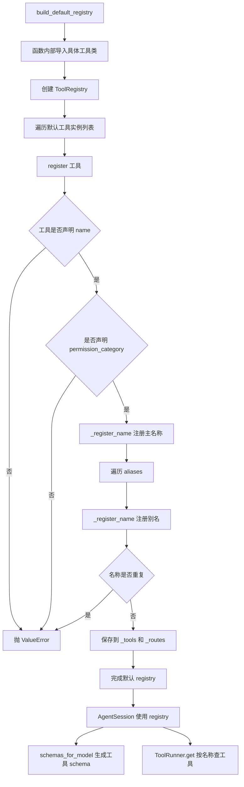
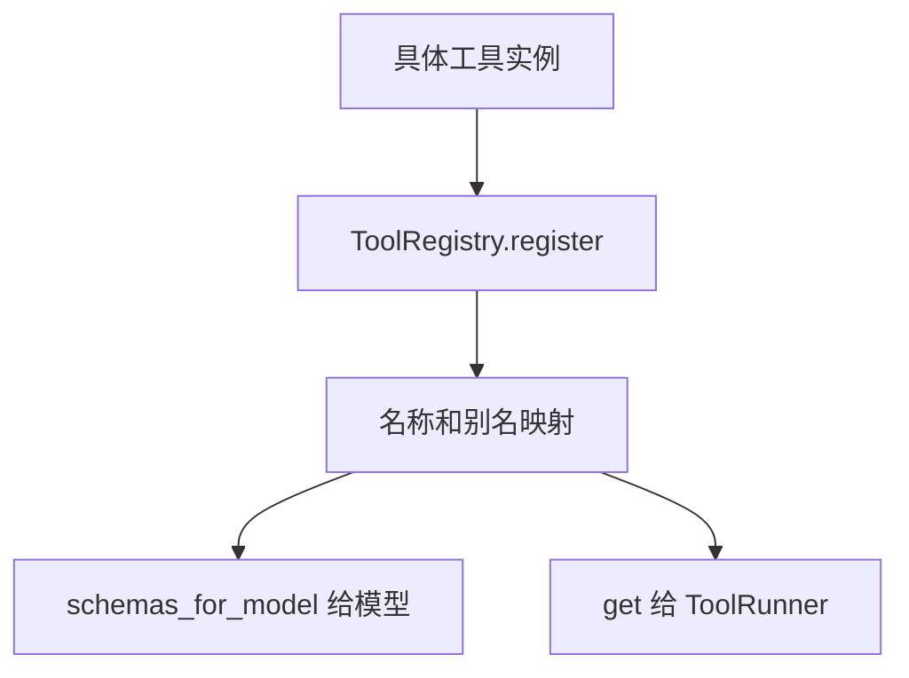

# `bigcode/tools/registry.py` 代码阅读

源码路径：`bigcode/tools/registry.py`

## 这个文件解决什么问题

`registry.py` 是工具注册表。它负责把工具名称映射到工具实例，并把工具 schema 提供给模型。

模型调用工具时只会给出一个工具名，比如 `Read` 或 `Bash`。`ToolRunner` 需要通过这个工具名找到实际的 Python 工具对象，这个查找就依赖 `ToolRegistry`。

## 先抓主线

这个文件分三块：

1. `ToolRoute`：工具路由元数据。
2. `ToolRegistry`：注册、查找、列出工具、生成 schema。
3. `build_default_registry()`：把 BigCode 默认工具全部注册进去。

## 核心数据结构

### `ToolRoute`

当前字段：

- `kind="local"`
- `metadata=None`

目前大部分工具都是本地工具。保留 route 是为了未来支持外部工具来源。

### `ToolRegistry`

内部有两个 dict：

- `_tools: dict[str, BaseTool]`
- `_routes: dict[str, ToolRoute]`

`_tools` 用工具名或别名查工具实例。`_routes` 保存对应路由信息。

## 关键函数逐段讲解

### `register(tool, route=None)`

注册工具主名称和所有别名。

它会做两个基本校验：

- 工具必须声明 `name`。
- 工具必须声明 `permission_category`。

然后：

1. 注册 `tool.name`。
2. 遍历 `tool.aliases` 注册别名。

这意味着模型用主名称或别名调用时，最终都会找到同一个工具对象。

### `_register_name(name, tool, route)`

注册单个名称。

如果名称已经存在，直接抛 `ValueError`。这样可以防止两个工具使用同一个名字或别名，避免模型调用时歧义。

### `get(name)`

按名称或别名取工具实例。

`ToolRunner.run_one()` 首先就会调用它。

如果返回 `None`，说明模型幻觉出了不存在的工具，runner 会返回错误结果。

### `route_for(name)`

返回某个工具名对应的 `ToolRoute`。

当前主流程使用不多，但为未来区分本地工具、远程工具、MCP 工具等来源预留。

### `list_tools()`

返回去重后的工具实例列表。

因为主名称和别名都指向同一个工具，如果直接返回 `_tools.values()` 会重复。这里用 `id(tool)` 去重。

### `schemas_for_model()`

把工具转换成模型 API 需要的 schema 列表。

每个 schema 包含：

- `name`
- `description`
- `input_schema`

其中 `input_schema` 来自 `tool.json_schema()`，也就是工具 Pydantic 输入模型的 JSON Schema。

`AgentSession.run_turn()` 请求模型时会把这个列表传给模型客户端。

### `build_default_registry()`

创建 BigCode 默认工具注册表。

它在函数内部 import 具体工具类，避免模块导入阶段循环依赖。

默认注册的工具包括：

- 文件和搜索：`Read`、`Edit`、`Write`、`Glob`、`Grep`
- 命令和网络：`Bash`、`WebFetch`、`WebSearch`
- artifact：`ArtifactRead`
- 任务系统：`TaskCreate`、`TaskUpdate`、`TaskList`、`TaskGet`、`TaskClaim`、`TaskBlock`
- 计划模式：`EnterPlanMode`、`WritePlan`、`PlanShow`、`ExitPlanMode`、`AskUserQuestion`
- 技能：`SkillLoad`、`SkillResourceRead`
- MCP：`ExternalResourceList`、`ExternalResourceRead`、`ExternalPromptList`、`ExternalPromptGet`
- 子代理：`Agent`、`TaskOutput`、`TaskStop`

这个列表就是模型默认能看到的工具面。

## 和其他模块的关系

- `AgentSession.__init__()` 默认调用 `build_default_registry()`。
- `ToolRunner` 通过 `registry.get()` 查找工具。
- `AgentSession.run_turn()` 通过 `registry.schemas_for_model()` 把工具 schema 发给模型。
- 子代理会通过 `_registry_for_subagent()` 基于父 registry 裁剪工具集合。

## 阅读建议

先读 `build_default_registry()`，它能让你快速知道系统有哪些工具。然后读 `register()` 和 `schemas_for_model()`，理解工具如何从 Python 类变成模型可调用的 schema。

<!-- BEGIN EXTENDED READING NOTES -->

## 超详细源码阅读笔记（扩写版）

这一节是为了把前面的概览扩展成可以逐步跟读源码的版本。
阅读时不要只看结论，要把这里的每个检查点和对应源码放在一起看。
本篇主题是：工具注册表。
模块职责可以先压缩成一句话：维护工具名和别名到工具实例的映射，并给模型生成工具 schema。
下面的内容按“定位、符号、入口、数据流、边界、误区、自测”的顺序展开。
如果你是 Python 初学者，建议先读每节第一组短句，再回到源码找同名函数。

### A. 阅读定位

- 这篇文档对应源码：bigcode/tools/registry.py。
- 它在阅读路线里的角色：维护工具名和别名到工具实例的映射，并给模型生成工具 schema。
- 上游输入主要来自：具体工具类, AgentSession 初始化, 子代理 registry 裁剪。
- 下游输出或调用对象主要是：ToolRunner.get, 模型工具 schema。
- 可以用这个例子追踪：`registry.register(ReadTool()) 后 Read 和 ReadFile 都可查到同一对象`。
- 先读公开入口，再读辅助函数；先读数据结构，再读使用这些结构的流程。
- 遇到以下划线开头的函数，先判断它服务哪个公开函数，不要孤立理解。
- 遇到 dataclass，先把字段含义看懂，再看谁创建它、谁消费它。
- 遇到 BaseModel，先看字段类型，因为字段类型就是工具或 API 的输入约束。
- 遇到 async def，重点看它 await 了谁，这通常就是跨模块调用点。

### B. 源码文件 `bigcode/tools/registry.py` 的结构地图

- 这个文件共有 137 行源码。
- 顶层 class/function 数量是 3。
- 顶层常量数量是 0。
- import/import from 语句数量大约是 4。
- 阅读时可以先折叠函数体，只看顶层符号顺序。
- 顶层符号顺序通常反映作者希望你先理解的数据类型和主入口。

#### 顶层符号阅读

- `class ToolRoute`：位于第 14-20 行附近。
  - 先看签名和返回值，判断 `ToolRoute` 是入口、数据模型还是辅助逻辑。
  - 再看它直接读取哪些字段、调用哪些函数、返回什么对象。
  - 如果 `ToolRoute` 是类，先读字段和构造函数，再读会被外部调用的方法。
  - 如果 `ToolRoute` 是函数，先找调用方；没有调用方时看是否是导出入口或测试使用。
- `class ToolRegistry`：位于第 23-78 行附近。
  - 先看签名和返回值，判断 `ToolRegistry` 是入口、数据模型还是辅助逻辑。
  - 再看它直接读取哪些字段、调用哪些函数、返回什么对象。
  - 如果 `ToolRegistry` 是类，先读字段和构造函数，再读会被外部调用的方法。
  - 如果 `ToolRegistry` 是函数，先找调用方；没有调用方时看是否是导出入口或测试使用。
- `def build_default_registry`：位于第 81-137 行附近。
  - 先看签名和返回值，判断 `build_default_registry` 是入口、数据模型还是辅助逻辑。
  - 再看它直接读取哪些字段、调用哪些函数、返回什么对象。
  - 如果 `build_default_registry` 是类，先读字段和构造函数，再读会被外部调用的方法。
  - 如果 `build_default_registry` 是函数，先找调用方；没有调用方时看是否是导出入口或测试使用。

### C. 主流程拆解

- 第 1 步：创建 ToolRegistry。读这一环节时要确认输入对象是什么、输出对象交给谁。
- 第 2 步：register 主名称。读这一环节时要确认输入对象是什么、输出对象交给谁。
- 第 3 步：register aliases。读这一环节时要确认输入对象是什么、输出对象交给谁。
- 第 4 步：list_tools 去重。读这一环节时要确认输入对象是什么、输出对象交给谁。
- 第 5 步：schemas_for_model 输出 schema。读这一环节时要确认输入对象是什么、输出对象交给谁。

### D. 本篇最应该盯住的源码点

- 关注点 1：重复名称直接报错。它通常决定你是否真正理解这个模块的边界。
- 关注点 2：别名指向同一工具实例。它通常决定你是否真正理解这个模块的边界。
- 关注点 3：list_tools 用 id 去重。它通常决定你是否真正理解这个模块的边界。
- 关注点 4：build_default_registry 延迟 import。它通常决定你是否真正理解这个模块的边界。

### E. 初学者容易误解的点

- 误区 1：以为 aliases 会复制工具实例。读源码时用实际调用链验证，不要只按变量名猜。
- 误区 2：忽略 permission_category 注册校验。读源码时用实际调用链验证，不要只按变量名猜。
- 误区 3：把 route 当作当前核心功能。读源码时用实际调用链验证，不要只按变量名猜。
- 误区 4：忘记默认 registry 就是模型工具面。读源码时用实际调用链验证，不要只按变量名猜。

### F. 数据流追踪

- 输入侧 1：`具体工具类` 是这个模块可能接收信息的来源。
  - 追踪时先找它在哪个函数参数、对象字段或配置字段中出现。
  - 如果它是外部输入，要继续检查是否有校验、默认值或错误处理。
- 输入侧 2：`AgentSession 初始化` 是这个模块可能接收信息的来源。
  - 追踪时先找它在哪个函数参数、对象字段或配置字段中出现。
  - 如果它是外部输入，要继续检查是否有校验、默认值或错误处理。
- 输入侧 3：`子代理 registry 裁剪` 是这个模块可能接收信息的来源。
  - 追踪时先找它在哪个函数参数、对象字段或配置字段中出现。
  - 如果它是外部输入，要继续检查是否有校验、默认值或错误处理。
- 输出侧 1：`ToolRunner.get` 是这个模块处理结果的去向。
  - 追踪时看当前模块传递的是原始值、结构化对象，还是已经裁剪过的投影。
  - 如果下游是工具或模型，重点检查安全边界和格式转换。
- 输出侧 2：`模型工具 schema` 是这个模块处理结果的去向。
  - 追踪时看当前模块传递的是原始值、结构化对象，还是已经裁剪过的投影。
  - 如果下游是工具或模型，重点检查安全边界和格式转换。

### G. 边界情况阅读表

| 01 | `ToolRoute` | 输入为空时是否有默认值或早返回 | 回到源码确认实际分支，不要用经验推断 |
| 02 | `ToolRegistry` | 配置项不存在时是报错、降级还是记录 warning | 回到源码确认实际分支，不要用经验推断 |
| 03 | `build_default_registry` | 外部依赖不可用时是否影响主流程 | 回到源码确认实际分支，不要用经验推断 |
| 04 | `ToolRoute` | 异常是否被捕获并转成结构化结果 | 回到源码确认实际分支，不要用经验推断 |
| 05 | `ToolRegistry` | 列表为空时返回空列表还是 None | 回到源码确认实际分支，不要用经验推断 |
| 06 | `build_default_registry` | 路径或名称是否合法是否有校验 | 回到源码确认实际分支，不要用经验推断 |
| 07 | `ToolRoute` | 非交互模式是否会改变行为 | 回到源码确认实际分支，不要用经验推断 |
| 08 | `ToolRegistry` | 状态是否会写入 transcript、snapshot 或磁盘文件 | 回到源码确认实际分支，不要用经验推断 |
| 09 | `build_default_registry` | 是否存在只读模式、plan 模式或 sandbox 的特殊分支 | 回到源码确认实际分支，不要用经验推断 |
| 10 | `ToolRoute` | 返回值是否会继续进入模型上下文 | 回到源码确认实际分支，不要用经验推断 |
| 11 | `ToolRegistry` | 输入为空时是否有默认值或早返回 | 回到源码确认实际分支，不要用经验推断 |
| 12 | `build_default_registry` | 配置项不存在时是报错、降级还是记录 warning | 回到源码确认实际分支，不要用经验推断 |
| 13 | `ToolRoute` | 外部依赖不可用时是否影响主流程 | 回到源码确认实际分支，不要用经验推断 |
| 14 | `ToolRegistry` | 异常是否被捕获并转成结构化结果 | 回到源码确认实际分支，不要用经验推断 |
| 15 | `build_default_registry` | 列表为空时返回空列表还是 None | 回到源码确认实际分支，不要用经验推断 |
| 16 | `ToolRoute` | 路径或名称是否合法是否有校验 | 回到源码确认实际分支，不要用经验推断 |
| 17 | `ToolRegistry` | 非交互模式是否会改变行为 | 回到源码确认实际分支，不要用经验推断 |
| 18 | `build_default_registry` | 状态是否会写入 transcript、snapshot 或磁盘文件 | 回到源码确认实际分支，不要用经验推断 |
| 19 | `ToolRoute` | 是否存在只读模式、plan 模式或 sandbox 的特殊分支 | 回到源码确认实际分支，不要用经验推断 |
| 20 | `ToolRegistry` | 返回值是否会继续进入模型上下文 | 回到源码确认实际分支，不要用经验推断 |
| 21 | `build_default_registry` | 输入为空时是否有默认值或早返回 | 回到源码确认实际分支，不要用经验推断 |
| 22 | `ToolRoute` | 配置项不存在时是报错、降级还是记录 warning | 回到源码确认实际分支，不要用经验推断 |
| 23 | `ToolRegistry` | 外部依赖不可用时是否影响主流程 | 回到源码确认实际分支，不要用经验推断 |
| 24 | `build_default_registry` | 异常是否被捕获并转成结构化结果 | 回到源码确认实际分支，不要用经验推断 |
| 25 | `ToolRoute` | 列表为空时返回空列表还是 None | 回到源码确认实际分支，不要用经验推断 |
| 26 | `ToolRegistry` | 路径或名称是否合法是否有校验 | 回到源码确认实际分支，不要用经验推断 |
| 27 | `build_default_registry` | 非交互模式是否会改变行为 | 回到源码确认实际分支，不要用经验推断 |
| 28 | `ToolRoute` | 状态是否会写入 transcript、snapshot 或磁盘文件 | 回到源码确认实际分支，不要用经验推断 |
| 29 | `ToolRegistry` | 是否存在只读模式、plan 模式或 sandbox 的特殊分支 | 回到源码确认实际分支，不要用经验推断 |
| 30 | `build_default_registry` | 返回值是否会继续进入模型上下文 | 回到源码确认实际分支，不要用经验推断 |
| 31 | `ToolRoute` | 输入为空时是否有默认值或早返回 | 回到源码确认实际分支，不要用经验推断 |
| 32 | `ToolRegistry` | 配置项不存在时是报错、降级还是记录 warning | 回到源码确认实际分支，不要用经验推断 |
| 33 | `build_default_registry` | 外部依赖不可用时是否影响主流程 | 回到源码确认实际分支，不要用经验推断 |
| 34 | `ToolRoute` | 异常是否被捕获并转成结构化结果 | 回到源码确认实际分支，不要用经验推断 |
| 35 | `ToolRegistry` | 列表为空时返回空列表还是 None | 回到源码确认实际分支，不要用经验推断 |
| 36 | `build_default_registry` | 路径或名称是否合法是否有校验 | 回到源码确认实际分支，不要用经验推断 |
| 37 | `ToolRoute` | 非交互模式是否会改变行为 | 回到源码确认实际分支，不要用经验推断 |
| 38 | `ToolRegistry` | 状态是否会写入 transcript、snapshot 或磁盘文件 | 回到源码确认实际分支，不要用经验推断 |
| 39 | `build_default_registry` | 是否存在只读模式、plan 模式或 sandbox 的特殊分支 | 回到源码确认实际分支，不要用经验推断 |
| 40 | `ToolRoute` | 返回值是否会继续进入模型上下文 | 回到源码确认实际分支，不要用经验推断 |
| 41 | `ToolRegistry` | 输入为空时是否有默认值或早返回 | 回到源码确认实际分支，不要用经验推断 |
| 42 | `build_default_registry` | 配置项不存在时是报错、降级还是记录 warning | 回到源码确认实际分支，不要用经验推断 |
| 43 | `ToolRoute` | 外部依赖不可用时是否影响主流程 | 回到源码确认实际分支，不要用经验推断 |
| 44 | `ToolRegistry` | 异常是否被捕获并转成结构化结果 | 回到源码确认实际分支，不要用经验推断 |
| 45 | `build_default_registry` | 列表为空时返回空列表还是 None | 回到源码确认实际分支，不要用经验推断 |
| 46 | `ToolRoute` | 路径或名称是否合法是否有校验 | 回到源码确认实际分支，不要用经验推断 |
| 47 | `ToolRegistry` | 非交互模式是否会改变行为 | 回到源码确认实际分支，不要用经验推断 |
| 48 | `build_default_registry` | 状态是否会写入 transcript、snapshot 或磁盘文件 | 回到源码确认实际分支，不要用经验推断 |
| 49 | `ToolRoute` | 是否存在只读模式、plan 模式或 sandbox 的特殊分支 | 回到源码确认实际分支，不要用经验推断 |
| 50 | `ToolRegistry` | 返回值是否会继续进入模型上下文 | 回到源码确认实际分支，不要用经验推断 |
| 51 | `build_default_registry` | 输入为空时是否有默认值或早返回 | 回到源码确认实际分支，不要用经验推断 |
| 52 | `ToolRoute` | 配置项不存在时是报错、降级还是记录 warning | 回到源码确认实际分支，不要用经验推断 |
| 53 | `ToolRegistry` | 外部依赖不可用时是否影响主流程 | 回到源码确认实际分支，不要用经验推断 |
| 54 | `build_default_registry` | 异常是否被捕获并转成结构化结果 | 回到源码确认实际分支，不要用经验推断 |
| 55 | `ToolRoute` | 列表为空时返回空列表还是 None | 回到源码确认实际分支，不要用经验推断 |
| 56 | `ToolRegistry` | 路径或名称是否合法是否有校验 | 回到源码确认实际分支，不要用经验推断 |
| 57 | `build_default_registry` | 非交互模式是否会改变行为 | 回到源码确认实际分支，不要用经验推断 |
| 58 | `ToolRoute` | 状态是否会写入 transcript、snapshot 或磁盘文件 | 回到源码确认实际分支，不要用经验推断 |
| 59 | `ToolRegistry` | 是否存在只读模式、plan 模式或 sandbox 的特殊分支 | 回到源码确认实际分支，不要用经验推断 |
| 60 | `build_default_registry` | 返回值是否会继续进入模型上下文 | 回到源码确认实际分支，不要用经验推断 |

### H. 与阅读路线的衔接

- 读完 `工具注册表` 后，回到 `doc/CodeReadingGuide.md` 看它处在哪一阶段。
- 如果它的上游是 具体工具类，就从上游重新走一次调用链。
- 如果它的下游是 ToolRunner.get，就继续读下游如何消费当前模块的输出。
- 不要只背函数名；真正的理解是能说清数据对象怎样跨文件移动。
- 当你能画出自己的简图，再对照文末两个流程图，说明这一篇基本读通了。

## 详细流程图

## 核心流程图

