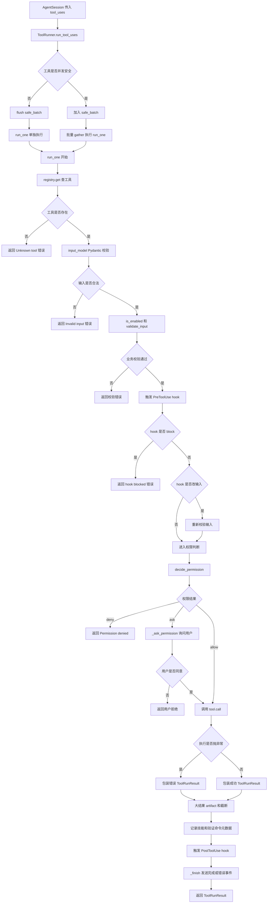
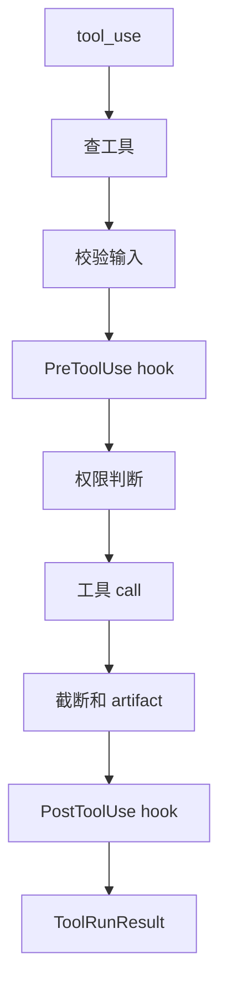

# `bigcode/tools/runner.py` 代码阅读

源码路径：`bigcode/tools/runner.py`

## 这个文件解决什么问题

`runner.py` 是工具执行调度器。模型返回 `tool_use` 后，真正把工具跑起来的就是这里。

它负责把一个工具调用从“不可信的模型输出”变成“可审计的工具运行结果”：

- 查找工具。
- Pydantic 校验输入。
- 工具业务校验。
- 执行 `PreToolUse` hook。
- 调统一权限系统。
- 必要时询问用户。
- 调工具的 `call()`。
- 捕获异常。
- 大结果落盘 artifact。
- 截断工具结果。
- 记录技能加载、验证命令等状态。
- 执行 `PostToolUse` hook。
- 发事件流。

读工具系统时，`run_one()` 是核心。

## 先抓主线

主要对象：

- `ToolUse`：模型返回的工具调用请求。
- `_ShellCommandParts`：审批提示里用于拆 shell 命令。
- `ToolRunner`：执行工具调用的调度器。

主流程：

1. `run_tool_uses()` 执行一批工具调用，安全工具可并发。
2. `run_one()` 执行单个工具完整流水线。
3. `_ask_permission()` 在交互式终端询问用户。
4. `_offload_large_result()` 处理超大结果。
5. `_record_metadata_carryover()` 把工具副作用记录回会话。

## 核心数据结构

### `ToolUse`

字段：

- `id`：工具调用 id。
- `name`：工具名。
- `input`：模型传入的原始 dict。

`AgentSession.run_turn()` 从 `ToolUseBlock` 构造它。

### `_ShellCommandParts`

审批提示用的数据结构。

字段：

- `segments`
- `separators`
- `is_complex`

它不参与真正 shell 执行，只用于把命令摘要翻译成人能看懂的一句话。

## 关键函数逐段讲解

### `run_tool_uses(tool_uses, ctx)`

执行一批工具调用。

它支持有限并发：

- `state_effect="none"` 且工具认为安全的调用，会加入 `safe_batch`。
- 遇到可能改变状态的工具，先 flush 并发批次，再单独执行。
- 这样既能并发跑只读工具，又能保持有副作用工具的顺序语义。

如果 `abort_event` 已设置，未执行的工具会返回统一的 aborted 错误。

### `run_one(tool_use, ctx)`

单个工具执行主链路。

第一步：发工具开始事件。

```py
self._emit_tool_started(tool_use, ctx)
```

第二步：查找工具。

如果 `registry.get(tool_use.name)` 返回 `None`，说明模型调用了未知工具，返回错误 `ToolRunResult`。

第三步：Pydantic 校验。

```py
input_model = tool.input_model.model_validate(tool_use.input)
```

这一步把模型给的 dict 变成强类型输入对象。

第四步：检查工具是否启用，以及业务校验。

- `tool.is_enabled(ctx)`
- `tool.validate_input(input_model, ctx)`

第五步：触发 `PreToolUse` hook。

hook 可以：

- block 工具调用。
- 修改工具输入。
- approve 或 ask。
- 追加上下文。

如果 hook 修改了输入，runner 会重新做 Pydantic 校验和业务校验。

第六步：统一权限判断。

```py
perm = await decide_permission(tool, input_model, ctx, hook_decision=hook_decision)
```

这里即使 hook approve 了，也仍然要经过 hard deny 和 sandbox 等收紧规则。

第七步：如果权限是 `ask`，调用 `_ask_permission()`。

非交互模式会直接拒绝。

第八步：执行工具。

```py
result = await tool.call(input_model, ctx)
```

异常会被捕获并包装成错误 `ToolRunResult`，不会让整个 session 崩掉。

第九步：处理大结果和元数据。

- `_offload_large_result()`
- `limit_tool_run_result()`
- `_record_metadata_carryover()`

第十步：触发 `PostToolUse` hook。

当前实现里 Post hook 只观察，不修改结果。

最后统一走 `_finish()`，记录耗时、完成事件和错误事件。

### `_finish(...)`

工具执行结束的统一出口。

它会：

- 计算耗时。
- 发 `ToolCompleted` 事件。
- 如果错误，发 `ErrorEvent`。
- 返回结果。

### `_ask_permission(...)`

生成权限提示文本，然后用 `asyncio.to_thread()` 调阻塞的 `input()`。

非交互会话直接返回 `False`。

### `_is_concurrency_safe(tool_use, ctx)`

先查工具，再校验输入，最后调用工具自己的 `is_concurrency_safe()`。

输入无效或工具不存在时都按不安全处理。

### `_offload_large_result(result, max_chars, ctx)`

如果工具结果超过 `max_chars`，会写入 artifact。

关键点：

- `artifact_id` 直接使用 `tool_use_id`。
- 元数据写到 `result.metadata` 和 `result.output.metadata` 两边。
- `active_artifacts` 登记白名单，防止模型读其它 session 的 artifact。
- 如果有 `agent_session.record_artifact()`，还会写入 snapshot，保证 resume 后可读。

### `_record_metadata_carryover(...)`

把某些工具运行结果转成会话状态：

- `SkillLoad` 成功后记录已加载技能。
- `Bash` 如果看起来是测试、构建、lint 命令，就记录最近验证命令和退出码。

### 权限提示辅助函数

从 `_format_permission_prompt()` 到 `_redact_inline()`，这一组函数只负责“把工具调用翻译成用户能判断的提示”。

例如：

- `Write` 显示写哪个文件、多少字符、多少行。
- `Edit` 显示修改哪个文件、替换首个还是全部。
- `Bash` 会尽量把 `rm`、`mkdir`、`git status` 等命令翻译成具体动作。
- 敏感字段会被 `<redacted>`。

真正的权限安全判断不在这些函数里，而在 `permissions.py`。

## 和其他模块的关系

- `AgentSession.run_turn()` 调 `run_tool_uses()`。
- `ToolRegistry` 提供工具查找。
- `BaseTool` 提供工具协议。
- `permissions.decide_permission()` 做权限决策。
- `HookBus` 提供 `PreToolUse` 和 `PostToolUse`。
- `output_limits.limit_tool_run_result()` 控制上下文大小。
- `artifacts` 负责大结果落盘。
- `normalizer.tool_run_result_to_message()` 后续把结果转成模型可见的工具结果消息。

## 阅读建议

先读 `run_one()`，它是工具系统的主干。后面一大段 shell 摘要函数可以第二遍再看，它们主要服务权限提示的可读性，不改变工具执行安全边界。

<!-- BEGIN EXTENDED READING NOTES -->

## 超详细源码阅读笔记（扩写版）

这一节是为了把前面的概览扩展成可以逐步跟读源码的版本。
阅读时不要只看结论，要把这里的每个检查点和对应源码放在一起看。
本篇主题是：工具执行器。
模块职责可以先压缩成一句话：把模型返回的 tool_use 按校验、hook、权限、执行、截断、事件的顺序变成 ToolRunResult。
下面的内容按“定位、符号、入口、数据流、边界、误区、自测”的顺序展开。
如果你是 Python 初学者，建议先读每节第一组短句，再回到源码找同名函数。

### A. 阅读定位

- 这篇文档对应源码：bigcode/tools/runner.py。
- 它在阅读路线里的角色：把模型返回的 tool_use 按校验、hook、权限、执行、截断、事件的顺序变成 ToolRunResult。
- 上游输入主要来自：AgentSession.run_turn, ToolRegistry, HookBus。
- 下游输出或调用对象主要是：具体工具 call, Permissions, Artifacts, Normalizer。
- 可以用这个例子追踪：`Bash tool_use -> 校验 -> PreToolUse -> permissions -> call -> ToolRunResult`。
- 先读公开入口，再读辅助函数；先读数据结构，再读使用这些结构的流程。
- 遇到以下划线开头的函数，先判断它服务哪个公开函数，不要孤立理解。
- 遇到 dataclass，先把字段含义看懂，再看谁创建它、谁消费它。
- 遇到 BaseModel，先看字段类型，因为字段类型就是工具或 API 的输入约束。
- 遇到 async def，重点看它 await 了谁，这通常就是跨模块调用点。

### B. 源码文件 `bigcode/tools/runner.py` 的结构地图

- 这个文件共有 776 行源码。
- 顶层 class/function 数量是 24。
- 顶层常量数量是 2。
- import/import from 语句数量大约是 16。
- 阅读时可以先折叠函数体，只看顶层符号顺序。
- 顶层符号顺序通常反映作者希望你先理解的数据类型和主入口。

#### 顶层常量阅读

- `_SENSITIVE_FIELD_RE` 位于第 425 行附近，通常是规则集合、正则、默认值或白名单。
  - 读 `_SENSITIVE_FIELD_RE` 时先问：它是安全边界、展示配置，还是业务默认值。
  - 再找哪里引用 `_SENSITIVE_FIELD_RE`，引用点才说明它真正影响哪个分支。
- `_MAX_INLINE_CHARS` 位于第 426 行附近，通常是规则集合、正则、默认值或白名单。
  - 读 `_MAX_INLINE_CHARS` 时先问：它是安全边界、展示配置，还是业务默认值。
  - 再找哪里引用 `_MAX_INLINE_CHARS`，引用点才说明它真正影响哪个分支。

#### 顶层符号阅读

- `class ToolUse`：位于第 28-35 行附近。
  - 先看签名和返回值，判断 `ToolUse` 是入口、数据模型还是辅助逻辑。
  - 再看它直接读取哪些字段、调用哪些函数、返回什么对象。
  - 如果 `ToolUse` 是类，先读字段和构造函数，再读会被外部调用的方法。
  - 如果 `ToolUse` 是函数，先找调用方；没有调用方时看是否是导出入口或测试使用。
- `class _ShellCommandParts`：位于第 39-44 行附近。
  - 先看签名和返回值，判断 `_ShellCommandParts` 是入口、数据模型还是辅助逻辑。
  - 再看它直接读取哪些字段、调用哪些函数、返回什么对象。
  - 如果 `_ShellCommandParts` 是类，先读字段和构造函数，再读会被外部调用的方法。
  - 如果 `_ShellCommandParts` 是函数，先找调用方；没有调用方时看是否是导出入口或测试使用。
- `class ToolRunner`：位于第 47-414 行附近。
  - 先看签名和返回值，判断 `ToolRunner` 是入口、数据模型还是辅助逻辑。
  - 再看它直接读取哪些字段、调用哪些函数、返回什么对象。
  - 如果 `ToolRunner` 是类，先读字段和构造函数，再读会被外部调用的方法。
  - 如果 `ToolRunner` 是函数，先找调用方；没有调用方时看是否是导出入口或测试使用。
- `def _read_yes_no`：位于第 417-422 行附近。
  - 先看签名和返回值，判断 `_read_yes_no` 是入口、数据模型还是辅助逻辑。
  - 再看它直接读取哪些字段、调用哪些函数、返回什么对象。
  - 如果 `_read_yes_no` 是类，先读字段和构造函数，再读会被外部调用的方法。
  - 如果 `_read_yes_no` 是函数，先找调用方；没有调用方时看是否是导出入口或测试使用。
- `def _format_permission_prompt`：位于第 429-436 行附近。
  - 先看签名和返回值，判断 `_format_permission_prompt` 是入口、数据模型还是辅助逻辑。
  - 再看它直接读取哪些字段、调用哪些函数、返回什么对象。
  - 如果 `_format_permission_prompt` 是类，先读字段和构造函数，再读会被外部调用的方法。
  - 如果 `_format_permission_prompt` 是函数，先找调用方；没有调用方时看是否是导出入口或测试使用。
- `def _permission_summary`：位于第 439-478 行附近。
  - 先看签名和返回值，判断 `_permission_summary` 是入口、数据模型还是辅助逻辑。
  - 再看它直接读取哪些字段、调用哪些函数、返回什么对象。
  - 如果 `_permission_summary` 是类，先读字段和构造函数，再读会被外部调用的方法。
  - 如果 `_permission_summary` 是函数，先找调用方；没有调用方时看是否是导出入口或测试使用。
- `def _bash_permission_summary`：位于第 481-497 行附近。
  - 先看签名和返回值，判断 `_bash_permission_summary` 是入口、数据模型还是辅助逻辑。
  - 再看它直接读取哪些字段、调用哪些函数、返回什么对象。
  - 如果 `_bash_permission_summary` 是类，先读字段和构造函数，再读会被外部调用的方法。
  - 如果 `_bash_permission_summary` 是函数，先找调用方；没有调用方时看是否是导出入口或测试使用。
- `def _simple_bash_action`：位于第 500-545 行附近。
  - 先看签名和返回值，判断 `_simple_bash_action` 是入口、数据模型还是辅助逻辑。
  - 再看它直接读取哪些字段、调用哪些函数、返回什么对象。
  - 如果 `_simple_bash_action` 是类，先读字段和构造函数，再读会被外部调用的方法。
  - 如果 `_simple_bash_action` 是函数，先找调用方；没有调用方时看是否是导出入口或测试使用。
- `def _split_shell_command`：位于第 548-605 行附近。
  - 先看签名和返回值，判断 `_split_shell_command` 是入口、数据模型还是辅助逻辑。
  - 再看它直接读取哪些字段、调用哪些函数、返回什么对象。
  - 如果 `_split_shell_command` 是类，先读字段和构造函数，再读会被外部调用的方法。
  - 如果 `_split_shell_command` 是函数，先找调用方；没有调用方时看是否是导出入口或测试使用。
- `def _flush_shell_segment`：位于第 608-613 行附近。
  - 先看签名和返回值，判断 `_flush_shell_segment` 是入口、数据模型还是辅助逻辑。
  - 再看它直接读取哪些字段、调用哪些函数、返回什么对象。
  - 如果 `_flush_shell_segment` 是类，先读字段和构造函数，再读会被外部调用的方法。
  - 如果 `_flush_shell_segment` 是函数，先找调用方；没有调用方时看是否是导出入口或测试使用。
- `def _git_bash_action`：位于第 616-629 行附近。
  - 先看签名和返回值，判断 `_git_bash_action` 是入口、数据模型还是辅助逻辑。
  - 再看它直接读取哪些字段、调用哪些函数、返回什么对象。
  - 如果 `_git_bash_action` 是类，先读字段和构造函数，再读会被外部调用的方法。
  - 如果 `_git_bash_action` 是函数，先找调用方；没有调用方时看是否是导出入口或测试使用。
- `def _external_permission_summary`：位于第 632-645 行附近。
  - 先看签名和返回值，判断 `_external_permission_summary` 是入口、数据模型还是辅助逻辑。
  - 再看它直接读取哪些字段、调用哪些函数、返回什么对象。
  - 如果 `_external_permission_summary` 是类，先读字段和构造函数，再读会被外部调用的方法。
  - 如果 `_external_permission_summary` 是函数，先找调用方；没有调用方时看是否是导出入口或测试使用。
- `def _shell_targets`：位于第 648-667 行附近。
  - 先看签名和返回值，判断 `_shell_targets` 是入口、数据模型还是辅助逻辑。
  - 再看它直接读取哪些字段、调用哪些函数、返回什么对象。
  - 如果 `_shell_targets` 是类，先读字段和构造函数，再读会被外部调用的方法。
  - 如果 `_shell_targets` 是函数，先找调用方；没有调用方时看是否是导出入口或测试使用。
- `def _target_count_label`：位于第 670-672 行附近。
  - 先看签名和返回值，判断 `_target_count_label` 是入口、数据模型还是辅助逻辑。
  - 再看它直接读取哪些字段、调用哪些函数、返回什么对象。
  - 如果 `_target_count_label` 是类，先读字段和构造函数，再读会被外部调用的方法。
  - 如果 `_target_count_label` 是函数，先找调用方；没有调用方时看是否是导出入口或测试使用。
- `def _format_targets`：位于第 675-679 行附近。
  - 先看签名和返回值，判断 `_format_targets` 是入口、数据模型还是辅助逻辑。
  - 再看它直接读取哪些字段、调用哪些函数、返回什么对象。
  - 如果 `_format_targets` 是类，先读字段和构造函数，再读会被外部调用的方法。
  - 如果 `_format_targets` 是函数，先找调用方；没有调用方时看是否是导出入口或测试使用。
- `def _short_shell_path`：位于第 682-687 行附近。
  - 先看签名和返回值，判断 `_short_shell_path` 是入口、数据模型还是辅助逻辑。
  - 再看它直接读取哪些字段、调用哪些函数、返回什么对象。
  - 如果 `_short_shell_path` 是类，先读字段和构造函数，再读会被外部调用的方法。
  - 如果 `_short_shell_path` 是函数，先找调用方；没有调用方时看是否是导出入口或测试使用。
- `def _short_path`：位于第 690-692 行附近。
  - 先看签名和返回值，判断 `_short_path` 是入口、数据模型还是辅助逻辑。
  - 再看它直接读取哪些字段、调用哪些函数、返回什么对象。
  - 如果 `_short_path` 是类，先读字段和构造函数，再读会被外部调用的方法。
  - 如果 `_short_path` 是函数，先找调用方；没有调用方时看是否是导出入口或测试使用。
- `def _display_path`：位于第 695-706 行附近。
  - 先看签名和返回值，判断 `_display_path` 是入口、数据模型还是辅助逻辑。
  - 再看它直接读取哪些字段、调用哪些函数、返回什么对象。
  - 如果 `_display_path` 是类，先读字段和构造函数，再读会被外部调用的方法。
  - 如果 `_display_path` 是函数，先找调用方；没有调用方时看是否是导出入口或测试使用。
- `def _line_count`：位于第 709-713 行附近。
  - 先看签名和返回值，判断 `_line_count` 是入口、数据模型还是辅助逻辑。
  - 再看它直接读取哪些字段、调用哪些函数、返回什么对象。
  - 如果 `_line_count` 是类，先读字段和构造函数，再读会被外部调用的方法。
  - 如果 `_line_count` 是函数，先找调用方；没有调用方时看是否是导出入口或测试使用。
- `def _inline_preview`：位于第 716-724 行附近。
  - 先看签名和返回值，判断 `_inline_preview` 是入口、数据模型还是辅助逻辑。
  - 再看它直接读取哪些字段、调用哪些函数、返回什么对象。
  - 如果 `_inline_preview` 是类，先读字段和构造函数，再读会被外部调用的方法。
  - 如果 `_inline_preview` 是函数，先找调用方；没有调用方时看是否是导出入口或测试使用。
- `def _safe_inline_json`：位于第 727-730 行附近。
  - 先看签名和返回值，判断 `_safe_inline_json` 是入口、数据模型还是辅助逻辑。
  - 再看它直接读取哪些字段、调用哪些函数、返回什么对象。
  - 如果 `_safe_inline_json` 是类，先读字段和构造函数，再读会被外部调用的方法。
  - 如果 `_safe_inline_json` 是函数，先找调用方；没有调用方时看是否是导出入口或测试使用。
- `def _sanitize_for_prompt`：位于第 733-747 行附近。
  - 先看签名和返回值，判断 `_sanitize_for_prompt` 是入口、数据模型还是辅助逻辑。
  - 再看它直接读取哪些字段、调用哪些函数、返回什么对象。
  - 如果 `_sanitize_for_prompt` 是类，先读字段和构造函数，再读会被外部调用的方法。
  - 如果 `_sanitize_for_prompt` 是函数，先找调用方；没有调用方时看是否是导出入口或测试使用。
- `def _redact_inline`：位于第 750-752 行附近。
  - 先看签名和返回值，判断 `_redact_inline` 是入口、数据模型还是辅助逻辑。
  - 再看它直接读取哪些字段、调用哪些函数、返回什么对象。
  - 如果 `_redact_inline` 是类，先读字段和构造函数，再读会被外部调用的方法。
  - 如果 `_redact_inline` 是函数，先找调用方；没有调用方时看是否是导出入口或测试使用。
- `def _is_verification_command`：位于第 755-776 行附近。
  - 先看签名和返回值，判断 `_is_verification_command` 是入口、数据模型还是辅助逻辑。
  - 再看它直接读取哪些字段、调用哪些函数、返回什么对象。
  - 如果 `_is_verification_command` 是类，先读字段和构造函数，再读会被外部调用的方法。
  - 如果 `_is_verification_command` 是函数，先找调用方；没有调用方时看是否是导出入口或测试使用。

### C. 主流程拆解

- 第 1 步：run_tool_uses 批量调度。读这一环节时要确认输入对象是什么、输出对象交给谁。
- 第 2 步：run_one 查工具。读这一环节时要确认输入对象是什么、输出对象交给谁。
- 第 3 步：校验输入。读这一环节时要确认输入对象是什么、输出对象交给谁。
- 第 4 步：PreToolUse hook。读这一环节时要确认输入对象是什么、输出对象交给谁。
- 第 5 步：decide_permission。读这一环节时要确认输入对象是什么、输出对象交给谁。
- 第 6 步：tool.call。读这一环节时要确认输入对象是什么、输出对象交给谁。
- 第 7 步：artifact 和截断。读这一环节时要确认输入对象是什么、输出对象交给谁。
- 第 8 步：PostToolUse hook。读这一环节时要确认输入对象是什么、输出对象交给谁。

### D. 本篇最应该盯住的源码点

- 关注点 1：安全工具并发批次。它通常决定你是否真正理解这个模块的边界。
- 关注点 2：hook 修改输入后重新校验。它通常决定你是否真正理解这个模块的边界。
- 关注点 3：非交互 ask 会失败。它通常决定你是否真正理解这个模块的边界。
- 关注点 4：大结果先落盘再截断。它通常决定你是否真正理解这个模块的边界。
- 关注点 5：Bash 验证命令会记录 last_verification。它通常决定你是否真正理解这个模块的边界。

### E. 初学者容易误解的点

- 误区 1：把权限提示摘要当作安全判断。读源码时用实际调用链验证，不要只按变量名猜。
- 误区 2：以为 PostToolUse 能改结果。读源码时用实际调用链验证，不要只按变量名猜。
- 误区 3：忽略 unknown tool 也会变成工具结果。读源码时用实际调用链验证，不要只按变量名猜。
- 误区 4：忘记 tool.call 异常会被捕获。读源码时用实际调用链验证，不要只按变量名猜。

### F. 数据流追踪

- 输入侧 1：`AgentSession.run_turn` 是这个模块可能接收信息的来源。
  - 追踪时先找它在哪个函数参数、对象字段或配置字段中出现。
  - 如果它是外部输入，要继续检查是否有校验、默认值或错误处理。
- 输入侧 2：`ToolRegistry` 是这个模块可能接收信息的来源。
  - 追踪时先找它在哪个函数参数、对象字段或配置字段中出现。
  - 如果它是外部输入，要继续检查是否有校验、默认值或错误处理。
- 输入侧 3：`HookBus` 是这个模块可能接收信息的来源。
  - 追踪时先找它在哪个函数参数、对象字段或配置字段中出现。
  - 如果它是外部输入，要继续检查是否有校验、默认值或错误处理。
- 输出侧 1：`具体工具 call` 是这个模块处理结果的去向。
  - 追踪时看当前模块传递的是原始值、结构化对象，还是已经裁剪过的投影。
  - 如果下游是工具或模型，重点检查安全边界和格式转换。
- 输出侧 2：`Permissions` 是这个模块处理结果的去向。
  - 追踪时看当前模块传递的是原始值、结构化对象，还是已经裁剪过的投影。
  - 如果下游是工具或模型，重点检查安全边界和格式转换。
- 输出侧 3：`Artifacts` 是这个模块处理结果的去向。
  - 追踪时看当前模块传递的是原始值、结构化对象，还是已经裁剪过的投影。
  - 如果下游是工具或模型，重点检查安全边界和格式转换。
- 输出侧 4：`Normalizer` 是这个模块处理结果的去向。
  - 追踪时看当前模块传递的是原始值、结构化对象，还是已经裁剪过的投影。
  - 如果下游是工具或模型，重点检查安全边界和格式转换。

### G. 边界情况阅读表

| 01 | `ToolUse` | 输入为空时是否有默认值或早返回 | 回到源码确认实际分支，不要用经验推断 |
| 02 | `_ShellCommandParts` | 配置项不存在时是报错、降级还是记录 warning | 回到源码确认实际分支，不要用经验推断 |
| 03 | `ToolRunner` | 外部依赖不可用时是否影响主流程 | 回到源码确认实际分支，不要用经验推断 |
| 04 | `_read_yes_no` | 异常是否被捕获并转成结构化结果 | 回到源码确认实际分支，不要用经验推断 |
| 05 | `_format_permission_prompt` | 列表为空时返回空列表还是 None | 回到源码确认实际分支，不要用经验推断 |
| 06 | `_permission_summary` | 路径或名称是否合法是否有校验 | 回到源码确认实际分支，不要用经验推断 |
| 07 | `_bash_permission_summary` | 非交互模式是否会改变行为 | 回到源码确认实际分支，不要用经验推断 |
| 08 | `_simple_bash_action` | 状态是否会写入 transcript、snapshot 或磁盘文件 | 回到源码确认实际分支，不要用经验推断 |
| 09 | `_split_shell_command` | 是否存在只读模式、plan 模式或 sandbox 的特殊分支 | 回到源码确认实际分支，不要用经验推断 |
| 10 | `_flush_shell_segment` | 返回值是否会继续进入模型上下文 | 回到源码确认实际分支，不要用经验推断 |
| 11 | `_git_bash_action` | 输入为空时是否有默认值或早返回 | 回到源码确认实际分支，不要用经验推断 |
| 12 | `_external_permission_summary` | 配置项不存在时是报错、降级还是记录 warning | 回到源码确认实际分支，不要用经验推断 |
| 13 | `_shell_targets` | 外部依赖不可用时是否影响主流程 | 回到源码确认实际分支，不要用经验推断 |
| 14 | `_target_count_label` | 异常是否被捕获并转成结构化结果 | 回到源码确认实际分支，不要用经验推断 |
| 15 | `_format_targets` | 列表为空时返回空列表还是 None | 回到源码确认实际分支，不要用经验推断 |
| 16 | `_short_shell_path` | 路径或名称是否合法是否有校验 | 回到源码确认实际分支，不要用经验推断 |
| 17 | `_short_path` | 非交互模式是否会改变行为 | 回到源码确认实际分支，不要用经验推断 |
| 18 | `_display_path` | 状态是否会写入 transcript、snapshot 或磁盘文件 | 回到源码确认实际分支，不要用经验推断 |
| 19 | `_line_count` | 是否存在只读模式、plan 模式或 sandbox 的特殊分支 | 回到源码确认实际分支，不要用经验推断 |
| 20 | `_inline_preview` | 返回值是否会继续进入模型上下文 | 回到源码确认实际分支，不要用经验推断 |
| 21 | `_safe_inline_json` | 输入为空时是否有默认值或早返回 | 回到源码确认实际分支，不要用经验推断 |
| 22 | `_sanitize_for_prompt` | 配置项不存在时是报错、降级还是记录 warning | 回到源码确认实际分支，不要用经验推断 |
| 23 | `_redact_inline` | 外部依赖不可用时是否影响主流程 | 回到源码确认实际分支，不要用经验推断 |
| 24 | `_is_verification_command` | 异常是否被捕获并转成结构化结果 | 回到源码确认实际分支，不要用经验推断 |
| 25 | `ToolUse` | 列表为空时返回空列表还是 None | 回到源码确认实际分支，不要用经验推断 |
| 26 | `_ShellCommandParts` | 路径或名称是否合法是否有校验 | 回到源码确认实际分支，不要用经验推断 |
| 27 | `ToolRunner` | 非交互模式是否会改变行为 | 回到源码确认实际分支，不要用经验推断 |
| 28 | `_read_yes_no` | 状态是否会写入 transcript、snapshot 或磁盘文件 | 回到源码确认实际分支，不要用经验推断 |
| 29 | `_format_permission_prompt` | 是否存在只读模式、plan 模式或 sandbox 的特殊分支 | 回到源码确认实际分支，不要用经验推断 |
| 30 | `_permission_summary` | 返回值是否会继续进入模型上下文 | 回到源码确认实际分支，不要用经验推断 |
| 31 | `_bash_permission_summary` | 输入为空时是否有默认值或早返回 | 回到源码确认实际分支，不要用经验推断 |
| 32 | `_simple_bash_action` | 配置项不存在时是报错、降级还是记录 warning | 回到源码确认实际分支，不要用经验推断 |
| 33 | `_split_shell_command` | 外部依赖不可用时是否影响主流程 | 回到源码确认实际分支，不要用经验推断 |
| 34 | `_flush_shell_segment` | 异常是否被捕获并转成结构化结果 | 回到源码确认实际分支，不要用经验推断 |
| 35 | `_git_bash_action` | 列表为空时返回空列表还是 None | 回到源码确认实际分支，不要用经验推断 |
| 36 | `_external_permission_summary` | 路径或名称是否合法是否有校验 | 回到源码确认实际分支，不要用经验推断 |
| 37 | `_shell_targets` | 非交互模式是否会改变行为 | 回到源码确认实际分支，不要用经验推断 |
| 38 | `_target_count_label` | 状态是否会写入 transcript、snapshot 或磁盘文件 | 回到源码确认实际分支，不要用经验推断 |
| 39 | `_format_targets` | 是否存在只读模式、plan 模式或 sandbox 的特殊分支 | 回到源码确认实际分支，不要用经验推断 |
| 40 | `_short_shell_path` | 返回值是否会继续进入模型上下文 | 回到源码确认实际分支，不要用经验推断 |
| 41 | `_short_path` | 输入为空时是否有默认值或早返回 | 回到源码确认实际分支，不要用经验推断 |
| 42 | `_display_path` | 配置项不存在时是报错、降级还是记录 warning | 回到源码确认实际分支，不要用经验推断 |
| 43 | `_line_count` | 外部依赖不可用时是否影响主流程 | 回到源码确认实际分支，不要用经验推断 |
| 44 | `_inline_preview` | 异常是否被捕获并转成结构化结果 | 回到源码确认实际分支，不要用经验推断 |
| 45 | `_safe_inline_json` | 列表为空时返回空列表还是 None | 回到源码确认实际分支，不要用经验推断 |
| 46 | `_sanitize_for_prompt` | 路径或名称是否合法是否有校验 | 回到源码确认实际分支，不要用经验推断 |
| 47 | `_redact_inline` | 非交互模式是否会改变行为 | 回到源码确认实际分支，不要用经验推断 |
| 48 | `_is_verification_command` | 状态是否会写入 transcript、snapshot 或磁盘文件 | 回到源码确认实际分支，不要用经验推断 |
| 49 | `ToolUse` | 是否存在只读模式、plan 模式或 sandbox 的特殊分支 | 回到源码确认实际分支，不要用经验推断 |
| 50 | `_ShellCommandParts` | 返回值是否会继续进入模型上下文 | 回到源码确认实际分支，不要用经验推断 |
| 51 | `ToolRunner` | 输入为空时是否有默认值或早返回 | 回到源码确认实际分支，不要用经验推断 |
| 52 | `_read_yes_no` | 配置项不存在时是报错、降级还是记录 warning | 回到源码确认实际分支，不要用经验推断 |
| 53 | `_format_permission_prompt` | 外部依赖不可用时是否影响主流程 | 回到源码确认实际分支，不要用经验推断 |
| 54 | `_permission_summary` | 异常是否被捕获并转成结构化结果 | 回到源码确认实际分支，不要用经验推断 |
| 55 | `_bash_permission_summary` | 列表为空时返回空列表还是 None | 回到源码确认实际分支，不要用经验推断 |
| 56 | `_simple_bash_action` | 路径或名称是否合法是否有校验 | 回到源码确认实际分支，不要用经验推断 |
| 57 | `_split_shell_command` | 非交互模式是否会改变行为 | 回到源码确认实际分支，不要用经验推断 |
| 58 | `_flush_shell_segment` | 状态是否会写入 transcript、snapshot 或磁盘文件 | 回到源码确认实际分支，不要用经验推断 |
| 59 | `_git_bash_action` | 是否存在只读模式、plan 模式或 sandbox 的特殊分支 | 回到源码确认实际分支，不要用经验推断 |
| 60 | `_external_permission_summary` | 返回值是否会继续进入模型上下文 | 回到源码确认实际分支，不要用经验推断 |

### H. 与阅读路线的衔接

- 读完 `工具执行器` 后，回到 `doc/CodeReadingGuide.md` 看它处在哪一阶段。
- 如果它的上游是 AgentSession.run_turn，就从上游重新走一次调用链。
- 如果它的下游是 具体工具 call，就继续读下游如何消费当前模块的输出。
- 不要只背函数名；真正的理解是能说清数据对象怎样跨文件移动。
- 当你能画出自己的简图，再对照文末两个流程图，说明这一篇基本读通了。

## 详细流程图



## 核心流程图


