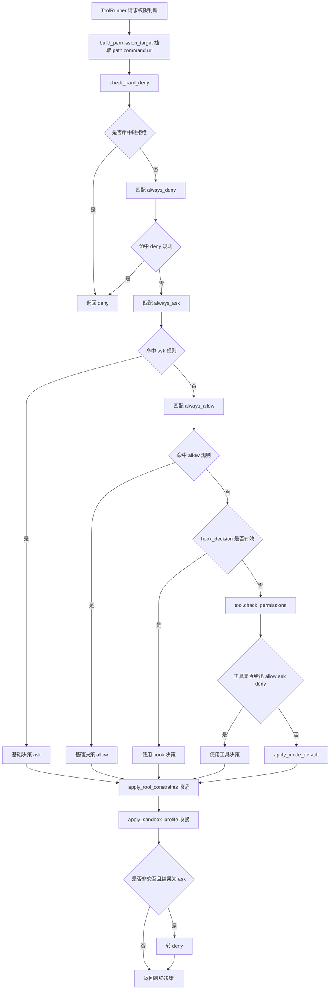
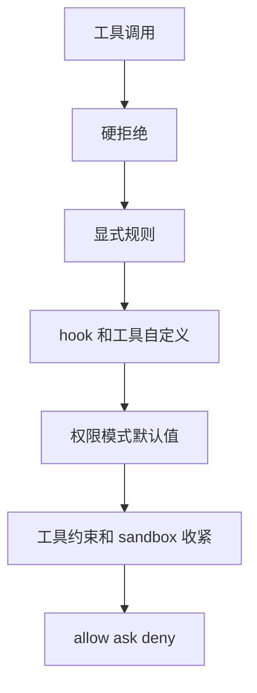

# `bigcode/tools/permissions.py` 代码阅读

源码路径：`bigcode/tools/permissions.py`

## 这个文件解决什么问题

`permissions.py` 是工具权限决策核心。它决定一个工具调用应该：

- 允许。
- 拒绝。
- 询问用户。

它的特点是“保守收敛”：先做不能绕过的硬拒绝，再看显式规则、hook、工具自定义、权限模式默认值，最后再用工具约束和 sandbox profile 收紧。

这意味着即使某个 hook 或规则批准了工具调用，危险命令、敏感文件、系统目录写入、私网 URL、sandbox 限制仍然可以把它拒绝。

## 先抓主线

主入口是 `decide_permission(tool, input_model, ctx, hook_decision=None)`。

决策顺序：

1. `build_permission_target()` 抽取通用判断对象。
2. `check_hard_deny()` 做安全底线检查。
3. 显式 deny 规则。
4. 显式 ask 规则。
5. 显式 allow 规则。
6. hook 决策。
7. 工具自己的 `check_permissions()`。
8. `apply_mode_default()` 根据权限模式给默认决策。
9. `apply_tool_constraints()` 用工具约束收紧。
10. `apply_sandbox_profile()` 用 sandbox 收紧。
11. 非交互时把 `ask` 变成 `deny`。

## 核心数据结构

### `PermissionRule`

一条权限规则。

字段：

- `tool_name`：具体工具名或 `*`。
- `behavior`：`allow`、`deny`、`ask`。
- `pattern`：用 `fnmatch` 匹配路径、命令或 URL。
- `source`
- `reason`

### `ToolPermissionContext`

当前会话权限上下文。

字段：

- `mode`
- `always_allow`
- `always_deny`
- `always_ask`
- `should_avoid_permission_prompts`

`AgentSession` 初始化时会复制一份配置里的权限上下文，后续 Plan Mode 或 resume 可以修改它。

### `PermissionTarget`

从具体工具输入中抽象出的权限判断对象。

字段：

- `tool_name`
- `category`
- `path`
- `command`
- `network_url`
- `raw`

权限系统不关心每个工具的全部参数，只关心路径、命令、URL、类别这些通用安全字段。

## 关键常量

### `SENSITIVE_NAMES`

敏感文件名，例如：

- `.env`
- `.npmrc`
- `.pypirc`
- `.netrc`
- 私钥文件名
- `credentials`

访问这些路径会被 hard deny。

### `SYSTEM_DENY_PREFIXES`

系统目录写入拒绝列表：

- `/bin`
- `/sbin`
- `/usr`
- `/etc`
- `/var`
- `/boot`
- `/dev`
- `/proc`
- `/sys`

写、改、删这些目录会被 hard deny。

### Bash 分类常量

- `READ_ONLY_BASH`
- `MUTATING_BASH`
- `COMPLEX_SHELL_RE`

它们服务 `classify_bash()`，用于判断命令是只读、会修改、危险还是未知。

## 关键函数逐段讲解

### `decide_permission(...)`

这是总入口。

先构造 `PermissionTarget`，再做 hard deny：

```py
hard = check_hard_deny(target, ctx)
```

hard deny 是安全底线，不能被配置或 hook 绕过。

显式规则顺序是：

1. `always_deny`
2. `always_ask`
3. `always_allow`

这保证明确拒绝比批准优先。

如果没有命中显式规则，再考虑：

- hook 决策。
- 工具自己的权限判断。
- 模式默认规则。

得到基础决策后，再调用：

- `apply_tool_constraints()`
- `apply_sandbox_profile()`

最后，如果是非交互模式或避免权限提示模式，`ask` 会变成 `deny`。

### `build_permission_target(tool, input_model)`

从 Pydantic 输入模型里抽取通用字段：

- `file_path` 或 `path` 转成 `Path`。
- `command`
- `url`

并带上工具名和权限类别。

### `check_hard_deny(target, ctx)`

执行不能绕过的拒绝。

路径相关：

- 敏感文件名拒绝。
- `.pem` 文件拒绝。
- 路径必须能安全 resolve。
- 写、改、删系统目录拒绝。

命令相关：

- `sudo`、`su` 拒绝。
- `rm -rf /`、`rm -rf ~`、`rm -rf $HOME` 这类广泛递归删除拒绝。

网络相关：

- 只允许 `http` 和 `https`。
- 必须有 host。
- localhost、metadata、私网、保留地址等拒绝。

### `apply_mode_default(tool, target, ctx)`

根据权限模式和工具类别给默认决策。

#### `bypassPermissions`

默认允许，但仍然不能绕过 hard deny、工具约束和 sandbox。

#### `plan`

Plan Mode 偏只读：

- 允许读文件、搜索、计划查看和写计划、询问用户、退出计划模式、任务只读、技能读取、MCP 资源或 prompt 读取等。
- 允许只读 Bash。
- 允许只读规划子代理。
- 其它直接拒绝。

#### `default`

大致规则：

- 读 workspace 内文件允许，workspace 外读取需要 ask。
- skill 访问允许。
- bash 如果是只读命令允许。
- state 工具允许。
- 写、改、删、网络、agent、MCP 等一般 ask。

#### `acceptEdits`

在 `default` 基础上，workspace 编辑类工具可以默认允许。

### `apply_tool_constraints(decision, tool, target, ctx)`

用工具自身特性收紧结果。

当前重点是 Bash：

- `danger`：直接 deny。
- Plan Mode 下非只读 Bash：deny。
- `unknown` 命令如果前面是 allow，会降级成 ask。

还会保证 Plan Mode 下工作区写入被拒绝，除非是 `WritePlan`。

### `apply_sandbox_profile(decision, tool, target, ctx)`

用 sandbox profile 进一步收紧。

#### `none`

不额外限制。

#### `workspace`

- 禁止网络和 MCP。
- Bash 只允许只读命令。
- 其它保持前面决策。

#### `read-only`

只放行明确只读工具、只读 Bash、只读子代理。其它拒绝。

### `classify_bash(command)`

把 shell 命令分成：

- `read`
- `mutate`
- `danger`
- `unknown`

它故意保守：

- 空命令算 read。
- `sudo`、`su` 是 danger。
- 复杂 shell 语法通常 unknown。
- `git status`、`git diff`、`git log` 等是 read。
- 大多数 git 其它子命令算 mutate。
- `find -delete`、`sed -i` 算 mutate。
- `python`、`node`、`bash` 等脚本执行大多 unknown。

### `_match_rules(rules, target)`

匹配显式权限规则。

工具名必须匹配具体工具或 `*`。如果规则带 pattern，就用 `fnmatch` 匹配：

- command
- path
- network_url

### 路径和网络辅助函数

- `_resolve_existing_or_parent()`：已存在路径 resolve；新文件 resolve 父目录再拼文件名。
- `_inside_any()`：判断路径是否在任一 workspace root 内。
- `_is_relative_to()`：安全判断相对关系。
- `_is_unsafe_network_host()`：拒绝 localhost、私网、链路本地、保留地址等。

## 和其他模块的关系

- `ToolRunner.run_one()` 调 `decide_permission()`。
- `config/loader.py` 解析配置生成 `ToolPermissionContext` 和 `PermissionRule`。
- `BaseTool.permission_category` 是权限分类来源。
- `ToolExecutionContext` 提供 cwd、workspace roots、权限上下文、sandbox profile。
- 具体工具可以通过 `check_permissions()` 提供工具级判断。

## 阅读建议

先读 `decide_permission()`，把顺序记住。然后读 `check_hard_deny()` 和 `apply_mode_default()`。最后读 Bash 分类和 sandbox 收紧逻辑。权限系统最重要的是顺序：先安全底线，再用户规则，最后收紧。

<!-- BEGIN EXTENDED READING NOTES -->

## 超详细源码阅读笔记（扩写版）

这一节是为了把前面的概览扩展成可以逐步跟读源码的版本。
阅读时不要只看结论，要把这里的每个检查点和对应源码放在一起看。
本篇主题是：工具权限引擎。
模块职责可以先压缩成一句话：统一决定工具调用是 allow、ask 还是 deny，并用 hard deny 和 sandbox 保守收紧。
下面的内容按“定位、符号、入口、数据流、边界、误区、自测”的顺序展开。
如果你是 Python 初学者，建议先读每节第一组短句，再回到源码找同名函数。

### A. 阅读定位

- 这篇文档对应源码：bigcode/tools/permissions.py。
- 它在阅读路线里的角色：统一决定工具调用是 allow、ask 还是 deny，并用 hard deny 和 sandbox 保守收紧。
- 上游输入主要来自：ToolRunner, config loader, BaseTool 元数据。
- 下游输出或调用对象主要是：ToolRunner 权限询问或拒绝, 工具执行安全边界。
- 可以用这个例子追踪：`Edit 系统路径 -> hard deny；Bash git status -> read；Bash python script.py -> unknown`。
- 先读公开入口，再读辅助函数；先读数据结构，再读使用这些结构的流程。
- 遇到以下划线开头的函数，先判断它服务哪个公开函数，不要孤立理解。
- 遇到 dataclass，先把字段含义看懂，再看谁创建它、谁消费它。
- 遇到 BaseModel，先看字段类型，因为字段类型就是工具或 API 的输入约束。
- 遇到 async def，重点看它 await 了谁，这通常就是跨模块调用点。

### B. 源码文件 `bigcode/tools/permissions.py` 的结构地图

- 这个文件共有 414 行源码。
- 顶层 class/function 数量是 15。
- 顶层常量数量是 7。
- import/import from 语句数量大约是 11。
- 阅读时可以先折叠函数体，只看顶层符号顺序。
- 顶层符号顺序通常反映作者希望你先理解的数据类型和主入口。

#### 顶层常量阅读

- `SENSITIVE_NAMES` 位于第 61 行附近，通常是规则集合、正则、默认值或白名单。
  - 读 `SENSITIVE_NAMES` 时先问：它是安全边界、展示配置，还是业务默认值。
  - 再找哪里引用 `SENSITIVE_NAMES`，引用点才说明它真正影响哪个分支。
- `SYSTEM_DENY_PREFIXES` 位于第 72 行附近，通常是规则集合、正则、默认值或白名单。
  - 读 `SYSTEM_DENY_PREFIXES` 时先问：它是安全边界、展示配置，还是业务默认值。
  - 再找哪里引用 `SYSTEM_DENY_PREFIXES`，引用点才说明它真正影响哪个分支。
- `READ_ONLY_BASH` 位于第 73 行附近，通常是规则集合、正则、默认值或白名单。
  - 读 `READ_ONLY_BASH` 时先问：它是安全边界、展示配置，还是业务默认值。
  - 再找哪里引用 `READ_ONLY_BASH`，引用点才说明它真正影响哪个分支。
- `MUTATING_BASH` 位于第 86 行附近，通常是规则集合、正则、默认值或白名单。
  - 读 `MUTATING_BASH` 时先问：它是安全边界、展示配置，还是业务默认值。
  - 再找哪里引用 `MUTATING_BASH`，引用点才说明它真正影响哪个分支。
- `COMPLEX_SHELL_RE` 位于第 106 行附近，通常是规则集合、正则、默认值或白名单。
  - 读 `COMPLEX_SHELL_RE` 时先问：它是安全边界、展示配置，还是业务默认值。
  - 再找哪里引用 `COMPLEX_SHELL_RE`，引用点才说明它真正影响哪个分支。
- `READ_ONLY_SANDBOX_TOOLS` 位于第 107 行附近，通常是规则集合、正则、默认值或白名单。
  - 读 `READ_ONLY_SANDBOX_TOOLS` 时先问：它是安全边界、展示配置，还是业务默认值。
  - 再找哪里引用 `READ_ONLY_SANDBOX_TOOLS`，引用点才说明它真正影响哪个分支。
- `READ_ONLY_SANDBOX_AGENTS` 位于第 119 行附近，通常是规则集合、正则、默认值或白名单。
  - 读 `READ_ONLY_SANDBOX_AGENTS` 时先问：它是安全边界、展示配置，还是业务默认值。
  - 再找哪里引用 `READ_ONLY_SANDBOX_AGENTS`，引用点才说明它真正影响哪个分支。

#### 顶层符号阅读

- `class PermissionRule`：位于第 25-34 行附近。
  - 先看签名和返回值，判断 `PermissionRule` 是入口、数据模型还是辅助逻辑。
  - 再看它直接读取哪些字段、调用哪些函数、返回什么对象。
  - 如果 `PermissionRule` 是类，先读字段和构造函数，再读会被外部调用的方法。
  - 如果 `PermissionRule` 是函数，先找调用方；没有调用方时看是否是导出入口或测试使用。
- `class ToolPermissionContext`：位于第 38-44 行附近。
  - 先看签名和返回值，判断 `ToolPermissionContext` 是入口、数据模型还是辅助逻辑。
  - 再看它直接读取哪些字段、调用哪些函数、返回什么对象。
  - 如果 `ToolPermissionContext` 是类，先读字段和构造函数，再读会被外部调用的方法。
  - 如果 `ToolPermissionContext` 是函数，先找调用方；没有调用方时看是否是导出入口或测试使用。
- `class PermissionTarget`：位于第 48-58 行附近。
  - 先看签名和返回值，判断 `PermissionTarget` 是入口、数据模型还是辅助逻辑。
  - 再看它直接读取哪些字段、调用哪些函数、返回什么对象。
  - 如果 `PermissionTarget` 是类，先读字段和构造函数，再读会被外部调用的方法。
  - 如果 `PermissionTarget` 是函数，先找调用方；没有调用方时看是否是导出入口或测试使用。
- `async def decide_permission`：位于第 122-170 行附近。
  - 先看签名和返回值，判断 `decide_permission` 是入口、数据模型还是辅助逻辑。
  - 再看它直接读取哪些字段、调用哪些函数、返回什么对象。
  - 如果 `decide_permission` 是类，先读字段和构造函数，再读会被外部调用的方法。
  - 如果 `decide_permission` 是函数，先找调用方；没有调用方时看是否是导出入口或测试使用。
- `def build_permission_target`：位于第 173-184 行附近。
  - 先看签名和返回值，判断 `build_permission_target` 是入口、数据模型还是辅助逻辑。
  - 再看它直接读取哪些字段、调用哪些函数、返回什么对象。
  - 如果 `build_permission_target` 是类，先读字段和构造函数，再读会被外部调用的方法。
  - 如果 `build_permission_target` 是函数，先找调用方；没有调用方时看是否是导出入口或测试使用。
- `def check_hard_deny`：位于第 187-220 行附近。
  - 先看签名和返回值，判断 `check_hard_deny` 是入口、数据模型还是辅助逻辑。
  - 再看它直接读取哪些字段、调用哪些函数、返回什么对象。
  - 如果 `check_hard_deny` 是类，先读字段和构造函数，再读会被外部调用的方法。
  - 如果 `check_hard_deny` 是函数，先找调用方；没有调用方时看是否是导出入口或测试使用。
- `def apply_mode_default`：位于第 223-257 行附近。
  - 先看签名和返回值，判断 `apply_mode_default` 是入口、数据模型还是辅助逻辑。
  - 再看它直接读取哪些字段、调用哪些函数、返回什么对象。
  - 如果 `apply_mode_default` 是类，先读字段和构造函数，再读会被外部调用的方法。
  - 如果 `apply_mode_default` 是函数，先找调用方；没有调用方时看是否是导出入口或测试使用。
- `def apply_tool_constraints`：位于第 260-280 行附近。
  - 先看签名和返回值，判断 `apply_tool_constraints` 是入口、数据模型还是辅助逻辑。
  - 再看它直接读取哪些字段、调用哪些函数、返回什么对象。
  - 如果 `apply_tool_constraints` 是类，先读字段和构造函数，再读会被外部调用的方法。
  - 如果 `apply_tool_constraints` 是函数，先找调用方；没有调用方时看是否是导出入口或测试使用。
- `def apply_sandbox_profile`：位于第 283-316 行附近。
  - 先看签名和返回值，判断 `apply_sandbox_profile` 是入口、数据模型还是辅助逻辑。
  - 再看它直接读取哪些字段、调用哪些函数、返回什么对象。
  - 如果 `apply_sandbox_profile` 是类，先读字段和构造函数，再读会被外部调用的方法。
  - 如果 `apply_sandbox_profile` 是函数，先找调用方；没有调用方时看是否是导出入口或测试使用。
- `def classify_bash`：位于第 319-367 行附近。
  - 先看签名和返回值，判断 `classify_bash` 是入口、数据模型还是辅助逻辑。
  - 再看它直接读取哪些字段、调用哪些函数、返回什么对象。
  - 如果 `classify_bash` 是类，先读字段和构造函数，再读会被外部调用的方法。
  - 如果 `classify_bash` 是函数，先找调用方；没有调用方时看是否是导出入口或测试使用。
- `def _match_rules`：位于第 370-380 行附近。
  - 先看签名和返回值，判断 `_match_rules` 是入口、数据模型还是辅助逻辑。
  - 再看它直接读取哪些字段、调用哪些函数、返回什么对象。
  - 如果 `_match_rules` 是类，先读字段和构造函数，再读会被外部调用的方法。
  - 如果 `_match_rules` 是函数，先找调用方；没有调用方时看是否是导出入口或测试使用。
- `def _resolve_existing_or_parent`：位于第 383-388 行附近。
  - 先看签名和返回值，判断 `_resolve_existing_or_parent` 是入口、数据模型还是辅助逻辑。
  - 再看它直接读取哪些字段、调用哪些函数、返回什么对象。
  - 如果 `_resolve_existing_or_parent` 是类，先读字段和构造函数，再读会被外部调用的方法。
  - 如果 `_resolve_existing_or_parent` 是函数，先找调用方；没有调用方时看是否是导出入口或测试使用。
- `def _inside_any`：位于第 391-393 行附近。
  - 先看签名和返回值，判断 `_inside_any` 是入口、数据模型还是辅助逻辑。
  - 再看它直接读取哪些字段、调用哪些函数、返回什么对象。
  - 如果 `_inside_any` 是类，先读字段和构造函数，再读会被外部调用的方法。
  - 如果 `_inside_any` 是函数，先找调用方；没有调用方时看是否是导出入口或测试使用。
- `def _is_relative_to`：位于第 396-402 行附近。
  - 先看签名和返回值，判断 `_is_relative_to` 是入口、数据模型还是辅助逻辑。
  - 再看它直接读取哪些字段、调用哪些函数、返回什么对象。
  - 如果 `_is_relative_to` 是类，先读字段和构造函数，再读会被外部调用的方法。
  - 如果 `_is_relative_to` 是函数，先找调用方；没有调用方时看是否是导出入口或测试使用。
- `def _is_unsafe_network_host`：位于第 405-414 行附近。
  - 先看签名和返回值，判断 `_is_unsafe_network_host` 是入口、数据模型还是辅助逻辑。
  - 再看它直接读取哪些字段、调用哪些函数、返回什么对象。
  - 如果 `_is_unsafe_network_host` 是类，先读字段和构造函数，再读会被外部调用的方法。
  - 如果 `_is_unsafe_network_host` 是函数，先找调用方；没有调用方时看是否是导出入口或测试使用。

### C. 主流程拆解

- 第 1 步：build_permission_target。读这一环节时要确认输入对象是什么、输出对象交给谁。
- 第 2 步：check_hard_deny。读这一环节时要确认输入对象是什么、输出对象交给谁。
- 第 3 步：显式规则匹配。读这一环节时要确认输入对象是什么、输出对象交给谁。
- 第 4 步：hook 和工具自定义。读这一环节时要确认输入对象是什么、输出对象交给谁。
- 第 5 步：模式默认值。读这一环节时要确认输入对象是什么、输出对象交给谁。
- 第 6 步：工具约束。读这一环节时要确认输入对象是什么、输出对象交给谁。
- 第 7 步：sandbox 收紧。读这一环节时要确认输入对象是什么、输出对象交给谁。

### D. 本篇最应该盯住的源码点

- 关注点 1：hard deny 不能被绕过。它通常决定你是否真正理解这个模块的边界。
- 关注点 2：deny 优先于 ask 优先于 allow。它通常决定你是否真正理解这个模块的边界。
- 关注点 3：plan 模式偏只读。它通常决定你是否真正理解这个模块的边界。
- 关注点 4：classify_bash 故意保守。它通常决定你是否真正理解这个模块的边界。
- 关注点 5：sandbox 只能收紧。它通常决定你是否真正理解这个模块的边界。

### E. 初学者容易误解的点

- 误区 1：以为 bypassPermissions 绕过 hard deny。读源码时用实际调用链验证，不要只按变量名猜。
- 误区 2：把 bash 摘要和 bash 分类混为一谈。读源码时用实际调用链验证，不要只按变量名猜。
- 误区 3：忽略非交互 ask 转 deny。读源码时用实际调用链验证，不要只按变量名猜。
- 误区 4：以为 workspace sandbox 允许网络。读源码时用实际调用链验证，不要只按变量名猜。

### F. 数据流追踪

- 输入侧 1：`ToolRunner` 是这个模块可能接收信息的来源。
  - 追踪时先找它在哪个函数参数、对象字段或配置字段中出现。
  - 如果它是外部输入，要继续检查是否有校验、默认值或错误处理。
- 输入侧 2：`config loader` 是这个模块可能接收信息的来源。
  - 追踪时先找它在哪个函数参数、对象字段或配置字段中出现。
  - 如果它是外部输入，要继续检查是否有校验、默认值或错误处理。
- 输入侧 3：`BaseTool 元数据` 是这个模块可能接收信息的来源。
  - 追踪时先找它在哪个函数参数、对象字段或配置字段中出现。
  - 如果它是外部输入，要继续检查是否有校验、默认值或错误处理。
- 输出侧 1：`ToolRunner 权限询问或拒绝` 是这个模块处理结果的去向。
  - 追踪时看当前模块传递的是原始值、结构化对象，还是已经裁剪过的投影。
  - 如果下游是工具或模型，重点检查安全边界和格式转换。
- 输出侧 2：`工具执行安全边界` 是这个模块处理结果的去向。
  - 追踪时看当前模块传递的是原始值、结构化对象，还是已经裁剪过的投影。
  - 如果下游是工具或模型，重点检查安全边界和格式转换。

### G. 边界情况阅读表

| 01 | `PermissionRule` | 输入为空时是否有默认值或早返回 | 回到源码确认实际分支，不要用经验推断 |
| 02 | `ToolPermissionContext` | 配置项不存在时是报错、降级还是记录 warning | 回到源码确认实际分支，不要用经验推断 |
| 03 | `PermissionTarget` | 外部依赖不可用时是否影响主流程 | 回到源码确认实际分支，不要用经验推断 |
| 04 | `decide_permission` | 异常是否被捕获并转成结构化结果 | 回到源码确认实际分支，不要用经验推断 |
| 05 | `build_permission_target` | 列表为空时返回空列表还是 None | 回到源码确认实际分支，不要用经验推断 |
| 06 | `check_hard_deny` | 路径或名称是否合法是否有校验 | 回到源码确认实际分支，不要用经验推断 |
| 07 | `apply_mode_default` | 非交互模式是否会改变行为 | 回到源码确认实际分支，不要用经验推断 |
| 08 | `apply_tool_constraints` | 状态是否会写入 transcript、snapshot 或磁盘文件 | 回到源码确认实际分支，不要用经验推断 |
| 09 | `apply_sandbox_profile` | 是否存在只读模式、plan 模式或 sandbox 的特殊分支 | 回到源码确认实际分支，不要用经验推断 |
| 10 | `classify_bash` | 返回值是否会继续进入模型上下文 | 回到源码确认实际分支，不要用经验推断 |
| 11 | `_match_rules` | 输入为空时是否有默认值或早返回 | 回到源码确认实际分支，不要用经验推断 |
| 12 | `_resolve_existing_or_parent` | 配置项不存在时是报错、降级还是记录 warning | 回到源码确认实际分支，不要用经验推断 |
| 13 | `_inside_any` | 外部依赖不可用时是否影响主流程 | 回到源码确认实际分支，不要用经验推断 |
| 14 | `_is_relative_to` | 异常是否被捕获并转成结构化结果 | 回到源码确认实际分支，不要用经验推断 |
| 15 | `_is_unsafe_network_host` | 列表为空时返回空列表还是 None | 回到源码确认实际分支，不要用经验推断 |
| 16 | `PermissionRule` | 路径或名称是否合法是否有校验 | 回到源码确认实际分支，不要用经验推断 |
| 17 | `ToolPermissionContext` | 非交互模式是否会改变行为 | 回到源码确认实际分支，不要用经验推断 |
| 18 | `PermissionTarget` | 状态是否会写入 transcript、snapshot 或磁盘文件 | 回到源码确认实际分支，不要用经验推断 |
| 19 | `decide_permission` | 是否存在只读模式、plan 模式或 sandbox 的特殊分支 | 回到源码确认实际分支，不要用经验推断 |
| 20 | `build_permission_target` | 返回值是否会继续进入模型上下文 | 回到源码确认实际分支，不要用经验推断 |
| 21 | `check_hard_deny` | 输入为空时是否有默认值或早返回 | 回到源码确认实际分支，不要用经验推断 |
| 22 | `apply_mode_default` | 配置项不存在时是报错、降级还是记录 warning | 回到源码确认实际分支，不要用经验推断 |
| 23 | `apply_tool_constraints` | 外部依赖不可用时是否影响主流程 | 回到源码确认实际分支，不要用经验推断 |
| 24 | `apply_sandbox_profile` | 异常是否被捕获并转成结构化结果 | 回到源码确认实际分支，不要用经验推断 |
| 25 | `classify_bash` | 列表为空时返回空列表还是 None | 回到源码确认实际分支，不要用经验推断 |
| 26 | `_match_rules` | 路径或名称是否合法是否有校验 | 回到源码确认实际分支，不要用经验推断 |
| 27 | `_resolve_existing_or_parent` | 非交互模式是否会改变行为 | 回到源码确认实际分支，不要用经验推断 |
| 28 | `_inside_any` | 状态是否会写入 transcript、snapshot 或磁盘文件 | 回到源码确认实际分支，不要用经验推断 |
| 29 | `_is_relative_to` | 是否存在只读模式、plan 模式或 sandbox 的特殊分支 | 回到源码确认实际分支，不要用经验推断 |
| 30 | `_is_unsafe_network_host` | 返回值是否会继续进入模型上下文 | 回到源码确认实际分支，不要用经验推断 |
| 31 | `PermissionRule` | 输入为空时是否有默认值或早返回 | 回到源码确认实际分支，不要用经验推断 |
| 32 | `ToolPermissionContext` | 配置项不存在时是报错、降级还是记录 warning | 回到源码确认实际分支，不要用经验推断 |
| 33 | `PermissionTarget` | 外部依赖不可用时是否影响主流程 | 回到源码确认实际分支，不要用经验推断 |
| 34 | `decide_permission` | 异常是否被捕获并转成结构化结果 | 回到源码确认实际分支，不要用经验推断 |
| 35 | `build_permission_target` | 列表为空时返回空列表还是 None | 回到源码确认实际分支，不要用经验推断 |
| 36 | `check_hard_deny` | 路径或名称是否合法是否有校验 | 回到源码确认实际分支，不要用经验推断 |
| 37 | `apply_mode_default` | 非交互模式是否会改变行为 | 回到源码确认实际分支，不要用经验推断 |
| 38 | `apply_tool_constraints` | 状态是否会写入 transcript、snapshot 或磁盘文件 | 回到源码确认实际分支，不要用经验推断 |
| 39 | `apply_sandbox_profile` | 是否存在只读模式、plan 模式或 sandbox 的特殊分支 | 回到源码确认实际分支，不要用经验推断 |
| 40 | `classify_bash` | 返回值是否会继续进入模型上下文 | 回到源码确认实际分支，不要用经验推断 |
| 41 | `_match_rules` | 输入为空时是否有默认值或早返回 | 回到源码确认实际分支，不要用经验推断 |
| 42 | `_resolve_existing_or_parent` | 配置项不存在时是报错、降级还是记录 warning | 回到源码确认实际分支，不要用经验推断 |
| 43 | `_inside_any` | 外部依赖不可用时是否影响主流程 | 回到源码确认实际分支，不要用经验推断 |
| 44 | `_is_relative_to` | 异常是否被捕获并转成结构化结果 | 回到源码确认实际分支，不要用经验推断 |
| 45 | `_is_unsafe_network_host` | 列表为空时返回空列表还是 None | 回到源码确认实际分支，不要用经验推断 |
| 46 | `PermissionRule` | 路径或名称是否合法是否有校验 | 回到源码确认实际分支，不要用经验推断 |
| 47 | `ToolPermissionContext` | 非交互模式是否会改变行为 | 回到源码确认实际分支，不要用经验推断 |
| 48 | `PermissionTarget` | 状态是否会写入 transcript、snapshot 或磁盘文件 | 回到源码确认实际分支，不要用经验推断 |
| 49 | `decide_permission` | 是否存在只读模式、plan 模式或 sandbox 的特殊分支 | 回到源码确认实际分支，不要用经验推断 |
| 50 | `build_permission_target` | 返回值是否会继续进入模型上下文 | 回到源码确认实际分支，不要用经验推断 |
| 51 | `check_hard_deny` | 输入为空时是否有默认值或早返回 | 回到源码确认实际分支，不要用经验推断 |
| 52 | `apply_mode_default` | 配置项不存在时是报错、降级还是记录 warning | 回到源码确认实际分支，不要用经验推断 |
| 53 | `apply_tool_constraints` | 外部依赖不可用时是否影响主流程 | 回到源码确认实际分支，不要用经验推断 |
| 54 | `apply_sandbox_profile` | 异常是否被捕获并转成结构化结果 | 回到源码确认实际分支，不要用经验推断 |
| 55 | `classify_bash` | 列表为空时返回空列表还是 None | 回到源码确认实际分支，不要用经验推断 |
| 56 | `_match_rules` | 路径或名称是否合法是否有校验 | 回到源码确认实际分支，不要用经验推断 |
| 57 | `_resolve_existing_or_parent` | 非交互模式是否会改变行为 | 回到源码确认实际分支，不要用经验推断 |
| 58 | `_inside_any` | 状态是否会写入 transcript、snapshot 或磁盘文件 | 回到源码确认实际分支，不要用经验推断 |
| 59 | `_is_relative_to` | 是否存在只读模式、plan 模式或 sandbox 的特殊分支 | 回到源码确认实际分支，不要用经验推断 |
| 60 | `_is_unsafe_network_host` | 返回值是否会继续进入模型上下文 | 回到源码确认实际分支，不要用经验推断 |

### H. 与阅读路线的衔接

- 读完 `工具权限引擎` 后，回到 `doc/CodeReadingGuide.md` 看它处在哪一阶段。
- 如果它的上游是 ToolRunner，就从上游重新走一次调用链。
- 如果它的下游是 ToolRunner 权限询问或拒绝，就继续读下游如何消费当前模块的输出。
- 不要只背函数名；真正的理解是能说清数据对象怎样跨文件移动。
- 当你能画出自己的简图，再对照文末两个流程图，说明这一篇基本读通了。

## 详细流程图



## 核心流程图


