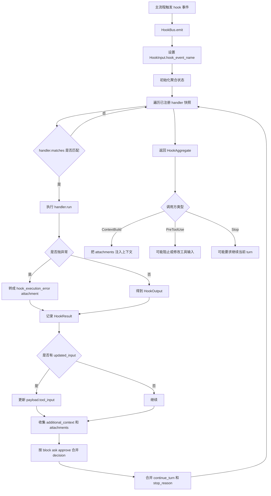
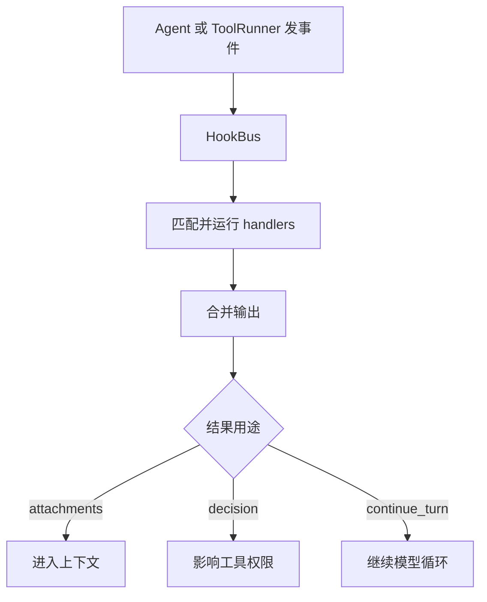

# `bigcode/hooks/` 代码阅读

源码目录：`bigcode/hooks/`

## 这个目录解决什么问题

`hooks/` 提供 BigCode 的生命周期扩展机制。主会话、上下文构建、工具执行、Plan Mode、任务、子代理等关键节点都会触发 hook，hook 可以观察、补充上下文、修改工具输入、阻止工具调用，或者要求模型继续当前 turn。

这个目录的核心思想是：

> 主流程在关键节点发事件，HookBus 按优先级调用 handler，然后把多个 handler 的结果合并成一个最终结果。

## 文件职责

### `models.py`

定义 hook 系统的数据结构：

- `HookEvent`
- `HookDecision`
- `HookInput`
- `HookOutput`
- `HookResult`
- `HookAggregate`

### `bus.py`

定义 hook 分发器：

- `HookHandler`
- `HookBus`

它负责注册 handler、匹配事件、按优先级执行、合并结果。

### `builtins.py`

定义内置 hook：

- `PlanModeContextHook`
- `PlanModeStopHook`
- `TaskReminderHook`
- `CapabilityIndexHook`
- `register_builtin_hooks()`

这些 hook 主要通过 attachment 或 continue_turn 影响模型上下文。

### `command.py`

把用户在 `settings.json` 里配置的外部命令 hook 接入 HookBus。

外部命令通过 stdin 接收 `HookInput` JSON，可以在 stdout 最后输出 JSON 作为 `HookOutput`。

### `__init__.py`

导出常用类型：

- `HookBus`
- `HookInput`
- `HookOutput`
- `HookAggregate`

## 核心数据结构

### `HookEvent`

事件类型包括：

- `SessionStart`
- `UserPromptSubmit`
- `ContextBuild`
- `PreToolUse`
- `PostToolUse`
- `Stop`
- `PlanModeEnter`
- `PlanModeExit`
- `TaskCreated`
- `TaskUpdated`
- `PreCompact`
- `PostCompact`
- `SubagentStart`
- `SubagentStop`
- `CapabilityChanged`

这些名字基本就是 BigCode 主流程的扩展点。

### `HookInput`

hook 输入。

字段：

- `hook_event_name`
- `session_id`
- `cwd`
- `permission_mode`
- `transcript_path`
- `agent_id`
- `payload`

不同事件把自己的额外信息放进 `payload`。

### `HookOutput`

单个 handler 的输出。

字段：

- `decision`：`approve`、`ask`、`block`、`passthrough`
- `reason`
- `updated_input`
- `additional_context`
- `attachments`
- `continue_turn`
- `stop_reason`
- `metadata`

不同事件只会使用其中一部分。例如 `PreToolUse` 会关注 `decision` 和 `updated_input`，`ContextBuild` 会关注 `attachments`。

### `HookAggregate`

多个 hook 输出合并后的结果。

调用方通常只看它，而不用逐个处理每个 hook 结果。

## 关键类和函数

### `HookHandler`

handler 基类。

子类需要声明：

- `name`
- `source`
- `events`
- `priority`

并实现：

- `matches(input)`
- `run(input)`

默认 `matches()` 只按事件名匹配。

### `HookBus.register(handler)`

注册 handler，并按 `priority` 从小到大排序。

优先级小的先运行。

### `HookBus.emit(event, input)`

hook 系统主入口。

它会：

1. 把 `input.hook_event_name` 设置为当前事件。
2. 初始化聚合状态。
3. 遍历 handler 快照。
4. 对匹配的 handler 调 `run()`。
5. 捕获异常并转成 hook 错误 attachment。
6. 记录每个 handler 的耗时和结果。
7. 合并 `updated_input`、`attachments`、`decision`、`continue_turn`。
8. 返回 `HookAggregate`。

决策合并规则很重要：

- `block` 优先级最高。
- `ask` 次之。
- `approve` 只能在当前还是 `passthrough` 时生效。

这保证 hook 之间不会轻易互相放宽安全决策。

## 内置 hook

### `PlanModeContextHook`

监听：

- `ContextBuild`
- `PlanModeExit`

如果 Plan Mode 正在激活，注入提醒：

- 可以读和检查。
- 不能编辑工作区。
- 不能执行变更命令。
- 应把计划写到 plan 文件。
- 应通过 `AskUserQuestion` 或 `ExitPlanMode` 收尾。

如果 Plan Mode 已退出且需要注入批准计划，它会注入一次 approved plan reminder，然后清掉标志。

### `PlanModeStopHook`

监听：

- `Stop`

如果 Plan Mode 仍在激活，且本轮没有调用 `AskUserQuestion` 或 `ExitPlanMode`，它会：

- `continue_turn=True`
- `decision="block"`
- 追加提醒文本

这会让 `AgentSession.run_turn()` 继续下一步模型请求，而不是直接结束。

### `TaskReminderHook`

监听：

- `ContextBuild`

它从 task store 里读取未完成任务，生成一个 attachment，提醒模型当前还有哪些任务。

### `CapabilityIndexHook`

监听：

- `ContextBuild`
- `CapabilityChanged`
- `SessionStart`

当前只在首次 `ContextBuild` 时注入能力索引，例如可加载技能和 MCP 能力。它用 `_injected_sessions` 防止每轮重复注入。

## 命令型 hook

### `CommandHookSpec`

描述一个外部命令 hook：

- `command`
- `timeout`
- `once`
- `status_message`
- `matcher`
- `event`

### `CommandHookHandler`

运行外部命令。

流程：

1. 用 `asyncio.create_subprocess_shell()` 启动命令。
2. 把 `HookInput` JSON 写入 stdin。
3. 等待命令完成，受 `timeout` 限制。
4. 从 stdout 末尾解析最后一个 JSON 对象。
5. 如果解析成功，转成 `HookOutput`。
6. 如果返回码是 2，视为 block。
7. 其它失败转成 hook 错误 attachment。

### `CommandRegistry`

从 settings 解析命令 hook 注册记录。

它会保留 enabled、disabled、failed 三类记录，这样 `doctor` 可以报告配置问题，而不是静默忽略。

## 和其他模块的关系

- `AgentSession.__init__()` 创建 `HookBus`，注册内置 hook 和配置里的命令 hook。
- `AgentSession.start()` 触发 `SessionStart`。
- `AgentSession.run_turn()` 触发 `UserPromptSubmit` 和 `Stop`。
- `context.builder` 触发 `ContextBuild`。
- `ToolRunner.run_one()` 触发 `PreToolUse` 和 `PostToolUse`。
- 子代理启动和停止会触发 `SubagentStart`、`SubagentStop`。

## 阅读建议

先读 `models.py` 明白输入输出结构，再读 `bus.py` 看合并规则，然后读 `builtins.py` 看内置 hook 怎样改变上下文，最后读 `command.py` 看用户配置的外部 hook。

<!-- BEGIN EXTENDED READING NOTES -->

## 超详细源码阅读笔记（扩写版）

这一节是为了把前面的概览扩展成可以逐步跟读源码的版本。
阅读时不要只看结论，要把这里的每个检查点和对应源码放在一起看。
本篇主题是：Hook 扩展系统。
模块职责可以先压缩成一句话：在会话、上下文、工具、停止、任务、子代理等生命周期点注入扩展逻辑。
下面的内容按“定位、符号、入口、数据流、边界、误区、自测”的顺序展开。
如果你是 Python 初学者，建议先读每节第一组短句，再回到源码找同名函数。

### A. 阅读定位

- 这篇文档对应源码：bigcode/hooks/models.py, bigcode/hooks/bus.py, bigcode/hooks/builtins.py, bigcode/hooks/command.py。
- 它在阅读路线里的角色：在会话、上下文、工具、停止、任务、子代理等生命周期点注入扩展逻辑。
- 上游输入主要来自：AgentSession, Context builder, ToolRunner, settings hooks 配置。
- 下游输出或调用对象主要是：上下文 attachments, 工具输入修改, 工具阻止, Stop 继续回合。
- 可以用这个例子追踪：`ContextBuild -> TaskReminderHook -> Attachment -> meta UserMessage`。
- 先读公开入口，再读辅助函数；先读数据结构，再读使用这些结构的流程。
- 遇到以下划线开头的函数，先判断它服务哪个公开函数，不要孤立理解。
- 遇到 dataclass，先把字段含义看懂，再看谁创建它、谁消费它。
- 遇到 BaseModel，先看字段类型，因为字段类型就是工具或 API 的输入约束。
- 遇到 async def，重点看它 await 了谁，这通常就是跨模块调用点。

### B. 源码文件 `bigcode/hooks/models.py` 的结构地图

- 这个文件共有 91 行源码。
- 顶层 class/function 数量是 4。
- 顶层常量数量是 0。
- import/import from 语句数量大约是 3。
- 阅读时可以先折叠函数体，只看顶层符号顺序。
- 顶层符号顺序通常反映作者希望你先理解的数据类型和主入口。

#### 顶层符号阅读

- `class HookInput`：位于第 33-44 行附近。
  - 先看签名和返回值，判断 `HookInput` 是入口、数据模型还是辅助逻辑。
  - 再看它直接读取哪些字段、调用哪些函数、返回什么对象。
  - 如果 `HookInput` 是类，先读字段和构造函数，再读会被外部调用的方法。
  - 如果 `HookInput` 是函数，先找调用方；没有调用方时看是否是导出入口或测试使用。
- `class HookOutput`：位于第 48-60 行附近。
  - 先看签名和返回值，判断 `HookOutput` 是入口、数据模型还是辅助逻辑。
  - 再看它直接读取哪些字段、调用哪些函数、返回什么对象。
  - 如果 `HookOutput` 是类，先读字段和构造函数，再读会被外部调用的方法。
  - 如果 `HookOutput` 是函数，先找调用方；没有调用方时看是否是导出入口或测试使用。
- `class HookResult`：位于第 64-74 行附近。
  - 先看签名和返回值，判断 `HookResult` 是入口、数据模型还是辅助逻辑。
  - 再看它直接读取哪些字段、调用哪些函数、返回什么对象。
  - 如果 `HookResult` 是类，先读字段和构造函数，再读会被外部调用的方法。
  - 如果 `HookResult` 是函数，先找调用方；没有调用方时看是否是导出入口或测试使用。
- `class HookAggregate`：位于第 78-90 行附近。
  - 先看签名和返回值，判断 `HookAggregate` 是入口、数据模型还是辅助逻辑。
  - 再看它直接读取哪些字段、调用哪些函数、返回什么对象。
  - 如果 `HookAggregate` 是类，先读字段和构造函数，再读会被外部调用的方法。
  - 如果 `HookAggregate` 是函数，先找调用方；没有调用方时看是否是导出入口或测试使用。

### B. 源码文件 `bigcode/hooks/bus.py` 的结构地图

- 这个文件共有 118 行源码。
- 顶层 class/function 数量是 2。
- 顶层常量数量是 0。
- import/import from 语句数量大约是 5。
- 阅读时可以先折叠函数体，只看顶层符号顺序。
- 顶层符号顺序通常反映作者希望你先理解的数据类型和主入口。

#### 顶层符号阅读

- `class HookHandler`：位于第 15-32 行附近。
  - 先看签名和返回值，判断 `HookHandler` 是入口、数据模型还是辅助逻辑。
  - 再看它直接读取哪些字段、调用哪些函数、返回什么对象。
  - 如果 `HookHandler` 是类，先读字段和构造函数，再读会被外部调用的方法。
  - 如果 `HookHandler` 是函数，先找调用方；没有调用方时看是否是导出入口或测试使用。
- `class HookBus`：位于第 35-118 行附近。
  - 先看签名和返回值，判断 `HookBus` 是入口、数据模型还是辅助逻辑。
  - 再看它直接读取哪些字段、调用哪些函数、返回什么对象。
  - 如果 `HookBus` 是类，先读字段和构造函数，再读会被外部调用的方法。
  - 如果 `HookBus` 是函数，先找调用方；没有调用方时看是否是导出入口或测试使用。

### B. 源码文件 `bigcode/hooks/builtins.py` 的结构地图

- 这个文件共有 140 行源码。
- 顶层 class/function 数量是 5。
- 顶层常量数量是 0。
- import/import from 语句数量大约是 4。
- 阅读时可以先折叠函数体，只看顶层符号顺序。
- 顶层符号顺序通常反映作者希望你先理解的数据类型和主入口。

#### 顶层符号阅读

- `class PlanModeContextHook`：位于第 13-52 行附近。
  - 先看签名和返回值，判断 `PlanModeContextHook` 是入口、数据模型还是辅助逻辑。
  - 再看它直接读取哪些字段、调用哪些函数、返回什么对象。
  - 如果 `PlanModeContextHook` 是类，先读字段和构造函数，再读会被外部调用的方法。
  - 如果 `PlanModeContextHook` 是函数，先找调用方；没有调用方时看是否是导出入口或测试使用。
- `class PlanModeStopHook`：位于第 55-80 行附近。
  - 先看签名和返回值，判断 `PlanModeStopHook` 是入口、数据模型还是辅助逻辑。
  - 再看它直接读取哪些字段、调用哪些函数、返回什么对象。
  - 如果 `PlanModeStopHook` 是类，先读字段和构造函数，再读会被外部调用的方法。
  - 如果 `PlanModeStopHook` 是函数，先找调用方；没有调用方时看是否是导出入口或测试使用。
- `class TaskReminderHook`：位于第 83-106 行附近。
  - 先看签名和返回值，判断 `TaskReminderHook` 是入口、数据模型还是辅助逻辑。
  - 再看它直接读取哪些字段、调用哪些函数、返回什么对象。
  - 如果 `TaskReminderHook` 是类，先读字段和构造函数，再读会被外部调用的方法。
  - 如果 `TaskReminderHook` 是函数，先找调用方；没有调用方时看是否是导出入口或测试使用。
- `class CapabilityIndexHook`：位于第 109-132 行附近。
  - 先看签名和返回值，判断 `CapabilityIndexHook` 是入口、数据模型还是辅助逻辑。
  - 再看它直接读取哪些字段、调用哪些函数、返回什么对象。
  - 如果 `CapabilityIndexHook` 是类，先读字段和构造函数，再读会被外部调用的方法。
  - 如果 `CapabilityIndexHook` 是函数，先找调用方；没有调用方时看是否是导出入口或测试使用。
- `def register_builtin_hooks`：位于第 135-140 行附近。
  - 先看签名和返回值，判断 `register_builtin_hooks` 是入口、数据模型还是辅助逻辑。
  - 再看它直接读取哪些字段、调用哪些函数、返回什么对象。
  - 如果 `register_builtin_hooks` 是类，先读字段和构造函数，再读会被外部调用的方法。
  - 如果 `register_builtin_hooks` 是函数，先找调用方；没有调用方时看是否是导出入口或测试使用。

### B. 源码文件 `bigcode/hooks/command.py` 的结构地图

- 这个文件共有 348 行源码。
- 顶层 class/function 数量是 10。
- 顶层常量数量是 1。
- import/import from 语句数量大约是 10。
- 阅读时可以先折叠函数体，只看顶层符号顺序。
- 顶层符号顺序通常反映作者希望你先理解的数据类型和主入口。

#### 顶层常量阅读

- `VALID_HOOK_EVENTS` 位于第 20 行附近，通常是规则集合、正则、默认值或白名单。
  - 读 `VALID_HOOK_EVENTS` 时先问：它是安全边界、展示配置，还是业务默认值。
  - 再找哪里引用 `VALID_HOOK_EVENTS`，引用点才说明它真正影响哪个分支。

#### 顶层符号阅读

- `class CommandHookSpec`：位于第 40-51 行附近。
  - 先看签名和返回值，判断 `CommandHookSpec` 是入口、数据模型还是辅助逻辑。
  - 再看它直接读取哪些字段、调用哪些函数、返回什么对象。
  - 如果 `CommandHookSpec` 是类，先读字段和构造函数，再读会被外部调用的方法。
  - 如果 `CommandHookSpec` 是函数，先找调用方；没有调用方时看是否是导出入口或测试使用。
- `class CommandRegistration`：位于第 58-72 行附近。
  - 先看签名和返回值，判断 `CommandRegistration` 是入口、数据模型还是辅助逻辑。
  - 再看它直接读取哪些字段、调用哪些函数、返回什么对象。
  - 如果 `CommandRegistration` 是类，先读字段和构造函数，再读会被外部调用的方法。
  - 如果 `CommandRegistration` 是函数，先找调用方；没有调用方时看是否是导出入口或测试使用。
- `class CommandHookHandler`：位于第 75-138 行附近。
  - 先看签名和返回值，判断 `CommandHookHandler` 是入口、数据模型还是辅助逻辑。
  - 再看它直接读取哪些字段、调用哪些函数、返回什么对象。
  - 如果 `CommandHookHandler` 是类，先读字段和构造函数，再读会被外部调用的方法。
  - 如果 `CommandHookHandler` 是函数，先找调用方；没有调用方时看是否是导出入口或测试使用。
- `class CommandRegistry`：位于第 141-182 行附近。
  - 先看签名和返回值，判断 `CommandRegistry` 是入口、数据模型还是辅助逻辑。
  - 再看它直接读取哪些字段、调用哪些函数、返回什么对象。
  - 如果 `CommandRegistry` 是类，先读字段和构造函数，再读会被外部调用的方法。
  - 如果 `CommandRegistry` 是函数，先找调用方；没有调用方时看是否是导出入口或测试使用。
- `def command_hooks_from_settings`：位于第 185-187 行附近。
  - 先看签名和返回值，判断 `command_hooks_from_settings` 是入口、数据模型还是辅助逻辑。
  - 再看它直接读取哪些字段、调用哪些函数、返回什么对象。
  - 如果 `command_hooks_from_settings` 是类，先读字段和构造函数，再读会被外部调用的方法。
  - 如果 `command_hooks_from_settings` 是函数，先找调用方；没有调用方时看是否是导出入口或测试使用。
- `def _registrations_from_settings`：位于第 190-230 行附近。
  - 先看签名和返回值，判断 `_registrations_from_settings` 是入口、数据模型还是辅助逻辑。
  - 再看它直接读取哪些字段、调用哪些函数、返回什么对象。
  - 如果 `_registrations_from_settings` 是类，先读字段和构造函数，再读会被外部调用的方法。
  - 如果 `_registrations_from_settings` 是函数，先找调用方；没有调用方时看是否是导出入口或测试使用。
- `def _registration_from_raw`：位于第 233-265 行附近。
  - 先看签名和返回值，判断 `_registration_from_raw` 是入口、数据模型还是辅助逻辑。
  - 再看它直接读取哪些字段、调用哪些函数、返回什么对象。
  - 如果 `_registration_from_raw` 是类，先读字段和构造函数，再读会被外部调用的方法。
  - 如果 `_registration_from_raw` 是函数，先找调用方；没有调用方时看是否是导出入口或测试使用。
- `def _unsupported_plugin_commands`：位于第 268-308 行附近。
  - 先看签名和返回值，判断 `_unsupported_plugin_commands` 是入口、数据模型还是辅助逻辑。
  - 再看它直接读取哪些字段、调用哪些函数、返回什么对象。
  - 如果 `_unsupported_plugin_commands` 是类，先读字段和构造函数，再读会被外部调用的方法。
  - 如果 `_unsupported_plugin_commands` 是函数，先找调用方；没有调用方时看是否是导出入口或测试使用。
- `def _registration`：位于第 311-333 行附近。
  - 先看签名和返回值，判断 `_registration` 是入口、数据模型还是辅助逻辑。
  - 再看它直接读取哪些字段、调用哪些函数、返回什么对象。
  - 如果 `_registration` 是类，先读字段和构造函数，再读会被外部调用的方法。
  - 如果 `_registration` 是函数，先找调用方；没有调用方时看是否是导出入口或测试使用。
- `def _parse_last_json`：位于第 336-348 行附近。
  - 先看签名和返回值，判断 `_parse_last_json` 是入口、数据模型还是辅助逻辑。
  - 再看它直接读取哪些字段、调用哪些函数、返回什么对象。
  - 如果 `_parse_last_json` 是类，先读字段和构造函数，再读会被外部调用的方法。
  - 如果 `_parse_last_json` 是函数，先找调用方；没有调用方时看是否是导出入口或测试使用。

### C. 主流程拆解

- 第 1 步：定义 HookInput 和 HookOutput。读这一环节时要确认输入对象是什么、输出对象交给谁。
- 第 2 步：注册 HookHandler。读这一环节时要确认输入对象是什么、输出对象交给谁。
- 第 3 步：HookBus.emit 事件。读这一环节时要确认输入对象是什么、输出对象交给谁。
- 第 4 步：按 priority 执行。读这一环节时要确认输入对象是什么、输出对象交给谁。
- 第 5 步：合并 decision attachments continue_turn。读这一环节时要确认输入对象是什么、输出对象交给谁。

### D. 本篇最应该盯住的源码点

- 关注点 1：block 高于 ask 高于 approve。它通常决定你是否真正理解这个模块的边界。
- 关注点 2：hook 异常转 attachment。它通常决定你是否真正理解这个模块的边界。
- 关注点 3：PreToolUse 可串行改输入。它通常决定你是否真正理解这个模块的边界。
- 关注点 4：PlanModeStopHook 会阻止普通结束。它通常决定你是否真正理解这个模块的边界。
- 关注点 5：command hook 通过 stdin/stdout JSON 通信。它通常决定你是否真正理解这个模块的边界。

### E. 初学者容易误解的点

- 误区 1：以为 hook 失败会中断主流程。读源码时用实际调用链验证，不要只按变量名猜。
- 误区 2：以为 approve 能绕过权限 hard deny。读源码时用实际调用链验证，不要只按变量名猜。
- 误区 3：忽略 priority 顺序。读源码时用实际调用链验证，不要只按变量名猜。
- 误区 4：把 additional_context 和 attachment 当作不同最终通道。读源码时用实际调用链验证，不要只按变量名猜。

### F. 数据流追踪

- 输入侧 1：`AgentSession` 是这个模块可能接收信息的来源。
  - 追踪时先找它在哪个函数参数、对象字段或配置字段中出现。
  - 如果它是外部输入，要继续检查是否有校验、默认值或错误处理。
- 输入侧 2：`Context builder` 是这个模块可能接收信息的来源。
  - 追踪时先找它在哪个函数参数、对象字段或配置字段中出现。
  - 如果它是外部输入，要继续检查是否有校验、默认值或错误处理。
- 输入侧 3：`ToolRunner` 是这个模块可能接收信息的来源。
  - 追踪时先找它在哪个函数参数、对象字段或配置字段中出现。
  - 如果它是外部输入，要继续检查是否有校验、默认值或错误处理。
- 输入侧 4：`settings hooks 配置` 是这个模块可能接收信息的来源。
  - 追踪时先找它在哪个函数参数、对象字段或配置字段中出现。
  - 如果它是外部输入，要继续检查是否有校验、默认值或错误处理。
- 输出侧 1：`上下文 attachments` 是这个模块处理结果的去向。
  - 追踪时看当前模块传递的是原始值、结构化对象，还是已经裁剪过的投影。
  - 如果下游是工具或模型，重点检查安全边界和格式转换。
- 输出侧 2：`工具输入修改` 是这个模块处理结果的去向。
  - 追踪时看当前模块传递的是原始值、结构化对象，还是已经裁剪过的投影。
  - 如果下游是工具或模型，重点检查安全边界和格式转换。
- 输出侧 3：`工具阻止` 是这个模块处理结果的去向。
  - 追踪时看当前模块传递的是原始值、结构化对象，还是已经裁剪过的投影。
  - 如果下游是工具或模型，重点检查安全边界和格式转换。
- 输出侧 4：`Stop 继续回合` 是这个模块处理结果的去向。
  - 追踪时看当前模块传递的是原始值、结构化对象，还是已经裁剪过的投影。
  - 如果下游是工具或模型，重点检查安全边界和格式转换。

### G. 边界情况阅读表

| 01 | `HookInput` | 输入为空时是否有默认值或早返回 | 回到源码确认实际分支，不要用经验推断 |
| 02 | `HookOutput` | 配置项不存在时是报错、降级还是记录 warning | 回到源码确认实际分支，不要用经验推断 |
| 03 | `HookResult` | 外部依赖不可用时是否影响主流程 | 回到源码确认实际分支，不要用经验推断 |
| 04 | `HookAggregate` | 异常是否被捕获并转成结构化结果 | 回到源码确认实际分支，不要用经验推断 |
| 05 | `HookHandler` | 列表为空时返回空列表还是 None | 回到源码确认实际分支，不要用经验推断 |
| 06 | `HookBus` | 路径或名称是否合法是否有校验 | 回到源码确认实际分支，不要用经验推断 |
| 07 | `PlanModeContextHook` | 非交互模式是否会改变行为 | 回到源码确认实际分支，不要用经验推断 |
| 08 | `PlanModeStopHook` | 状态是否会写入 transcript、snapshot 或磁盘文件 | 回到源码确认实际分支，不要用经验推断 |
| 09 | `TaskReminderHook` | 是否存在只读模式、plan 模式或 sandbox 的特殊分支 | 回到源码确认实际分支，不要用经验推断 |
| 10 | `CapabilityIndexHook` | 返回值是否会继续进入模型上下文 | 回到源码确认实际分支，不要用经验推断 |
| 11 | `register_builtin_hooks` | 输入为空时是否有默认值或早返回 | 回到源码确认实际分支，不要用经验推断 |
| 12 | `CommandHookSpec` | 配置项不存在时是报错、降级还是记录 warning | 回到源码确认实际分支，不要用经验推断 |
| 13 | `CommandRegistration` | 外部依赖不可用时是否影响主流程 | 回到源码确认实际分支，不要用经验推断 |
| 14 | `CommandHookHandler` | 异常是否被捕获并转成结构化结果 | 回到源码确认实际分支，不要用经验推断 |
| 15 | `CommandRegistry` | 列表为空时返回空列表还是 None | 回到源码确认实际分支，不要用经验推断 |
| 16 | `command_hooks_from_settings` | 路径或名称是否合法是否有校验 | 回到源码确认实际分支，不要用经验推断 |
| 17 | `_registrations_from_settings` | 非交互模式是否会改变行为 | 回到源码确认实际分支，不要用经验推断 |
| 18 | `_registration_from_raw` | 状态是否会写入 transcript、snapshot 或磁盘文件 | 回到源码确认实际分支，不要用经验推断 |
| 19 | `_unsupported_plugin_commands` | 是否存在只读模式、plan 模式或 sandbox 的特殊分支 | 回到源码确认实际分支，不要用经验推断 |
| 20 | `_registration` | 返回值是否会继续进入模型上下文 | 回到源码确认实际分支，不要用经验推断 |
| 21 | `_parse_last_json` | 输入为空时是否有默认值或早返回 | 回到源码确认实际分支，不要用经验推断 |
| 22 | `HookInput` | 配置项不存在时是报错、降级还是记录 warning | 回到源码确认实际分支，不要用经验推断 |
| 23 | `HookOutput` | 外部依赖不可用时是否影响主流程 | 回到源码确认实际分支，不要用经验推断 |
| 24 | `HookResult` | 异常是否被捕获并转成结构化结果 | 回到源码确认实际分支，不要用经验推断 |
| 25 | `HookAggregate` | 列表为空时返回空列表还是 None | 回到源码确认实际分支，不要用经验推断 |
| 26 | `HookHandler` | 路径或名称是否合法是否有校验 | 回到源码确认实际分支，不要用经验推断 |
| 27 | `HookBus` | 非交互模式是否会改变行为 | 回到源码确认实际分支，不要用经验推断 |
| 28 | `PlanModeContextHook` | 状态是否会写入 transcript、snapshot 或磁盘文件 | 回到源码确认实际分支，不要用经验推断 |
| 29 | `PlanModeStopHook` | 是否存在只读模式、plan 模式或 sandbox 的特殊分支 | 回到源码确认实际分支，不要用经验推断 |
| 30 | `TaskReminderHook` | 返回值是否会继续进入模型上下文 | 回到源码确认实际分支，不要用经验推断 |
| 31 | `CapabilityIndexHook` | 输入为空时是否有默认值或早返回 | 回到源码确认实际分支，不要用经验推断 |
| 32 | `register_builtin_hooks` | 配置项不存在时是报错、降级还是记录 warning | 回到源码确认实际分支，不要用经验推断 |
| 33 | `CommandHookSpec` | 外部依赖不可用时是否影响主流程 | 回到源码确认实际分支，不要用经验推断 |
| 34 | `CommandRegistration` | 异常是否被捕获并转成结构化结果 | 回到源码确认实际分支，不要用经验推断 |
| 35 | `CommandHookHandler` | 列表为空时返回空列表还是 None | 回到源码确认实际分支，不要用经验推断 |
| 36 | `CommandRegistry` | 路径或名称是否合法是否有校验 | 回到源码确认实际分支，不要用经验推断 |
| 37 | `command_hooks_from_settings` | 非交互模式是否会改变行为 | 回到源码确认实际分支，不要用经验推断 |
| 38 | `_registrations_from_settings` | 状态是否会写入 transcript、snapshot 或磁盘文件 | 回到源码确认实际分支，不要用经验推断 |
| 39 | `_registration_from_raw` | 是否存在只读模式、plan 模式或 sandbox 的特殊分支 | 回到源码确认实际分支，不要用经验推断 |
| 40 | `_unsupported_plugin_commands` | 返回值是否会继续进入模型上下文 | 回到源码确认实际分支，不要用经验推断 |
| 41 | `_registration` | 输入为空时是否有默认值或早返回 | 回到源码确认实际分支，不要用经验推断 |
| 42 | `_parse_last_json` | 配置项不存在时是报错、降级还是记录 warning | 回到源码确认实际分支，不要用经验推断 |
| 43 | `HookInput` | 外部依赖不可用时是否影响主流程 | 回到源码确认实际分支，不要用经验推断 |
| 44 | `HookOutput` | 异常是否被捕获并转成结构化结果 | 回到源码确认实际分支，不要用经验推断 |
| 45 | `HookResult` | 列表为空时返回空列表还是 None | 回到源码确认实际分支，不要用经验推断 |
| 46 | `HookAggregate` | 路径或名称是否合法是否有校验 | 回到源码确认实际分支，不要用经验推断 |
| 47 | `HookHandler` | 非交互模式是否会改变行为 | 回到源码确认实际分支，不要用经验推断 |
| 48 | `HookBus` | 状态是否会写入 transcript、snapshot 或磁盘文件 | 回到源码确认实际分支，不要用经验推断 |
| 49 | `PlanModeContextHook` | 是否存在只读模式、plan 模式或 sandbox 的特殊分支 | 回到源码确认实际分支，不要用经验推断 |
| 50 | `PlanModeStopHook` | 返回值是否会继续进入模型上下文 | 回到源码确认实际分支，不要用经验推断 |
| 51 | `TaskReminderHook` | 输入为空时是否有默认值或早返回 | 回到源码确认实际分支，不要用经验推断 |
| 52 | `CapabilityIndexHook` | 配置项不存在时是报错、降级还是记录 warning | 回到源码确认实际分支，不要用经验推断 |
| 53 | `register_builtin_hooks` | 外部依赖不可用时是否影响主流程 | 回到源码确认实际分支，不要用经验推断 |
| 54 | `CommandHookSpec` | 异常是否被捕获并转成结构化结果 | 回到源码确认实际分支，不要用经验推断 |
| 55 | `CommandRegistration` | 列表为空时返回空列表还是 None | 回到源码确认实际分支，不要用经验推断 |
| 56 | `CommandHookHandler` | 路径或名称是否合法是否有校验 | 回到源码确认实际分支，不要用经验推断 |
| 57 | `CommandRegistry` | 非交互模式是否会改变行为 | 回到源码确认实际分支，不要用经验推断 |
| 58 | `command_hooks_from_settings` | 状态是否会写入 transcript、snapshot 或磁盘文件 | 回到源码确认实际分支，不要用经验推断 |
| 59 | `_registrations_from_settings` | 是否存在只读模式、plan 模式或 sandbox 的特殊分支 | 回到源码确认实际分支，不要用经验推断 |
| 60 | `_registration_from_raw` | 返回值是否会继续进入模型上下文 | 回到源码确认实际分支，不要用经验推断 |

### H. 与阅读路线的衔接

- 读完 `Hook 扩展系统` 后，回到 `doc/CodeReadingGuide.md` 看它处在哪一阶段。
- 如果它的上游是 AgentSession，就从上游重新走一次调用链。
- 如果它的下游是 上下文 attachments，就继续读下游如何消费当前模块的输出。
- 不要只背函数名；真正的理解是能说清数据对象怎样跨文件移动。
- 当你能画出自己的简图，再对照文末两个流程图，说明这一篇基本读通了。

## 详细流程图

## 核心流程图

