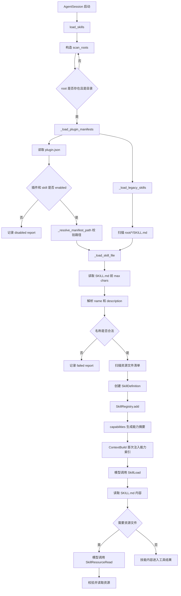
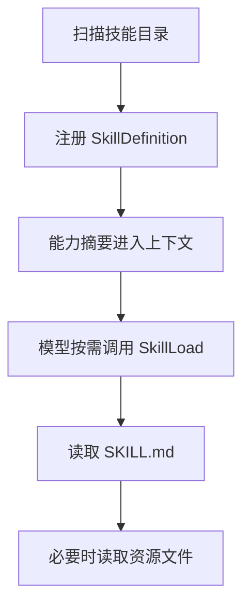

# `bigcode/skills/` 代码阅读

源码目录：`bigcode/skills/`

## 这个目录解决什么问题

`skills/` 负责扫描、注册和读取技能。技能本质上是一组本地 Markdown 指令和资源文件，模型可以按需加载它们来获得特定任务的操作指南。

这个模块的关键设计是：

> 启动时只扫描技能元信息和资源清单，不把所有 SKILL.md 都塞进模型上下文。模型需要某个技能时，再调用 `SkillLoad` 读取内容。

这样能避免上下文被大量技能说明撑爆。

## 文件职责

### `models.py`

定义技能数据模型：

- `SkillDefinition`
- `SkillLoadReport`

### `loader.py`

扫描技能根目录，支持两种来源：

- 传统结构：`skills/<name>/SKILL.md`
- 插件 manifest：`*/.codex-plugin/plugin.json` 中声明的 skills

它还会加载内置技能目录 `bigcode/skills/builtin/`。

### `tools.py`

把技能能力暴露成模型可调用工具：

- `SkillLoad`
- `SkillResourceRead`

### `__init__.py`

导出：

- `SkillRegistry`
- `load_skills`

### `builtin/`

内置技能目录，当前有：

- `code-review`
- `test-debug`
- `repo-map`

## 核心数据结构

### `SkillDefinition`

一个已注册技能。

字段：

- `name`
- `root`
- `skill_md`
- `description`
- `resources`
- `source`
- `plugin_name`

`resources` 是技能目录下除了 `SKILL.md` 之外的附加文件相对路径列表。

### `SkillLoadReport`

扫描过程报告。

字段：

- `name`
- `status`：`enabled`、`disabled`、`failed`
- `source`
- `path`
- `reason`
- `plugin_name`

即使技能加载失败，也会生成 report，方便 `doctor` 展示问题。

### `SkillRegistry`

运行时技能注册表。

内部保存：

- `_skills`
- `errors`
- `reports`

主要方法：

- `add(skill)`
- `add_report(report)`
- `get(name)`
- `list()`
- `capabilities()`
- `status_counts()`

`capabilities()` 会生成给模型看的能力摘要，例如 `Skill xxx: description`。

## 关键函数逐段讲解

### `load_skills(roots, max_skill_md_chars=20000, include_builtin=True)`

技能扫描主入口。

流程：

1. 创建空 `SkillRegistry`。
2. 如果 `include_builtin=True`，把内置技能根目录放到扫描列表最前面。
3. 遍历所有 root。
4. 跳过不存在或非目录路径。
5. 调 `_load_plugin_manifests()` 扫插件技能。
6. 调 `_load_legacy_skills()` 扫传统技能。
7. 返回 registry。

### `_load_plugin_manifests(root, registry, max_skill_md_chars)`

扫描 `*/.codex-plugin/plugin.json`。

它会：

- 读取 manifest。
- 检查插件是否 enabled。
- 读取 manifest 的 `skills` 列表。
- 对每个 skill entry 检查 `enabled`、`name`、`path`、`description`。
- 用 `_resolve_manifest_path()` 确认路径必须留在 plugin root 内。
- 调 `_load_skill_file()` 加载具体 `SKILL.md`。

如果配置错误，不会中断整个扫描，只会记录 failed report。

### `_load_legacy_skills(root, registry, max_skill_md_chars)`

扫描传统结构：

```text
root/<skill-name>/SKILL.md
```

如果目录同时有 `.codex-plugin/plugin.json`，说明它是插件，跳过传统加载，避免重复。

### `_load_skill_file(...)`

读取和校验单个 `SKILL.md`。

步骤：

1. 解析 `skill_root` 和 `real_md`。
2. 确认 `SKILL.md` 真实路径在技能目录里。
3. 读取前 `max_skill_md_chars` 字符。
4. 确定技能名：override、frontmatter `name`、目录名。
5. 校验名称正则。
6. 确定描述：override、frontmatter `description`、第一行非空文本。
7. 扫描资源文件清单。
8. 创建 `SkillDefinition` 并注册。

这里不会读取资源文件内容，只列路径。

### `_resolve_manifest_path(plugin_root, rel_path)`

解析插件 manifest 中的技能路径。

安全规则：

- 不能是绝对路径。
- 不能包含 `..`。
- 必须 stay inside plugin root。
- 如果指向目录，就自动找该目录下的 `SKILL.md`。
- 最终文件名必须是 `SKILL.md`。

### `_frontmatter_value(text, key)`

从 Markdown frontmatter 里取 `name` 或 `description`。

实现简单，只处理 `key: value` 格式。

### `SkillLoadTool`

工具名：`SkillLoad`

输入：

- `name`
- `max_chars`

执行流程：

1. 从 `ctx.skill_registry` 查技能。
2. 找不到时给出相近名称提示。
3. 读取完整 `SKILL.md`。
4. 按 `max_chars` 截断。
5. 返回技能名、内容、资源清单、是否截断。

### `SkillResourceReadTool`

工具名：`SkillResourceRead`

输入：

- `name`
- `resource_path`

安全规则：

- resource path 不能是绝对路径。
- 不能包含 `..`。
- 文件名不能是敏感名称。
- resolve 后必须在技能 root 内。
- 必须是普通文件。

通过后读取资源文件文本。

## 和其他模块的关系

- `AgentSession.__init__()` 调 `load_skills(config.skill_roots)`。
- `AgentSession._capabilities()` 把技能能力摘要注入 `ContextBuild`。
- `CapabilityIndexHook` 首次上下文构建时提醒模型可加载技能。
- `ToolRegistry` 注册 `SkillLoadTool` 和 `SkillResourceReadTool`。
- `ToolRunner` 在 `SkillLoad` 成功后调用 `record_loaded_skill()` 写入会话快照。
- 权限系统对 `permission_category="skill"` 默认允许注册技能访问。

## 阅读建议

先读 `load_skills()`，再读 `_load_skill_file()`。理解“扫描只建索引，读取通过工具按需发生”这一点后，再读 `tools.py` 会很顺。

<!-- BEGIN EXTENDED READING NOTES -->

## 超详细源码阅读笔记（扩写版）

这一节是为了把前面的概览扩展成可以逐步跟读源码的版本。
阅读时不要只看结论，要把这里的每个检查点和对应源码放在一起看。
本篇主题是：Skill 加载系统。
模块职责可以先压缩成一句话：扫描本地和插件技能，建立索引，并通过工具按需读取 SKILL.md 与资源文件。
下面的内容按“定位、符号、入口、数据流、边界、误区、自测”的顺序展开。
如果你是 Python 初学者，建议先读每节第一组短句，再回到源码找同名函数。

### A. 阅读定位

- 这篇文档对应源码：bigcode/skills/models.py, bigcode/skills/loader.py, bigcode/skills/tools.py。
- 它在阅读路线里的角色：扫描本地和插件技能，建立索引，并通过工具按需读取 SKILL.md 与资源文件。
- 上游输入主要来自：RuntimeConfig.skill_roots, AgentSession 初始化, 内置技能目录。
- 下游输出或调用对象主要是：CapabilityIndexHook, SkillLoadTool, SkillResourceReadTool, snapshot loaded_skills。
- 可以用这个例子追踪：`Skill repo-map 被能力索引提示后，模型调用 SkillLoad 读取具体说明`。
- 先读公开入口，再读辅助函数；先读数据结构，再读使用这些结构的流程。
- 遇到以下划线开头的函数，先判断它服务哪个公开函数，不要孤立理解。
- 遇到 dataclass，先把字段含义看懂，再看谁创建它、谁消费它。
- 遇到 BaseModel，先看字段类型，因为字段类型就是工具或 API 的输入约束。
- 遇到 async def，重点看它 await 了谁，这通常就是跨模块调用点。

### B. 源码文件 `bigcode/skills/models.py` 的结构地图

- 这个文件共有 41 行源码。
- 顶层 class/function 数量是 2。
- 顶层常量数量是 0。
- import/import from 语句数量大约是 4。
- 阅读时可以先折叠函数体，只看顶层符号顺序。
- 顶层符号顺序通常反映作者希望你先理解的数据类型和主入口。

#### 顶层符号阅读

- `class SkillDefinition`：位于第 13-24 行附近。
  - 先看签名和返回值，判断 `SkillDefinition` 是入口、数据模型还是辅助逻辑。
  - 再看它直接读取哪些字段、调用哪些函数、返回什么对象。
  - 如果 `SkillDefinition` 是类，先读字段和构造函数，再读会被外部调用的方法。
  - 如果 `SkillDefinition` 是函数，先找调用方；没有调用方时看是否是导出入口或测试使用。
- `class SkillLoadReport`：位于第 31-41 行附近。
  - 先看签名和返回值，判断 `SkillLoadReport` 是入口、数据模型还是辅助逻辑。
  - 再看它直接读取哪些字段、调用哪些函数、返回什么对象。
  - 如果 `SkillLoadReport` 是类，先读字段和构造函数，再读会被外部调用的方法。
  - 如果 `SkillLoadReport` 是函数，先找调用方；没有调用方时看是否是导出入口或测试使用。

### B. 源码文件 `bigcode/skills/loader.py` 的结构地图

- 这个文件共有 258 行源码。
- 顶层 class/function 数量是 12。
- 顶层常量数量是 2。
- import/import from 语句数量大约是 6。
- 阅读时可以先折叠函数体，只看顶层符号顺序。
- 顶层符号顺序通常反映作者希望你先理解的数据类型和主入口。

#### 顶层常量阅读

- `SKILL_NAME_RE` 位于第 16 行附近，通常是规则集合、正则、默认值或白名单。
  - 读 `SKILL_NAME_RE` 时先问：它是安全边界、展示配置，还是业务默认值。
  - 再找哪里引用 `SKILL_NAME_RE`，引用点才说明它真正影响哪个分支。
- `BUILTIN_SKILL_ROOT` 位于第 17 行附近，通常是规则集合、正则、默认值或白名单。
  - 读 `BUILTIN_SKILL_ROOT` 时先问：它是安全边界、展示配置，还是业务默认值。
  - 再找哪里引用 `BUILTIN_SKILL_ROOT`，引用点才说明它真正影响哪个分支。

#### 顶层符号阅读

- `class SkillRegistry`：位于第 20-64 行附近。
  - 先看签名和返回值，判断 `SkillRegistry` 是入口、数据模型还是辅助逻辑。
  - 再看它直接读取哪些字段、调用哪些函数、返回什么对象。
  - 如果 `SkillRegistry` 是类，先读字段和构造函数，再读会被外部调用的方法。
  - 如果 `SkillRegistry` 是函数，先找调用方；没有调用方时看是否是导出入口或测试使用。
- `def load_skills`：位于第 67-76 行附近。
  - 先看签名和返回值，判断 `load_skills` 是入口、数据模型还是辅助逻辑。
  - 再看它直接读取哪些字段、调用哪些函数、返回什么对象。
  - 如果 `load_skills` 是类，先读字段和构造函数，再读会被外部调用的方法。
  - 如果 `load_skills` 是函数，先找调用方；没有调用方时看是否是导出入口或测试使用。
- `def _load_plugin_manifests`：位于第 79-140 行附近。
  - 先看签名和返回值，判断 `_load_plugin_manifests` 是入口、数据模型还是辅助逻辑。
  - 再看它直接读取哪些字段、调用哪些函数、返回什么对象。
  - 如果 `_load_plugin_manifests` 是类，先读字段和构造函数，再读会被外部调用的方法。
  - 如果 `_load_plugin_manifests` 是函数，先找调用方；没有调用方时看是否是导出入口或测试使用。
- `def _load_legacy_skills`：位于第 143-148 行附近。
  - 先看签名和返回值，判断 `_load_legacy_skills` 是入口、数据模型还是辅助逻辑。
  - 再看它直接读取哪些字段、调用哪些函数、返回什么对象。
  - 如果 `_load_legacy_skills` 是类，先读字段和构造函数，再读会被外部调用的方法。
  - 如果 `_load_legacy_skills` 是函数，先找调用方；没有调用方时看是否是导出入口或测试使用。
- `def _load_skill_file`：位于第 151-195 行附近。
  - 先看签名和返回值，判断 `_load_skill_file` 是入口、数据模型还是辅助逻辑。
  - 再看它直接读取哪些字段、调用哪些函数、返回什么对象。
  - 如果 `_load_skill_file` 是类，先读字段和构造函数，再读会被外部调用的方法。
  - 如果 `_load_skill_file` 是函数，先找调用方；没有调用方时看是否是导出入口或测试使用。
- `def _resolve_manifest_path`：位于第 198-210 行附近。
  - 先看签名和返回值，判断 `_resolve_manifest_path` 是入口、数据模型还是辅助逻辑。
  - 再看它直接读取哪些字段、调用哪些函数、返回什么对象。
  - 如果 `_resolve_manifest_path` 是类，先读字段和构造函数，再读会被外部调用的方法。
  - 如果 `_resolve_manifest_path` 是函数，先找调用方；没有调用方时看是否是导出入口或测试使用。
- `def _frontmatter_value`：位于第 213-225 行附近。
  - 先看签名和返回值，判断 `_frontmatter_value` 是入口、数据模型还是辅助逻辑。
  - 再看它直接读取哪些字段、调用哪些函数、返回什么对象。
  - 如果 `_frontmatter_value` 是类，先读字段和构造函数，再读会被外部调用的方法。
  - 如果 `_frontmatter_value` 是函数，先找调用方；没有调用方时看是否是导出入口或测试使用。
- `def _first_nonempty_line`：位于第 228-234 行附近。
  - 先看签名和返回值，判断 `_first_nonempty_line` 是入口、数据模型还是辅助逻辑。
  - 再看它直接读取哪些字段、调用哪些函数、返回什么对象。
  - 如果 `_first_nonempty_line` 是类，先读字段和构造函数，再读会被外部调用的方法。
  - 如果 `_first_nonempty_line` 是函数，先找调用方；没有调用方时看是否是导出入口或测试使用。
- `def _safe_child`：位于第 237-243 行附近。
  - 先看签名和返回值，判断 `_safe_child` 是入口、数据模型还是辅助逻辑。
  - 再看它直接读取哪些字段、调用哪些函数、返回什么对象。
  - 如果 `_safe_child` 是类，先读字段和构造函数，再读会被外部调用的方法。
  - 如果 `_safe_child` 是函数，先找调用方；没有调用方时看是否是导出入口或测试使用。
- `def _is_enabled`：位于第 246-248 行附近。
  - 先看签名和返回值，判断 `_is_enabled` 是入口、数据模型还是辅助逻辑。
  - 再看它直接读取哪些字段、调用哪些函数、返回什么对象。
  - 如果 `_is_enabled` 是类，先读字段和构造函数，再读会被外部调用的方法。
  - 如果 `_is_enabled` 是函数，先找调用方；没有调用方时看是否是导出入口或测试使用。
- `def _string_value`：位于第 251-253 行附近。
  - 先看签名和返回值，判断 `_string_value` 是入口、数据模型还是辅助逻辑。
  - 再看它直接读取哪些字段、调用哪些函数、返回什么对象。
  - 如果 `_string_value` 是类，先读字段和构造函数，再读会被外部调用的方法。
  - 如果 `_string_value` 是函数，先找调用方；没有调用方时看是否是导出入口或测试使用。
- `def _failed_report`：位于第 256-258 行附近。
  - 先看签名和返回值，判断 `_failed_report` 是入口、数据模型还是辅助逻辑。
  - 再看它直接读取哪些字段、调用哪些函数、返回什么对象。
  - 如果 `_failed_report` 是类，先读字段和构造函数，再读会被外部调用的方法。
  - 如果 `_failed_report` 是函数，先找调用方；没有调用方时看是否是导出入口或测试使用。

### B. 源码文件 `bigcode/skills/tools.py` 的结构地图

- 这个文件共有 99 行源码。
- 顶层 class/function 数量是 4。
- 顶层常量数量是 0。
- import/import from 语句数量大约是 6。
- 阅读时可以先折叠函数体，只看顶层符号顺序。
- 顶层符号顺序通常反映作者希望你先理解的数据类型和主入口。

#### 顶层符号阅读

- `class SkillLoadInput`：位于第 16-22 行附近。
  - 先看签名和返回值，判断 `SkillLoadInput` 是入口、数据模型还是辅助逻辑。
  - 再看它直接读取哪些字段、调用哪些函数、返回什么对象。
  - 如果 `SkillLoadInput` 是类，先读字段和构造函数，再读会被外部调用的方法。
  - 如果 `SkillLoadInput` 是函数，先找调用方；没有调用方时看是否是导出入口或测试使用。
- `class SkillResourceReadInput`：位于第 25-31 行附近。
  - 先看签名和返回值，判断 `SkillResourceReadInput` 是入口、数据模型还是辅助逻辑。
  - 再看它直接读取哪些字段、调用哪些函数、返回什么对象。
  - 如果 `SkillResourceReadInput` 是类，先读字段和构造函数，再读会被外部调用的方法。
  - 如果 `SkillResourceReadInput` 是函数，先找调用方；没有调用方时看是否是导出入口或测试使用。
- `class SkillLoadTool`：位于第 34-64 行附近。
  - 先看签名和返回值，判断 `SkillLoadTool` 是入口、数据模型还是辅助逻辑。
  - 再看它直接读取哪些字段、调用哪些函数、返回什么对象。
  - 如果 `SkillLoadTool` 是类，先读字段和构造函数，再读会被外部调用的方法。
  - 如果 `SkillLoadTool` 是函数，先找调用方；没有调用方时看是否是导出入口或测试使用。
- `class SkillResourceReadTool`：位于第 67-99 行附近。
  - 先看签名和返回值，判断 `SkillResourceReadTool` 是入口、数据模型还是辅助逻辑。
  - 再看它直接读取哪些字段、调用哪些函数、返回什么对象。
  - 如果 `SkillResourceReadTool` 是类，先读字段和构造函数，再读会被外部调用的方法。
  - 如果 `SkillResourceReadTool` 是函数，先找调用方；没有调用方时看是否是导出入口或测试使用。

### C. 主流程拆解

- 第 1 步：load_skills 扫 roots。读这一环节时要确认输入对象是什么、输出对象交给谁。
- 第 2 步：加载插件 manifest。读这一环节时要确认输入对象是什么、输出对象交给谁。
- 第 3 步：加载传统 SKILL.md。读这一环节时要确认输入对象是什么、输出对象交给谁。
- 第 4 步：生成 SkillDefinition。读这一环节时要确认输入对象是什么、输出对象交给谁。
- 第 5 步：capabilities 提示模型。读这一环节时要确认输入对象是什么、输出对象交给谁。
- 第 6 步：SkillLoad 按需读取。读这一环节时要确认输入对象是什么、输出对象交给谁。

### D. 本篇最应该盯住的源码点

- 关注点 1：扫描阶段只读元信息。它通常决定你是否真正理解这个模块的边界。
- 关注点 2：resources 只列路径不读内容。它通常决定你是否真正理解这个模块的边界。
- 关注点 3：插件路径必须 stay inside root。它通常决定你是否真正理解这个模块的边界。
- 关注点 4：SkillResourceRead 防止 .. 和敏感文件。它通常决定你是否真正理解这个模块的边界。
- 关注点 5：SkillLoad 成功会记录 loaded_skills。它通常决定你是否真正理解这个模块的边界。

### E. 初学者容易误解的点

- 误区 1：以为启动时加载全部 SKILL.md 到上下文。读源码时用实际调用链验证，不要只按变量名猜。
- 误区 2：忽略 disabled 和 failed report。读源码时用实际调用链验证，不要只按变量名猜。
- 误区 3：把 plugin skill 和 legacy skill 重复加载。读源码时用实际调用链验证，不要只按变量名猜。
- 误区 4：忘记资源读取仍要安全校验。读源码时用实际调用链验证，不要只按变量名猜。

### F. 数据流追踪

- 输入侧 1：`RuntimeConfig.skill_roots` 是这个模块可能接收信息的来源。
  - 追踪时先找它在哪个函数参数、对象字段或配置字段中出现。
  - 如果它是外部输入，要继续检查是否有校验、默认值或错误处理。
- 输入侧 2：`AgentSession 初始化` 是这个模块可能接收信息的来源。
  - 追踪时先找它在哪个函数参数、对象字段或配置字段中出现。
  - 如果它是外部输入，要继续检查是否有校验、默认值或错误处理。
- 输入侧 3：`内置技能目录` 是这个模块可能接收信息的来源。
  - 追踪时先找它在哪个函数参数、对象字段或配置字段中出现。
  - 如果它是外部输入，要继续检查是否有校验、默认值或错误处理。
- 输出侧 1：`CapabilityIndexHook` 是这个模块处理结果的去向。
  - 追踪时看当前模块传递的是原始值、结构化对象，还是已经裁剪过的投影。
  - 如果下游是工具或模型，重点检查安全边界和格式转换。
- 输出侧 2：`SkillLoadTool` 是这个模块处理结果的去向。
  - 追踪时看当前模块传递的是原始值、结构化对象，还是已经裁剪过的投影。
  - 如果下游是工具或模型，重点检查安全边界和格式转换。
- 输出侧 3：`SkillResourceReadTool` 是这个模块处理结果的去向。
  - 追踪时看当前模块传递的是原始值、结构化对象，还是已经裁剪过的投影。
  - 如果下游是工具或模型，重点检查安全边界和格式转换。
- 输出侧 4：`snapshot loaded_skills` 是这个模块处理结果的去向。
  - 追踪时看当前模块传递的是原始值、结构化对象，还是已经裁剪过的投影。
  - 如果下游是工具或模型，重点检查安全边界和格式转换。

### G. 边界情况阅读表

| 01 | `SkillDefinition` | 输入为空时是否有默认值或早返回 | 回到源码确认实际分支，不要用经验推断 |
| 02 | `SkillLoadReport` | 配置项不存在时是报错、降级还是记录 warning | 回到源码确认实际分支，不要用经验推断 |
| 03 | `SkillRegistry` | 外部依赖不可用时是否影响主流程 | 回到源码确认实际分支，不要用经验推断 |
| 04 | `load_skills` | 异常是否被捕获并转成结构化结果 | 回到源码确认实际分支，不要用经验推断 |
| 05 | `_load_plugin_manifests` | 列表为空时返回空列表还是 None | 回到源码确认实际分支，不要用经验推断 |
| 06 | `_load_legacy_skills` | 路径或名称是否合法是否有校验 | 回到源码确认实际分支，不要用经验推断 |
| 07 | `_load_skill_file` | 非交互模式是否会改变行为 | 回到源码确认实际分支，不要用经验推断 |
| 08 | `_resolve_manifest_path` | 状态是否会写入 transcript、snapshot 或磁盘文件 | 回到源码确认实际分支，不要用经验推断 |
| 09 | `_frontmatter_value` | 是否存在只读模式、plan 模式或 sandbox 的特殊分支 | 回到源码确认实际分支，不要用经验推断 |
| 10 | `_first_nonempty_line` | 返回值是否会继续进入模型上下文 | 回到源码确认实际分支，不要用经验推断 |
| 11 | `_safe_child` | 输入为空时是否有默认值或早返回 | 回到源码确认实际分支，不要用经验推断 |
| 12 | `_is_enabled` | 配置项不存在时是报错、降级还是记录 warning | 回到源码确认实际分支，不要用经验推断 |
| 13 | `_string_value` | 外部依赖不可用时是否影响主流程 | 回到源码确认实际分支，不要用经验推断 |
| 14 | `_failed_report` | 异常是否被捕获并转成结构化结果 | 回到源码确认实际分支，不要用经验推断 |
| 15 | `SkillLoadInput` | 列表为空时返回空列表还是 None | 回到源码确认实际分支，不要用经验推断 |
| 16 | `SkillResourceReadInput` | 路径或名称是否合法是否有校验 | 回到源码确认实际分支，不要用经验推断 |
| 17 | `SkillLoadTool` | 非交互模式是否会改变行为 | 回到源码确认实际分支，不要用经验推断 |
| 18 | `SkillResourceReadTool` | 状态是否会写入 transcript、snapshot 或磁盘文件 | 回到源码确认实际分支，不要用经验推断 |
| 19 | `SkillDefinition` | 是否存在只读模式、plan 模式或 sandbox 的特殊分支 | 回到源码确认实际分支，不要用经验推断 |
| 20 | `SkillLoadReport` | 返回值是否会继续进入模型上下文 | 回到源码确认实际分支，不要用经验推断 |
| 21 | `SkillRegistry` | 输入为空时是否有默认值或早返回 | 回到源码确认实际分支，不要用经验推断 |
| 22 | `load_skills` | 配置项不存在时是报错、降级还是记录 warning | 回到源码确认实际分支，不要用经验推断 |
| 23 | `_load_plugin_manifests` | 外部依赖不可用时是否影响主流程 | 回到源码确认实际分支，不要用经验推断 |
| 24 | `_load_legacy_skills` | 异常是否被捕获并转成结构化结果 | 回到源码确认实际分支，不要用经验推断 |
| 25 | `_load_skill_file` | 列表为空时返回空列表还是 None | 回到源码确认实际分支，不要用经验推断 |
| 26 | `_resolve_manifest_path` | 路径或名称是否合法是否有校验 | 回到源码确认实际分支，不要用经验推断 |
| 27 | `_frontmatter_value` | 非交互模式是否会改变行为 | 回到源码确认实际分支，不要用经验推断 |
| 28 | `_first_nonempty_line` | 状态是否会写入 transcript、snapshot 或磁盘文件 | 回到源码确认实际分支，不要用经验推断 |
| 29 | `_safe_child` | 是否存在只读模式、plan 模式或 sandbox 的特殊分支 | 回到源码确认实际分支，不要用经验推断 |
| 30 | `_is_enabled` | 返回值是否会继续进入模型上下文 | 回到源码确认实际分支，不要用经验推断 |
| 31 | `_string_value` | 输入为空时是否有默认值或早返回 | 回到源码确认实际分支，不要用经验推断 |
| 32 | `_failed_report` | 配置项不存在时是报错、降级还是记录 warning | 回到源码确认实际分支，不要用经验推断 |
| 33 | `SkillLoadInput` | 外部依赖不可用时是否影响主流程 | 回到源码确认实际分支，不要用经验推断 |
| 34 | `SkillResourceReadInput` | 异常是否被捕获并转成结构化结果 | 回到源码确认实际分支，不要用经验推断 |
| 35 | `SkillLoadTool` | 列表为空时返回空列表还是 None | 回到源码确认实际分支，不要用经验推断 |
| 36 | `SkillResourceReadTool` | 路径或名称是否合法是否有校验 | 回到源码确认实际分支，不要用经验推断 |
| 37 | `SkillDefinition` | 非交互模式是否会改变行为 | 回到源码确认实际分支，不要用经验推断 |
| 38 | `SkillLoadReport` | 状态是否会写入 transcript、snapshot 或磁盘文件 | 回到源码确认实际分支，不要用经验推断 |
| 39 | `SkillRegistry` | 是否存在只读模式、plan 模式或 sandbox 的特殊分支 | 回到源码确认实际分支，不要用经验推断 |
| 40 | `load_skills` | 返回值是否会继续进入模型上下文 | 回到源码确认实际分支，不要用经验推断 |
| 41 | `_load_plugin_manifests` | 输入为空时是否有默认值或早返回 | 回到源码确认实际分支，不要用经验推断 |
| 42 | `_load_legacy_skills` | 配置项不存在时是报错、降级还是记录 warning | 回到源码确认实际分支，不要用经验推断 |
| 43 | `_load_skill_file` | 外部依赖不可用时是否影响主流程 | 回到源码确认实际分支，不要用经验推断 |
| 44 | `_resolve_manifest_path` | 异常是否被捕获并转成结构化结果 | 回到源码确认实际分支，不要用经验推断 |
| 45 | `_frontmatter_value` | 列表为空时返回空列表还是 None | 回到源码确认实际分支，不要用经验推断 |
| 46 | `_first_nonempty_line` | 路径或名称是否合法是否有校验 | 回到源码确认实际分支，不要用经验推断 |
| 47 | `_safe_child` | 非交互模式是否会改变行为 | 回到源码确认实际分支，不要用经验推断 |
| 48 | `_is_enabled` | 状态是否会写入 transcript、snapshot 或磁盘文件 | 回到源码确认实际分支，不要用经验推断 |
| 49 | `_string_value` | 是否存在只读模式、plan 模式或 sandbox 的特殊分支 | 回到源码确认实际分支，不要用经验推断 |
| 50 | `_failed_report` | 返回值是否会继续进入模型上下文 | 回到源码确认实际分支，不要用经验推断 |
| 51 | `SkillLoadInput` | 输入为空时是否有默认值或早返回 | 回到源码确认实际分支，不要用经验推断 |
| 52 | `SkillResourceReadInput` | 配置项不存在时是报错、降级还是记录 warning | 回到源码确认实际分支，不要用经验推断 |
| 53 | `SkillLoadTool` | 外部依赖不可用时是否影响主流程 | 回到源码确认实际分支，不要用经验推断 |
| 54 | `SkillResourceReadTool` | 异常是否被捕获并转成结构化结果 | 回到源码确认实际分支，不要用经验推断 |
| 55 | `SkillDefinition` | 列表为空时返回空列表还是 None | 回到源码确认实际分支，不要用经验推断 |
| 56 | `SkillLoadReport` | 路径或名称是否合法是否有校验 | 回到源码确认实际分支，不要用经验推断 |
| 57 | `SkillRegistry` | 非交互模式是否会改变行为 | 回到源码确认实际分支，不要用经验推断 |
| 58 | `load_skills` | 状态是否会写入 transcript、snapshot 或磁盘文件 | 回到源码确认实际分支，不要用经验推断 |
| 59 | `_load_plugin_manifests` | 是否存在只读模式、plan 模式或 sandbox 的特殊分支 | 回到源码确认实际分支，不要用经验推断 |
| 60 | `_load_legacy_skills` | 返回值是否会继续进入模型上下文 | 回到源码确认实际分支，不要用经验推断 |

### H. 与阅读路线的衔接

- 读完 `Skill 加载系统` 后，回到 `doc/CodeReadingGuide.md` 看它处在哪一阶段。
- 如果它的上游是 RuntimeConfig.skill_roots，就从上游重新走一次调用链。
- 如果它的下游是 CapabilityIndexHook，就继续读下游如何消费当前模块的输出。
- 不要只背函数名；真正的理解是能说清数据对象怎样跨文件移动。
- 当你能画出自己的简图，再对照文末两个流程图，说明这一篇基本读通了。

## 详细流程图



## 核心流程图


