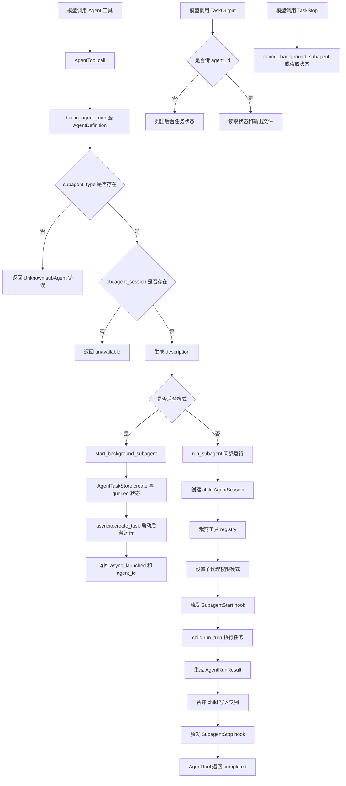
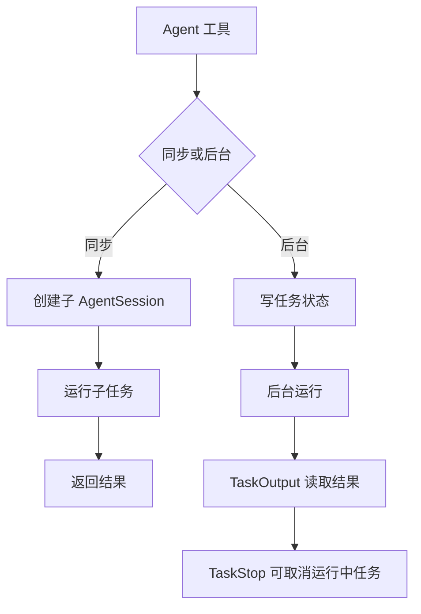

# `bigcode/subagents/` 代码阅读

源码目录：`bigcode/subagents/`

## 这个目录解决什么问题

`subagents/` 提供子代理能力。主模型可以把一个有边界的任务交给另一个 `AgentSession` 执行，子代理完成后把结果作为工具结果返回。

它支持两种运行方式：

- 同步子代理：当前工具调用等待子代理完成。
- 后台子代理：立即返回 `agent_id`，子代理在后台运行，后续用 `TaskOutput` 查看结果，用 `TaskStop` 取消。

目录里的代码主要定义子代理类型、后台任务存储、以及三个工具：

- `Agent`
- `TaskOutput`
- `TaskStop`

真正创建 child `AgentSession` 的逻辑在 `bigcode/agent/session.py`。

## 文件职责

### `definitions.py`

定义内置子代理类型。

核心对象：

- `AgentDefinition`
- `get_builtin_agents()`
- `builtin_agent_map()`

### `tasks.py`

定义后台子代理任务状态和磁盘持久化。

核心对象：

- `AgentRunResult`
- `AgentTaskState`
- `AgentTaskStore`

### `tool.py`

把子代理能力暴露成工具：

- `AgentTool`
- `TaskOutputTool`
- `TaskStopTool`

### `__init__.py`

导出：

- `AgentDefinition`
- `get_builtin_agents`

## 内置子代理类型

### `general-purpose`

通用子代理。

- 工具不做显式限制。
- 适合有明确授权的实现或综合调查。
- `max_turns=8`。

### `explorer`

只读代码探索者。

- 工具：`Read`、`Glob`、`Grep`、`Bash`、技能读取、部分外部资源读取。
- `permission_mode="plan"`。
- 不能编辑。

### `code-reviewer`

只读代码审查者。

- 工具：`Read`、`Glob`、`Grep`、`Bash`。
- `permission_mode="plan"`。
- 提示词要求优先报告缺陷和测试缺口。

### `planAgent`

只读计划助手。

- 工具：`Read`、`Glob`、`Grep`、`Bash`。
- `permission_mode="plan"`。
- 目标是把发现整理成实施计划。

## 核心数据结构

### `AgentDefinition`

描述一种子代理。

字段：

- `name`
- `description`
- `system_prompt`
- `tools`
- `disallowed_tools`
- `model`
- `permission_mode`
- `max_turns`
- `background`

`tools=None` 表示默认继承父 registry 中所有未禁用工具。

### `AgentRunResult`

同步或后台子代理完成后的结构化结果。

字段：

- `agent_id`
- `agent_type`
- `content`
- `total_tool_use_count`
- `total_duration_ms`
- `total_tokens`
- `stop_reason`
- `sidechain_transcript_path`

### `AgentTaskState`

后台任务状态。

字段包括：

- `agent_id`
- `agent_type`
- `description`
- `prompt`
- `status`
- `output_file`
- `sidechain_transcript_path`
- `parent_session_id`
- `result`
- `error`
- 时间戳和统计信息

状态可为：

- `queued`
- `running`
- `completed`
- `failed`
- `cancelled`

### `AgentTaskStore`

后台任务本地存储。

它基于 `project_state_dir` 派生三个目录：

- `agent-tasks`
- `agent-task-outputs`
- `subagents`

主要方法：

- `create()`
- `write_state()`
- `read_state()`
- `list_states()`
- `write_output()`
- `read_output()`
- `status_counts()`

## 子代理工具

### `AgentTool`

工具名：`Agent`

输入：

- `prompt`
- `subagent_type`
- `description`
- `model`
- `background`
- `run_in_background`

执行流程：

1. 从 `builtin_agent_map()` 查子代理定义。
2. 如果类型不存在，返回可用类型提示。
3. 如果没有 `ctx.agent_session`，返回 unavailable。
4. 生成 description。
5. 如果是后台模式，调用 `ctx.agent_session.start_background_subagent()`。
6. 如果是同步模式，调用 `ctx.agent_session.run_subagent()` 并等待结果。

后台模式返回：

- `status="async_launched"`
- `agent_id`
- `agent_type`
- `description`
- `prompt`
- `output_file`

同步模式返回：

- `status="completed"`
- `agent_id`
- `agent_type`
- `content`
- 统计信息

### `TaskOutputTool`

工具名：`TaskOutput`

两种用法：

- 不传 `agent_id`：列出所有后台任务。
- 传 `agent_id`：读取某个任务状态和输出文本。

输出支持 `max_chars` 截断。

### `TaskStopTool`

工具名：`TaskStop`

输入：

- `agent_id`

如果当前上下文有 `agent_session.cancel_background_subagent()`，优先取消内存里的后台 task。否则只读取磁盘状态并返回 `not_running`。

## 后台任务存储细节

### `validate_agent_id(agent_id)`

只允许：

- 字母
- 数字
- `_`
- `-`

这是因为 agent id 会用于文件名。

### `render_agent_result(result)`

把结构化结果渲染成人类可读文本，包含内容和统计信息。

### `_state_from_dict(data)`

从 JSON 容错恢复 `AgentTaskState`。

它会重新校验 `agent_id`，并对数值、状态、可选字段做宽松转换，兼容旧版本或手工修改过的状态文件。

## 和 `AgentSession` 的关系

子代理真正运行在 `AgentSession.run_subagent()`：

- 创建 child `AgentSession`。
- 使用 sidechain transcript。
- 不保存主 snapshot。
- 非交互运行。
- 用 `_registry_for_subagent()` 裁剪工具。
- 权限模式按子代理定义收紧。
- 复用父会话的 task、plan、skill、MCP、hook。
- child 的 `read_file_state` 从父会话 clone。
- 结束后只把 child 写入文件的快照合并回父会话。

后台子代理由 `AgentSession.start_background_subagent()` 和 `_run_background_subagent()` 管理状态落盘。

## 和其他模块的关系

- `ToolRegistry` 注册 `AgentTool`、`TaskOutputTool`、`TaskStopTool`。
- `ToolRunner` 按普通工具流程执行这些工具。
- `permissions.py` 对 `permission_category="agent"` 和 plan 子代理做权限限制。
- `AgentSession` 负责真正创建和运行 child session。
- `HookBus` 会收到 `SubagentStart` 和 `SubagentStop`。

## 阅读建议

先读 `definitions.py`，知道有哪些子代理。再读 `tool.py`，看模型怎样启动和管理子代理。最后读 `tasks.py`，理解后台任务的状态文件和输出文件。

<!-- BEGIN EXTENDED READING NOTES -->

## 超详细源码阅读笔记（扩写版）

这一节是为了把前面的概览扩展成可以逐步跟读源码的版本。
阅读时不要只看结论，要把这里的每个检查点和对应源码放在一起看。
本篇主题是：SubAgent 子代理系统。
模块职责可以先压缩成一句话：允许主会话启动同步或后台子代理，并用独立 transcript 和任务状态管理执行结果。
下面的内容按“定位、符号、入口、数据流、边界、误区、自测”的顺序展开。
如果你是 Python 初学者，建议先读每节第一组短句，再回到源码找同名函数。

### A. 阅读定位

- 这篇文档对应源码：bigcode/subagents/definitions.py, bigcode/subagents/tasks.py, bigcode/subagents/tool.py, bigcode/agent/session.py。
- 它在阅读路线里的角色：允许主会话启动同步或后台子代理，并用独立 transcript 和任务状态管理执行结果。
- 上游输入主要来自：模型 Agent 工具调用, AgentSession, ToolRegistry。
- 下游输出或调用对象主要是：子 AgentSession, AgentTaskStore, sidechain transcript, HookBus SubagentStart Stop。
- 可以用这个例子追踪：`Agent background=true -> async_launched -> TaskOutput(agent_id) 读取输出`。
- 先读公开入口，再读辅助函数；先读数据结构，再读使用这些结构的流程。
- 遇到以下划线开头的函数，先判断它服务哪个公开函数，不要孤立理解。
- 遇到 dataclass，先把字段含义看懂，再看谁创建它、谁消费它。
- 遇到 BaseModel，先看字段类型，因为字段类型就是工具或 API 的输入约束。
- 遇到 async def，重点看它 await 了谁，这通常就是跨模块调用点。

### B. 源码文件 `bigcode/subagents/definitions.py` 的结构地图

- 这个文件共有 70 行源码。
- 顶层 class/function 数量是 3。
- 顶层常量数量是 0。
- import/import from 语句数量大约是 2。
- 阅读时可以先折叠函数体，只看顶层符号顺序。
- 顶层符号顺序通常反映作者希望你先理解的数据类型和主入口。

#### 顶层符号阅读

- `class AgentDefinition`：位于第 11-24 行附近。
  - 先看签名和返回值，判断 `AgentDefinition` 是入口、数据模型还是辅助逻辑。
  - 再看它直接读取哪些字段、调用哪些函数、返回什么对象。
  - 如果 `AgentDefinition` 是类，先读字段和构造函数，再读会被外部调用的方法。
  - 如果 `AgentDefinition` 是函数，先找调用方；没有调用方时看是否是导出入口或测试使用。
- `def get_builtin_agents`：位于第 27-65 行附近。
  - 先看签名和返回值，判断 `get_builtin_agents` 是入口、数据模型还是辅助逻辑。
  - 再看它直接读取哪些字段、调用哪些函数、返回什么对象。
  - 如果 `get_builtin_agents` 是类，先读字段和构造函数，再读会被外部调用的方法。
  - 如果 `get_builtin_agents` 是函数，先找调用方；没有调用方时看是否是导出入口或测试使用。
- `def builtin_agent_map`：位于第 68-70 行附近。
  - 先看签名和返回值，判断 `builtin_agent_map` 是入口、数据模型还是辅助逻辑。
  - 再看它直接读取哪些字段、调用哪些函数、返回什么对象。
  - 如果 `builtin_agent_map` 是类，先读字段和构造函数，再读会被外部调用的方法。
  - 如果 `builtin_agent_map` 是函数，先找调用方；没有调用方时看是否是导出入口或测试使用。

### B. 源码文件 `bigcode/subagents/tasks.py` 的结构地图

- 这个文件共有 287 行源码。
- 顶层 class/function 数量是 13。
- 顶层常量数量是 1。
- import/import from 语句数量大约是 7。
- 阅读时可以先折叠函数体，只看顶层符号顺序。
- 顶层符号顺序通常反映作者希望你先理解的数据类型和主入口。

#### 顶层常量阅读

- `_SAFE_AGENT_ID_RE` 位于第 18 行附近，通常是规则集合、正则、默认值或白名单。
  - 读 `_SAFE_AGENT_ID_RE` 时先问：它是安全边界、展示配置，还是业务默认值。
  - 再找哪里引用 `_SAFE_AGENT_ID_RE`，引用点才说明它真正影响哪个分支。

#### 顶层符号阅读

- `class AgentRunResult`：位于第 22-34 行附近。
  - 先看签名和返回值，判断 `AgentRunResult` 是入口、数据模型还是辅助逻辑。
  - 再看它直接读取哪些字段、调用哪些函数、返回什么对象。
  - 如果 `AgentRunResult` 是类，先读字段和构造函数，再读会被外部调用的方法。
  - 如果 `AgentRunResult` 是函数，先找调用方；没有调用方时看是否是导出入口或测试使用。
- `class AgentTaskState`：位于第 38-60 行附近。
  - 先看签名和返回值，判断 `AgentTaskState` 是入口、数据模型还是辅助逻辑。
  - 再看它直接读取哪些字段、调用哪些函数、返回什么对象。
  - 如果 `AgentTaskState` 是类，先读字段和构造函数，再读会被外部调用的方法。
  - 如果 `AgentTaskState` 是函数，先找调用方；没有调用方时看是否是导出入口或测试使用。
- `class AgentTaskStore`：位于第 63-166 行附近。
  - 先看签名和返回值，判断 `AgentTaskStore` 是入口、数据模型还是辅助逻辑。
  - 再看它直接读取哪些字段、调用哪些函数、返回什么对象。
  - 如果 `AgentTaskStore` 是类，先读字段和构造函数，再读会被外部调用的方法。
  - 如果 `AgentTaskStore` 是函数，先找调用方；没有调用方时看是否是导出入口或测试使用。
- `def validate_agent_id`：位于第 169-173 行附近。
  - 先看签名和返回值，判断 `validate_agent_id` 是入口、数据模型还是辅助逻辑。
  - 再看它直接读取哪些字段、调用哪些函数、返回什么对象。
  - 如果 `validate_agent_id` 是类，先读字段和构造函数，再读会被外部调用的方法。
  - 如果 `validate_agent_id` 是函数，先找调用方；没有调用方时看是否是导出入口或测试使用。
- `def is_valid_agent_id`：位于第 176-178 行附近。
  - 先看签名和返回值，判断 `is_valid_agent_id` 是入口、数据模型还是辅助逻辑。
  - 再看它直接读取哪些字段、调用哪些函数、返回什么对象。
  - 如果 `is_valid_agent_id` 是类，先读字段和构造函数，再读会被外部调用的方法。
  - 如果 `is_valid_agent_id` 是函数，先找调用方；没有调用方时看是否是导出入口或测试使用。
- `def render_agent_result`：位于第 181-195 行附近。
  - 先看签名和返回值，判断 `render_agent_result` 是入口、数据模型还是辅助逻辑。
  - 再看它直接读取哪些字段、调用哪些函数、返回什么对象。
  - 如果 `render_agent_result` 是类，先读字段和构造函数，再读会被外部调用的方法。
  - 如果 `render_agent_result` 是函数，先找调用方；没有调用方时看是否是导出入口或测试使用。
- `def task_summary`：位于第 198-217 行附近。
  - 先看签名和返回值，判断 `task_summary` 是入口、数据模型还是辅助逻辑。
  - 再看它直接读取哪些字段、调用哪些函数、返回什么对象。
  - 如果 `task_summary` 是类，先读字段和构造函数，再读会被外部调用的方法。
  - 如果 `task_summary` 是函数，先找调用方；没有调用方时看是否是导出入口或测试使用。
- `def _state_from_dict`：位于第 220-254 行附近。
  - 先看签名和返回值，判断 `_state_from_dict` 是入口、数据模型还是辅助逻辑。
  - 再看它直接读取哪些字段、调用哪些函数、返回什么对象。
  - 如果 `_state_from_dict` 是类，先读字段和构造函数，再读会被外部调用的方法。
  - 如果 `_state_from_dict` 是函数，先找调用方；没有调用方时看是否是导出入口或测试使用。
- `def result_to_dict`：位于第 257-259 行附近。
  - 先看签名和返回值，判断 `result_to_dict` 是入口、数据模型还是辅助逻辑。
  - 再看它直接读取哪些字段、调用哪些函数、返回什么对象。
  - 如果 `result_to_dict` 是类，先读字段和构造函数，再读会被外部调用的方法。
  - 如果 `result_to_dict` 是函数，先找调用方；没有调用方时看是否是导出入口或测试使用。
- `def _float_or_now`：位于第 262-265 行附近。
  - 先看签名和返回值，判断 `_float_or_now` 是入口、数据模型还是辅助逻辑。
  - 再看它直接读取哪些字段、调用哪些函数、返回什么对象。
  - 如果 `_float_or_now` 是类，先读字段和构造函数，再读会被外部调用的方法。
  - 如果 `_float_or_now` 是函数，先找调用方；没有调用方时看是否是导出入口或测试使用。
- `def _float_or_zero`：位于第 268-271 行附近。
  - 先看签名和返回值，判断 `_float_or_zero` 是入口、数据模型还是辅助逻辑。
  - 再看它直接读取哪些字段、调用哪些函数、返回什么对象。
  - 如果 `_float_or_zero` 是类，先读字段和构造函数，再读会被外部调用的方法。
  - 如果 `_float_or_zero` 是函数，先找调用方；没有调用方时看是否是导出入口或测试使用。
- `def _float_or_none`：位于第 274-279 行附近。
  - 先看签名和返回值，判断 `_float_or_none` 是入口、数据模型还是辅助逻辑。
  - 再看它直接读取哪些字段、调用哪些函数、返回什么对象。
  - 如果 `_float_or_none` 是类，先读字段和构造函数，再读会被外部调用的方法。
  - 如果 `_float_or_none` 是函数，先找调用方；没有调用方时看是否是导出入口或测试使用。
- `def _int_or_zero`：位于第 282-287 行附近。
  - 先看签名和返回值，判断 `_int_or_zero` 是入口、数据模型还是辅助逻辑。
  - 再看它直接读取哪些字段、调用哪些函数、返回什么对象。
  - 如果 `_int_or_zero` 是类，先读字段和构造函数，再读会被外部调用的方法。
  - 如果 `_int_or_zero` 是函数，先找调用方；没有调用方时看是否是导出入口或测试使用。

### B. 源码文件 `bigcode/subagents/tool.py` 的结构地图

- 这个文件共有 199 行源码。
- 顶层 class/function 数量是 8。
- 顶层常量数量是 0。
- import/import from 语句数量大约是 5。
- 阅读时可以先折叠函数体，只看顶层符号顺序。
- 顶层符号顺序通常反映作者希望你先理解的数据类型和主入口。

#### 顶层符号阅读

- `class AgentToolInput`：位于第 15-25 行附近。
  - 先看签名和返回值，判断 `AgentToolInput` 是入口、数据模型还是辅助逻辑。
  - 再看它直接读取哪些字段、调用哪些函数、返回什么对象。
  - 如果 `AgentToolInput` 是类，先读字段和构造函数，再读会被外部调用的方法。
  - 如果 `AgentToolInput` 是函数，先找调用方；没有调用方时看是否是导出入口或测试使用。
- `class TaskOutputInput`：位于第 28-34 行附近。
  - 先看签名和返回值，判断 `TaskOutputInput` 是入口、数据模型还是辅助逻辑。
  - 再看它直接读取哪些字段、调用哪些函数、返回什么对象。
  - 如果 `TaskOutputInput` 是类，先读字段和构造函数，再读会被外部调用的方法。
  - 如果 `TaskOutputInput` 是函数，先找调用方；没有调用方时看是否是导出入口或测试使用。
- `class TaskStopInput`：位于第 37-42 行附近。
  - 先看签名和返回值，判断 `TaskStopInput` 是入口、数据模型还是辅助逻辑。
  - 再看它直接读取哪些字段、调用哪些函数、返回什么对象。
  - 如果 `TaskStopInput` 是类，先读字段和构造函数，再读会被外部调用的方法。
  - 如果 `TaskStopInput` 是函数，先找调用方；没有调用方时看是否是导出入口或测试使用。
- `class AgentTool`：位于第 45-109 行附近。
  - 先看签名和返回值，判断 `AgentTool` 是入口、数据模型还是辅助逻辑。
  - 再看它直接读取哪些字段、调用哪些函数、返回什么对象。
  - 如果 `AgentTool` 是类，先读字段和构造函数，再读会被外部调用的方法。
  - 如果 `AgentTool` 是函数，先找调用方；没有调用方时看是否是导出入口或测试使用。
- `class TaskOutputTool`：位于第 112-148 行附近。
  - 先看签名和返回值，判断 `TaskOutputTool` 是入口、数据模型还是辅助逻辑。
  - 再看它直接读取哪些字段、调用哪些函数、返回什么对象。
  - 如果 `TaskOutputTool` 是类，先读字段和构造函数，再读会被外部调用的方法。
  - 如果 `TaskOutputTool` 是函数，先找调用方；没有调用方时看是否是导出入口或测试使用。
- `class TaskStopTool`：位于第 151-176 行附近。
  - 先看签名和返回值，判断 `TaskStopTool` 是入口、数据模型还是辅助逻辑。
  - 再看它直接读取哪些字段、调用哪些函数、返回什么对象。
  - 如果 `TaskStopTool` 是类，先读字段和构造函数，再读会被外部调用的方法。
  - 如果 `TaskStopTool` 是函数，先找调用方；没有调用方时看是否是导出入口或测试使用。
- `def _task_store`：位于第 179-187 行附近。
  - 先看签名和返回值，判断 `_task_store` 是入口、数据模型还是辅助逻辑。
  - 再看它直接读取哪些字段、调用哪些函数、返回什么对象。
  - 如果 `_task_store` 是类，先读字段和构造函数，再读会被外部调用的方法。
  - 如果 `_task_store` 是函数，先找调用方；没有调用方时看是否是导出入口或测试使用。
- `def _description_for`：位于第 190-199 行附近。
  - 先看签名和返回值，判断 `_description_for` 是入口、数据模型还是辅助逻辑。
  - 再看它直接读取哪些字段、调用哪些函数、返回什么对象。
  - 如果 `_description_for` 是类，先读字段和构造函数，再读会被外部调用的方法。
  - 如果 `_description_for` 是函数，先找调用方；没有调用方时看是否是导出入口或测试使用。

### B. 源码文件 `bigcode/agent/session.py` 的结构地图

- 这个文件共有 844 行源码。
- 顶层 class/function 数量是 8。
- 顶层常量数量是 0。
- import/import from 语句数量大约是 31。
- 阅读时可以先折叠函数体，只看顶层符号顺序。
- 顶层符号顺序通常反映作者希望你先理解的数据类型和主入口。

#### 顶层符号阅读

- `class AgentTurnResult`：位于第 41-48 行附近。
  - 先看签名和返回值，判断 `AgentTurnResult` 是入口、数据模型还是辅助逻辑。
  - 再看它直接读取哪些字段、调用哪些函数、返回什么对象。
  - 如果 `AgentTurnResult` 是类，先读字段和构造函数，再读会被外部调用的方法。
  - 如果 `AgentTurnResult` 是函数，先找调用方；没有调用方时看是否是导出入口或测试使用。
- `class AgentSession`：位于第 51-749 行附近。
  - 先看签名和返回值，判断 `AgentSession` 是入口、数据模型还是辅助逻辑。
  - 再看它直接读取哪些字段、调用哪些函数、返回什么对象。
  - 如果 `AgentSession` 是类，先读字段和构造函数，再读会被外部调用的方法。
  - 如果 `AgentSession` 是函数，先找调用方；没有调用方时看是否是导出入口或测试使用。
- `def _clone_permission_context`：位于第 752-760 行附近。
  - 先看签名和返回值，判断 `_clone_permission_context` 是入口、数据模型还是辅助逻辑。
  - 再看它直接读取哪些字段、调用哪些函数、返回什么对象。
  - 如果 `_clone_permission_context` 是类，先读字段和构造函数，再读会被外部调用的方法。
  - 如果 `_clone_permission_context` 是函数，先找调用方；没有调用方时看是否是导出入口或测试使用。
- `def _format_exception`：位于第 763-765 行附近。
  - 先看签名和返回值，判断 `_format_exception` 是入口、数据模型还是辅助逻辑。
  - 再看它直接读取哪些字段、调用哪些函数、返回什么对象。
  - 如果 `_format_exception` 是类，先读字段和构造函数，再读会被外部调用的方法。
  - 如果 `_format_exception` 是函数，先找调用方；没有调用方时看是否是导出入口或测试使用。
- `def _parse_timeout`：位于第 768-776 行附近。
  - 先看签名和返回值，判断 `_parse_timeout` 是入口、数据模型还是辅助逻辑。
  - 再看它直接读取哪些字段、调用哪些函数、返回什么对象。
  - 如果 `_parse_timeout` 是类，先读字段和构造函数，再读会被外部调用的方法。
  - 如果 `_parse_timeout` 是函数，先找调用方；没有调用方时看是否是导出入口或测试使用。
- `def _total_tokens`：位于第 779-788 行附近。
  - 先看签名和返回值，判断 `_total_tokens` 是入口、数据模型还是辅助逻辑。
  - 再看它直接读取哪些字段、调用哪些函数、返回什么对象。
  - 如果 `_total_tokens` 是类，先读字段和构造函数，再读会被外部调用的方法。
  - 如果 `_total_tokens` 是函数，先找调用方；没有调用方时看是否是导出入口或测试使用。
- `def _resolve_subagent_permission_mode`：位于第 791-798 行附近。
  - 先看签名和返回值，判断 `_resolve_subagent_permission_mode` 是入口、数据模型还是辅助逻辑。
  - 再看它直接读取哪些字段、调用哪些函数、返回什么对象。
  - 如果 `_resolve_subagent_permission_mode` 是类，先读字段和构造函数，再读会被外部调用的方法。
  - 如果 `_resolve_subagent_permission_mode` 是函数，先找调用方；没有调用方时看是否是导出入口或测试使用。
- `def _registry_for_subagent`：位于第 801-844 行附近。
  - 先看签名和返回值，判断 `_registry_for_subagent` 是入口、数据模型还是辅助逻辑。
  - 再看它直接读取哪些字段、调用哪些函数、返回什么对象。
  - 如果 `_registry_for_subagent` 是类，先读字段和构造函数，再读会被外部调用的方法。
  - 如果 `_registry_for_subagent` 是函数，先找调用方；没有调用方时看是否是导出入口或测试使用。

### C. 主流程拆解

- 第 1 步：AgentTool 查 AgentDefinition。读这一环节时要确认输入对象是什么、输出对象交给谁。
- 第 2 步：同步调用 run_subagent。读这一环节时要确认输入对象是什么、输出对象交给谁。
- 第 3 步：或后台写 AgentTaskState。读这一环节时要确认输入对象是什么、输出对象交给谁。
- 第 4 步：child AgentSession 执行任务。读这一环节时要确认输入对象是什么、输出对象交给谁。
- 第 5 步：TaskOutput 读取结果。读这一环节时要确认输入对象是什么、输出对象交给谁。
- 第 6 步：TaskStop 取消任务。读这一环节时要确认输入对象是什么、输出对象交给谁。

### D. 本篇最应该盯住的源码点

- 关注点 1：explorer 和 planAgent 是只读 plan 模式。它通常决定你是否真正理解这个模块的边界。
- 关注点 2：后台子代理不能再启动子代理或询问用户。它通常决定你是否真正理解这个模块的边界。
- 关注点 3：child read_file_state clone 后合并写入快照。它通常决定你是否真正理解这个模块的边界。
- 关注点 4：agent_id 必须安全字符。它通常决定你是否真正理解这个模块的边界。
- 关注点 5：输出和状态分文件保存。它通常决定你是否真正理解这个模块的边界。

### E. 初学者容易误解的点

- 误区 1：以为子代理是轻量函数调用。读源码时用实际调用链验证，不要只按变量名猜。
- 误区 2：忽略同步和后台差异。读源码时用实际调用链验证，不要只按变量名猜。
- 误区 3：以为后台结果直接进当前上下文。读源码时用实际调用链验证，不要只按变量名猜。
- 误区 4：忘记子代理 registry 会被裁剪。读源码时用实际调用链验证，不要只按变量名猜。

### F. 数据流追踪

- 输入侧 1：`模型 Agent 工具调用` 是这个模块可能接收信息的来源。
  - 追踪时先找它在哪个函数参数、对象字段或配置字段中出现。
  - 如果它是外部输入，要继续检查是否有校验、默认值或错误处理。
- 输入侧 2：`AgentSession` 是这个模块可能接收信息的来源。
  - 追踪时先找它在哪个函数参数、对象字段或配置字段中出现。
  - 如果它是外部输入，要继续检查是否有校验、默认值或错误处理。
- 输入侧 3：`ToolRegistry` 是这个模块可能接收信息的来源。
  - 追踪时先找它在哪个函数参数、对象字段或配置字段中出现。
  - 如果它是外部输入，要继续检查是否有校验、默认值或错误处理。
- 输出侧 1：`子 AgentSession` 是这个模块处理结果的去向。
  - 追踪时看当前模块传递的是原始值、结构化对象，还是已经裁剪过的投影。
  - 如果下游是工具或模型，重点检查安全边界和格式转换。
- 输出侧 2：`AgentTaskStore` 是这个模块处理结果的去向。
  - 追踪时看当前模块传递的是原始值、结构化对象，还是已经裁剪过的投影。
  - 如果下游是工具或模型，重点检查安全边界和格式转换。
- 输出侧 3：`sidechain transcript` 是这个模块处理结果的去向。
  - 追踪时看当前模块传递的是原始值、结构化对象，还是已经裁剪过的投影。
  - 如果下游是工具或模型，重点检查安全边界和格式转换。
- 输出侧 4：`HookBus SubagentStart Stop` 是这个模块处理结果的去向。
  - 追踪时看当前模块传递的是原始值、结构化对象，还是已经裁剪过的投影。
  - 如果下游是工具或模型，重点检查安全边界和格式转换。

### G. 边界情况阅读表

| 01 | `AgentDefinition` | 输入为空时是否有默认值或早返回 | 回到源码确认实际分支，不要用经验推断 |
| 02 | `get_builtin_agents` | 配置项不存在时是报错、降级还是记录 warning | 回到源码确认实际分支，不要用经验推断 |
| 03 | `builtin_agent_map` | 外部依赖不可用时是否影响主流程 | 回到源码确认实际分支，不要用经验推断 |
| 04 | `AgentRunResult` | 异常是否被捕获并转成结构化结果 | 回到源码确认实际分支，不要用经验推断 |
| 05 | `AgentTaskState` | 列表为空时返回空列表还是 None | 回到源码确认实际分支，不要用经验推断 |
| 06 | `AgentTaskStore` | 路径或名称是否合法是否有校验 | 回到源码确认实际分支，不要用经验推断 |
| 07 | `validate_agent_id` | 非交互模式是否会改变行为 | 回到源码确认实际分支，不要用经验推断 |
| 08 | `is_valid_agent_id` | 状态是否会写入 transcript、snapshot 或磁盘文件 | 回到源码确认实际分支，不要用经验推断 |
| 09 | `render_agent_result` | 是否存在只读模式、plan 模式或 sandbox 的特殊分支 | 回到源码确认实际分支，不要用经验推断 |
| 10 | `task_summary` | 返回值是否会继续进入模型上下文 | 回到源码确认实际分支，不要用经验推断 |
| 11 | `_state_from_dict` | 输入为空时是否有默认值或早返回 | 回到源码确认实际分支，不要用经验推断 |
| 12 | `result_to_dict` | 配置项不存在时是报错、降级还是记录 warning | 回到源码确认实际分支，不要用经验推断 |
| 13 | `_float_or_now` | 外部依赖不可用时是否影响主流程 | 回到源码确认实际分支，不要用经验推断 |
| 14 | `_float_or_zero` | 异常是否被捕获并转成结构化结果 | 回到源码确认实际分支，不要用经验推断 |
| 15 | `_float_or_none` | 列表为空时返回空列表还是 None | 回到源码确认实际分支，不要用经验推断 |
| 16 | `_int_or_zero` | 路径或名称是否合法是否有校验 | 回到源码确认实际分支，不要用经验推断 |
| 17 | `AgentToolInput` | 非交互模式是否会改变行为 | 回到源码确认实际分支，不要用经验推断 |
| 18 | `TaskOutputInput` | 状态是否会写入 transcript、snapshot 或磁盘文件 | 回到源码确认实际分支，不要用经验推断 |
| 19 | `TaskStopInput` | 是否存在只读模式、plan 模式或 sandbox 的特殊分支 | 回到源码确认实际分支，不要用经验推断 |
| 20 | `AgentTool` | 返回值是否会继续进入模型上下文 | 回到源码确认实际分支，不要用经验推断 |
| 21 | `TaskOutputTool` | 输入为空时是否有默认值或早返回 | 回到源码确认实际分支，不要用经验推断 |
| 22 | `TaskStopTool` | 配置项不存在时是报错、降级还是记录 warning | 回到源码确认实际分支，不要用经验推断 |
| 23 | `_task_store` | 外部依赖不可用时是否影响主流程 | 回到源码确认实际分支，不要用经验推断 |
| 24 | `_description_for` | 异常是否被捕获并转成结构化结果 | 回到源码确认实际分支，不要用经验推断 |
| 25 | `AgentTurnResult` | 列表为空时返回空列表还是 None | 回到源码确认实际分支，不要用经验推断 |
| 26 | `AgentSession` | 路径或名称是否合法是否有校验 | 回到源码确认实际分支，不要用经验推断 |
| 27 | `_clone_permission_context` | 非交互模式是否会改变行为 | 回到源码确认实际分支，不要用经验推断 |
| 28 | `_format_exception` | 状态是否会写入 transcript、snapshot 或磁盘文件 | 回到源码确认实际分支，不要用经验推断 |
| 29 | `_parse_timeout` | 是否存在只读模式、plan 模式或 sandbox 的特殊分支 | 回到源码确认实际分支，不要用经验推断 |
| 30 | `_total_tokens` | 返回值是否会继续进入模型上下文 | 回到源码确认实际分支，不要用经验推断 |
| 31 | `_resolve_subagent_permission_mode` | 输入为空时是否有默认值或早返回 | 回到源码确认实际分支，不要用经验推断 |
| 32 | `_registry_for_subagent` | 配置项不存在时是报错、降级还是记录 warning | 回到源码确认实际分支，不要用经验推断 |
| 33 | `AgentDefinition` | 外部依赖不可用时是否影响主流程 | 回到源码确认实际分支，不要用经验推断 |
| 34 | `get_builtin_agents` | 异常是否被捕获并转成结构化结果 | 回到源码确认实际分支，不要用经验推断 |
| 35 | `builtin_agent_map` | 列表为空时返回空列表还是 None | 回到源码确认实际分支，不要用经验推断 |
| 36 | `AgentRunResult` | 路径或名称是否合法是否有校验 | 回到源码确认实际分支，不要用经验推断 |
| 37 | `AgentTaskState` | 非交互模式是否会改变行为 | 回到源码确认实际分支，不要用经验推断 |
| 38 | `AgentTaskStore` | 状态是否会写入 transcript、snapshot 或磁盘文件 | 回到源码确认实际分支，不要用经验推断 |
| 39 | `validate_agent_id` | 是否存在只读模式、plan 模式或 sandbox 的特殊分支 | 回到源码确认实际分支，不要用经验推断 |
| 40 | `is_valid_agent_id` | 返回值是否会继续进入模型上下文 | 回到源码确认实际分支，不要用经验推断 |
| 41 | `render_agent_result` | 输入为空时是否有默认值或早返回 | 回到源码确认实际分支，不要用经验推断 |
| 42 | `task_summary` | 配置项不存在时是报错、降级还是记录 warning | 回到源码确认实际分支，不要用经验推断 |
| 43 | `_state_from_dict` | 外部依赖不可用时是否影响主流程 | 回到源码确认实际分支，不要用经验推断 |
| 44 | `result_to_dict` | 异常是否被捕获并转成结构化结果 | 回到源码确认实际分支，不要用经验推断 |
| 45 | `_float_or_now` | 列表为空时返回空列表还是 None | 回到源码确认实际分支，不要用经验推断 |
| 46 | `_float_or_zero` | 路径或名称是否合法是否有校验 | 回到源码确认实际分支，不要用经验推断 |
| 47 | `_float_or_none` | 非交互模式是否会改变行为 | 回到源码确认实际分支，不要用经验推断 |
| 48 | `_int_or_zero` | 状态是否会写入 transcript、snapshot 或磁盘文件 | 回到源码确认实际分支，不要用经验推断 |
| 49 | `AgentToolInput` | 是否存在只读模式、plan 模式或 sandbox 的特殊分支 | 回到源码确认实际分支，不要用经验推断 |
| 50 | `TaskOutputInput` | 返回值是否会继续进入模型上下文 | 回到源码确认实际分支，不要用经验推断 |
| 51 | `TaskStopInput` | 输入为空时是否有默认值或早返回 | 回到源码确认实际分支，不要用经验推断 |
| 52 | `AgentTool` | 配置项不存在时是报错、降级还是记录 warning | 回到源码确认实际分支，不要用经验推断 |
| 53 | `TaskOutputTool` | 外部依赖不可用时是否影响主流程 | 回到源码确认实际分支，不要用经验推断 |
| 54 | `TaskStopTool` | 异常是否被捕获并转成结构化结果 | 回到源码确认实际分支，不要用经验推断 |
| 55 | `_task_store` | 列表为空时返回空列表还是 None | 回到源码确认实际分支，不要用经验推断 |
| 56 | `_description_for` | 路径或名称是否合法是否有校验 | 回到源码确认实际分支，不要用经验推断 |
| 57 | `AgentTurnResult` | 非交互模式是否会改变行为 | 回到源码确认实际分支，不要用经验推断 |
| 58 | `AgentSession` | 状态是否会写入 transcript、snapshot 或磁盘文件 | 回到源码确认实际分支，不要用经验推断 |
| 59 | `_clone_permission_context` | 是否存在只读模式、plan 模式或 sandbox 的特殊分支 | 回到源码确认实际分支，不要用经验推断 |
| 60 | `_format_exception` | 返回值是否会继续进入模型上下文 | 回到源码确认实际分支，不要用经验推断 |

### H. 与阅读路线的衔接

- 读完 `SubAgent 子代理系统` 后，回到 `doc/CodeReadingGuide.md` 看它处在哪一阶段。
- 如果它的上游是 模型 Agent 工具调用，就从上游重新走一次调用链。
- 如果它的下游是 子 AgentSession，就继续读下游如何消费当前模块的输出。
- 不要只背函数名；真正的理解是能说清数据对象怎样跨文件移动。
- 当你能画出自己的简图，再对照文末两个流程图，说明这一篇基本读通了。

## 详细流程图

## 核心流程图

