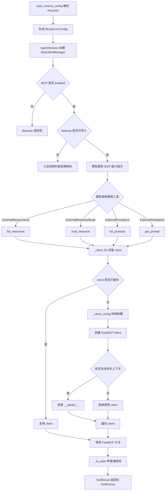
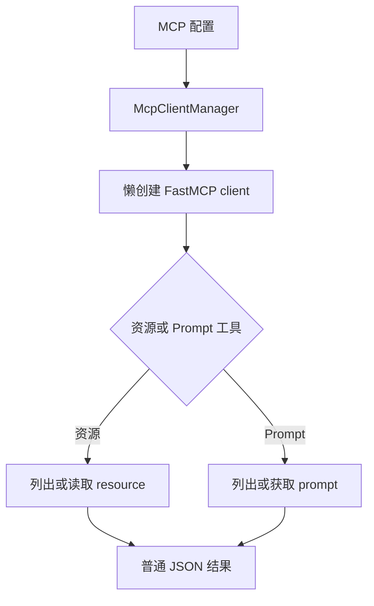

# `bigcode/mcp/` 代码阅读

源码目录：`bigcode/mcp/`

## 这个目录解决什么问题

`mcp/` 负责把外部 MCP server 的资源和 prompt 接入 BigCode。MCP 是可选能力，BigCode 本身不强依赖 FastMCP；如果当前 Python 环境没有安装 `fastmcp`，MCP 工具会报告依赖缺失，但主会话仍能运行。

当前这个目录主要处理：

- 保存 MCP server 配置。
- 延迟创建 FastMCP client。
- 发现外部工具、资源、prompt。
- 列出和读取外部资源。
- 列出和获取外部 prompt。
- 把资源和 prompt 包装成 BigCode 工具。

注意：虽然 `McpClientManager` 有 `call_tool()`，当前默认注册表里暴露的是资源和 prompt 工具，不直接暴露任意 MCP tool 调用工具。

## 文件职责

### `client.py`

MCP 客户端管理器。

核心对象：

- `McpCapability`
- `McpClientManager`

### `tools.py`

把 MCP 资源和 prompt 包装成 BigCode 工具：

- `ExternalResourceListTool`
- `ExternalResourceReadTool`
- `ExternalPromptListTool`
- `ExternalPromptGetTool`

### `__init__.py`

导出：

- `McpClientManager`

## 核心数据结构

### `McpCapability`

MCP discovery 得到的一项能力。

字段：

- `kind`：`tool`、`resource`、`prompt`
- `server`
- `name`
- `description`
- `schema`
- `read_only_hint`

这些能力可用于上下文能力索引。

### `McpClientManager`

MCP 客户端生命周期管理器。

关键字段：

- `servers`：配置里的 MCP server。
- `enabled`：总开关。
- `capabilities`：发现到的能力缓存。
- `_fastmcp_available`：当前环境是否可 import fastmcp。
- `_clients`：server name 到 client 的缓存。

它延迟创建 client：只有真正 discovery、读资源、取 prompt 时才连接 server。

## 关键函数逐段讲解

### `fastmcp_available`

属性，返回当前环境是否能 import `fastmcp`。

`AgentSession._capabilities()` 会根据它提示模型：

- MCP 已配置且 FastMCP 可用。
- MCP 已配置但 FastMCP 未安装。

### `discover(server_name=None)`

发现 MCP server 暴露的能力。

流程：

1. 如果 MCP disabled，返回空。
2. 如果 FastMCP 不可用，返回空。
3. 如果传入 `server_name`，只查那个 server；否则查所有 server。
4. 跳过不存在或 disabled 的 server。
5. 用 `_client_for()` 懒创建 client。
6. 调 `client.list_tools()`，生成 `McpCapability(kind="tool")`。
7. 调 `_safe_list(client, "list_resources")`，生成 resource capability。
8. 调 `_safe_list(client, "list_prompts")`，生成 prompt capability。
9. 捕获单个 server 异常，避免 discovery 影响主会话。
10. 缓存并返回 capabilities。

### `call_tool(server_name, tool_name, arguments)`

调用 MCP server 上的工具。

当前默认工具面没有直接把它暴露给模型，但 manager 具备这个能力。

它会检查：

- MCP 是否 enabled。
- FastMCP 是否安装。

然后调用：

```py
client.call_tool(tool_name, arguments, raise_on_error=False)
```

返回值会经过 `_to_plain()` 转成普通 Python 或 JSON 结构。

### `list_resources(server_name=None)`

列出一个或所有 MCP server 的资源。

如果某个资源是 dict，会补上 `server` 字段，方便调用方知道它来自哪个 server。

### `read_resource(server_name, uri)`

读取一个 MCP resource URI。

它直接委托 FastMCP client 的 `read_resource(uri)`，再用 `_to_plain()` 转换返回值。

### `list_prompts(server_name=None)`

列出一个或所有 MCP server 的 prompts。

和资源列表一样，会尽量补 `server` 字段。

### `get_prompt(server_name, name, arguments=None)`

获取指定 prompt，可传入 prompt 参数。

### `close_all()`

关闭已经创建的 client，并清空缓存。

如果 client 有 `close` 方法，会调用并支持 await。

### `_client_for(server_name)`

懒创建并缓存 FastMCP client。

步骤：

1. 如果 `_clients` 已有，直接返回。
2. 检查 server 是否存在且 enabled。
3. `from fastmcp import Client`。
4. 用 `_client_config()` 转换配置。
5. 创建 `Client(config)`。
6. 如果支持异步上下文管理，手动 `__aenter__()`。
7. 缓存 client。

### `_client_config(server)`

把 BigCode 的 MCP server 配置转换成 FastMCP 接受的格式。

规则：

- `transport` 是 `http` 或 `sse` 且有 `url`：返回 URL 字符串。
- `transport` 是 `stdio`：返回 `{"mcpServers": {server.name: cfg}}`。
- 其它情况：原样返回 cfg。

### `_safe_list(client, method)`

安全调用可选的 `list_*` 方法。

如果方法不存在，返回空列表。

### `_maybe_await(value)`

如果返回值是 awaitable 就 await，否则原样返回。

这样能兼容不同 FastMCP 版本里同步或异步 API 的差异。

### `_obj_get(obj, name, default=None)`

同时支持 dict 和对象属性取值。

### `_to_plain(value)`

把 FastMCP 返回对象递归转换成普通结构。

支持：

- Pydantic `model_dump`
- 普通对象 `__dict__`
- dict
- list 或 tuple
- 其它原样返回

## MCP 工具

### `ExternalResourceListTool`

工具名：`ExternalResourceList`

输入：

- `server` 可选

返回：

- `resources`

调用 `ctx.mcp_manager.list_resources(input.server)`。

### `ExternalResourceReadTool`

工具名：`ExternalResourceRead`

输入：

- `server`
- `uri`

调用 `ctx.mcp_manager.read_resource(input.server, input.uri)`。

### `ExternalPromptListTool`

工具名：`ExternalPromptList`

输入：

- `server` 可选

返回：

- `prompts`

### `ExternalPromptGetTool`

工具名：`ExternalPromptGet`

输入：

- `server`
- `name`
- `arguments`

调用 `ctx.mcp_manager.get_prompt(...)`。

这些工具的 `permission_category` 都是 `mcp`，`state_effect` 都是 `external`，会经过统一权限系统。

## 和其他模块的关系

- `config/loader.py` 解析 `mcp.json`，生成 `McpServerConfig`。
- `AgentSession.__init__()` 创建 `McpClientManager`。
- `AgentSession._capabilities()` 把 MCP 状态放进能力摘要。
- `CapabilityIndexHook` 首次上下文构建时把外部能力提示给模型。
- `ToolRegistry` 注册 MCP 资源和 prompt 工具。
- `permissions.py` 对 `mcp` 类工具默认要求权限，并受 sandbox 限制。

## 阅读建议

先读 `McpClientManager.__init__()` 和 `_client_for()`，理解“可选依赖、懒连接、缓存 client”。再读 `tools.py`，你会发现工具层很薄，真正外部通信都在 manager 里。

<!-- BEGIN EXTENDED READING NOTES -->

## 超详细源码阅读笔记（扩写版）

这一节是为了把前面的概览扩展成可以逐步跟读源码的版本。
阅读时不要只看结论，要把这里的每个检查点和对应源码放在一起看。
本篇主题是：MCP 外部能力接入。
模块职责可以先压缩成一句话：可选地通过 FastMCP 连接外部 server，列出和读取资源、prompt，并包装成 BigCode 工具。
下面的内容按“定位、符号、入口、数据流、边界、误区、自测”的顺序展开。
如果你是 Python 初学者，建议先读每节第一组短句，再回到源码找同名函数。

### A. 阅读定位

- 这篇文档对应源码：bigcode/mcp/client.py, bigcode/mcp/tools.py, bigcode/config/models.py。
- 它在阅读路线里的角色：可选地通过 FastMCP 连接外部 server，列出和读取资源、prompt，并包装成 BigCode 工具。
- 上游输入主要来自：mcp.json, RuntimeConfig, AgentSession, External* 工具调用。
- 下游输出或调用对象主要是：FastMCP Client, ToolResult, CapabilityIndexHook, 权限系统。
- 可以用这个例子追踪：`ExternalResourceRead(server="docs", uri="...") -> McpClientManager.read_resource`。
- 先读公开入口，再读辅助函数；先读数据结构，再读使用这些结构的流程。
- 遇到以下划线开头的函数，先判断它服务哪个公开函数，不要孤立理解。
- 遇到 dataclass，先把字段含义看懂，再看谁创建它、谁消费它。
- 遇到 BaseModel，先看字段类型，因为字段类型就是工具或 API 的输入约束。
- 遇到 async def，重点看它 await 了谁，这通常就是跨模块调用点。

### B. 源码文件 `bigcode/mcp/client.py` 的结构地图

- 这个文件共有 221 行源码。
- 顶层 class/function 数量是 8。
- 顶层常量数量是 0。
- import/import from 语句数量大约是 4。
- 阅读时可以先折叠函数体，只看顶层符号顺序。
- 顶层符号顺序通常反映作者希望你先理解的数据类型和主入口。

#### 顶层符号阅读

- `class McpCapability`：位于第 14-24 行附近。
  - 先看签名和返回值，判断 `McpCapability` 是入口、数据模型还是辅助逻辑。
  - 再看它直接读取哪些字段、调用哪些函数、返回什么对象。
  - 如果 `McpCapability` 是类，先读字段和构造函数，再读会被外部调用的方法。
  - 如果 `McpCapability` 是函数，先找调用方；没有调用方时看是否是导出入口或测试使用。
- `class McpClientManager`：位于第 27-165 行附近。
  - 先看签名和返回值，判断 `McpClientManager` 是入口、数据模型还是辅助逻辑。
  - 再看它直接读取哪些字段、调用哪些函数、返回什么对象。
  - 如果 `McpClientManager` 是类，先读字段和构造函数，再读会被外部调用的方法。
  - 如果 `McpClientManager` 是函数，先找调用方；没有调用方时看是否是导出入口或测试使用。
- `def _fastmcp_available`：位于第 168-174 行附近。
  - 先看签名和返回值，判断 `_fastmcp_available` 是入口、数据模型还是辅助逻辑。
  - 再看它直接读取哪些字段、调用哪些函数、返回什么对象。
  - 如果 `_fastmcp_available` 是类，先读字段和构造函数，再读会被外部调用的方法。
  - 如果 `_fastmcp_available` 是函数，先找调用方；没有调用方时看是否是导出入口或测试使用。
- `def _client_config`：位于第 177-185 行附近。
  - 先看签名和返回值，判断 `_client_config` 是入口、数据模型还是辅助逻辑。
  - 再看它直接读取哪些字段、调用哪些函数、返回什么对象。
  - 如果 `_client_config` 是类，先读字段和构造函数，再读会被外部调用的方法。
  - 如果 `_client_config` 是函数，先找调用方；没有调用方时看是否是导出入口或测试使用。
- `async def _safe_list`：位于第 188-194 行附近。
  - 先看签名和返回值，判断 `_safe_list` 是入口、数据模型还是辅助逻辑。
  - 再看它直接读取哪些字段、调用哪些函数、返回什么对象。
  - 如果 `_safe_list` 是类，先读字段和构造函数，再读会被外部调用的方法。
  - 如果 `_safe_list` 是函数，先找调用方；没有调用方时看是否是导出入口或测试使用。
- `async def _maybe_await`：位于第 197-201 行附近。
  - 先看签名和返回值，判断 `_maybe_await` 是入口、数据模型还是辅助逻辑。
  - 再看它直接读取哪些字段、调用哪些函数、返回什么对象。
  - 如果 `_maybe_await` 是类，先读字段和构造函数，再读会被外部调用的方法。
  - 如果 `_maybe_await` 是函数，先找调用方；没有调用方时看是否是导出入口或测试使用。
- `def _obj_get`：位于第 204-208 行附近。
  - 先看签名和返回值，判断 `_obj_get` 是入口、数据模型还是辅助逻辑。
  - 再看它直接读取哪些字段、调用哪些函数、返回什么对象。
  - 如果 `_obj_get` 是类，先读字段和构造函数，再读会被外部调用的方法。
  - 如果 `_obj_get` 是函数，先找调用方；没有调用方时看是否是导出入口或测试使用。
- `def _to_plain`：位于第 211-221 行附近。
  - 先看签名和返回值，判断 `_to_plain` 是入口、数据模型还是辅助逻辑。
  - 再看它直接读取哪些字段、调用哪些函数、返回什么对象。
  - 如果 `_to_plain` 是类，先读字段和构造函数，再读会被外部调用的方法。
  - 如果 `_to_plain` 是函数，先找调用方；没有调用方时看是否是导出入口或测试使用。

### B. 源码文件 `bigcode/mcp/tools.py` 的结构地图

- 这个文件共有 129 行源码。
- 顶层 class/function 数量是 8。
- 顶层常量数量是 0。
- import/import from 语句数量大约是 3。
- 阅读时可以先折叠函数体，只看顶层符号顺序。
- 顶层符号顺序通常反映作者希望你先理解的数据类型和主入口。

#### 顶层符号阅读

- `class ExternalResourceListInput`：位于第 12-17 行附近。
  - 先看签名和返回值，判断 `ExternalResourceListInput` 是入口、数据模型还是辅助逻辑。
  - 再看它直接读取哪些字段、调用哪些函数、返回什么对象。
  - 如果 `ExternalResourceListInput` 是类，先读字段和构造函数，再读会被外部调用的方法。
  - 如果 `ExternalResourceListInput` 是函数，先找调用方；没有调用方时看是否是导出入口或测试使用。
- `class ExternalResourceReadInput`：位于第 20-26 行附近。
  - 先看签名和返回值，判断 `ExternalResourceReadInput` 是入口、数据模型还是辅助逻辑。
  - 再看它直接读取哪些字段、调用哪些函数、返回什么对象。
  - 如果 `ExternalResourceReadInput` 是类，先读字段和构造函数，再读会被外部调用的方法。
  - 如果 `ExternalResourceReadInput` 是函数，先找调用方；没有调用方时看是否是导出入口或测试使用。
- `class ExternalPromptListInput`：位于第 29-34 行附近。
  - 先看签名和返回值，判断 `ExternalPromptListInput` 是入口、数据模型还是辅助逻辑。
  - 再看它直接读取哪些字段、调用哪些函数、返回什么对象。
  - 如果 `ExternalPromptListInput` 是类，先读字段和构造函数，再读会被外部调用的方法。
  - 如果 `ExternalPromptListInput` 是函数，先找调用方；没有调用方时看是否是导出入口或测试使用。
- `class ExternalPromptGetInput`：位于第 37-44 行附近。
  - 先看签名和返回值，判断 `ExternalPromptGetInput` 是入口、数据模型还是辅助逻辑。
  - 再看它直接读取哪些字段、调用哪些函数、返回什么对象。
  - 如果 `ExternalPromptGetInput` 是类，先读字段和构造函数，再读会被外部调用的方法。
  - 如果 `ExternalPromptGetInput` 是函数，先找调用方；没有调用方时看是否是导出入口或测试使用。
- `class ExternalResourceListTool`：位于第 47-65 行附近。
  - 先看签名和返回值，判断 `ExternalResourceListTool` 是入口、数据模型还是辅助逻辑。
  - 再看它直接读取哪些字段、调用哪些函数、返回什么对象。
  - 如果 `ExternalResourceListTool` 是类，先读字段和构造函数，再读会被外部调用的方法。
  - 如果 `ExternalResourceListTool` 是函数，先找调用方；没有调用方时看是否是导出入口或测试使用。
- `class ExternalResourceReadTool`：位于第 68-86 行附近。
  - 先看签名和返回值，判断 `ExternalResourceReadTool` 是入口、数据模型还是辅助逻辑。
  - 再看它直接读取哪些字段、调用哪些函数、返回什么对象。
  - 如果 `ExternalResourceReadTool` 是类，先读字段和构造函数，再读会被外部调用的方法。
  - 如果 `ExternalResourceReadTool` 是函数，先找调用方；没有调用方时看是否是导出入口或测试使用。
- `class ExternalPromptListTool`：位于第 89-107 行附近。
  - 先看签名和返回值，判断 `ExternalPromptListTool` 是入口、数据模型还是辅助逻辑。
  - 再看它直接读取哪些字段、调用哪些函数、返回什么对象。
  - 如果 `ExternalPromptListTool` 是类，先读字段和构造函数，再读会被外部调用的方法。
  - 如果 `ExternalPromptListTool` 是函数，先找调用方；没有调用方时看是否是导出入口或测试使用。
- `class ExternalPromptGetTool`：位于第 110-128 行附近。
  - 先看签名和返回值，判断 `ExternalPromptGetTool` 是入口、数据模型还是辅助逻辑。
  - 再看它直接读取哪些字段、调用哪些函数、返回什么对象。
  - 如果 `ExternalPromptGetTool` 是类，先读字段和构造函数，再读会被外部调用的方法。
  - 如果 `ExternalPromptGetTool` 是函数，先找调用方；没有调用方时看是否是导出入口或测试使用。

### B. 源码文件 `bigcode/config/models.py` 的结构地图

- 这个文件共有 81 行源码。
- 顶层 class/function 数量是 4。
- 顶层常量数量是 0。
- import/import from 语句数量大约是 4。
- 阅读时可以先折叠函数体，只看顶层符号顺序。
- 顶层符号顺序通常反映作者希望你先理解的数据类型和主入口。

#### 顶层符号阅读

- `class ModelCapabilities`：位于第 16-24 行附近。
  - 先看签名和返回值，判断 `ModelCapabilities` 是入口、数据模型还是辅助逻辑。
  - 再看它直接读取哪些字段、调用哪些函数、返回什么对象。
  - 如果 `ModelCapabilities` 是类，先读字段和构造函数，再读会被外部调用的方法。
  - 如果 `ModelCapabilities` 是函数，先找调用方；没有调用方时看是否是导出入口或测试使用。
- `class ResolvedModel`：位于第 28-43 行附近。
  - 先看签名和返回值，判断 `ResolvedModel` 是入口、数据模型还是辅助逻辑。
  - 再看它直接读取哪些字段、调用哪些函数、返回什么对象。
  - 如果 `ResolvedModel` 是类，先读字段和构造函数，再读会被外部调用的方法。
  - 如果 `ResolvedModel` 是函数，先找调用方；没有调用方时看是否是导出入口或测试使用。
- `class McpServerConfig`：位于第 47-54 行附近。
  - 先看签名和返回值，判断 `McpServerConfig` 是入口、数据模型还是辅助逻辑。
  - 再看它直接读取哪些字段、调用哪些函数、返回什么对象。
  - 如果 `McpServerConfig` 是类，先读字段和构造函数，再读会被外部调用的方法。
  - 如果 `McpServerConfig` 是函数，先找调用方；没有调用方时看是否是导出入口或测试使用。
- `class RuntimeConfig`：位于第 58-81 行附近。
  - 先看签名和返回值，判断 `RuntimeConfig` 是入口、数据模型还是辅助逻辑。
  - 再看它直接读取哪些字段、调用哪些函数、返回什么对象。
  - 如果 `RuntimeConfig` 是类，先读字段和构造函数，再读会被外部调用的方法。
  - 如果 `RuntimeConfig` 是函数，先找调用方；没有调用方时看是否是导出入口或测试使用。

### C. 主流程拆解

- 第 1 步：配置解析 McpServerConfig。读这一环节时要确认输入对象是什么、输出对象交给谁。
- 第 2 步：创建 McpClientManager。读这一环节时要确认输入对象是什么、输出对象交给谁。
- 第 3 步：检测 fastmcp。读这一环节时要确认输入对象是什么、输出对象交给谁。
- 第 4 步：懒创建 client。读这一环节时要确认输入对象是什么、输出对象交给谁。
- 第 5 步：list/read resources。读这一环节时要确认输入对象是什么、输出对象交给谁。
- 第 6 步：list/get prompts。读这一环节时要确认输入对象是什么、输出对象交给谁。
- 第 7 步：返回普通 JSON。读这一环节时要确认输入对象是什么、输出对象交给谁。

### D. 本篇最应该盯住的源码点

- 关注点 1：FastMCP 是可选依赖。它通常决定你是否真正理解这个模块的边界。
- 关注点 2：_client_for 懒创建并缓存。它通常决定你是否真正理解这个模块的边界。
- 关注点 3：_to_plain 兼容对象和 dict。它通常决定你是否真正理解这个模块的边界。
- 关注点 4：workspace sandbox 禁止 mcp。它通常决定你是否真正理解这个模块的边界。
- 关注点 5：默认工具面暴露资源和 prompt。它通常决定你是否真正理解这个模块的边界。

### E. 初学者容易误解的点

- 误区 1：以为没装 fastmcp 会导致 BigCode 启动失败。读源码时用实际调用链验证，不要只按变量名猜。
- 误区 2：把 discover 失败当作会话失败。读源码时用实际调用链验证，不要只按变量名猜。
- 误区 3：忽略 server enabled。读源码时用实际调用链验证，不要只按变量名猜。
- 误区 4：以为 call_tool 已默认暴露给模型。读源码时用实际调用链验证，不要只按变量名猜。

### F. 数据流追踪

- 输入侧 1：`mcp.json` 是这个模块可能接收信息的来源。
  - 追踪时先找它在哪个函数参数、对象字段或配置字段中出现。
  - 如果它是外部输入，要继续检查是否有校验、默认值或错误处理。
- 输入侧 2：`RuntimeConfig` 是这个模块可能接收信息的来源。
  - 追踪时先找它在哪个函数参数、对象字段或配置字段中出现。
  - 如果它是外部输入，要继续检查是否有校验、默认值或错误处理。
- 输入侧 3：`AgentSession` 是这个模块可能接收信息的来源。
  - 追踪时先找它在哪个函数参数、对象字段或配置字段中出现。
  - 如果它是外部输入，要继续检查是否有校验、默认值或错误处理。
- 输入侧 4：`External* 工具调用` 是这个模块可能接收信息的来源。
  - 追踪时先找它在哪个函数参数、对象字段或配置字段中出现。
  - 如果它是外部输入，要继续检查是否有校验、默认值或错误处理。
- 输出侧 1：`FastMCP Client` 是这个模块处理结果的去向。
  - 追踪时看当前模块传递的是原始值、结构化对象，还是已经裁剪过的投影。
  - 如果下游是工具或模型，重点检查安全边界和格式转换。
- 输出侧 2：`ToolResult` 是这个模块处理结果的去向。
  - 追踪时看当前模块传递的是原始值、结构化对象，还是已经裁剪过的投影。
  - 如果下游是工具或模型，重点检查安全边界和格式转换。
- 输出侧 3：`CapabilityIndexHook` 是这个模块处理结果的去向。
  - 追踪时看当前模块传递的是原始值、结构化对象，还是已经裁剪过的投影。
  - 如果下游是工具或模型，重点检查安全边界和格式转换。
- 输出侧 4：`权限系统` 是这个模块处理结果的去向。
  - 追踪时看当前模块传递的是原始值、结构化对象，还是已经裁剪过的投影。
  - 如果下游是工具或模型，重点检查安全边界和格式转换。

### G. 边界情况阅读表

| 01 | `McpCapability` | 输入为空时是否有默认值或早返回 | 回到源码确认实际分支，不要用经验推断 |
| 02 | `McpClientManager` | 配置项不存在时是报错、降级还是记录 warning | 回到源码确认实际分支，不要用经验推断 |
| 03 | `_fastmcp_available` | 外部依赖不可用时是否影响主流程 | 回到源码确认实际分支，不要用经验推断 |
| 04 | `_client_config` | 异常是否被捕获并转成结构化结果 | 回到源码确认实际分支，不要用经验推断 |
| 05 | `_safe_list` | 列表为空时返回空列表还是 None | 回到源码确认实际分支，不要用经验推断 |
| 06 | `_maybe_await` | 路径或名称是否合法是否有校验 | 回到源码确认实际分支，不要用经验推断 |
| 07 | `_obj_get` | 非交互模式是否会改变行为 | 回到源码确认实际分支，不要用经验推断 |
| 08 | `_to_plain` | 状态是否会写入 transcript、snapshot 或磁盘文件 | 回到源码确认实际分支，不要用经验推断 |
| 09 | `ExternalResourceListInput` | 是否存在只读模式、plan 模式或 sandbox 的特殊分支 | 回到源码确认实际分支，不要用经验推断 |
| 10 | `ExternalResourceReadInput` | 返回值是否会继续进入模型上下文 | 回到源码确认实际分支，不要用经验推断 |
| 11 | `ExternalPromptListInput` | 输入为空时是否有默认值或早返回 | 回到源码确认实际分支，不要用经验推断 |
| 12 | `ExternalPromptGetInput` | 配置项不存在时是报错、降级还是记录 warning | 回到源码确认实际分支，不要用经验推断 |
| 13 | `ExternalResourceListTool` | 外部依赖不可用时是否影响主流程 | 回到源码确认实际分支，不要用经验推断 |
| 14 | `ExternalResourceReadTool` | 异常是否被捕获并转成结构化结果 | 回到源码确认实际分支，不要用经验推断 |
| 15 | `ExternalPromptListTool` | 列表为空时返回空列表还是 None | 回到源码确认实际分支，不要用经验推断 |
| 16 | `ExternalPromptGetTool` | 路径或名称是否合法是否有校验 | 回到源码确认实际分支，不要用经验推断 |
| 17 | `ModelCapabilities` | 非交互模式是否会改变行为 | 回到源码确认实际分支，不要用经验推断 |
| 18 | `ResolvedModel` | 状态是否会写入 transcript、snapshot 或磁盘文件 | 回到源码确认实际分支，不要用经验推断 |
| 19 | `McpServerConfig` | 是否存在只读模式、plan 模式或 sandbox 的特殊分支 | 回到源码确认实际分支，不要用经验推断 |
| 20 | `RuntimeConfig` | 返回值是否会继续进入模型上下文 | 回到源码确认实际分支，不要用经验推断 |
| 21 | `McpCapability` | 输入为空时是否有默认值或早返回 | 回到源码确认实际分支，不要用经验推断 |
| 22 | `McpClientManager` | 配置项不存在时是报错、降级还是记录 warning | 回到源码确认实际分支，不要用经验推断 |
| 23 | `_fastmcp_available` | 外部依赖不可用时是否影响主流程 | 回到源码确认实际分支，不要用经验推断 |
| 24 | `_client_config` | 异常是否被捕获并转成结构化结果 | 回到源码确认实际分支，不要用经验推断 |
| 25 | `_safe_list` | 列表为空时返回空列表还是 None | 回到源码确认实际分支，不要用经验推断 |
| 26 | `_maybe_await` | 路径或名称是否合法是否有校验 | 回到源码确认实际分支，不要用经验推断 |
| 27 | `_obj_get` | 非交互模式是否会改变行为 | 回到源码确认实际分支，不要用经验推断 |
| 28 | `_to_plain` | 状态是否会写入 transcript、snapshot 或磁盘文件 | 回到源码确认实际分支，不要用经验推断 |
| 29 | `ExternalResourceListInput` | 是否存在只读模式、plan 模式或 sandbox 的特殊分支 | 回到源码确认实际分支，不要用经验推断 |
| 30 | `ExternalResourceReadInput` | 返回值是否会继续进入模型上下文 | 回到源码确认实际分支，不要用经验推断 |
| 31 | `ExternalPromptListInput` | 输入为空时是否有默认值或早返回 | 回到源码确认实际分支，不要用经验推断 |
| 32 | `ExternalPromptGetInput` | 配置项不存在时是报错、降级还是记录 warning | 回到源码确认实际分支，不要用经验推断 |
| 33 | `ExternalResourceListTool` | 外部依赖不可用时是否影响主流程 | 回到源码确认实际分支，不要用经验推断 |
| 34 | `ExternalResourceReadTool` | 异常是否被捕获并转成结构化结果 | 回到源码确认实际分支，不要用经验推断 |
| 35 | `ExternalPromptListTool` | 列表为空时返回空列表还是 None | 回到源码确认实际分支，不要用经验推断 |
| 36 | `ExternalPromptGetTool` | 路径或名称是否合法是否有校验 | 回到源码确认实际分支，不要用经验推断 |
| 37 | `ModelCapabilities` | 非交互模式是否会改变行为 | 回到源码确认实际分支，不要用经验推断 |
| 38 | `ResolvedModel` | 状态是否会写入 transcript、snapshot 或磁盘文件 | 回到源码确认实际分支，不要用经验推断 |
| 39 | `McpServerConfig` | 是否存在只读模式、plan 模式或 sandbox 的特殊分支 | 回到源码确认实际分支，不要用经验推断 |
| 40 | `RuntimeConfig` | 返回值是否会继续进入模型上下文 | 回到源码确认实际分支，不要用经验推断 |
| 41 | `McpCapability` | 输入为空时是否有默认值或早返回 | 回到源码确认实际分支，不要用经验推断 |
| 42 | `McpClientManager` | 配置项不存在时是报错、降级还是记录 warning | 回到源码确认实际分支，不要用经验推断 |
| 43 | `_fastmcp_available` | 外部依赖不可用时是否影响主流程 | 回到源码确认实际分支，不要用经验推断 |
| 44 | `_client_config` | 异常是否被捕获并转成结构化结果 | 回到源码确认实际分支，不要用经验推断 |
| 45 | `_safe_list` | 列表为空时返回空列表还是 None | 回到源码确认实际分支，不要用经验推断 |
| 46 | `_maybe_await` | 路径或名称是否合法是否有校验 | 回到源码确认实际分支，不要用经验推断 |
| 47 | `_obj_get` | 非交互模式是否会改变行为 | 回到源码确认实际分支，不要用经验推断 |
| 48 | `_to_plain` | 状态是否会写入 transcript、snapshot 或磁盘文件 | 回到源码确认实际分支，不要用经验推断 |
| 49 | `ExternalResourceListInput` | 是否存在只读模式、plan 模式或 sandbox 的特殊分支 | 回到源码确认实际分支，不要用经验推断 |
| 50 | `ExternalResourceReadInput` | 返回值是否会继续进入模型上下文 | 回到源码确认实际分支，不要用经验推断 |
| 51 | `ExternalPromptListInput` | 输入为空时是否有默认值或早返回 | 回到源码确认实际分支，不要用经验推断 |
| 52 | `ExternalPromptGetInput` | 配置项不存在时是报错、降级还是记录 warning | 回到源码确认实际分支，不要用经验推断 |
| 53 | `ExternalResourceListTool` | 外部依赖不可用时是否影响主流程 | 回到源码确认实际分支，不要用经验推断 |
| 54 | `ExternalResourceReadTool` | 异常是否被捕获并转成结构化结果 | 回到源码确认实际分支，不要用经验推断 |
| 55 | `ExternalPromptListTool` | 列表为空时返回空列表还是 None | 回到源码确认实际分支，不要用经验推断 |
| 56 | `ExternalPromptGetTool` | 路径或名称是否合法是否有校验 | 回到源码确认实际分支，不要用经验推断 |
| 57 | `ModelCapabilities` | 非交互模式是否会改变行为 | 回到源码确认实际分支，不要用经验推断 |
| 58 | `ResolvedModel` | 状态是否会写入 transcript、snapshot 或磁盘文件 | 回到源码确认实际分支，不要用经验推断 |
| 59 | `McpServerConfig` | 是否存在只读模式、plan 模式或 sandbox 的特殊分支 | 回到源码确认实际分支，不要用经验推断 |
| 60 | `RuntimeConfig` | 返回值是否会继续进入模型上下文 | 回到源码确认实际分支，不要用经验推断 |

### H. 与阅读路线的衔接

- 读完 `MCP 外部能力接入` 后，回到 `doc/CodeReadingGuide.md` 看它处在哪一阶段。
- 如果它的上游是 mcp.json，就从上游重新走一次调用链。
- 如果它的下游是 FastMCP Client，就继续读下游如何消费当前模块的输出。
- 不要只背函数名；真正的理解是能说清数据对象怎样跨文件移动。
- 当你能画出自己的简图，再对照文末两个流程图，说明这一篇基本读通了。

## 详细流程图



## 核心流程图


